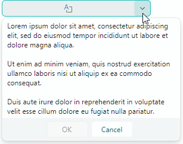
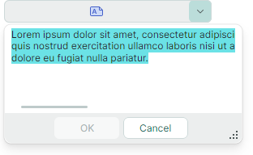

# MemoEditor

`MemoEditor` 允许用户在下拉窗口中查看和编辑多行文本。该控件的编辑框本身不提供文本编辑操作。



该控件的主要功能包括：

- 用户可以点击编辑框或内置的下拉按钮来打开下拉文本编辑器。
- 你可以在下拉编辑器中启用文本换行。
- 控制下拉窗口中滚动条的可见性。
- 当下拉编辑器包含文本时，编辑框可以显示一个特殊图标；当没有文本时，会显示一个空图标。
- 编辑框可以显示下拉文本的预览（第一行文本），以代替特殊图标。

## 指定文本和文本选项

使用 `MemoEditor.EditorValue` 属性在下拉编辑器中获取和设置文本。如果指定的文本包含 _NewLine_ 字符，编辑器会将文本显示为多行。

### 文本换行

`MemoEditor.TextWrapping` 属性允许你在编辑器右边缘启用自动文本换行。将该属性设置为 `Avalonia.Media.TextWrapping.Wrap` 值，即可启用常规文本换行模式。

### 输入时接受 _Tab_ 和 _Enter_ 键

用户可以按下 _Tab_ 和 _Enter_ 键在文本中插入 _Tab_ 和 _Return_ 字符。你可以使用以下选项更改此行为：

- `MemoEditor.MemoAcceptsReturn` — 指定下拉编辑器是否接受按下 _Enter_ 键。如果该属性被禁用，下拉编辑器会忽略 _Enter_ 键。
- `MemoEditor.MemoAcceptsTab` — 指定下拉编辑器是否接受按下 _Tab_ 键。如果该属性被禁用，按下 _Tab_ 键时焦点会移动到 Tab 顺序中的下一个控件。

### 示例 - 如何在 MemoEditor 中启用文本换行

``` xml
xmlns:mxe="https://schemas.eremexcontrols.net/avalonia/editors"
xmlns:mxtl="https://schemas.eremexcontrols.net/avalonia/treelist"

<mxe:MemoEditor x:Name="memoEditor" Grid.Row="1"  MemoTextWrapping="Wrap"/>
```

## 指示文本是否存在

该控件的默认行为是显示一个特殊图标，用于指示是否存在文本：


禁用 `MemoEditor.ShowIcon` 属性，可隐藏该图标，并在编辑框中显示文本的第一行：


## 打开下拉编辑器

用户可以通过点击编辑框或内置的下拉按钮来打开下拉编辑器。

`MemoEditor.IsPopupOpen` 属性允许你在代码中打开和关闭下拉编辑器。

## 指定滚动条的可见性

使用以下属性来管理滚动条的可见性：

- `MemoEditor.MemoHorizontalScrollBarVisibility` — 获取或设置一个 `Avalonia.Controls.Primitives.ScrollBarVisibility` 值，用于指定下拉文本编辑器中水平滚动条的可见性。
- `MemoEditor.MemoVerticalScrollBarVisibility` — 获取或设置一个 `Avalonia.Controls.Primitives.ScrollBarVisibility` 值，用于指定下拉文本编辑器中垂直滚动条的可见性。

## 防止只读编辑器弹出下拉窗口

在只读模式下，任何弹出式编辑器的默认行为都是允许用户打开编辑器的下拉窗口。但用户无法通过编辑框或下拉窗口修改值。要为只读编辑器禁用弹出窗口，请将 `ShowPopupIfReadOnly` 属性设置为 `false`。

## 阻止弹出窗口打开和关闭

你可以处理以下继承事件来取消弹出窗口的打开和关闭操作：

- `PopupEditor.PopupOpening` — 在弹出窗口即将创建时触发。
- `PopupEditor.PopupClosing` — 在弹出窗口即将关闭时触发。

这些事件提供 `e.Cancel` 参数。将其设置为 `true` 即可取消当前操作。

## 在弹出窗口出现时对其进行自定义

处理以下继承事件，以修改弹出窗口或其嵌套控件：

- `PopupEditor.PopupOpened` — 在弹出窗口创建完成之后、显示之前立即触发。这是一个通知事件，不允许你取消弹出窗口的打开操作。处理 `PopupOpened` 事件即可自定义弹出窗口或其子控件。

在处理 `PopupEditor.PopupOpened` 事件时，可使用编辑器的 `PopupContent` 属性安全地访问编辑器弹出窗口内部的控件。`PopupOpened` 事件确保在你访问该弹出窗口控件时它已经存在。对于 MemoEditor 控件而言，`PopupContent` 属性返回一个 `TextBox` 类的实例。

### 示例 - 在弹出窗口打开时选中全部文本

本示例通过处理 `PopupOpened` 事件，在 MemoEditor 的弹出窗口出现时选中其中的全部文本。代码使用 `PopupContent` 属性访问弹出窗口内嵌的文本编辑器，然后调用 `SelectAll` 方法选中其全部文本。



``` cs
using Eremex.AvaloniaUI.Controls.Editors;

 private void MemoEditor_PopupOpened(object sender, Avalonia.Interactivity.RoutedEventArgs e)
 {
     MemoEditor memoEditor = sender as MemoEditor;
     (memoEditor.PopupContent as TextBox).SelectAll();
 }
```


## 响应弹出窗口的关闭

使用以下继承事件，在弹出窗口关闭后执行相应操作：

- `PopupEditor.PopupClosed` — 在弹出窗口关闭后立即触发。这是一个通知事件，不允许你取消弹出窗口的关闭操作。


<br>
<br>

<sup>*</sup> 本页面使用机器翻译技术翻译。
