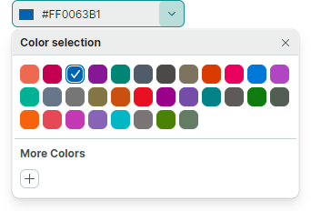
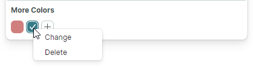

# PopupColorEditor

Eremex Controls 库包含 `PopupColorEditor` 控件，允许你在编辑框中显示颜色，并从关联的弹出窗口中选取颜色。


该控件的主要功能包括：

- 可自定义的默认调色板。
- 标准调色板。
- 可由用户自定义的自定义调色板。
- 内置对话框允许你使用取色器选择颜色，或以 RGB 或 HSB 格式指定颜色的各个分量。

## 选择颜色

用户可以使用下拉窗口中显示的调色板来选择颜色。

在代码中，你可以使用 `PopupColorEditor.Color` 或 `PopupColorEditor.EditorValue` 属性指定颜色或读取当前选定的颜色。这两个属性是同步的，区别在于值类型：`Color` 属性是可为 null 的 `Color` 类型，而 `EditorValue` 属性和所有 Eremex 编辑器一样是 `object` 类型。

## 调色板

`PopupColorEditor` 支持三种调色板：默认调色板、标准调色板和自定义调色板。使用 `PopupColorEditor.ColorsShowMode` 属性自定义各个调色板的可见性。`ColorsShowMode` 属性被定义为一组标志。


## 默认调色板

默认调色板显示一组预定义的颜色。


你可以使用以下代码将这些颜色替换为自定义调色板：

``` cs
List<uint> fluentIntColors = new List<uint>() 
{
    0xffef6950, 0xffc30052, 0xff0063b1, 0xff881798, 0xff018574, 0xff515c6b, 0xff4c4a48, 0xff7e735f,
    0xffda3b01, 0xffea005e, 0xff0078d7, 0xffb146c2, 0xff00b294, 0xff68768a, 0xff767676, 0xff847545,
    0xffca5010, 0xffe81123, 0xff9a0089, 0xff744da9, 0xff038387, 0xff5d5a57, 0xff107c10, 0xff525e54,
    0xfff7630c, 0xffe74856, 0xffc239b3, 0xff8764b8, 0xff00b7c3, 0xff7a7574, 0xff498205, 0xff647c64
};

List<Color> fluentColors = new List<Color>();
fluentIntColors.ForEach(intColor => fluentColors.Add(Color.FromUInt32(intColor)));

ColorPalette colorPalette = new Eremex.AvaloniaUI.Controls.Editors.CustomPalette("myPalette", fluentColors);
popupColorEditor1.ThemePalette = colorPalette;
```




<!--TODO
..\Controls\Source\Eremex.Avalonia.Controls\Editors\ColorEditor\PalettesHelper.cs
-->


## 标准调色板

在 `ColorsShowMode` 属性值中启用 `StandardColors` 标志，即可显示“Standard Colors”调色板。


``` xml
<mxe:PopupColorEditor 
    Width="190" Height="30"
    Name="popupColorEditor1"
    ColorsShowMode="StandardColors,CustomColors"/>
```

## 自定义调色板

在 `ColorsShowMode` 属性值中包含 `CustomColors` 标志，即可显示“Custom Colors”调色板。


``` xml
<mxe:PopupColorEditor ColorsShowMode="CustomColors"/>
```

用户可以在运行时于自定义调色板中添加和自定义颜色。点击“+”按钮即可添加颜色。


右键点击已有的颜色，即可显示上下文菜单，从中可以更改或删除该颜色。



你也可以预先在代码中通过 `CustomColors` 属性填充“Custom Colors”调色板。

### 示例 - 如何设置自定义调色板

以下代码启用了 Custom Colors 调色板，并使用 ViewModel 中定义的 _CustomColorCollection_ 属性对其进行填充。

``` xml
xmlns:mxe="https://schemas.eremexcontrols.net/avalonia/editors"
xmlns:sys="clr-namespace:System;assembly=mscorlib"
xmlns:local="clr-namespace:ComboBoxTestSample"

<Window.DataContext>
    <local:MainViewModel/>
</Window.DataContext>

<mxe:PopupColorEditor ColorsShowMode="CustomColors" 
 CustomColors="{Binding CustomColorCollection}"/>
```

``` csharp
using Avalonia.Media;
using CommunityToolkit.Mvvm.ComponentModel;
using System.Collections.ObjectModel;

[ObservableObject]
public partial class MainViewModel 
{
    public MainViewModel()
    {
        CustomColorCollection = new ObservableCollection<Color>()
        {
            Color.FromRgb(0x7d, 0xd7, 0xab), 
            Color.FromRgb(0xc5, 0x94, 0x88), 
            Color.FromRgb(0x47, 0xfe, 0xff), 
            Color.FromRgb(0xe9, 0xbf, 0x3f),
        };
    }

    [ObservableProperty]
    ObservableCollection<Color> customColorCollection;
}
```

### 颜色选择对话框

当用户点击“+”按钮，或右键点击自定义调色板中已有的颜色方块时，编辑器会弹出取色对话框。


该对话框的界面包含取色器，以及用于以 RGB 或 HSB 格式指定颜色分量的控件。

#### 相关 API

- `ShowAlphaChannel` — 允许你隐藏用于指定颜色 Alpha 分量的控件。
- `PopupFooterButtons` — 指定是否在颜色选择对话框中显示“应用”和“取消”按钮。如果该属性设置为 `OkCancel`，用户需要点击“应用”按钮以确认颜色选择；点击“返回”或“取消”按钮则会取消该对话框。

<!-- TODO 
rename PopupFooterButtons  to ShowConfirmationButtons
to sync the API with ColorEditor
 -->

## 防止只读编辑器弹出下拉窗口

在只读模式下，任何弹出式编辑器的默认行为都是允许用户打开编辑器的下拉窗口。但用户无法通过编辑框或下拉窗口修改值。要为只读编辑器禁用弹出窗口，请将 `ShowPopupIfReadOnly` 属性设置为 `false`。

## 阻止弹出窗口打开和关闭

你可以处理以下继承事件来取消弹出窗口的打开和关闭操作：

- `PopupEditor.PopupOpening` — 在弹出窗口即将创建时触发。
- `PopupEditor.PopupClosing` — 在弹出窗口即将关闭时触发。

这些事件提供 `e.Cancel` 参数。将其设置为 `true` 即可取消当前操作。

## 在弹出窗口出现时对其进行自定义

处理以下继承事件，以修改弹出窗口或其嵌套控件：

- `PopupEditor.PopupOpened` — 在弹出窗口创建完成之后、显示之前立即触发。这是一个通知事件，不允许你取消弹出窗口的打开操作。处理 `PopupOpened` 事件即可自定义弹出窗口或其子控件。

在处理 `PopupEditor.PopupOpened` 事件时，可使用编辑器的 `PopupContent` 属性安全地访问编辑器弹出窗口内部的控件。`PopupOpened` 事件确保在你访问该弹出窗口控件时它已经存在。对于 PopupColorEditor 控件而言，`PopupContent` 属性返回一个 `ColorEditor` 类的实例。

## 响应弹出窗口的关闭

使用以下继承事件，在弹出窗口关闭后执行相应操作：

- `PopupEditor.PopupClosed` — 在弹出窗口关闭后立即触发。这是一个通知事件，不允许你取消弹出窗口的关闭操作。


<br>
<br>

<sup>*</sup> 本页面使用机器翻译技术翻译。
