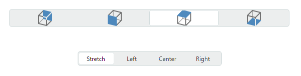

# SegmentedEditor

`SegmentedEditor` 将一组项目（选项）呈现为一系列水平排列的分段。用户可以单击其中一个分段来选择相应的选项，或者按住 CTRL 键并单击已选中的分段来清除选择。



该控件的主要功能包括：

- 从字符串列表、业务对象列表或枚举类型填充分段。
- 项目模板允许您以自定义方式呈现分段。
- 将该控件用作容器控件（例如 TreeList、TreeView 和 PropertyGrid）内的内嵌编辑器。

## 指定项目来源

使用 `SegmentedEditor.ItemsSource` 属性指定用于创建控件分段的项目源。您可以将编辑器绑定到字符串列表、业务对象列表或枚举类型。

## 绑定到字符串列表

最简单的项目源是一个字符串列表。

### 示例 - 如何绑定到字符串列表
以下示例使用字符串列表填充 `SegmentedEditor` 控件。

``` xml
xmlns:mxe="https://schemas.eremexcontrols.net/avalonia/editors"
xmlns:sys="clr-namespace:System;assembly=mscorlib"
xmlns:col="using:System.Collections"

<mxe:SegmentedEditor>
    <mxe:SegmentedEditor.ItemsSource>
        <col:ArrayList>
            <sys:String>Montevideo</sys:String>
            <sys:String>Havana</sys:String>
            <sys:String>Santiago</sys:String>
            <sys:String>La Paz</sys:String>
        </col:ArrayList>
    </mxe:SegmentedEditor.ItemsSource>
</mxe:SegmentedEditor>
```

## 绑定到业务对象列表

您可以将 `SegmentedEditor` 控件绑定到业务对象列表。在这种情况下，该控件的默认行为如下：

- 业务对象的 `ToString` 方法指定项目的默认文本表示形式。
- 当您选择项目时，编辑器的值 (`SegmentedEditor.EditorValue`) 将设置为相应的业务对象。

一个典型的业务对象具有多个属性。您可以指定由哪些业务对象属性提供项目显示文本和编辑值。为此请使用以下 API 成员：

- `SegmentedEditor.DisplayMember` - 获取或设置业务对象中用于指定项目显示文本的属性名称。 
- `SegmentedEditor.ValueMember` - 获取或设置业务对象中用于指定项目值的属性名称。当您选择项目时，编辑器的值 (`SegmentedEditor.EditorValue`) 将设置为该项目的 `ValueMember` 属性值。

### 示例 - 如何绑定到业务对象列表

以下示例将 SegmentedEditor 控件绑定到 _Product_ 业务对象列表。 _Product.ProductName_ 属性指定项目显示文本。 _Product.ProductID_ 属性指定项目值。

``` xml
xmlns:mxe="https://schemas.eremexcontrols.net/avalonia/editors"
xmlns:sys="clr-namespace:System;assembly=mscorlib"

<Window.DataContext>
    <local:MainViewModel/>
</Window.DataContext>

<mxe:SegmentedEditor
    Name="segmEditor1"
    ItemsSource="{Binding Products}"
    DisplayMember="ProductName"
    ValueMember="ProductID" />
```
``` csharp
public MainViewModel()
{
    Products = new ObservableCollection<Product>();
    Products.Add(new Product(0, "Chai", "Beverages", 200));
    Products.Add(new Product(1, "Chang", "Beverages", 100))
    Products.Add(new Product(3, "Ikura", "Seafood", 500));
    Products.Add(new Product(5, "Tofu", "Produce", 430));
    //...
}

public partial class Product :ObservableObject
{
    public Product(int productID, string productName, string category, int productPrice)
    {
        ProductID = productID;
        ProductName = productName;
        Category = category;
        ProductPrice = productPrice;
    }

    [ObservableProperty]
    public int productID;

    [ObservableProperty]
    public string productName;

    [ObservableProperty]
    public string category;

    [ObservableProperty]
    public decimal productPrice;
}
```

## 绑定到枚举

`SegmentedEditor` 可以用枚举类型的值填充其段。

`Eremex.AvaloniaUI.Controls.Common.EnumItemsSource` 帮助程序类有助于绑定到枚举。其主要特点包括：

- 枚举成员的图像。将 `Eremex.AvaloniaUI.Controls.Common.ImageAttribute` 属性应用于目标枚举成员以指定图像。
- 枚举成员的自定义显示名称。使用 `System.ComponentModel.DataAnnotations.DisplayAttribute` 属性或自定义转换器更改默认的项目显示文本。
- 项目的工具提示。工具提示包含目标项目的描述，您可以使用 `System.ComponentModel.DataAnnotations.DisplayAttribute` 属性或自定义转换器来提供该描述。

使用以下 `EnumItemsSource` 属性设置与枚举类型的绑定：

- `EnumItemsSource.EnumType` — 指定其值将显示在 `SegmentedEditor` 控件中的枚举类型。
- `EnumItemsSource.ShowImages` — 指定是否显示枚举成员的图像。您可以使用 `Eremex.AvaloniaUI.Controls.Common.ImageAttribute` 属性来提供图像。
- `EnumItemsSource.ShowNames` — 指定是否显示项目文本。将 `ShowNames` 设置为 `false` 并将 `ShowImages` 设置为 `true` 以使用不带文本的图像呈现枚举成员。
- `EnumItemsSource.ImageSize` — 指定分配给枚举成员的图像的显示尺寸。
- `EnumItemsSource.NameToDisplayTextConverter` — 允许您分配一个转换器，用于检索枚举成员的自定义显示文本。
- `EnumItemsSource.NameToDescriptionConverter` — 允许您分配一个转换器来检索枚举成员描述，当用户将鼠标悬停在段上时，这些描述将显示为工具提示。

### 示例 - 如何显示枚举值，以及如何使用特性为枚举成员提供显示文本和图像

以下示例显示 `SegmentedEditor` 中的 _ProductCategoryEnum_ 枚举的值。它使用 `EnumItemsSource` 类进行数据绑定。

`System.ComponentModel.DataAnnotations.DisplayAttribute` 和 `Eremex.AvaloniaUI.Controls.Common.ImageAttribute` 属性指定枚举成员的自定义显示文本、描述（工具提示）和图像。

``` xml
xmlns:mx="https://schemas.eremexcontrols.net/avalonia"
xmlns:mxe="https://schemas.eremexcontrols.net/avalonia/editors"

<mxe:SegmentedEditor Name="segmentedEditorEnum"
        ItemsSource="{mx:EnumItemsSource EnumType=local:ProductCategoryEnum, 
         ImageSize='16, 16', ShowImages=True, ShowNames=True}">
</mxe:SegmentedEditor>
```
``` csharp
using Eremex.AvaloniaUI.Controls.Common;
using System.ComponentModel.DataAnnotations;

public enum ProductCategoryEnum
{
    // The images assigned to the enumeration values below are placed 
    // in the EditorsSample/Images folder.
    // They have their "Build Action" properties set to "AvaloniaResource".
    [Image($"avares://EditorsSample/Images/Products/DairyProducts.svg")]
    [Display(Name = "Dairy Products", Description = "Products made from milk")]
    DairyProducts,

    [Image($"avares://EditorsSample/Images/Products/Beverages.svg")]
    [Display(Description = "Edible drinks")]
    Beverages,

    [Image($"avares://EditorsSample/Images/Products/Condiments.svg")]
    [Display(Description = "Flavor Enhancers")]
    Condiments,

    [Image($"avares://EditorsSample/Images/Products/Confections.svg")]
    [Display(Description = "Sweets")]
    Confections
}
```

### 示例 - 如何显示枚举值，并使用自定义转换器为枚举成员提供显示文本

以下示例使用 `EnumItemsSource` 类在 `SegmentedEditor` 控件中显示枚举类型的值。 `EnumItemsSource.NameToDisplayTextConverter` 和 `EnumItemsSource.NameToDescriptionConverter` 对象为枚举成员提供自定义显示文本和说明（工具提示）。

``` xml
xmlns:mxe="https://schemas.eremexcontrols.net/avalonia/editors"
xmlns:mx="https://schemas.eremexcontrols.net/avalonia"
xmlns:local="clr-namespace:EditorsSample"

<mxe:SegmentedEditor Name="segmentedEditorEnumWithConverters"
        ItemsSource="{mx:EnumItemsSource EnumType=local:ProductCategoryEnum, 
         ImageSize='16, 16', ShowImages=True, ShowNames=True, 
         NameToDisplayTextConverter={local:EnumMemberNameToDisplayTextConverter}, 
         NameToDescriptionConverter={local:EnumMemberNameToDescriptionConverter}}"
        >
</mxe:SegmentedEditor>
```

``` csharp
using Eremex.AvaloniaUI.Controls.Common;

public enum ProductCategoryEnum
{
    // The images assigned to the enumeration values below are placed 
    // in the EditorsSample/Images folder.
    // They have their "Build Action" properties set to "AvaloniaResource".
    [Image($"avares://EditorsSample/Images/Products/DairyProducts.svg")]
    DairyProducts,

    [Image($"avares://EditorsSample/Images/Products/Beverages.svg")]
    Beverages,

    [Image($"avares://EditorsSample/Images/Products/Condiments.svg")]
    Condiments,

    [Image($"avares://EditorsSample/Images/Products/Confections.svg")]
    Confections
}

public class EnumMemberNameToDisplayTextConverter : BaseEnumConverter
{
    protected override void PopulateDictionary()
    {
        TextValueDictionary.Add("ProductCategoryEnum_DairyProducts", "Dairy");
    }
}
public class EnumMemberNameToDescriptionConverter : BaseEnumConverter
{
    protected override void PopulateDictionary()
    {
        TextValueDictionary.Add("ProductCategoryEnum_DairyProducts", "Milk Products");
    }
}

public abstract class BaseEnumConverter : MarkupExtension, IValueConverter
{
    protected Dictionary<string, string> TextValueDictionary;

    public BaseEnumConverter()
    {
        TextValueDictionary = new Dictionary<string, string>();
        PopulateDictionary();
    }

    protected abstract void PopulateDictionary();

    public override object ProvideValue(IServiceProvider serviceProvider)
    {
        return this;
    }
    public object? Convert(object? value, Type targetType, object? parameter, 
     System.Globalization.CultureInfo culture)
    {
        var type = value?.GetType();
        var memberName = value?.ToString();
        if (type == null || !type.IsEnum || string.IsNullOrEmpty(memberName))
            return null;
        return EnumMemberToString(type.Name, memberName);
    }
        
    protected virtual string EnumMemberToString(string enumName, string enumMemberName)
    {
        string fullMemberName = enumName + "_" + enumMemberName;
        if (TextValueDictionary.ContainsKey(fullMemberName))
            return TextValueDictionary[fullMemberName];
        else 
            return enumMemberName;
    }
        
    public object? ConvertBack(object? value, Type targetType, object? parameter, 
     System.Globalization.CultureInfo culture)
    {
        return null;
    }
}
```

## 获取和设置所选项目，并指定编辑器值

当用户按住 CTRL 键并单击某个段来选择或取消选择该段时，`SegmentedEditor.SelectedItem` 和 `SegmentedEditor.EditorValue` 属性会相应更改。
您可以使用这些属性中的任何一个来获取和设置编辑器的选定值。

`SegmentedEditor.SelectedItem` 属性指定所选段对应的底层数据对象。

`SegmentedEditor.EditorValue` 属性具有以下含义：

- 如果 `ValueMember` 属性为空，则 `EditorValue` 和 `SelectedItem` 属性等效。
- 否则，`EditorValue` 属性将与所选底层数据对象的 `ValueMember` 属性值同步。

要清除选择，请将 `SegmentedEditor.SelectedItem` 属性设置为 `null`。
 
### 示例 - 当 SegmentedEditor 绑定到字符串列表时如何选择项目

以下示例演示如何使用 `SelectedItem` 或 `EditorValue` 属性在绑定到字符串列表的 `SegmentedEditor` 控件中选择项目。

``` xml
xmlns:mxe="https://schemas.eremexcontrols.net/avalonia/editors"
xmlns:sys="clr-namespace:System;assembly=mscorlib"
xmlns:col="using:System.Collections"

<mxe:SegmentedEditor Name="segmEditorStrings">
    <mxe:SegmentedEditor.ItemsSource>
        <col:ArrayList>
            <sys:String>Montevideo</sys:String>
            <sys:String>Havana</sys:String>
            <sys:String>Santiago</sys:String>
            <sys:String>La Paz</sys:String>
        </col:ArrayList>
    </mxe:SegmentedEditor.ItemsSource>
</mxe:SegmentedEditor>
```
``` csharp
// Use the SelectedItem property:
segmEditorStrings.SelectedItem = "Santiago";
//or the EditorValue property:
segmEditorStrings.EditorValue = "Santiago";
```

### 示例 - 当 SegmentedEditor 绑定到业务对象列表时如何选择 item

在以下示例中，`SegmentedEditor` 控件绑定到 _Product_ 对象列表。 `ValueMember` 属性引用 _Product.ProductID_ 成员。因此，产品 ID 用作项目值。当用户选择某个分段时，`EditorValue` 属性将设置为相应的产品 ID。该示例使用 `EditorValue` 属性在代码中选择项目。

``` xml
xmlns:mxe="https://schemas.eremexcontrols.net/avalonia/editors"
xmlns:sys="clr-namespace:System;assembly=mscorlib"
xmlns:local="clr-namespace:EditorsSample"

<Window.DataContext>
    <local:MainViewModel/>
</Window.DataContext>

<mxe:SegmentedEditor
    Name="segmEditor1"
    ItemsSource="{Binding Products}"
    DisplayMember="ProductName"
    ValueMember="ProductID" />
```

``` csharp
// Select an item by its product ID:
var itemSource = segmEditor1.ItemsSource as ObservableCollection<Product>;
if (itemSource != null)
    segmEditor1.EditorValue = itemSource[3].ProductID;
//The SelectedItem property will return the itemSource[3] object.

//...
[ObservableObject]
public partial class MainViewModel : ViewModelBase
{
    [ObservableProperty]
    public ObservableCollection<Product> products;

    public MainViewModel()
    {
        Products = new ObservableCollection<Product>();
        Products.Add(new Product(0, "Chai", "Beverages", 200));
        Products.Add(new Product(1, "Chang", "Beverages", 100))
        Products.Add(new Product(3, "Ikura", "Seafood", 500));
        Products.Add(new Product(5, "Tofu", "Produce", 430));
    }
}

public partial class Product :ObservableObject
{
    public Product(int productID, string productName, string category, int productPrice)
    {
        ProductID = productID;
        ProductName = productName;
        Category = category;
        ProductPrice = productPrice;
    }

    [ObservableProperty]
    public int productID;

    [ObservableProperty]
    public string productName;

    [ObservableProperty]
    public string category;

    [ObservableProperty]
    public decimal productPrice;
}
```

## 指定项目模板

当 `SegmentedEditor` 绑定到字符串或业务对象列表时，control 的段显示 default text representation 项目。 default item display text 定义如下：

- 如果未设置 `ValueMember` 属性，则由 underlying 数据对象的 `ToString` method 返回的值。
- 否则，存储在数据对象的 `ValueMember` 属性中的值的文本表示形式。

项目模板使您可以灵活地指定在编辑器的片段中显示的内容。它们允许您显示图像以及段中多个属性的值。使用 `SegmentedEditor.ItemTemplate` 属性指定 item 模板。

### 示例 - 如何显示 image 和 SegmentedEditor 项目的文本

以下示例演示如何创建在 `SegmentedEditor` control 的段中显示图像和文本的 item 模板。

在示例中，`SegmentedEditor` control 绑定到 _CapitalInfo_ 对象的集合，该对象存储有关国家、国家首都和国旗的信息。 
创建的 item 模板（`SegmentedEditor.ItemTemplate` 属性）显示国旗，后跟国家首都的名称。

`SegmentedEditor.ValueMember` 属性引用 _CapitalInfo.Capital_ 属性。当用户选择一个段时，编辑器的 `EditorValue` 属性将设置为相应国家/地区首都的名称。

``` xml
xmlns:mxe="https://schemas.eremexcontrols.net/avalonia/editors"
xmlns:local="clr-namespace:EditorsSample"

<Window.DataContext>
    <local:MainViewModel/>
</Window.DataContext>

<Window.Resources>
    <DataTemplate x:Key="CapitalItemTemplate">
        <Grid>
            <Grid.ColumnDefinitions>
                <ColumnDefinition Width="Auto"/>
                <ColumnDefinition Width="*"/>
            </Grid.ColumnDefinitions>
            <Image Width="16" Height="16" Source="{Binding Path=Flag}"/>
            <TextBlock VerticalAlignment="Center" Grid.Column="1" 
             Margin="6,0,0,0" Text="{Binding Path=Capital}"/>
        </Grid>
    </DataTemplate>
</Window.Resources>

<mxe:SegmentedEditor
    Name="segmentedEditorCapitals"
    ItemsSource="{Binding Capitals}"
    ItemTemplate="{StaticResource CapitalItemTemplate}"
    ValueMember="Capital"
/>
```

``` csharp
using CommunityToolkit.Mvvm.ComponentModel;
using Avalonia.Media;
using Avalonia.Svg.Skia;
using Eremex.AvaloniaUI.Controls.Utils;

public partial class MainViewModel 
{
    [ObservableProperty]
    public ObservableCollection<CapitalInfo> capitals;

    public MainViewModel()
    {
        var capitalDictionary = new List<(string capital, string country)>();
        capitalDictionary.Add(("Havana", "Cuba"));
        capitalDictionary.Add(("Santiago", "Chile"));
        capitalDictionary.Add(("La Paz", "Bolivia"));
        Capitals = new ObservableCollection<CapitalInfo>();
        foreach (var item in capitalDictionary)
        {
            string country = item.country.ToLower();
            // Load .SVG images that are stored in the Images/Flags folder as Avalonia Resources.
            IImage image = ImageLoader.LoadSvgImage(Assembly.GetExecutingAssembly(), $"Images/Flags/{country}.svg");
            Capitals.Add(new CapitalInfo(item.capital, item.country, image));
        }
    }
}

public partial class CapitalInfo : ObservableObject
{
    public CapitalInfo(string capital, string country, IImage flag)
    {
        Capital = capital;
        Flag = flag;
        Country = country;
    }

    [ObservableProperty]
    public string capital;

    [ObservableProperty]
    public string country;

    [ObservableProperty]
    public IImage flag;
}
```

<br>
<br>

<sup>*</sup> 本页面使用机器翻译技术翻译。
