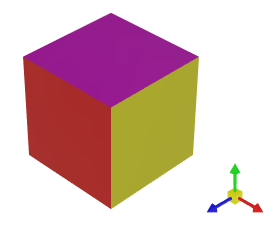

# Camera

相机是视点的虚拟表示，定义了 3D 模型如何投影到 2D 屏幕上。`Graphics3DControl` 允许您在等距相机和透视相机之间进行选择，并在代码中管理相机的设置和位置。


`Graphics3DControl` 默认使用透视相机。

`Graphics3DControl.Camera` 属性允许您访问当前的相机对象。但是，该属性最初返回 `null`，这意味着 `Graphics3DControl` 使用默认相机（透视相机）。

要在代码中访问和自定义相机对象，您需要使用 `PerspectiveCamera` 或 `IsometricCamera` 对象显式初始化 `Graphics3DControl.Camera` 属性。


## 透视相机

透视相机通过将 3D 模型投影到 2D 平面来模拟真实的深度感知，使物体随着距离的增加而显得更小。

透视相机是 Graphics3DControl 中的默认相机。要访问相机对象并自定义其设置，请将 `Graphics3DControl.Camera` 属性设置为 `PerspectiveCamera` 对象。

``` xml
xmlns:mx3d="https://schemas.eremexcontrols.net/avalonia/controls3d"

<mx3d:Graphics3DControl Name="g3DControl" ShowAxes="True">
    <mx3d:Graphics3DControl.Camera>
        <mx3d:PerspectiveCamera FieldOfView="0.9" />
    </mx3d:Graphics3DControl.Camera>
</mx3d:Graphics3DControl>
```

`PerspectiveCamera.FieldOfView` 属性允许您指定透视相机的视野角度，以弧度表示。该属性的默认值为 `MathF.PI/4`。


## 等距相机

等距相机对所有物体保持一致的缩放比例，与它们到相机的距离无关。

将 `Graphics3DControl.Camera` 属性设置为 `IsometricCamera` 对象，以切换到等距相机。

``` xml
xmlns:mx3d="https://schemas.eremexcontrols.net/avalonia/controls3d"

<mx3d:Graphics3DControl Name="g3DControl" ShowAxes="True">
    <mx3d:Graphics3DControl.Camera>
        <mx3d:IsometricCamera FarClipPlane="1000"/>
    </mx3d:Graphics3DControl.Camera>
</mx3d:Graphics3DControl>
```

<!-- TODO
Describe camera settings
 -->

## 观察场景

### 查看预定义场景

`Graphics3DControl` 允许您定位相机，使其观察 3D 模型的顶部、正面和其他预定义的侧面。

默认场景是 `IsoXYZ`（等距）。在等距场景中，_X_、_Y_ 和 _Z_ 轴具有相等的比例，轴之间的角度始终为 120 度：



要更改默认场景，请使用 `PerspectiveCamera` 和 `IsometricCamera` 对象的 `Camera.DefaultCameraPosition` 属性。您可以将 `Camera.DefaultCameraPosition` 设置为以下 `CameraPosition` 枚举值：

- `Down` — 模型的底部。相机沿 _Y_ 轴的负方向定位。
- `Front` — 模型的正面。相机沿 _Z_ 轴的正方向定位。
- `IsoXYZ` — 等距场景，其中 _X_、_Y_ 和 _Z_ 轴具有相等的比例，轴之间的角度始终为 120 度。
- `Left` — 模型的左侧。相机沿 _X_ 轴的负方向定位。
- `Rear` — 模型的背面。相机沿 _Z_ 轴的负方向定位。
- `Right` — 模型的右侧。相机沿 _X_ 轴的正方向定位。
- `Up` — 模型的顶部。相机沿 _Y_ 轴的正方向定位。

以下代码将默认相机位置设置为查看模型的右侧。


``` xml
<mx3d:Graphics3DControl.Camera>
    <mx3d:PerspectiveCamera DefaultCameraPosition="Right" />
</mx3d:Graphics3DControl.Camera>
```


在运行时，您可以使用以下成员来查看 3D 模型的特定场景：

- `Graphics3DControl.LookCameraAtScene` 方法
- `PerspectiveCamera` 和 `IsometricCamera` 对象的 `Camera.Position` 属性。

``` cs
g3DControl.LookCameraAtScene(CameraPosition.Left);
```


<!-- TODO
What if I change the coordinate system ?
-->

除了使用 `LookCameraAtScene` 方法之外，您还可以使用 `Graphics3DControl.LookCameraAtSceneCommand` 命令来可视化预定义场景。将 `CameraPosition` 枚举值作为参数传递给此命令。

### 从特定角度完整查看模型

以下 `Graphics3DControl.LookCameraAtScene` 重载方法用于定位和引导相机，从特定角度完整显示模型。

```
public void LookCameraAtScene(Vector3 cameraViewDirection, Vector3 upDirection)
```

此重载会自动计算最佳相机位置，以确保整个模型可见。该方法的参数用于指定相机在 3D 空间中的方向和朝向：

- `cameraViewDirection` — 指定相机所指方向的向量。
- `upDirection` — 指定相机向上方向的向量。此参数与 `Camera.UpDirection` 属性相对应。


## 手动定位相机

`PerspectiveCamera` 和 `IsometricCamera` 类均派生自基类 `Camera`，该基类提供了用于获取和调整相机在 3D 空间中位置与朝向的成员：

- `Camera.Position` 属性 — 相机位置的 _X_、_Y_ 和 _Z_ 坐标。

    !!! tip
    
        当您设置 `Position` 属性时，请确保相机与其目标（`Camera.Target`）之间的距离在 `Camera.MinDistance` 和 `Camera.MaxDistance` 定义的允许范围内。否则，模型可能会被隐藏。

- `Camera.Target` 属性 — 相机所对准的点的 _X_、_Y_ 和 _Z_ 坐标。默认目标是坐标系的原点 _(0, 0, 0)_。当您使用 `Camera.MoveLeft`/`Camera.MoveUp` 方法以及[键盘快捷键和鼠标手势](user-interactions-with-3d-models.md)平移（移动）模型时，目标点会自动更改。
- `Camera.UpDirection` 属性 — 一个指定相机向上方向的向量（`Vector3` 值）。例如，当 `UpDirection` 设置为 _Vector3(0, 1, 0)_ 时，_Y_ 轴指向上方。

- `Camera.LookAt` 方法 — 同时设置相机的目标和向上方向。


其他相机设置指定了距离限制和视锥体：

- `Camera.NearClipPlane` — 相机与近裁剪平面之间的距离。比此裁剪平面更近的物体将被隐藏。另请参见 `FarClipPlane`。
- `Camera.FarClipPlane` — 相机与远裁剪平面之间的距离。超出远裁剪平面的物体将被隐藏。Graphics3DControl 仅显示位于近、远裁剪平面之间的物体。
- `Camera.MaxDistance` — 相机（`Camera.Position`）与目标点（`Camera.Target`）之间允许的最大距离。`MaxDistance` 和 `MinDistance` 属性指定相机与目标之间可以相距多远。这些属性会影响使用 `Camera.MoveForward` 方法以及[键盘快捷键和鼠标手势](user-interactions-with-3d-models.md)执行的缩放操作。
- `Camera.MinDistance` — 相机（`Camera.Position`）与目标点（`Camera.Target`）之间允许的最小距离。


  


### 示例 - 将相机放置在自定义位置

以下代码将相机放置在位置 _(X=40, Y=200, Z=40)_，并将 `Target` 属性设置为 _Vector3(0, 0, 0)_，使其向下指向坐标系原点，以查看模型的顶部。`UpDirection` 属性设置为 _Vector3(1, 0, 1)_，使 _X_ 和 _Z_ 轴分别与屏幕的左上角和右上角对齐。
`MaxDistance` 属性设置为 _300_，以确保相机与目标之间的新距离处于 [`MinDistance`, `MaxDistance`] 范围内。


``` cs
g3DControl.Camera.MaxDistance = 300;
g3DControl.Camera.Position = new Vector3(40, 200, 40);
g3DControl.Camera.Target = new Vector3(0, 0, 0);
g3DControl.Camera.UpDirection = new Vector3(1, 0, 1);

// or

g3DControl.Camera.MaxDistance = 300;
g3DControl.Camera.Position = new Vector3(40, 200, 40);
g3DControl.Camera.LookAt(new Vector3(0, 0, 0), new Vector3(1, 0, 1));
```

## 移动和旋转相机

Graphics3DControl 支持[键盘快捷键和鼠标手势](user-interactions-with-3d-models.md)，允许用户在运行时移动（平移）、旋转和缩放模型。您还可以在代码中使用 `Camera` 对象提供的以下方法执行这些操作：

- `MoveForward` — 使相机靠近模型（正偏移量）或远离模型（负偏移量）。
- `MoveLeft` — 将相机向左（正偏移量）或向右（负偏移量）移动。
- `MoveUp` — 将相机向上（正偏移量）或向下（负偏移量）移动。
- `Rotate` — 围绕**屏幕空间**的水平轴和垂直轴旋转相机。旋转中心是控件坐标系的原点 _(0, 0, 0)_。

  

<br>
<br>

<sup>*</sup> 本页面使用机器翻译技术翻译。
