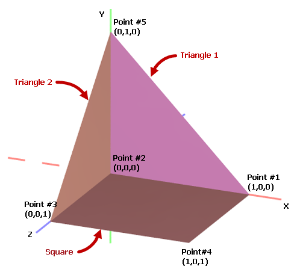
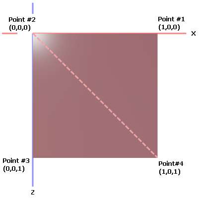
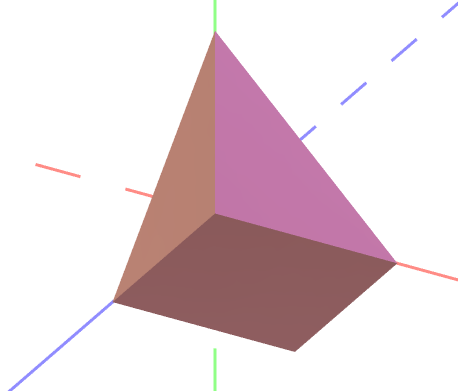

# Graphics3DControl 入门


本教程演示如何创建 3D 模型并在 `Graphics3DControl` 控件中显示它。该示例使用控件公开的 API 来定义网格、顶点和材质。

您可以在一个 `Graphics3DControl` 中同时显示多个 3D 模型。本教程创建一个 3D 模型，它由一个正方形和两个相互成直角放置的三角形组成。每个图形都使用其自己的材质进行绘制。


## 前提条件：为 Graphics3DControl 注册绘制主题

从 1.3 版本开始，`Graphics3DControl` 的通用外观设置由 `Controls3D` 绘制主题指定。这些设置包括控件的对齐方式、可获得焦点状态、背景和边框颜色、Gizmo 设置等。`Controls3D` 绘制主题与 `Graphics3DControl` 控件本身定义在同一个程序集中。为确保 `Graphics3DControl` 正确渲染，您需要在 _App.xaml_ 文件中注册此主题，如下所示：

- 打开 _App.xaml_ 文件，并将以下命名空间添加到 `Application` 对象中：

    ``` xml
    <!-- App.xaml file -->
    xmlns:theme3D="clr-namespace:Eremex.AvaloniaUI.Themes.Controls3D;assembly=Eremex.Avalonia.Controls3D"
    ```

- 在 `Application.Styles` 集合中包含 <code>&lt;theme3D:Controls3DTheme/&gt;</code> 项。

    ``` xml
    <!-- App.xaml file -->
    <Application xmlns="https://github.com/avaloniaui"
             xmlns:x="http://schemas.microsoft.com/winfx/2006/xaml"
             x:Class="MyEMXCameraApp.App"
             xmlns:theme="clr-namespace:Eremex.AvaloniaUI.Themes.DeltaDesign;assembly=Eremex.Avalonia.Themes.DeltaDesign"
             xmlns:theme3D="clr-namespace:Eremex.AvaloniaUI.Themes.Controls3D;assembly=Eremex.Avalonia.Controls3D"
             RequestedThemeVariant="Default">
        <Application.Styles>
            <theme:DeltaDesignTheme/>
            <theme3D:Controls3DTheme />
        </Application.Styles>
    </Application>
    ```

!!! note

    如果未注册 `Controls3D` 绘制主题，`Graphics3DControl` 将显示为空白。

## 创建 Graphics3DControl

使用以下代码在 XAML 中创建 `Graphics3DControl` 控件：

``` xml
xmlns:mx3d="https://schemas.eremexcontrols.net/avalonia/controls3d"

<mx3d:Graphics3DControl Name="g3DControl" ShowAxes="True">
    <mx3d:Graphics3DControl.Camera>
        <mx3d:IsometricCamera/>
    </mx3d:Graphics3DControl.Camera>
</mx3d:Graphics3DControl>
```

此代码为 `Graphics3DControl` 控件显示坐标轴并启用等距相机。您也可以启用透视相机。为此，请将 `Graphics3DControl.Camera` 属性设置为 `PerspectiveCamera` 对象。


## 定义 3D 模型

`GeometryModel3D` 类封装了 `Graphics3DControl` 的一个 3D 模型。要向控件添加 3D 模型，请将一个或多个 `GeometryModel3D` 对象添加到 `Graphics3DControl.Models` 集合中。

``` cs
using Eremex.AvaloniaUI.Controls3D;

GeometryModel3D model = new GeometryModel3D();
g3DControl.Models.Add(model);
```

一个 3D 模型由一个或多个网格组成。网格是使用特定材质绘制的模型的一部分。

3D 模型中的正方形和三角形图形使用各自的材质绘制，因此需要创建三个网格。

### 添加网格

使用 `GeometryModel3D.Meshes` 集合来添加网格。每个网格由一个 `MeshGeometry3D` 对象封装。

``` cs
using DynamicData;

MeshGeometry3D meshTriangle1 = new MeshGeometry3D();
MeshGeometry3D meshTriangle2 = new MeshGeometry3D();
MeshGeometry3D meshSquare = new MeshGeometry3D();
//...
model.Meshes.AddRange(new[] { meshTriangle1, meshTriangle2, meshSquare });
```

`Graphics3DControl` 支持三种网格类型：

- 由一组三角形定义的网格（默认，或当 `MeshGeometry3D.FillType` 设置为 `MeshFillType.Triangles` 时）
- 由一组线段定义的网格（当 `MeshGeometry3D.FillType` 设置为 `MeshFillType.Lines` 时）
- 由一组点定义的网格（当 `MeshGeometry3D.FillType` 设置为 `MeshFillType.Points` 时）

在当前示例中，网格由三角形创建。对于此网格类型，您需要指定以下属性：

- `MeshGeometry3D.Vertices` — 构成网格的所有顶点（`Vertex3D` 对象）的数组。`Vertex3D` 对象公开以下主要属性：

    - `Vertex3D.Position` — 指定顶点坐标的 `Vector3` 对象。
    - `Vertex3D.Normal` — 指定顶点法线的 `Vector3` 对象。顶点法线是用于计算顶点和三角形光反射的方向向量。
    - `Vertex3D.TextureCoord` — 指定当前顶点纹理坐标的 `Vector2` 对象。

- `MeshGeometry3D.Indices` — `Vertices` 数组中顶点的索引数组，用于定义各个网格三角形。此数组包含若干组，每组三个索引。数组中的前三个索引指向第一个网格三角形的顶点。接下来的三个索引指向第二个网格三角形的顶点，依此类推。
每个三角形索引的顺序很重要，因为它决定了表面法线。表面法线又决定了三角形的正面和背面，这对于背面剔除和正面剔除等操作至关重要。


#### 定义 Triangle 1 和 Triangle 2 图形的网格

**Triangle 1** 和 **Triangle 2** 图形的网格很容易定义，因为这些图形本身就是三角形。

首先，让我们确定创建的 3D 模型中的所有顶点及其 (x, y, z) 坐标。




在代码中，使用 `Vector3` 对象定义所有顶点的坐标：

``` cs
Vector3 pt1 = new(1, 0, 0);
Vector3 pt2 = new(0, 0, 0);
Vector3 pt3 = new(0, 0, 1);
Vector3 pt4 = new(1, 0, 1);
Vector3 pt5 = new(0, 1, 0);
```

初始化 **Triangle 1** 图形的顶点和索引：

``` cs
Vertex3D[] meshTriangle1Vertices = new Vertex3D[]
{
    new Vertex3D() { Position = pt2,  Normal = new Vector3(0, 0, 1) },
    new Vertex3D() { Position = pt5,  Normal = new Vector3(0, 0, 1) },
    new Vertex3D() { Position = pt1,  Normal = new Vector3(0, 0, 1) },
};

// Define a mesh triangle.
uint[] meshTriangle1Indices = new uint[] { 0, 1, 2 };

meshTriangle1.Vertices = meshTriangle1Vertices;
meshTriangle1.Indices = meshTriangle1Indices;
```

这里，索引 0、1 和 2 分别指向 `Vertices` 数组中的第一、第二和第三个顶点。

同样地，初始化 **Triangle 2** 图形的顶点和索引：

``` cs
Vertex3D[] meshTriangle2Vertices = new Vertex3D[]
{
    new Vertex3D() { Position = pt2,  Normal = new Vector3(1, 0, 0) },
    new Vertex3D() { Position = pt5,  Normal = new Vector3(1, 0, 0) },
    new Vertex3D() { Position = pt3,  Normal = new Vector3(1, 0, 0) }
};

// Define a mesh triangle.
uint[] meshTriangle2Indices = new uint[] { 0, 1, 2 };

meshTriangle2.Vertices = meshTriangle2Vertices;
meshTriangle2.Indices = meshTriangle2Indices;
```

#### 定义 Square 图形的网格

**Square** 图形可以划分为两个网格三角形。例如：




**Square** 网格的 `Vertices` 数组应包含四个点。`Indices` 数组应包含六个索引，用于标识两个网格三角形。

``` cs
Vertex3D[] meshSquareVertices = new Vertex3D[]
{
    new Vertex3D() { Position = pt1,  Normal = new Vector3(0, 1, 0) },
    new Vertex3D() { Position = pt2,  Normal = new Vector3(0, 1, 0) },
    new Vertex3D() { Position = pt3,  Normal = new Vector3(0, 1, 0) },
    new Vertex3D() { Position = pt4,  Normal = new Vector3(0, 1, 0) }
};

// Define two mesh triangles.
// The first mesh triangle is formed by points pt1, pt2 and pt4.
// The second mesh triangle is formed by points pt2, pt3 and pt4.
uint[] meshSquareIndices = new uint[] { 0, 1, 3, 1, 2, 3 };

meshSquare.Vertices = meshSquareVertices;
meshSquare.Indices = meshSquareIndices;

```


## 指定材质

`Graphics3DControl` 控件支持以下派生自 `Eremex.AvaloniaUI.Controls3D.Material` 抽象类的材质：

- `SimplePbrMaterial` — 一种以数值形式描述表面视觉属性的材质：

    - `Albedo` — 基础颜色
    - `Alpha` — 透明度
    - `Emission` — 表面发光的强度
    - `AmbientOcclusion` — 由阻挡环境光的物体所造成的阴影级别
    - `Roughness` — 表面的光滑程度
    - `Metallic` — 表面的反射率。

- `TexturedPbrMaterial` — PBR 格式的纹理材质。此材质允许您以位图形式指定表面的视觉属性（`Albedo`、`Alpha`、`Emission`、`AmbientOcclusion`、`Roughness`、`Metallic` 和 `Normal`）。

您需要使用 `Material.Key` 属性为材质分配唯一的键（字符串值）。
然后，您可以通过 `MeshGeometry3D.MaterialKey` 属性将材质与网格关联起来。


以下代码添加了三个具有特定基础颜色（`Albedo`）的材质（`SimplePbrMaterial` 对象）。创建的网格使用 `MaterialKey` 属性与材质关联。

``` cs
using DynamicData;

g3DControl.Materials.AddRange(
    new[] {
        new SimplePbrMaterial(Color.FromUInt32(0xFF822c2e), "BrownColor"),
        new SimplePbrMaterial(Color.FromUInt32(0xffeb523f), "TomatoColor"),
        new SimplePbrMaterial(Color.FromUInt32(0xFFea3699), "VioletColor")
    }
);

//...

meshTriangle1.MaterialKey = "VioletColor";
meshTriangle2.MaterialKey = "TomatoColor";
meshSquare.MaterialKey = "BrownColor";
```

## 运行应用程序

现在您可以运行应用程序了。使用鼠标和键盘对创建的 3D 模型进行平移、缩放和旋转。



## 完整代码

``` xml
<mx:MxWindow xmlns="https://github.com/avaloniaui"
        xmlns:x="http://schemas.microsoft.com/winfx/2006/xaml"
        xmlns:vm="using:G3DControl_Get_Started.ViewModels"
        xmlns:d="http://schemas.microsoft.com/expression/blend/2008"
        xmlns:mc="http://schemas.openxmlformats.org/markup-compatibility/2006"
        xmlns:mx="https://schemas.eremexcontrols.net/avalonia"
        xmlns:mx3d="https://schemas.eremexcontrols.net/avalonia/controls3d"
        xmlns:mxe="https://schemas.eremexcontrols.net/avalonia/editors"
             
        mc:Ignorable="d" d:DesignWidth="800" d:DesignHeight="450"
        x:Class="G3DControl_Get_Started.Views.MainWindow"
        x:DataType="vm:MainWindowViewModel"
        Icon="/Assets/EMXControls.ico"
        Title="G3DControl_Get_Started">

    <Design.DataContext>
        <!-- This only sets the DataContext for the previewer in an IDE -->
        <vm:MainWindowViewModel/>
    </Design.DataContext>

    <mx3d:Graphics3DControl Name="g3DControl" ShowAxes="True">
        <mx3d:Graphics3DControl.Camera>
            <mx3d:IsometricCamera/>
        </mx3d:Graphics3DControl.Camera>
    </mx3d:Graphics3DControl>
</mx:MxWindow>
```

``` cs
using Avalonia.Controls;
using Avalonia.Media;
using DynamicData;
using Eremex.AvaloniaUI.Controls.Common;
using Eremex.AvaloniaUI.Controls3D;
using System;
using System.Numerics;

namespace G3DControl_Get_Started.Views;

public partial class MainWindow : MxWindow
{
    public MainWindow()
    {
        InitializeComponent();

        InitG3DControlMaterials();
        InitG3DControlMeshes();
    }

    private void InitG3DControlMaterials()
    {
        g3DControl.Materials.AddRange(
            new[] {
                new SimplePbrMaterial(Color.FromUInt32(0xFF822c2e), "BrownColor"),
                new SimplePbrMaterial(Color.FromUInt32(0xffeb523f), "TomatoColor"),
                new SimplePbrMaterial(Color.FromUInt32(0xFFea3699), "VioletColor")
            }
        );
    }

    private void InitG3DControlMeshes()
    {

        GeometryModel3D model = new GeometryModel3D();
        g3DControl.Models.Add(model);

        Vector3 pt1 = new(1, 0, 0);
        Vector3 pt2 = new(0, 0, 0);
        Vector3 pt3 = new(0, 0, 1);
        Vector3 pt4 = new(1, 0, 1);
        Vector3 pt5 = new(0, 1, 0);

        // Triangle 1
        MeshGeometry3D meshTriangle1 = new MeshGeometry3D();
        // Setting the FillType property to 'Triangles' is not required
        // as 'Triangles' is the default value of the FillType property.
        //meshTriangle1.FillType = MeshFillType.Triangles;
        Vertex3D[] meshTriangle1Vertices = new Vertex3D[]
        {
            new Vertex3D() { Position = pt2,  Normal = new Vector3(0, 0, 1) },
            new Vertex3D() { Position = pt5,  Normal = new Vector3(0, 0, 1) },
            new Vertex3D() { Position = pt1,  Normal = new Vector3(0, 0, 1) },
        };
        // Define a mesh triangle.
        uint[] meshTriangle1Indices = new uint[] { 0, 2, 1 };
        meshTriangle1.Vertices = meshTriangle1Vertices;
        meshTriangle1.Indices = meshTriangle1Indices;
        meshTriangle1.MaterialKey = "VioletColor";

        // Triangle 2
        MeshGeometry3D meshTriangle2 = new MeshGeometry3D();
        Vertex3D[] meshTriangle2Vertices = new Vertex3D[]
        {
            new Vertex3D() { Position = pt2,  Normal = new Vector3(1, 0, 0) },
            new Vertex3D() { Position = pt5,  Normal = new Vector3(1, 0, 0) },
            new Vertex3D() { Position = pt3,  Normal = new Vector3(1, 0, 0) }
        };
        // Define a mesh triangle.
        uint[] meshTriangle2Indices = new uint[] { 0, 2, 1 };
        meshTriangle2.Vertices = meshTriangle2Vertices;
        meshTriangle2.Indices = meshTriangle2Indices;
        meshTriangle2.MaterialKey = "TomatoColor";

        // Square
        MeshGeometry3D meshSquare = new MeshGeometry3D();
        Vertex3D[] meshSquareVertices = new Vertex3D[]
        {
            new Vertex3D() { Position = pt1,  Normal = new Vector3(0, 1, 0) },
            new Vertex3D() { Position = pt2,  Normal = new Vector3(0, 1, 0) },
            new Vertex3D() { Position = pt3,  Normal = new Vector3(0, 1, 0) },
            new Vertex3D() { Position = pt4,  Normal = new Vector3(0, 1, 0) }
        };
        // Define two mesh triangles.
        // The first mesh triangle is formed by points pt1, pt2 and pt4.
        // The second mesh triangle is formed by points pt2, pt3 and pt4.
        uint[] meshSquareIndices = new uint[] { 0, 1, 3, 1, 2, 3 };
        meshSquare.Vertices = meshSquareVertices;
        meshSquare.Indices = meshSquareIndices;
        meshSquare.MaterialKey = "BrownColor";

        model.Meshes.AddRange(new[] { meshTriangle1, meshTriangle2, meshSquare });
    }
}
```

<br>
<br>

<sup>*</sup> 本页面使用机器翻译技术翻译。
