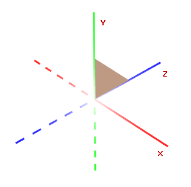
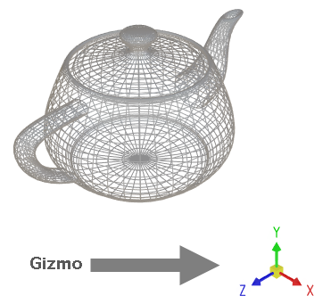
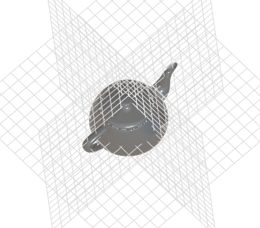
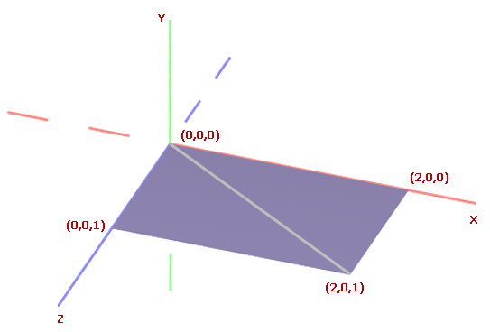
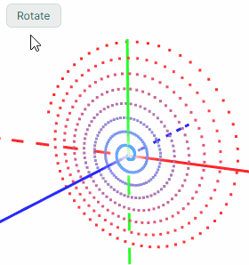
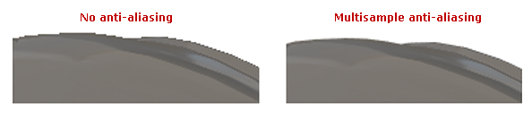
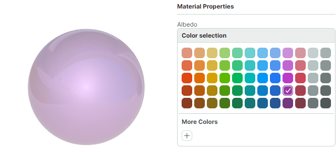
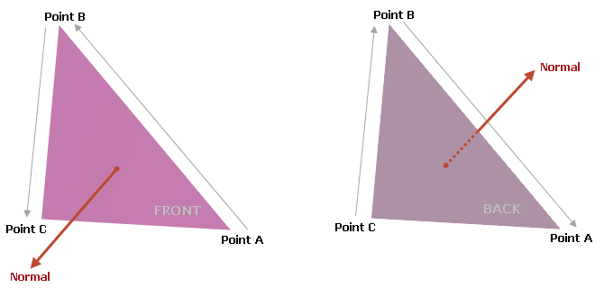
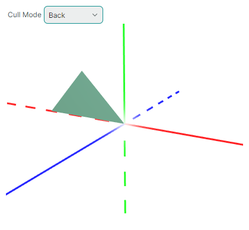

# Graphics3DControl 概述

`Graphics3DControl` 控件允许您在 Avalonia 应用程序中嵌入 3D 模型。该控件支持使用鼠标和键盘执行旋转、平移和缩放操作，让用户能够在运行时与模型进行交互。


任何 3D 模型都是由使用指定材质渲染的网格组成的。`Graphics3DControl` 提供了用于定义网格、材质、摄像机和光照设置的 API。您还可以利用第三方库将 OBJ 和 STL 格式的模型加载到 `Graphics3DControl` 控件中。

## 主要功能

- 用于指定 3D 模型的 API
- 同时显示多个 3D 模型
- 透视和等距摄像机
- 支持的网格类型：三角形、线和点
- 简单材质和纹理材质
- 3D 模型变换
- 正面和背面剔除
- 支持使用 MVVM 设计模式定义 3D 模型
- 显示坐标轴和网格线

### 用户交互

- 使用鼠标和键盘旋转、平移和缩放模型
- 提示信息
- 元素高亮和选择

请参阅[与 3D 模型的用户交互](user-interactions-with-3d-models.md)

## 快速入门

- [Graphics3DControl 快速入门](get-started-with-graphics3dcontrol.md) — 演示如何从零开始创建一个 3D 模型。

## 演示

请查看 [Eremex Avalonia Controls Demo](https://github.com/Eremex/controls-demo) 应用程序，其中包含演示 `Graphics3DControl` 各种功能的示例：

- 使用第三方库从外部文件加载 Wavefront（Obj）和 Stl 模型，并根据加载的数据创建 3D 模型。
- 从零开始创建 3D 模型。
- 展示支持的网格类型：三角形、线和点。
- 使用 MVVM 设计模式定义 3D 模型，等等。


## Graphics3DControl 的绘制主题

从 1.3 版本开始，要使用 `Graphics3DControl`，您必须在 _App.xaml_ 文件中注册 `Controls3D` 绘制主题。该主题包含渲染 `Graphics3DControl` 所需的通用外观设置。有关更多信息，请参阅以下主题：

- [注册 Graphics3DControl 的绘制主题](get-started-with-graphics3dcontrol.md#prerequisites-register-the-paint-theme-for-the-graphics3dcontrol)


!!! note

    如果未注册 `Controls3D` 绘制主题，`Graphics3DControl` 将显示为空白。


## 坐标系、坐标轴和网格线

`Graphics3DControl` 支持右手坐标系（默认）和左手坐标系。您可以使用 `Graphics3DControl.CoordinateSystem` 属性来启用所需的选项。

``` xml
<mx3d:Graphics3DControl Name="g3DControl" ShowAxes="True" CoordinateSystem="LeftHanded" ...>
```

### 右手坐标系

正 X、Y、Z 轴分别指向右侧、上方和面向观察者的方向。


### 左手坐标系

正 X、Y、Z 轴分别指向右侧、上方和远离观察者的方向。




<!-- TODO
перепутаны оси
 -->

### 坐标轴

启用 `Graphics3DControl.ShowAxes` 属性可在控件中显示 X、Y、Z 坐标轴。


``` xml
<mx3d:Graphics3DControl Name="g3DControl" ShowAxes="True"/>
```

#### 相关选项

- `Graphics3DControl.AxisThickness` 属性 — 指定坐标轴的粗细。


### Gizmo

`Graphics3DControl` 可以显示 Gizmo。它是一个独立的部件，用于直观地指示 3D 空间中坐标轴的当前朝向。



要启用 Gizmo，请使用 `Eremex.AvaloniaUI.Controls3D.Gizmo` 类的实例初始化 `Graphics3DControl.Gizmo` 属性。

``` xml
<mx3d:Graphics3DControl Name="g3DControl" >
        <!-- ... -->
    <mx3d:Graphics3DControl.Gizmo>
        <mx3d:Gizmo Name="gizmo" />
    </mx3d:Graphics3DControl.Gizmo>
</mx3d:Graphics3DControl>
```

您可以以自定义方式绘制 Gizmo。为此，请使用 `Gizmo.Models` 或 `Gizmo.ModelsSource` 属性指定用于渲染 Gizmo 的 3D 模型。填充这些属性的过程与 `Graphics3dControl` 相同，因为这两个类继承自同一个基类。

### 网格线

`Graphics3DControl.ShowGrid` 属性允许您在 XY、XZ 和 YZ 平面上显示网格线。

](../../images/g3d-grid.png)

``` xml
<mx3d:Graphics3DControl Name="g3DControl" ShowGrid="True"/>
```

#### 相关选项

- `Graphics3DControl.GridThickness` 属性 — 指定网格线的粗细。

<!-- TODO
Option for grid spacing ?
 -->


## 模型

要为 `Graphics3DControl` 定义 3D 模型，请使用 `Graphics3DControl` 的 API 创建表示模型、网格、顶点、材质、摄像机等的对象。

### 定义 3D 模型

`GeometryModel3D` 类封装了 `Graphics3DControl` 中的单个 3D 模型。
使用以下属性之一将 3D 模型添加到控件中：

- `Graphics3DControl.Models` — 一个 `GeometryModel3D` 对象的集合。
- `Graphics3DControl.ModelsSource` — 按照 MVVM 设计模式，用于创建 3D 模型（`GeometryModel3D` 对象）的业务对象源。

``` xml
xmlns:mx3d="https://schemas.eremexcontrols.net/avalonia/controls3d"

<mx3d:Graphics3DControl Name="g3DControl" ShowAxes="True"/>
```

``` cs
using Eremex.AvaloniaUI.Controls3D;

GeometryModel3D model = new GeometryModel3D();
g3DControl.Models.Add(model);
```


### 网格

一个 3D 模型代表使用特定材质渲染的一组网格。网格定义了 3D 对象的形状和结构。

`MeshGeometry3D` 类表示 `Graphics3DControl` 中的一个网格。以下属性允许您为模型指定网格：

- `GeometryModel3D.Meshes` — 一个 `MeshGeometry3D` 对象的集合。
- `GeometryModel3D.MeshesSource` — 按照 MVVM 设计模式，用于创建网格（`MeshGeometry3D` 对象）的业务对象源。

该控件支持三种网格类型，您可以通过 `MeshGeometry3D.FillType` 属性进行选择。


- `MeshFillType.Triangles`（默认）— 三角形网格。由三角形面（由三条边围成的平面区域）组成。

  

- `MeshFillType.Lines` — 线网格。顶点通过线连接，形成线框。

  

- `MeshFillType.Points` — 点网格（点云）。由未通过线连接的顶点组成。

  
  


``` cs
using DynamicData;

MeshGeometry3D meshTriangle1 = new MeshGeometry3D();
MeshGeometry3D meshSquare = new MeshGeometry3D();
MeshGeometry3D meshPoints = new MeshGeometry3D() { FillType = MeshFillType.Points };
//Define the meshes
//...
model.Meshes.AddRange(new[] { meshTriangle1, meshSquare, meshPoints });
```

创建网格时，使用以下属性来定义顶点和面/线：

- `MeshGeometry3D.Vertices` 数组 — 指定组成网格的所有顶点的数组。
- `MeshGeometry3D.Indices` 数组 — 定义三角形面（对于三角形网格），或线（对于线网格）。


#### 顶点

顶点是 3D 空间中由其坐标 (x, y, z) 定义的一个点。

`Vertex3D` 类型封装了 `Graphics3DControl` 中的单个顶点。使用 `MeshGeometry3D.Vertices` 数组向网格添加顶点。

`Vertex3D` 类型公开了以下需要初始化的主要属性。

- `Vertex3D.Position` — 一个 `Vector3` 值，指定顶点的 (x, y, z) 坐标。
- `Vertex3D.Normal` — 一个 `Vector3` 值，指定顶点法线。顶点法线是在该顶点处垂直于 3D 模型表面的向量。在 3D 图形中，顶点法线用于计算网格的光照和着色。相邻三角形的法线必须对齐，以确保平滑的着色（边缘）效果。

  

- `Vertex3D.TextureCoord` — 一个 `Vector2` 值，指定纹理材质中映射到当前顶点的点的 (x, y) 坐标。

#### 定义三角形网格

要创建三角形网格，您需要将一个形状划分为若干三角形。顶点指定这些三角形的角点。`MeshGeometry3D.FillType` 属性需要设置为其默认值（`MeshFillType.Triangles`）。

考虑一个网格为四边形的示例。可以通过添加一条对角线将其三角化。



首先，将所有顶点添加到 `MeshGeometry3D.Vertices` 数组中。

``` xml
<mx3d:Graphics3DControl Name="g3DControl" ShowAxes="True"/>
```

``` cs
using DynamicData;

GeometryModel3D model = new GeometryModel3D();
g3DControl.Models.Add(model);

Vector3 pt1 = new(2f, 0, 0);
Vector3 pt2 = new(0, 0, 0);
Vector3 pt3 = new(0, 0, 1);
Vector3 pt4 = new(2f, 0, 1);

MeshGeometry3D meshSquare = new MeshGeometry3D();
meshSquare.FillType = MeshFillType.Triangles;
Vertex3D[] meshSquareVertices = new Vertex3D[]
{
    new Vertex3D() { Position = pt1,  Normal = new Vector3(0, 1, 0) },
    new Vertex3D() { Position = pt2,  Normal = new Vector3(0, 1, 0) },
    new Vertex3D() { Position = pt3,  Normal = new Vector3(0, 1, 0) },
    new Vertex3D() { Position = pt4,  Normal = new Vector3(0, 1, 0) }
};
meshSquare.Vertices = meshSquareVertices;
//...
model.Meshes.AddRange(new[] { meshSquare });
```

然后使用 `MeshGeometry3D.Indices` 属性来构成三角形面。

对于三角形网格，`MeshGeometry3D.Indices` 属性是 `MeshGeometry3D.Vertices` 数组中定义各个网格三角形的顶点索引数组。此数组包含若干组，每组**三个**索引。数组中的前三个索引指向第一个网格三角形的顶点。接下来的三个索引指向第二个网格三角形的顶点，依此类推。
每个三角形的索引顺序很重要，因为它决定了表面法线。表面法线又决定了三角形的正面和背面，这对于背面剔除和正面剔除等操作至关重要。

对于上面的四边形网格，`MeshGeometry3D.Indices` 数组应包含六个索引。前三个索引指向第一个三角形的顶点。后三个索引指向第二个三角形的顶点。

``` cs
uint[] meshSquareIndices = new uint[] { 0, 1, 3, 1, 2, 3 };
meshSquare.Indices = meshSquareIndices;
```

#### 定义线网格

在线网格中，顶点通过线连接。要定义线网格，请创建一个 `MeshGeometry3D` 对象，并将其 `MeshGeometry3D.FillType` 属性设置为 `MeshFillType.Lines`。然后使用 `MeshGeometry3D.Vertices` 属性指定所有顶点，并使用 `MeshGeometry3D.Indices` 属性将顶点用线连接起来。

考虑以下由连接六个点的线组成的 3D 模型。


首先，将所有顶点添加到 `MeshGeometry3D.Vertices` 数组中。

``` xml
<mx3d:Graphics3DControl Name="g3DControl" ShowAxes="True"/>
```

``` cs
GeometryModel3D model = new GeometryModel3D();
g3DControl.Models.Add(model);

Vector3 p0 = new(1, 0, 0);
Vector3 p1 = new(1, 1, 0);
Vector3 p2 = new(1, 1, 2);
Vector3 p3 = new(2, 1, 2);
Vector3 p4 = new(2, 1, 0);
Vector3 p5 = new(2, 2, 0);

MeshGeometry3D meshLines = new MeshGeometry3D();
meshLines.PrimitiveSize = 3;
meshLines.FillType = MeshFillType.Lines;
Vertex3D[] meshLinesVertices = new Vertex3D[]
{
    new Vertex3D() { Position = p0,  Normal = new Vector3(0, 1, 0) },
    new Vertex3D() { Position = p1,  Normal = new Vector3(0, 1, 0) },
    new Vertex3D() { Position = p2,  Normal = new Vector3(0, 1, 0) },
    new Vertex3D() { Position = p3,  Normal = new Vector3(0, 1, 0) },
    new Vertex3D() { Position = p4,  Normal = new Vector3(0, 1, 0) },
    new Vertex3D() { Position = p5,  Normal = new Vector3(0, 1, 0) }
};
meshLines.Vertices = meshLinesVertices;
//...
model.Meshes.Add(meshLines);
```

<!-- TODO
Should I specify vertex Normals in a line and point meshes?
 -->


使用 `MeshGeometry3D.Indices` 属性将顶点用线连接起来。对于线网格，`MeshGeometry3D.Indices` 属性是 `MeshGeometry3D.Vertices` 数组中定义各条线的顶点索引数组。
此数组包含成对的索引。数组中前两个索引指向第一条线的顶点。接下来两个索引指向第二条线的顶点，依此类推。

对于上面的示例，`MeshGeometry3D.Indices` 数组应包含 10 个索引。第一对索引指向定义第一条线的点。第二对索引指向第二条线的顶点，依此类推。

``` cs
uint[] meshLinesIndices = new uint[] { 0, 1, 1, 2, 2, 3, 3, 4, 4, 5 };
meshLines.Indices = meshLinesIndices;
```

##### 线的粗细

在线网格中，使用 `PrimitiveSize` 属性来更改线的粗细。


#### 定义点网格

在点网格中，顶点被渲染为独立的点。

要定义点网格，请创建一个 `MeshGeometry3D` 对象，并将其 `MeshGeometry3D.FillType` 属性设置为 `MeshFillType.Points`。然后使用 `MeshGeometry3D.Vertices` 属性指定所有顶点，并使用 `MeshGeometry3D.Indices` 属性指定要渲染哪些顶点。

让我们创建一个形成螺旋线的点网格，其中的点排列在 XY 平面上。


``` cs
int pointCount = 500;

GeometryModel3D model = new GeometryModel3D();
g3DControl.Models.Add(model);
var vertices = new Vertex3D[pointCount];
var indices = new uint[pointCount];
MeshGeometry3D meshPoints = new MeshGeometry3D();
meshPoints.PrimitiveSize = 3;
meshPoints.MaterialKey = "pointsMaterial";
meshPoints.FillType = MeshFillType.Points;
double radius = 0;
double angle = 0;
double radiusStep = 0.1;
double angleStep = 0.1;
for (uint i = 0; i < pointCount; i++)
{
    double x = radius * Math.Cos(angle);
    double y = radius * Math.Sin(angle);
    vertices[i] = new Vertex3D() { 
        // Vertex coordinates:
        Position = new Vector3((float)x, (float)y, 0), 
        // Normalized coordinates of a position in the texture mapped to the current vertex:
        TextureCoord= new Vector2((float)i/pointCount, 0) 
    };
    radius += radiusStep;
    angle += angleStep;
    indices[i] = i;
}
meshPoints.Vertices = vertices;
meshPoints.Indices = indices;
model.Meshes.Add(meshPoints);
```

<!-- TODO
Remove line:
meshPoints.MaterialKey = "pointsMaterial";

Display a non-colorlized image (intermediate stage)
Then colorlize the spiral
 -->


您可以使用不同的颜色为点网格中的顶点着色。例如，可以根据顶点的位置或坐标来为其着色。

以下代码展示了如何使用纹理材质为顶点着色。顶点的索引决定了它的颜色（在下方颜色渐变中的位置）。


1. 将纹理材质（`TexturedPbrMaterial`）添加到 `Graphics3DControl.Materials` 集合中。纹理材质表示一组位图，用于指定以下纹理设置：
    - `Albedo` — 基础颜色
    - `Alpha` — 透明度
    - `Emission` — 表面发光的强度
    - `AmbientOcclusion` — 由阻挡环境光的对象所造成的阴影级别
    - `Roughness` — 表面的光滑程度
    - `Metallic` — 表面的反射率设置

    顶点随后会被映射到这些纹理位图内的特定位置。

    为确保顶点显示出目标颜色渐变中的真实颜色，请按如下方式配置纹理位图：
    
    - 将 `TexturedPbrMaterial.Emission` 设置为决定顶点真实颜色的渐变位图。
    - 将 `TexturedPbrMaterial.Albedo` 设置为填充为黑色的位图。
    - 将 `TexturedPbrMaterial.Roughness` 和 `TexturedPbrMaterial.AmbientOcclusion` 设置为填充为白色的位图。

    ``` cs
    using DynamicData;
    using Avalonia.Media;

    public void InitG3DControlMaterials()
    {
        g3DControl.Materials.AddRange(
            new[] {
                new TexturedPbrMaterial(){
                    Albedo = getSolidColorBitmap(Colors.Black),
                    Roughness = getSolidColorBitmap(Colors.White),
                    AmbientOcclusion = getSolidColorBitmap(Colors.White),
                    Emission = getGradientColorBitmap(Colors.DodgerBlue, Colors.Red), 
                    Key= "pointsMaterial"
                }
            }
        );
    }

    Bitmap getSolidColorBitmap(Color fillColor)
    {
        var bitmap = new RenderTargetBitmap(new PixelSize(pointCount, 1));
        using (var context = bitmap.CreateDrawingContext())
        {
            Brush brush = new SolidColorBrush(fillColor);
            context.FillRectangle(brush, new Rect(0, 0, pointCount, 1));
        }
        return bitmap;
    }

    Bitmap getGradientColorBitmap(Color fillColor1, Color fillColor2)
    {
        var bitmap = new RenderTargetBitmap(new PixelSize(pointCount, 1));
        using (var context = bitmap.CreateDrawingContext())
        {
            var gradientBrush = new LinearGradientBrush
            {
                StartPoint = new RelativePoint(0, 0, RelativeUnit.Relative),
                EndPoint = new RelativePoint(1, 1, RelativeUnit.Relative),
                GradientStops = {
                    new GradientStop(fillColor1, 0.0),
                    new GradientStop(fillColor2, 1.0)
                }
            };

            context.FillRectangle(gradientBrush, new Rect(0, 0, pointCount, 1));
        }
        return bitmap;
    }
    ```

    材质的 `TexturedPbrMaterial.Key` 属性被设置为一个唯一的键（字符串）。唯一键用于在 `Graphics3DControl.Materials` 集合中识别材质。

2. 使用 `MeshGeometry3D.MaterialKey` 属性将创建的材质分配给网格。`MeshGeometry3D.MaterialKey` 属性应与 `TexturedPbrMaterial.Key` 设置的值相匹配。

    ``` cs
    meshPoints.MaterialKey = "pointsMaterial";
    ```

3. 使用 `Vertex3D.TextureCoord` 属性将顶点映射到纹理中的特定位置。此属性应指定归一化坐标。_TextureCoord.X_ 和 _TextureCoord.Y_ 的值应在 0 到 1 的范围内，其中 0 对应纹理位图的左边缘或上边缘，1 对应纹理位图的右边缘或下边缘。

    创建顶点时，指定 `Vertex3D.TextureCoord` 属性，以确定纹理中的目标位置。

    ``` cs
    vertices[i] = new Vertex3D() { 
        // Vertex coordinates:
        Position = new Vector3((float)x, (float)y, 0), 
        // Normalized coordinates of a position in the texture mapped to the current vertex:
        TextureCoord= new Vector2((float)i/pointCount, 0) 
    };
    ```

    现在，顶点已使用指定的渐变进行着色。

    <!-- TODO
    Final image (with a different camera angle)
    -->

    <!-- TODO
    Check the phrase: where 0 corresponds to the left or ____top____ edge, 
    and 1 corresponds to the right or _____bottom_____
    -->

##### 点的粗细

在点网格中，使用 `PrimitiveSize` 属性来更改点的粗细。


### 模型可见性

使用 `GeometryModel3D.Visible` 属性来临时隐藏，然后再恢复某个模型。

``` cs
GeometryModel3D model = new GeometryModel3D();
g3DControl.Models.Add(model);
//...
model.Visible = !model.Visible;
```

### 模型变换

`Graphics3DControl` 允许您对模型执行变换。为此，请构造一个用于旋转、缩放和/或平移模型的变换矩阵。创建完成后，将该矩阵赋值给 `GeometryModel3D.Transform` 属性。

要清除当前的变换，请将 `GeometryModel3D.Transform` 属性设置为 `Matrix4x4.Identity` 对象。

`Matrix4x4` 类提供了用于生成各种类型变换矩阵的方法。其中一些方法包括：

- `Matrix4x4.CreateRotationX` — 生成一个表示绕 X 轴旋转指定角度的变换矩阵。
- `Matrix4x4.CreateRotationY` — 生成一个表示绕 Y 轴旋转指定角度的变换矩阵。
- `Matrix4x4.CreateRotationZ` — 生成一个表示绕 Z 轴旋转指定角度的变换矩阵。
- `Matrix4x4.CreateTranslation` — 生成一个将对象沿 X、Y、Z 轴按指定偏移量移动的变换矩阵。
- `Matrix4x4.CreateScale` — 生成一个将对象沿 X、Y、Z 轴进行缩放的变换矩阵。


要同时应用多个变换，您可以将执行各个变换的矩阵相乘。

#### 示例 - 旋转模型

以下示例创建了一个旋转 3D 模型（一个由点组成的螺旋线）的动画。调用 `Matrix4x4.CreateRotationZ` 方法来生成一个使模型绕 Z 轴旋转指定角度的变换矩阵。
要应用该变换，需将此矩阵赋值给 `GeometryModel3D.Transform` 属性。



``` cs
GeometryModel3D model;
//Init the model
//...
float angleStep = MathF.PI / 180;
float angle = 0;

private void BtnRotate_Click(object? sender, Avalonia.Interactivity.RoutedEventArgs e)
{
    for (int i = 0; i < 180; i++) 
    {
        angle += angleStep;
        Matrix4x4 rotationMatrix = Matrix4x4.CreateRotationZ(angle);
        model.Transform = rotationMatrix;
        // Update the UI
        Dispatcher.UIThread.RunJobs();
        Thread.Sleep(12);
    }
}
```

#### 示例 - 执行多个变换

以下示例创建了一个渲染三角形的 3D 模型，并展示了如何对该模型执行多个变换。

该示例将缩放、旋转和平移操作组合成一个变换矩阵，然后将此矩阵赋值给 `GeometryModel3D.Transform` 属性以应用这些变换。

该示例对变换矩阵应用小幅度的渐进变化，从而创建出平滑的动画效果。


``` xml
xmlns:mx3d="https://schemas.eremexcontrols.net/avalonia/controls3d"

<mx3d:Graphics3DControl Name="g3DControl" ShowAxes="True" Grid.Row="1"/>
```

``` cs
using DynamicData;

public MainWindow()
{
    InitG3dControl();
}

private void InitG3dControl()
{
    // Create a 3D model that renders a triangle.
    GeometryModel3D model = new GeometryModel3D();
    g3DControl.Models.Add(model);
    Vector3 pt1 = new(1f, 0, 0);
    Vector3 pt2 = new(0, 0, 0);
    Vector3 pt3 = new(0, 0, 1);
    MeshGeometry3D meshSquare = new MeshGeometry3D();
    meshSquare.FillType = MeshFillType.Triangles;
    Vertex3D[] meshSquareVertices = new Vertex3D[]
    {
        new Vertex3D() { Position = pt1,  Normal = new Vector3(0, 1, 0) },
        new Vertex3D() { Position = pt2,  Normal = new Vector3(0, 1, 0) },
        new Vertex3D() { Position = pt3,  Normal = new Vector3(0, 1, 0) }
    };
    uint[] meshSquareIndices = new uint[] { 0, 1, 2 };
    meshSquare.Indices = meshSquareIndices;
    meshSquare.Vertices = meshSquareVertices;
    model.Meshes.AddRange(new[] { meshSquare });
    this.model = model;
}

//Transform the model
private void BtnRotate_Click(object? sender, Avalonia.Interactivity.RoutedEventArgs e)
{
    int steps = 100;
    Vector3 stepTranslationVector = new Vector3(-0.5f, 0, 0)/steps;
    Vector3 stepScaleVector = new Vector3(-0.5f, 0, 0.1f)/steps;
    float stepRotationAngle = (MathF.PI/2)/steps;

    Vector3 translationVector = new Vector3(0,0,0), 
        scaleVector = new Vector3(1, 1, 1);
    float rotationAngle = 0;

    for (int i = 0; i < steps; i++)
    {
        rotationAngle += stepRotationAngle;
        translationVector += stepTranslationVector;
        scaleVector += stepScaleVector;

        // Translation Matrix (move by)
        Matrix4x4 translationMatrix = Matrix4x4.CreateTranslation(translationVector);
        // Scaling Matrix
        Matrix4x4 scalingMatrix = Matrix4x4.CreateScale(scaleVector);
        // Rotation Matrix
        Matrix4x4 rotationMatrix = Matrix4x4.CreateRotationY(rotationAngle);
        rotationMatrix *= Matrix4x4.CreateRotationX(rotationAngle);

        Matrix4x4 combinedMatrix = Matrix4x4.Identity;
        combinedMatrix *= scalingMatrix;
        combinedMatrix *= rotationMatrix;
        combinedMatrix *= translationMatrix;

        model.Transform = combinedMatrix;
        // Update the UI
        Dispatcher.UIThread.RunJobs();
        Thread.Sleep(12);
    }
}
```


### 多重采样（抗锯齿）

- `Graphics3DControl.MultisamplingMode` — 启用或禁用多重采样抗锯齿（MSAA）。

抗锯齿功能用于减少渲染图形中的视觉伪影（例如锯齿边缘），从而产生更平滑、更精细的效果。



`MultisamplingMode` 属性可以设置为以下值：`None`、`X2`、`X4`、`X8`、`X16`、`X32`、`X64`。`X2`……`X64` 的值决定了每个像素用于计算最终颜色的采样点数量。采样点越多，效果越好，但计算成本也越高。

- `MultisamplingMode` 属性的默认值是 `X8`。
- 并非所有 MSAA 模式都受您的 GPU 支持。如果选择了不受支持的 MSAA 模式，系统会回退到较低的可用模式。您可以使用 `Graphics3DControl.AvailableMultisamplingModes` 属性来返回您的显卡驱动程序所支持的 MSAA 模式列表。
- 对于较大的 3D 模型，多重采样会增加内存占用和计算成本。为了在这种情况下提高应用程序性能，请考虑将 `MultisamplingMode` 设置为较低的值，或禁用 MSAA。


<!-- TODO

Демка с чайником:

- Слишком чувствительная реакция на события мыши

- Почему нельзя приблизить ближе ?

- можно ли попасть внутрь объекта?
 -->


## 材质

`Graphics3DControl` 控件中的每个网格都可以使用自己的材质进行绘制。材质指定了表面与光线的交互方式，从而赋予对象其视觉外观。

`Graphics3DControl` 控件支持两种材质类型：

- `SimplePbrMaterial` — 一种使用数值（例如颜色，如基础色和自发光，以及光交互设置，如金属度和粗糙度）来定义表面视觉属性的材质。有关更多信息，请参阅[简单材质（SimplePbrMaterial）](#simple-materials-simplepbrmaterial)

- `TexturedPbrMaterial` — 一种 PBR 格式的纹理材质。此材质使用纹理（位图）来指定表面的视觉属性。有关更多信息，请参阅[纹理材质（TexturedPbrMaterial）](#textured-materials-texturedpbrmaterial)

要将材质应用于网格，请执行以下操作：

1. 创建并初始化材质。
1. 将材质的 `Key` 属性设置为唯一字符串。这些键用于在将材质分配给网格时进行材质识别。
1. 将材质添加到 `Graphics3DControl.Materials` 集合中。
1. 使用 `MeshGeometry3D.MaterialKey` 属性将网格与特定材质关联起来。为此，将 `MeshGeometry3D.MaterialKey` 属性设置为目标材质的 `Key` 属性值。

### 示例 - 将材质分配给网格

以下示例创建了三种材质（`SimplePbrMaterial` 对象），并将其中一种材质应用于某个网格。所创建的材质通过唯一的字符串键（“BrownColor”、“TomatoColor” 和 “VioletColor”）进行标识。

``` cs
using DynamicData;

g3DControl.Materials.AddRange(
    new[] {
        new SimplePbrMaterial(Color.FromUInt32(0xFF822c2e), "BrownColor"),
        new SimplePbrMaterial(Color.FromUInt32(0xffeb523f), "TomatoColor"),
        new SimplePbrMaterial(Color.FromUInt32(0xFFea3699), "VioletColor")
    }
);

//...

mesh1.MaterialKey = "VioletColor";
```

### 简单材质（`SimplePbrMaterial`）

`SimplePbrMaterial` 是一种以数值形式描述表面视觉属性的材质。它提供以下成员用于指定视觉设置：

- `Albedo` — 基础颜色。

    该属性的值是一个 Vector3 对象，其 X、Y、Z 成员分别指定红、绿、蓝三个颜色分量的归一化值。归一化值的范围是 [0;1]。要将标准颜色分量（0–255）转换为归一化值，请将其除以 255。您也可以使用 `SimplePbrMaterial` 构造函数，从指定的 `Color` 对象初始化 `Albedo` 和 `Alpha` 属性。此构造函数会自动对颜色分量进行归一化。

- `Alpha` — 透明度级别。

    该属性的值应在 [0;1] 范围内，其中 `0` 表示完全透明，`1` 表示完全不透明。

- `Emission` — 表面发光的强度。

    该属性的值是一个 Vector3 对象，其 X、Y、Z 成员分别指定红、绿、蓝三个颜色分量的归一化值。归一化值的范围是 [0;1]。要将标准颜色分量（0–255）转换为归一化值，请将其除以 255。

- `AmbientOcclusion` — 由阻挡环境光的对象所造成的阴影级别。

    该属性的值应在 [0;1] 范围内，其中 `0` 表示应用最大程度的环境光遮蔽效果，`1` 表示不应用环境光遮蔽。

- `Roughness` — 表面的光滑程度。

    该属性的值应在 [0;1] 范围内，其中 `0` 表示完全光滑有光泽的表面，`1` 表示完全粗糙、无光泽的表面。

- `Metallic` — 表面的反射率。

    该属性的值应在 [0;1] 范围内，其中 `0` 表示非金属表面，`1` 表示完全金属材质。

#### 演示

[演示应用程序](../../index.md#demo-application)中的 `Simple Materials` 示例展示了使用简单材质绘制的 3D 模型。该演示允许您实时调整材质的设置，并即时查看更改效果。



#### 示例 - 将简单材质应用于模型

以下代码创建了一个简单材质（`SimplePbrMaterial` 对象），并将其应用于某个 3D 模型的第一个网格。
`SimplePbrMaterial.Albedo` 属性使用归一化颜色坐标被设置为基础颜色（Teal，蓝绿色）。

``` cs
SimplePbrMaterial material = new SimplePbrMaterial();
material.Albedo = ToNormalizedVector3(Colors.Teal);
material.Emission = ToNormalizedVector3(Colors.Black);
material.Metallic = 0;
material.Roughness = 0.5f;
material.AmbientOcclusion = 1;
material.Key = "myFavMaterial";
g3DControl.Materials.Add(material);

// Apply the material to the first mesh of the model
g3DControl.Models[0].Meshes[0].MaterialKey = "myFavMaterial";


public static Vector3 ToNormalizedVector3(Color color)
{
    return new Vector3(color.R/255f, color.G/255f, color.B/255f);
}
```

将该材质应用于一个示例 3D 模型的效果如下所示：


### 纹理材质（`TexturedPbrMaterial`）

`TexturedPbrMaterial` 是一种使用 PBR 纹理（位图）来定义表面视觉属性的材质。`TexturedPbrMaterial` 类提供以下成员用于配置材质的设置：

- `Albedo` — 指定材质基础颜色的位图。

- `Alpha` — 指定透明度级别的位图。

- `Emission` — 指定表面发光强度的位图。

- `AmbientOcclusion` — 指定由阻挡环境光的对象所造成阴影级别的位图。

- `Roughness` — 指定表面光滑程度的位图。

- `Metallic` — 指定表面反射率的位图。

- `Normal` — 指定法线贴图（Normal Map）的位图。

#### 演示

[演示应用程序](../../index.md#demo-application)中的 `Textured Materials` 示例展示了使用 PBR 纹理渲染的 3D 模型。这些纹理从存储在应用程序资源中的图形文件加载而来。


以下来自 `Textured Materials` 演示的代码片段，用材质（`TexturedPbrMaterial` 对象）填充了视图模型的 `Materials` 集合。这些材质是根据存储在应用程序资源中 `DemoCenter.Resources.Graphics3D.Materials` 文件夹下、以 ZIP 文件形式存放的所有纹理创建的。对于每个材质，如果包含纹理的 ZIP 文件中包含 `Albedo`、`AmbientOcclusion`、`Metallic`、`Roughness`、`Normal` 和 `Emission` 设置所需的位图，这些位图就会被加载并应用到该材质上。

``` cs
public partial class Graphics3DControlTexturedMaterialsViewModel : Graphics3DControlViewModel
{
    [ObservableProperty] ObservableCollection<TexturedPbrMaterial> materials = new();
    [ObservableProperty] TexturedPbrMaterial selectedMaterial;

    public Graphics3DControlTexturedMaterialsViewModel()
    {
        var assembly = Assembly.GetAssembly(typeof(Graphics3DControlViewModel));
        var textureNames = assembly!.GetManifestResourceNames().Where(name => name.StartsWith("DemoCenter.Resources.Graphics3D.Materials."));
        foreach (var textureName in textureNames)
            materials.Add(LoadMaterial(assembly, textureName));
        selectedMaterial = Materials.First();
        //...
    }

    static TexturedPbrMaterial LoadMaterial(Assembly assembly, string resourceName)
    {
        var stream = assembly!.GetManifestResourceStream(resourceName);
        using var archive = new ZipArchive(stream!, ZipArchiveMode.Read);
        var material = new TexturedPbrMaterial { Key = resourceName.Split('.')[^2] };
        foreach (var entry in archive.Entries)
        {
            using var entryStream = entry.Open();
            using var memoryStream = new MemoryStream();
            entryStream.CopyTo(memoryStream);
            memoryStream.Seek(0, SeekOrigin.Begin);
            var bitmap = new Bitmap(memoryStream);
            if (entry.Name.StartsWith("Albedo"))
                material.Albedo = bitmap;
            else if (entry.Name.StartsWith("AO"))
                material.AmbientOcclusion = bitmap;
            else if (entry.Name.StartsWith("Metallic"))
                material.Metallic = bitmap;
            else if (entry.Name.StartsWith("Roughness"))
                material.Roughness = bitmap;
            else if (entry.Name.StartsWith("Normal"))
                material.Normal = bitmap;
            else if (entry.Name.StartsWith("Emissive"))
                material.Emission = bitmap;
        }
        return material;
    }
}
```

以下来自 `Textured Materials` 演示的 XAML 代码，将 `Graphics3DControl` 控件绑定到视图模型中的材质集合（`Graphics3DControlTexturedMaterialsViewModel.Materials`）。当前应用的材质由 `Graphics3DControlTexturedMaterialsViewModel.SelectedMaterial` 属性指定。

``` xml
<mx3d:Graphics3DControl x:Name="DemoControl" MaterialsSource="{Binding Materials}">
    <mx3d:GeometryModel3D>
        <mx3d:MeshGeometry3D Vertices="{Binding Vertices}" Indices="{Binding Indices}" MaterialKey="{Binding SelectedMaterial.Key}" />
    </mx3d:GeometryModel3D>
</mx3d:Graphics3DControl>
```

#### 纹理坐标

使用纹理材质时，您需要将纹理映射到某个表面。为此，请初始化网格中顶点的 `Vertex3D.TextureCoord` 属性。此属性指定纹理坐标（通常称为 UV 坐标）。

纹理坐标是顶点所映射到的二维坐标 `(x, y)`。

- `x` 表示纹理中的水平坐标，范围为 [0; 1]，其中 `0` 表示图像的左边缘，`1` 表示图像的右边缘。

- `y` 表示纹理中的垂直坐标，范围为 [0; 1]，其中 `0` 表示图像的上边缘，`1` 表示图像的下边缘。

<!-- TODO
Check what's the meaning for 'y=1' and 'y=0'?
-->

例如，坐标 `(x, y)` 为 `(0.5, 0.5)` 将采样纹理中心的像素。

##### 示例

演示 `Vertex3D.TextureCoord` 属性用法的示例：

- `Textured Materials` 演示。

- 本文档中[定义点网格](#define-a-point-mesh)一节中的示例。


## 背面剔除和正面剔除

`Graphics3DControl.CullMode` 属性允许您为[三角形网格](#meshes)启用背面剔除和正面剔除。剔除模式决定了 3D 模型的哪些面应被绘制，哪些应被丢弃。您可以将 `Graphics3DControl.CullMode` 属性设置为以下值：

- `CullMode.Back` — 启用背面剔除，即不绘制三角形的背面。

- `CullMode.Front` — 启用正面剔除，即不绘制三角形的正面。

- `CullMode.None` — 正面和背面都会被绘制。

### 识别面的正面和背面

当您为网格[定义三角形面](#define-a-triangle-mesh)时，使用 `MeshGeometry3D.Indices` 属性来指定构成每个三角形的顶点索引。

每个网格三角形的索引顺序很重要，因为它决定了表面法线的方向，从而决定了三角形的正面和背面：

- 如果三角形的索引按逆时针方向排列，表面法线指向观察者，此时观察者看到的是该三角形的正面。

- 如果三角形的索引按顺时针方向排列，表面法线指向远离观察者的方向，此时观察者看到的是该三角形的背面。

 

### 示例

本示例演示了面剔除功能。
在此示例中，创建了一个由两个三角形组成的模型。显示时，观察者看到的是第一个（左侧）三角形的正面和第二个（右侧）三角形的背面。


``` xml
xmlns:mx3d="https://schemas.eremexcontrols.net/avalonia/controls3d"

<mx3d:Graphics3DControl Name="g3DControl" ShowAxes="True"/>
```

``` cs
using Avalonia.Media;
using DynamicData;

GeometryModel3D model = new GeometryModel3D();
g3DControl.Models.Add(model);

Vector3 pt1 = new(-1f, 0, 0);
Vector3 pt2 = new(-0.5f, 0.5f, 0);
Vector3 pt3 = new(0, 0, 0);
Vector3 pt4 = new(0, 0, 0);
Vector3 pt5 = new(0.5f, 0.5f, 0);
Vector3 pt6 = new(1f, 0, 0);

MeshGeometry3D mesh1 = new MeshGeometry3D();
mesh1.FillType = MeshFillType.Triangles;
Vertex3D[] meshVertices = new Vertex3D[]
{
    new Vertex3D() { Position = pt1,  Normal = new Vector3(0, 0, 1) },
    new Vertex3D() { Position = pt2,  Normal = new Vector3(0, 0, 1) },
    new Vertex3D() { Position = pt3,  Normal = new Vector3(0, 0, 1) },
    new Vertex3D() { Position = pt4,  Normal = new Vector3(0, 0, -1) },
    new Vertex3D() { Position = pt5,  Normal = new Vector3(0, 0, -1) },
    new Vertex3D() { Position = pt6,  Normal = new Vector3(0, 0, -1) }
};
mesh1.Vertices = meshVertices;
// Vertices of the first triangle are enumerated counter-clockwise (pt3->pt2->pt1),
// while vertices of the second triangle are enumerated clockwise (pt4->pt5->pt6):
uint[] meshIndices = new uint[] { 2, 1, 0, 3, 4, 5 };
mesh1.Indices = meshIndices;
model.Meshes.AddRange(new MeshGeometry3D[] { mesh1 });
g3DControl.Materials.Add(new SimplePbrMaterial(Colors.SeaGreen, "myMaterial"));
mesh1.MaterialKey = "myMaterial";
```

当您将 `Graphics3DControl.CullMode` 属性设置为 `CullMode.Back` 时，背面不会被绘制。第二个（右侧）三角形背对摄像机，因此不会被绘制。



当 `Graphics3DControl.CullMode` 等于 `CullMode.Front` 时，正面不会被绘制。第一个（左侧）三角形面向摄像机，因此被隐藏：


## 伽马校正和曝光校正

- `Graphics3DControl.Exposure` — 控制曝光校正级别，用于调整渲染图像的亮度。默认值为 4.5。该属性可以设置为非负值。
- `Graphics3DControl.Gamma` — 控制伽马校正。默认值为 2.2，这是大多数显示器的标准伽马值。该属性可以设置为非负值。


<br>
<br>

<sup>*</sup> 本页面使用机器翻译技术翻译。
