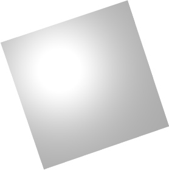
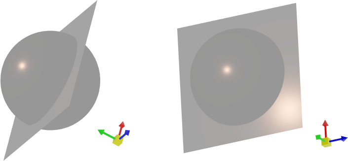
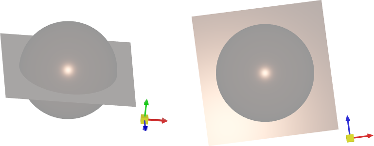

# 光

在Graphics3DControl中，灯光用于照亮3D模型。您可以使用默认灯光，或为 3D 场景创建自定义光源。


## 默认灯光

`Graphics3DControl` 提供开箱即用的默认灯光。默认灯光表示链接到相机的白点光源。它的方向始终与相机的方向同步。

下面的图像演示了从金属平面反射的默认光。



任何灯光的实际视觉效果都是由应用于3D模型的[materials](graphics3dcontrol-overview.md#materials)决定的。


#### 相关选项

- `Graphics3DControl.AllowDefaultLight`（默认值为 `true`）— 将此​​属性设置为 `false` 可强制禁用默认灯光。

创建自定义灯光时，默认灯光会自动禁用。


## 定制灯


要将自定义灯光添加到 3D 场景，请创建光源并将其添加到 `Graphics3DControl.Lights` 集合中。您还可以使用 `Graphics3DControl.LightsSource` 和 `Graphics3DControl.LightTemplate` 属性根据 MVVM 设计模式添加自定义灯光。


`Graphics3DControl`支持以下光源类型：

- 点光源 (`PointLight`)
- 定向光 (`DirectionalLight`)
- 相机相关点光源（`CameraPointLight`）
- 相机相关定向光（`CameraDirectionalLight`）

所有这些光源都有一个祖先，即 `Light` 抽象类。

### 点光源

向各个方向辐射（就像灯泡一样）。

#### 班级

`PointLight`

#### 设置
    
- `Color` — 光的颜色。
- `Position` — 光发射器的位置。
- `Radius` — 光发射器的半径。

#### 例子

以下示例创建珊瑚色的点光源。下面的图像演示了从金属平面和球体反射的光。



``` xml
<mx3d:Graphics3DControl.Lights>
    <mx3d:PointLight Color="{Binding MyLightColor}" Position="{Binding MyLightPosition}" Radius="10"/>
</mx3d:Graphics3DControl.Lights>
```
``` cs
PointLight myLight = new PointLight();
myLight.Color = Avalonia.Media.Colors.Coral;
myLight.Position = new Vector3(0, 50, 0);
myLight.Radius = 10;
g3DControl.Lights.Add(myLight);
```

### 定向光

向指定方向发射平行光线，模拟远处的照明（如阳光）。


#### 班级

`DirectionalLight`

#### 设置

- `Color` — 光的颜色。
- `Direction` — 指定光线方向的矢量。

#### 例子


以下示例添加指向负 Y 轴方向的定向光源。下面的图像演示了从金属平面和球体反射的光。


``` xml
<mx3d:Graphics3DControl.Lights>
    <mx3d:DirectionalLight Color="{Binding MyLightColor}" Direction="{Binding MyLightDirection}"/>
</mx3d:Graphics3DControl.Lights>
```
``` cs
using Eremex.AvaloniaUI.Controls3D;

DirectionalLight myLight = new DirectionalLight();
myLight.Direction = new System.Numerics.Vector3(0, -1, 0);
myLight.Color = Avalonia.Media.Colors.Coral;
g3DControl.Lights.Add(myLight);
```


### 相机相关的点光源

从相机发出的点光。该光的位置和方向与相机同步。

#### 班级

`CameraPointLight`

#### 设置

- `Color` — 光的颜色。
- `Radius` — 光发射器的半径。

#### 例子

以下示例创建与相机链接的点光源。下面的图像演示了从金属平面和球体反射的光。


``` xml
<mx3d:Graphics3DControl.Lights>
    <mx3d:CameraPointLight Color="{Binding MyLightColor}" Radius="10"/>
</mx3d:Graphics3DControl.Lights>
```
``` cs
using Eremex.AvaloniaUI.Controls3D;

CameraPointLight myLight = new CameraPointLight();
myLight.Radius = 10;
myLight.Color = Avalonia.Media.Colors.Coral;
g3DControl.Lights.Add(myLight);
```


### 相机相关定向光

沿相机方向发射平行光线，模拟远处的照明（如阳光）。

#### 班级

`CameraDirectionalLight`

#### 设置

- `Color` — 光的颜色。


#### 例子

以下示例创建与相机链接的定向光。下面的图像演示了从金属平面和球体反射的光。



``` xml
<mx3d:Graphics3DControl.Lights>
    <mx3d:CameraDirectionalLight Color="{Binding MyLightColor}"/>
</mx3d:Graphics3DControl.Lights>
```
``` cs
using Eremex.AvaloniaUI.Controls3D;

CameraDirectionalLight myLight = new CameraDirectionalLight();
myLight.Color = Avalonia.Media.Colors.Coral;
g3DControl.Lights.Add(myLight);
```


<!-- TODO

### 使用 MVVM 方法添加灯光

- `Graphics3DControl.LightsSource` — 支持 MVVM 设计模式。 `LightsSource` 属性是业务对象的集合 -->

<br>
<br>

<sup>*</sup> 本页面使用机器翻译技术翻译。
