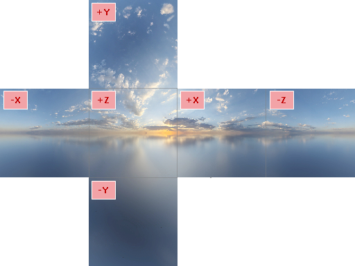

# 天空盒

`Graphics3DControl` 支持天空盒。天空盒是一种用于在 3D 场景周围创建沉浸式背景的技术。

天空盒由一个围绕整个场景的大立方体组成，具有六个纹理面（前、后、左、右、上、下）。这些纹理被映射到立方体的内侧，给人一种遥远的天空、地平线或其他背景的错觉。纹理的设计使其边缘完美匹配，确保从立方体内部观看时无缝的视觉连续性。

默认情况下，天空盒是隐藏的。但是，如果模型使用金属材质，天空盒可能会出现在其反射中。

## 启用天空盒

要使天空盒可见，请使用 `Skybox` 对象初始化 `Graphics3DControl.Skybox` 属性，并将 `Skybox.IsVisible` 属性设置为 `true`。

``` xml
xmlns:mx3d="https://schemas.eremexcontrols.net/avalonia/controls3d"

<mx3d:Graphics3DControl Name="g3DControl1">
    <mx3d:Graphics3DControl.Skybox>
        <mx3d:Skybox IsVisible="True"/>
    </mx3d:Graphics3DControl.Skybox>
</mx3d:Graphics3DControl>
```

## 指定自定义天空盒纹理

要创建自定义天空盒，您需要指定六个单独的纹理（位图），它们将映射到天空盒立方体的前、后、左、右、顶和底面。



- 所有天空盒纹理必须具有相同的大小。
- 每个纹理都应具有方形纵横比 (1:1)，以防止映射到立方体面时变形。

使用 `Skybox` 对象的以下属性为立方体面提供天空盒纹理：

- `Skybox.Top`
 - `Skybox.Bottom`
 - `Skybox.Left`
 - `Skybox.Right`
 - `Skybox.Front`
 - `Skybox.Rear`


### 例子

以下代码演示了如何在 XAML 中指定自定义天空盒纹理。纹理存储在项目的 _G3dControlSample/Resources/Textures_ 文件夹中，并且它们的 `Build Action` 属性设置为 `AvaloniaResource`。

``` xml
xmlns:mx3d="https://schemas.eremexcontrols.net/avalonia/controls3d"

<mx3d:Graphics3DControl Name="g3DControl1"  ModelsSource="{Binding Models}">
    <mx3d:Graphics3DControl.Gizmo>
        <mx3d:Gizmo x:Name="Gizmo" />
    </mx3d:Graphics3DControl.Gizmo>
    <mx3d:Graphics3DControl.Skybox>
        <mx3d:Skybox IsVisible="True"
                     Top="avares://G3dControlSample/Resources/Textures/py.png"
                     Bottom="avares://G3dControlSample/Resources/Textures/ny.png"
                     Left="avares://G3dControlSample/Resources/Textures/nx.png"
                     Right="avares://G3dControlSample/Resources/Textures/px.png"
                     Front="avares://G3dControlSample/Resources/Textures/pz.png"
                     Rear="avares://G3dControlSample/Resources/Textures/nz.png"
                     />
    </mx3d:Graphics3DControl.Skybox>
    <mx3d:Graphics3DControl.Materials>
        <mx3d:SimplePbrMaterial Metallic="0.6" />
    </mx3d:Graphics3DControl.Materials>
</mx3d:Graphics3DControl>
```
下面的图像演示了带有自定义天空盒的示例模型：


## 示例 - 禁用金属材质的反射

当 3D 模型使用金属材质时，表面会反射默认的灯光和天空盒。要防止金属材料发生这些反射，请执行以下操作：

- 使用 `Graphics3DControl.AllowDefaultLight` 属性禁用默认灯光。
- 将白色位图应用于所有天空盒立方体面。


以下代码展示了如何在代码隐藏（code-behind）中防止反射：

``` cs
g3DControl.Exposure = 4.5f;
g3DControl.AllowDefaultLight = false;
Skybox skybox = new Skybox();
skybox.IsVisible = false;
Bitmap whiteBitmap = getSolidColorBitmap(Colors.White);
skybox.Top = skybox.Bottom = whiteBitmap;
skybox.Left = skybox.Right = whiteBitmap;
skybox.Rear = skybox.Front = whiteBitmap;
g3DControl.Skybox = skybox;

Bitmap getSolidColorBitmap(Color fillColor)
{
    var bitmap = new RenderTargetBitmap(new PixelSize(100, 100));
    using (var context = bitmap.CreateDrawingContext())
    {
        Brush brush = new SolidColorBrush(fillColor);
        context.FillRectangle(brush, new Rect(0, 0, 100, 100));
    }
    return bitmap;
}
```

<br>
<br>

<sup>*</sup> 本页面使用机器翻译技术翻译。
