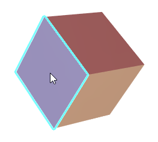
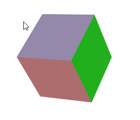

# 用户与 3D 模型的交互

`Graphics3DControl` 使用户能够与 3D 模型进行交互。用户可以使用鼠标和键盘旋转、缩放和平移（移动）模型。此外，您可以允许用户通过单击鼠标来选择模型的元素，或者在将鼠标悬停在元素上时突出显示元素。 
`Graphics3DControl` 还支持模型及其元素（网格）的工具提示。

## 旋转模型

#### 键盘快捷键

- 向左旋转 — Shift+向左箭头
- 向右旋转 — Shift+右箭头
- 向上旋转 — Shift+向上箭头
- 向下旋转 — Shift+向下箭头


#### 鼠标操作

- 旋转 — 使用鼠标左键拖动模型。

### 旋转选项

- `Graphics3DControl.RotateStep` — 允许您设置控件的旋转速度。 `RotateStep` 属性以内部单位指定。默认值为 20。值越高，旋转速度越大。

<!-- TODO
Check the property in the demo. 
 -->

## 缩放模型

#### 键盘快捷键

- 放大 — CTRL+加号键
- 缩小 — CTRL+减号键

#### 鼠标操作

- 缩放 — 使用鼠标滚轮放大和缩小。

### 缩放选项

- `Graphics3DControl.ZoomRate` — 控制使用键盘和鼠标滚轮执行缩放操作的速度。默认值为 0.1。值越高，变焦速度越高。

## 移动模型

#### 键盘快捷键

- 向左移动 — CTRL+向左箭头
- 向右移动 — CTRL+右箭头
- 向上移动 — CTRL+向上箭头
- 向下移动 — CTRL+向下箭头

#### 鼠标操作

- 移动 - 使用鼠标右键拖动模型。

### 移动选项

- `Graphics3DControl.KeyboardMoveStep` 属性 — 允许您指定在单次键盘移动操作期间模型移动的距离。

<!-- TODO
which units ?
 -->

## 在代码中旋转、缩放和移动模型

要在代码中从特定位置和角度查看模型，您需要调整相机的位置和方向。请参阅以下主题了解更多信息：

- [Camera](camera.md)


## 覆盖键盘快捷键

`Graphics3DKeyBindings` 类的 `Graphics3DControl.NavigationBindings` 属性允许您覆盖默认键盘快捷键。 `Graphics3DKeyBindings` 类包含定义缩放、旋转和平移操作快捷方式的属性。最初，这些属性被设置为上面列出的默认快捷方式。您可以使用这些属性为操作分配自定义快捷方式。

以下代码将 CTRL+1 和 CTRL+2 快捷键分配给“放大”和“缩小”操作。

``` cs
g3DControl.NavigationBindings = new Graphics3DKeyBindings();
Graphics3DKeyBinding zoomInShortcut = new Graphics3DKeyBinding(Avalonia.Input.KeyModifiers.Control, Avalonia.Input.Key.D1);
Graphics3DKeyBinding zoomOutShortcut = new Graphics3DKeyBinding(Avalonia.Input.KeyModifiers.Control, Avalonia.Input.Key.D2);
g3DControl.NavigationBindings.ZoomIn = zoomInShortcut;
g3DControl.NavigationBindings.ZoomOut = zoomOutShortcut;
```

## 显示提示

当用户将鼠标悬停在模型或单个网格上时，`Graphics3DControl` 可以显示提示。


使用以下属性将提示分配给模型、网格或同时分配给模型和网格：

- `GeometryModel3D.Hint` — 模型提示。
- `MeshGeometry3D.Hint` — 网格的提示。

以下示例为模型及其网格设置提示。网格的提示表明了它们的名称。

``` xml
<mx3d:GeometryModel3D x:Name="Cube" MeshesSource="{Binding Meshes}" Hint="Cube">
    <mx3d:GeometryModel3D.MeshTemplate>
        <DataTemplate x:DataType="vm:MeshViewModel">
            <mx3d:MeshGeometry3D 
                Name="{Binding Name}" 
                Hint="{Binding Name}"
                ...
            />
        </DataTemplate>
    </mx3d:GeometryModel3D.MeshTemplate>
</mx3d:GeometryModel3D>
```
``` cs
public partial class MeshViewModel : ObservableObject
{
    [ObservableProperty] string name;
    [ObservableProperty] Vertex3D[] vertices;
    //...
}
```

当为模型和网格设置提示时，这些提示将合并为单个提示，并由“,”分隔符分隔。


将 `Graphics3DControl.ShowHints` 属性设置为 `false` 以禁用提示。该属性的默认值为 `true`。

## 突出显示元素

`Graphics3DControl`支持模型和网格突出显示。借助此功能，当用户将鼠标悬停在模型/网格上时，该控件会在模型/网格周围绘制高亮边框。



使用 `Graphics3DControl.HighlightMode` 属性启用突出显示功能并指定突出显示模式。可以使用以下选项：

- `Mesh` — 启用单个网格的突出显示。
- `Model` — 启用单个模型的突出显示。
- `None`（默认）— 突出显示功能已禁用。

**相关API**

- `Graphics3DControl.HighlightedElement` — 获取或设置当前突出显示的元素。
- `Graphics3DControl.HighlightColor` — 获取或设置用于在突出显示元素周围绘制突出显示边框的颜色。


## 选择元素

您可以启用选择功能，以允许用户通过单击鼠标来选择元素（模型或网格）。当用户单击元素时，元素周围会绘制选择边框。



使用 `Graphics3DControl.SelectionMode` 属性激活选择功能并定义选择模式。可用的选项包括：

- `Mesh` — 单击鼠标即可选择单个网格。
- `Model` — 单击鼠标即可选择单个模型。
- `None`（默认）— 选择功能已禁用。


**相关API**

- `Graphics3DControl.SelectedElement` — 获取或设置当前选定的元素。
- `Graphics3DControl.SelectionColor` — 获取或设置用于在选定元素周围绘制边框的颜色。


## 另请参阅

- [Camera](camera.md)

<br>
<br>

<sup>*</sup> 本页面使用机器翻译技术翻译。
