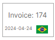

# ListView 控件入门

[ListViewControl](listview-overview.md) 允许您在单列或多列中显示项列表。该控件支持项排序、分组、筛选和多选。


<!-- TODO
Поставить точку останова в MainWindowViewModel на строке
focusedItem = value;
После этого, селекшн не снимается с предыдущего выделенного айтема при выборе нового айтема
 -->

本教程演示如何使用 `ListViewControl` 控件实现项列表,并按项属性对项进行排序和分组。


ListView 控件可以使用项源中的项进行填充。若要呈现绑定的项,您需要提供一个项模板。使用 ListView 控件时,您可以创建由多个字段组成的复杂项模板。
本示例创建一个项模板,该模板定义了一个带有 SVG 图像和内部文本块的边框。

## 创建新应用程序
创建一个新的 [Eremex Avalonia .NET MVVM 应用程序](../../get-started/index.md)。将其命名为 _ListView-example_。


若要显示 SVG 图像,请将 `Avalonia.Svg.Skia` NuGet 包添加到项目中。

## 定义项源

在 _MainWindowViewModel.cs_ 文件中,创建封装项对象的 _ItemViewModel_ 类。

``` cs
public partial class ItemViewModel : ObservableObject
{
    [ObservableProperty] private int invoiceId;
    [ObservableProperty] private string shipCountry;
    [ObservableProperty] private DateTime date;
    [ObservableProperty] private IImage flag;

    public ItemViewModel(int id, string shipCountry, IImage flag)
    {
        InvoiceId = id;
        ShipCountry = shipCountry;
        Random random = new Random();
        Date = new DateTime(DateTime.Now.Year, random.Next(1, 12), random.Next(1, 28));
        Flag = flag;
    }
}
```

_ItemViewModel_ 类公开的 _InvoiceId_、_Date_ 和 _Flag_ 属性包含要在 ListView 项中显示的值。_ItemViewModel.ShipCountry_ 属性指定与项关联的发货国家/地区。ListView 项将按此属性进行分组。

按照下面的示例,在 _MainWindowViewModel_ 类中创建并初始化 _Items_ 集合。以下代码使用三组项填充 _Items_ 集合。每组项都关联着各自的发货国家/地区(_China_、_Brazil_ 和 _India_)。

``` cs
using CommunityToolkit.Mvvm.ComponentModel;
using Avalonia.Svg.Skia;
using Eremex.AvaloniaUI.Controls.Utils;

public partial class MainWindowViewModel : ViewModelBase
{
    [ObservableProperty] 
    private List<ItemViewModel> items;

    public MainWindowViewModel()
    {
        SvgImage chinaFlag = ImageLoader.LoadSvgImage(Assembly.GetExecutingAssembly(), "Assets/china-flag.svg");
        SvgImage indiaFlag = ImageLoader.LoadSvgImage(Assembly.GetExecutingAssembly(), "Assets/india-flag.svg");
        SvgImage brazilFlag = ImageLoader.LoadSvgImage(Assembly.GetExecutingAssembly(), "Assets/brazil-flag.svg");

        Random random = new Random();
        Items = new List<ItemViewModel>();
        for (int i = 1; i < 10; i++)
        {
            Items.Add(new ItemViewModel(random.Next(500), "China", chinaFlag));
        }
        
        for (int i = 1; i < 5; i++)
        {
            Items.Add(new ItemViewModel(random.Next(500), "Brazil", brazilFlag));
        }

        for (int i = 1; i < 8; i++)
        {
            Items.Add(new ItemViewModel(random.Next(500), "India", indiaFlag));
        }
    }
}
```

`Eremex.AvaloniaUI.Controls.Utils.ImageLoader.LoadSvgImage` 方法用于加载存储在当前项目特定文件夹中的 SVG 图像。假定 SVG 图像放置在 _Assets_ 文件夹中,并且其 `Build Action` 属性设置为 `AvaloniaResource`。请确保项目中已包含 `Avalonia.Svg.Skia` 包。

## 创建 ListView 控件

打开 _MainWindow.axaml_ 文件,并在 XAML 中定义一个 `ListViewControl` 组件。

``` xml
xmlns:mxlv="https://schemas.eremexcontrols.net/avalonia/listview"

<mxlv:ListViewControl Name="listViewControl1">
</mxlv:ListViewControl>
```

## 将 ListView 绑定到项集合

请确保主窗口的 DataContext(以及由此产生的 ListView 的 DataContext)已设置为 _MainWindowViewModel_ 对象。请参阅将 DataContext 分配给主窗口的 _App.axaml.cs_ 文件。

使用 `ListViewControl.ItemsSource` 属性将 ListView 绑定到 _MainWindowViewModel_ 类中定义的项集合。

``` xml
<mxlv:ListViewControl Name="listViewControl1" ItemsSource="{Binding Items}">
</mxlv:ListViewControl>
```

## 定义项模板

ListView 控件没有针对项的默认呈现方式。若要以特定方式呈现项,请通过 `ListViewControl.ItemTemplate` 属性指定一个项模板。

在下面的代码中,项模板定义了一个带边框的 Grid 对象,其中包含两个文本块和一个图像。文本块分别显示 _ItemViewModel.InvoiceId_ 和 _ItemViewModel.Date_ 属性的值。Image 控件绑定到存储 SVG 图像的 _ItemViewModel.Flag_ 属性。



``` xml
<mxlv:ListViewControl Name="listViewControl1" ItemsSource="{Binding Items}">
    <mxlv:ListViewControl.ItemTemplate>
        <DataTemplate DataType="vm:ItemViewModel">
            <Border BorderBrush="DarkGray" BorderThickness="1">
                <Grid RowDefinitions="2*, *" Margin="3">
                    <TextBlock Text="{Binding InvoiceId, StringFormat={}Invoice: {0}}" HorizontalAlignment="Center" VerticalAlignment="Center"/>
                    <DockPanel Grid.Row="1" VerticalAlignment="Center">
                        <TextBlock Text="{Binding Date, StringFormat=yyyy-MM-dd}" FontSize="8" DockPanel.Dock="Left"/>
                        <Image Width="20"  DockPanel.Dock="Right" Source="{Binding Flag}"/>
                    </DockPanel>
                </Grid>
            </Border>
        </DataTemplate>
    </mxlv:ListViewControl.ItemTemplate>
</mxlv:ListViewControl>
```

## 指定项大小

ListView 控件根据第一个项计算默认项大小,并将其应用于其他项。因此,所有 ListView 项的显示大小都相同。

如果默认项大小不满足您的需求,您可以使用 `ListViewControl.ItemWidth` 和 `ListViewControl.ItemHeight` 属性指定自定义项大小。下面的代码将自定义项大小应用于 ListView 项。

``` xml
<mxlv:ListViewControl Name="listViewControl1" ItemsSource="{Binding Items}" 
    ItemHeight="70" ItemWidth="100">
```


## 对项进行分组

您可以按任意数量的项属性对 ListView 元素进行排序和/或分组。当您按某个属性分组时,会创建组合项的组行。请注意,组行会按分组属性自动排序。


`ListViewControl.SortInfo` 集合定义了用于排序和分组项的项属性。
若要对项进行分组,请执行以下操作:

- 将一个或多个 `ListViewSortInfo` 对象添加到 `ListViewControl.SortInfo` 集合中。将 `ListViewSortInfo.FieldName` 成员设置为要按其分组项的项属性。您可以选择使用 `ListViewSortInfo.SortDirection` 属性,在升序和降序排列组行之间进行选择。
- 将 `ListViewControl.GroupCount` 属性设置为分组级别(分组属性)的数量。`ListViewControl.GroupCount` 指定从 `ListViewControl.SortInfo` 集合开头算起,有多少个 `ListViewSortInfo` 对象用于对数据进行分组。如果按一个属性分组,请将 `GroupCount` 设置为 `1`。如果按两个属性分组,请将 `GroupCount` 设置为 `2`,依此类推。

以下代码实现了按 _ShipCountry_ 属性对项进行分组:

``` xml
<mxlv:ListViewControl Name="listViewControl1" ItemsSource="{Binding Items}" 
        ItemHeight="40" ItemWidth="60"
        GroupCount="1">
    <mxlv:ListViewControl.SortInfo>
        <mxlv:ListViewSortInfo FieldName="ShipCountry" SortDirection="Ascending" />
    </mxlv:ListViewControl.SortInfo>
    <!-- ... -->
</mxlv:ListViewControl>
```

## 对项进行排序

让我们按 _Date_ 项属性以降序对每个组中的项进行排序。为此,请向 `ListViewControl.SortInfo` 集合添加一个新的 `ListViewSortInfo` 对象,并将其 `ListViewSortInfo.FieldName` 和 `ListViewSortInfo.SortDirection` 成员设置为相应的值。

``` xml
<mxlv:ListViewControl.SortInfo>
    <mxlv:ListViewSortInfo FieldName="ShipCountry" SortDirection="Ascending" />
    <mxlv:ListViewSortInfo FieldName="Date" SortDirection="Descending" />
</mxlv:ListViewControl.SortInfo>
```

由于 `ListViewControl.GroupCount` 属性设置为 `1`,`ListViewControl.SortInfo` 集合中的第一个 `ListViewSortInfo` 对象指定用于对数据进行分组的字段。第二个 `ListViewSortInfo` 对象则仅用于对数据进行排序的字段。

## 选择项排列模式

ListView 支持两种项排列模式,您可以使用 `ListViewControl.ItemLayoutMode` 属性进行选择:

- `ListViewItemLayoutMode.Wrap`(默认)— 项先横向排列,然后纵向排列。它们会在控件的右边缘自动换行,形成多行。

    

- `ListViewItemLayoutMode.Stack` — 项以垂直列表的形式排列。它们会拉伸以填满 LayoutView 的宽度。

    

在本教程中,我们将使用默认的 `Wrap` 排列模式。


## 获取聚焦(选中)的项

当用户在单项选择模式下使用鼠标或键盘点击特定项时,聚焦项会发生变化。您可以使用 `ListViewControl.FocusedItem` 或 `ListViewControl.FocusedItemIndex` 属性来确定聚焦项。

以下代码在主 View Model 中定义了 _FocusedItem_ 属性,并将 `ListViewControl.FocusedItem` 成员绑定到该属性。

```cs
//MainWindowViewModel.cs
public partial class MainWindowViewModel : ViewModelBase
{
    //...
    ItemViewModel focusedItem;
    ItemViewModel FocusedItem {
        get {
            return focusedItem;
        }
        set
        {
            if (value != focusedItem)
            {
                focusedItem = value;
                // Perform actions when the focused item changes.
            }
        }
    }
}
```

```xml
<!-- MainWindow.axaml -->
<mxlv:ListViewControl Name="listViewControl1" ItemsSource="{Binding Items}"
                      ItemHeight="70" ItemWidth="100"
                      GroupCount="1"
                      FocusedItem="{Binding FocusedItem, Mode=TwoWay}"
                      >
```

若要允许同时选中多个项,请将 `ListViewControl.SelectionMode` 属性设置为 `Multiple`。在这种情况下,您可以从 `ListViewControl.SelectedItems` 集合中获取选中的项。

## 结果

您可以生成并运行该应用程序,以查看以下结果:


## 完整代码

_MainWindow.axaml_:

``` xml 
<mx:MxWindow xmlns="https://github.com/avaloniaui"
        xmlns:x="http://schemas.microsoft.com/winfx/2006/xaml"
        xmlns:vm="using:ListView_example.ViewModels"
        xmlns:d="http://schemas.microsoft.com/expression/blend/2008"
        xmlns:mc="http://schemas.openxmlformats.org/markup-compatibility/2006"
        xmlns:mx="https://schemas.eremexcontrols.net/avalonia"
        mc:Ignorable="d" d:DesignWidth="800" d:DesignHeight="450"
        x:Class="ListView_example.Views.MainWindow"
        x:DataType="vm:MainWindowViewModel"
        Icon="/Assets/EMXControls.ico"
        Title="ListView_example"
        xmlns:mxlv="https://schemas.eremexcontrols.net/avalonia/listview"
        >

    <Design.DataContext>
        <!-- This only sets the DataContext for the previewer in an IDE,
             to set the actual DataContext for runtime, set the DataContext property in code (look at App.axaml.cs) -->
        <vm:MainWindowViewModel/>
    </Design.DataContext>
    <Border BorderBrush="LightGray" BorderThickness="1" Margin="5">
        <mxlv:ListViewControl Name="listViewControl1" ItemsSource="{Binding Items}"
                              ItemHeight="70" ItemWidth="100"
                              GroupCount="1"
                              FocusedItem="{Binding FocusedItem, Mode=TwoWay}" SelectionMode="Multiple" SelectedItems=""
                              >
            <mxlv:ListViewControl.SortInfo>
                <mxlv:ListViewSortInfo FieldName="ShipCountry" SortDirection="Ascending" />
                <mxlv:ListViewSortInfo FieldName="Date" SortDirection="Descending" />
            </mxlv:ListViewControl.SortInfo>

            <mxlv:ListViewControl.ItemTemplate>
                <DataTemplate DataType="vm:ItemViewModel">
                    <Border BorderBrush="DarkGray" BorderThickness="1">
                        <Grid RowDefinitions="2*, *" Margin="3">
                            <TextBlock Text="{Binding InvoiceId, StringFormat={}Invoice: {0}}" HorizontalAlignment="Center" VerticalAlignment="Center"/>
                            <DockPanel Grid.Row="1" VerticalAlignment="Center">
                                <TextBlock Text="{Binding Date, StringFormat=yyyy-MM-dd}" FontSize="8" DockPanel.Dock="Left"/>
                                <Image Width="20"  DockPanel.Dock="Right" Source="{Binding Flag}"/>
                            </DockPanel>
                        </Grid>
                    </Border>
                </DataTemplate>
            </mxlv:ListViewControl.ItemTemplate>
        </mxlv:ListViewControl>
    </Border>
</mx:MxWindow>
```

_MainWindowViewModel.cs_:

``` cs
using Avalonia.Media;
using Avalonia.Svg.Skia;
using CommunityToolkit.Mvvm.ComponentModel;
using Eremex.AvaloniaUI.Controls.ListView;
using Eremex.AvaloniaUI.Controls.Utils;
using System;
using System.Collections.Generic;
using System.Reflection;
using System.Xml.Linq;

namespace ListView_example.ViewModels;

public partial class MainWindowViewModel : ViewModelBase
{
    [ObservableProperty] 
    private List<ItemViewModel> items;

    public MainWindowViewModel()
    {
        SvgImage chinaFlag = ImageLoader.LoadSvgImage(Assembly.GetExecutingAssembly(), "Assets/china-flag.svg");
        SvgImage indiaFlag = ImageLoader.LoadSvgImage(Assembly.GetExecutingAssembly(), "Assets/india-flag.svg");
        SvgImage brazilFlag = ImageLoader.LoadSvgImage(Assembly.GetExecutingAssembly(), "Assets/brazil-flag.svg");

        Random random = new Random();
        Items = new List<ItemViewModel>();
        for (int i = 1; i < 10; i++)
        {
            Items.Add(new ItemViewModel(random.Next(500), "China", chinaFlag));
        }

        for (int i = 1; i < 5; i++)
        {
            Items.Add(new ItemViewModel(random.Next(500), "Brazil", brazilFlag));
        }

        for (int i = 1; i < 8; i++)
        {
            Items.Add(new ItemViewModel(random.Next(500), "India", indiaFlag));
        }

        // Set focus to the first item in the item collection.
        focusedItem = Items[0];
    }

    ItemViewModel focusedItem;
    ItemViewModel FocusedItem {
        get {
            return focusedItem;
        }
        set
        {
            if (value != focusedItem)
            {
                focusedItem = value;
                // Perform actions when the focused item changes.
            }
        }
    }
}

public partial class ItemViewModel : ObservableObject
{
    [ObservableProperty] private int invoiceId;
    [ObservableProperty] private string shipCountry;
    [ObservableProperty] private DateTime date;
    [ObservableProperty] private IImage flag;

    public ItemViewModel(int id, string shipCountry, IImage flag)
    {
        InvoiceId = id;
        ShipCountry = shipCountry;
        Random random = new Random();
        Date = new DateTime(DateTime.Now.Year, random.Next(1, 12), random.Next(1, 28));
        Flag = flag;
    }
}
```

本教程中使用的 _*.svg_ 图像放置在项目的 _Assets_ 文件夹中。它们的 `Build Action` 属性设置为 `AvaloniaResource`。

<br>
<br>

<sup>*</sup> 本页面使用机器翻译技术翻译。
