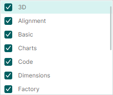
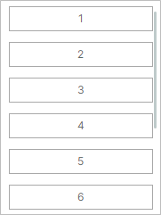
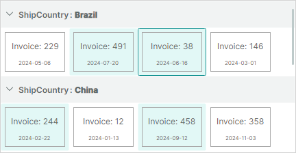

# ListView 控制概述

`ListViewControl` 是一种高级控件，用于在单列或多列中显示项目列表。该控件支持各种项目排列布局、项目排序、分组、过滤和选择。
您可以使用 ListView 模拟 Microsoft Windows 资源管理器右窗格的用户界面。

ListView 支持 MVVM 设计模式来渲染项目。控件从绑定的项目源中检索项目，并使用指定的项目模板来呈现它们。您需要按照所需的方式定义用于绘制项目的模板。例如，模板可以让 ListView 将项目绘制为图标、带文本的图标或纯文本。


 

## 开始使用

- [ListView 控件入门](get-started-with-listview.md)

## 为 ListView 提供项目

使用 `ListViewControl.ItemsSource` 属性将控件绑定到将呈现为 ListView 项的对象集合。

### 项目模板

要以特定方式呈现项目，请指定具有 `ListViewControl.ItemTemplate` 属性的项目模板。如果没有此模板，ListView 不会呈现其项目。

**ItemTemplate 的 DataContext**：`ListViewControl.ItemsSource` 集合中的项目对象。

### 例子

以下示例使用 _SvgIconsBrowserViewModel.Categories_ 集合中的项目填充 ListView，并定义用于呈现这些项目的模板。有关此示例的完整代码，请参阅 _SVG Icons Browser_ 模块。



下面代码中的 _SvgIconCategoryViewModel_ 类封装了绑定的项目集合中的项目。 
ListView 项目模板由一个复选框和一个文本字段组成。复选框和文本框分别绑定到 _SvgIconCategoryViewModel.IsChecked_ 和 _SvgIconCategoryViewModel.DisplayName_ 属性。


``` xml
<mxlv:ListViewControl ItemLayoutMode="Stack" ItemHeight="28" ItemsSource="{Binding Categories}" >
    <mxlv:ListViewControl.ItemTemplate>
        <DataTemplate DataType="vm:SvgIconCategoryViewModel">
            <Grid ColumnDefinitions="Auto, *">
                <CheckBox IsChecked="{Binding IsChecked}" Margin="0,0,4,0" VerticalAlignment="Center"/>
                <TextBlock Grid.Column="1" Text="{Binding DisplayName}" VerticalAlignment="Center"/>
            </Grid>
        </DataTemplate>
    </mxlv:ListViewControl.ItemTemplate>
</mxlv:ListViewControl>
```
``` cs
public partial class SvgIconsBrowserViewModel : PageViewModelBase
{
    [ObservableProperty] private List<SvgIconCategoryViewModel> categories;
    //...
}

public partial class SvgIconCategoryViewModel : ObservableObject, IComparable<SvgIconCategoryViewModel>, IComparable
{
    [ObservableProperty] private bool isChecked;
    [ObservableProperty] private string name;
    [ObservableProperty] private string displayName;
    [ObservableProperty] private bool isExpanded;
    //...
}
```

## 项目排列

ListView 控件支持两种项目排列模式：`Wrap`（默认）和 `Stack`。使用 `ListViewControl.ItemLayoutMode` 属性选择所需的布局。

### _Wrap_ 布局

将 `ListViewControl.ItemLayoutMode` 属性设置为 `ListViewItemLayoutMode.Wrap`，可先横向排列项目，然后纵向排列。项目会在控件的右边缘自动换行，形成多行。


所有项目的尺寸相同。默认的项目大小是根据指定模板（`ListViewControl.ItemTemplate`）依据第一个项目的数据计算得出的。
您可以使用 `ListViewControl.ItemWidth` 和 `ListViewControl.ItemHeight` 属性来指定 ListView 的自定义项目大小。

### _Stack_ 布局

将 `ListViewControl.ItemLayoutMode` 属性设置为 `ListViewItemLayoutMode.Stack`，可将项目排列为垂直列表。项目会被拉伸以填满 LayoutView 的宽度。



在 `Stack` 布局模式下，您可以使用 `ListViewControl.ItemHeight` 属性指定自定义项目高度。

## 对项目进行排序

您可以按一个或多个项目属性以升序或降序对 ListView 项目进行排序。要对项目进行排序，请将 `ListViewSortInfo` 对象添加到 `ListViewControl.SortInfo` 集合中。该集合还用于定义项目[分组](#group-items)。

`ListViewSortInfo` 对象包含以下属性来自定义排序设置：

- `ListViewSortInfo.FieldName` — 指定项目的属性，ListView 项目将按该属性进行排序。
- `ListViewSortInfo.SortDirection` — 指定 ListView 项目的排序顺序。默认排序顺序为升序。

### 示例 - 对项目进行排序

以下示例按项目的 _ShipCountry_ 和 _Date_ 属性对项目进行排序。该控件首先按 _ShipCountry_ 属性按升序对项目进行排序，将它们组织成具有相同运输国家/地区的子集。然后，该控件按 _Date_ 属性按降序对每个项目子集中的项目进行排序。


``` xml
<mxlv:ListViewControl Name="listViewControl1" ItemsSource="{Binding Items}" >
    <mxlv:ListViewControl.SortInfo>
        <mxlv:ListViewSortInfo FieldName="ShipCountry" SortDirection="Ascending" />
        <mxlv:ListViewSortInfo FieldName="Date" SortDirection="Descending"/>
    </mxlv:ListViewControl.SortInfo>
</mxlv:ListViewControl>
```

``` cs
public partial class MainWindowViewModel : ViewModelBase
{
    [ObservableProperty] 
    private List<ItemViewModel> items;
    //...
}

public partial class ItemViewModel : ObservableObject
{
    [ObservableProperty] private int invoiceId;
    [ObservableProperty] private string shipCountry;
    [ObservableProperty] private DateTime date;
    //...
}
```


## 组项目

分组允许您将具有相同值的项目组合到相同的可扩展组中。

例如，如果项目对象包含 _ShipCountry_ 属性，您可以按此属性进行分组以获得以下结果：


每组项目之前有一个组行。组行显示组属性名称和值。用户可以单击组行的折叠/展开按钮来隐藏/显示组的内容。

请注意，当您按属性分组时，组行会自动按组属性排序。在代码中，应用分组时，您可以选择组行按升序还是降序排列。

要按项目属性进行分组，请执行以下操作：

- 在 `ListViewControl.SortInfo` 集合的开头添加 `ListViewSortInfo` 对象。将 `ListViewSortInfo.FieldName` 设置为用于对项目进行分组的项目属性。（可选）使用 `ListViewSortInfo.SortDirection` 属性在升序和降序排序顺序之间选择，以确定组行的排列方式。

- 将 `ListViewControl.GroupCount` 属性设置为组级别数（组属性）。 
`ListViewControl.GroupCount` 指定从 `ListViewControl.SortInfo` 集合的开头开始使用多少个 `ListViewSortInfo` 对象来对数据进行分组。如果按单个项目属性进行分组，请将 `ListViewControl.GroupCount` 设置为 _1_。要按两个属性进行分组，请将 `ListViewControl.GroupCount` 设置为 2，依此类推。

`ListViewControl.SortInfo` 集合可能包含比 `ListViewControl.GroupCount` 更多的元素。编号由 `GroupCount` 指定的第一个元素用于对 ListView 项目进行分组。其余元素用于对 ListView 项目进行排序。

### 示例 - 分组项目

假设项目对象包含 _ShipCountry_ 属性。要按此属性进行分组，需要将引用 _ShipCountry_ 属性的 `ListViewSortInfo` 对象放置在 `ListViewControl.SortInfo` 集合的开头。 `ListViewControl.GroupCount` 属性必须设置为 `1`。


``` xml
<mxlv:ListViewControl Name="lv" ItemsSource="{Binding Items}" ItemHeight="40" ItemWidth="40" 
                      ItemLayoutMode="Wrap"                        
                      GroupCount="1">
    <mxlv:ListViewControl.SortInfo>
        <mxlv:ListViewSortInfo FieldName="ShipCountry" SortDirection="Ascending" />
    </mxlv:ListViewControl.SortInfo>
</mxlv:ListViewControl>
```

``` cs
public partial class MainWindowViewModel : ViewModelBase
{
    [ObservableProperty] 
    private List<ItemViewModel> items;
}

public partial class ItemViewModel : ObservableObject
{
    [ObservableProperty] private int invoiceId;
    [ObservableProperty] private string shipCountry;
    [ObservableProperty] private DateTime date;
    [ObservableProperty] private IImage flag;
    //...
}
```


### 自定义组行模板

如果默认的组行模板不能满足您的需求，您可以使用 `ListViewControl.GroupTemplate` 属性为组行指定自定义 DataTemplate。

**GroupTemplate 的 DataContext**：`Eremex.AvaloniaUI.Controls.ListView.Data.ListViewGroupData` 对象

存储在模板的 DataContext 中的 `ListViewGroupData` 对象公开以下属性，以帮助您获取有关组行的信息并设置组行模板：

- `ListViewGroupData.FieldName` — 组属性的名称。
- `ListViewGroupData.GroupValue` — 组属性的值。
- `ListViewGroupData.GroupValueDisplayText` — 组属性值的文本表示形式。您可以通过处理 `ListViewControl.CustomGroupValueDisplayText` 事件为组值提供自定义 display text。
- `ListViewGroupData.IsExpanded` — 指定组是展开还是折叠。
- `ListViewGroupData.Level` — 组的组级别。对于根级别的组行，`ListViewGroupData.Level` 属性返回 `0`。对于第二层的组行，`ListViewGroupData.Level` 属性返回 `1`，依此类推。

自定义模板可能需要不同的组行高。您可以使用 `ListViewControl.GroupHeight` 属性设置自定义组行高。

#### 示例 - 自定义组行模板

以下示例使用 `ListViewControl.GroupTemplate` 属性定义自定义组行模板。该模板由一个显示组值的文本块和一个显示带有组行的 SVG image associated 的 image control 组成。


该示例假设项目在 _Assets_ 文件夹中包含 _brazil-flag.svg_ 和 _china-flag.svg_ 图像。所有映像 should 的 _Build Action_ 属性均设置为 _AvaloniaResource_。要从文件中读取图像，下面的代码使用 `Eremex.AvaloniaUI.Controls.Utils.ImageLoader` 帮助程序类。


``` xml
xmlns:mxlv="https://schemas.eremexcontrols.net/avalonia/listview"
xmlns:mxlvd="using:Eremex.AvaloniaUI.Controls.ListView.Data"
xmlns:vm="using:ListView_example.ViewModels"

<mxlv:ListViewControl Name="listViewControl1" ItemsSource="{Binding Items}" 
                      ItemHeight="70" ItemWidth="100"
                      GroupCount="1"
                      GroupHeight="40">
    <mxlv:ListViewControl.SortInfo>
        <mxlv:ListViewSortInfo FieldName="ShipCountry" SortDirection="Ascending" />
    </mxlv:ListViewControl.SortInfo>
    <mxlv:ListViewControl.GroupTemplate>
        <DataTemplate DataType="mxlvd:ListViewGroupData">
            <StackPanel Orientation="Horizontal" >
                <Image Height="20" 
                  Source="{Binding GroupValue, Converter={vm:CountryNameToFlagConverter}}}" 
                  Margin="0,0,5,0" VerticalAlignment="Center"/>
                <TextBlock Text="{Binding GroupValueDisplayText}" VerticalAlignment="Center"/>
            </StackPanel>
        </DataTemplate>
    </mxlv:ListViewControl.GroupTemplate>
```

``` cs
using Eremex.AvaloniaUI.Controls.Utils;

namespace ListView_example.ViewModels;

public class CountryNameToFlagConverter : MarkupExtension, IValueConverter
{
    public object? Convert(object? value, Type targetType, object? parameter, CultureInfo culture)
    {
        if (value == null)
            return null;
        string countryName = ((string)value).ToLower();
        return ImageLoader.LoadSvgImage(Assembly.GetExecutingAssembly(), $"Assets/{countryName}-flag.svg");
    }

    public object? ConvertBack(object? value, Type targetType, object? parameter, CultureInfo culture)
    {
        throw new NotImplementedException();
    }

    public override object ProvideValue(IServiceProvider serviceProvider)
    {
        return this;
    }
}
```


### 自定义组值文本

默认情况下，组行显示组值的文本表示形式。您可以处理 `ListViewControl.CustomGroupValueDisplayText` 事件来覆盖组值的 display text。对于每个组行重复触发此事件。

### 识别组行

ListView 项和组行可以通过 **索引** 来标识。组行被分配负索引，而项目具有非负索引。除了索引之外，您还可以通过组值来识别组行。


有关更多详细信息，请参阅以下部分：[Identify and Get Items and Group Rows](#identify-and-get-items-and-group-rows)。


### 分组相关API

- `ListViewControl.GroupHeight` — 指定组行高。
- `ListViewControl.GroupLevelIndent` — 指定嵌套组行之前的缩进（第二层及更低级别）。
- `ListViewControl.AutoExpandAllGroups` — 允许您禁用 control 负载上组行的自动扩展。
- `ListViewControl.CollapseAllGroups` — 折叠所有组行。
- `ListViewControl.CollapseGroup` — 折叠特定组行。
- `ListViewControl.ExpandAllGroups` — 展开所有组行。
- `ListViewControl.ExpandGroup` — 展开特定组行。
- `ListViewControl.IsGroupExpanded` — 返回特定组是否已展开。

另请参阅：[Methods to Traverse Through Group Rows and Their Children](#methods-to-traverse-through-group-rows-and-their-children)。


<!-- TODO
string GroupClass/ItemClass -->

## 过滤项目

处理 `ListViewControl.FilterItem` 事件以动态自定义某些 ListView 项目的可见性。对于 `ListViewControl.ItemsSource` 集合中的每个 item，都会重复触发此事件。要隐藏特定的 item，请将 `e.Visible` 事件参数设置为 `false`。

如果您的应用程序中动态更改了 item 过滤规则，您可能需要强制重新调用 item 过滤机制，从而重新调用 `ListViewControl.FilterItem` 事件。为此，请调用 `ListViewControl.RefreshData` 方法。

### 例子

_SVG Icons Browser_ 模块中的以下示例根据特定条件隐藏项目。

``` xml
<mxlv:ListViewControl x:Name="IconsListControl" 
    FilterItem="ListViewControl_OnFilterItem">
```

``` cs
private void ListViewControl_OnFilterItem(object sender, ListViewFilterEventArgs e)
{
    ((SvgIconsBrowserViewModel)DataContext)?.OnCustomFilter(e);
}

public partial class SvgIconsBrowserViewModel : PageViewModelBase
{
    public void OnCustomFilter(ListViewFilterEventArgs e)
    {
        SvgIconViewModel vm = (SvgIconViewModel)e.Item;
        e.Visible = vm.Category.IsChecked && (string.IsNullOrEmpty(SearchText) || vm.Name.Contains(SearchText, StringComparison.OrdinalIgnoreCase));
    }
}
```

## 识别并获取项目并对行进行分组

ListView 为 ListView 项目和组行分配**索引**以允许识别它们。


- 索引反映项目和组行的顺序。
- 使用 zero-based 非负索引对项目进行编号。最上面的 item 的索引为 **0**，第二个 item 的索引为 **1**，依此类推。
- 组行使用负索引进行编号。顶部组行的索引为 **-1**，第二组行的索引为 **-2**，依此类推。
- 索引用于识别可见和隐藏（折叠组内）的项目。
- 当项目的顺序发生变化时（例如，当数据排序或分组时），项目将根据其新位置获得新的索引。
- 索引不会分配给因数据过滤而隐藏的项目。

当项目未分组时，索引与可见索引匹配：


当项目分组时，索引和可见索引不匹配：


### 特殊索引

ListView 保留以下预定义索引来识别无效项：

- `ListViewControl.InvalidItemIndex` 常量 — 标识 ListView 控件中不存在的 item。该值可以由用于获取 item 索引的 ListView 方法返回。

例如，根级别的项目没有父级。如果您尝试使用 `ListViewControl.GetParentItemIndex` method 获取根 item 的父级，则此 method 将返回 `ListViewControl.InvalidItemIndex` 常量。

### 源项目和源项目索引

每个 ListView item 对应于绑定的 item source (`ListViewControl.ItemsSource`) 中的特定业务对象。 item source 中的 item 的 position 称为 **源 QZX​​0007Q 索引**。

您可以通过以下方法获取underlying源item和源item索引。

- `ListViewControl.GetSourceItemIndexByItemIndex`
- `ListViewControl.GetSourceItemIndexByVisibleItemIndex`

<!-- TODO
не хватает методов
- `GetSourceItemByRowIndex`
- `GetSourceItemByVisibleRowIndex` 
issue=MX-253
 -->

要进行索引的相反转换，请参见以下方法：

- `ListViewControl.GetItemIndexBySourceItemIndex`
- `ListViewControl.GetVisibleItemIndexBySourceItemIndex`


源 QZX​​0000Q 索引是从零开始的。当您对项目进行排序、分组或筛选时，其源 QZX​​0001Q 索引不会更改。

组行在 item source 中没有对应的项目，因此无法使用源项目和源 QZX​​0001Q 索引对其进行寻址。


### 相关API

ListView 提供 API 成员通过索引检索项目，以及在 item 索引、可见 item 索引和源 QZX​​0003Q 索引之间进行转换。以下列表总结了这些信息：

- `ListViewControl.FocusedItemIndex` — 指定聚焦的 item/组行的索引。此属性允许您聚焦特定的 item 或组行。
- `ListViewControl.GetItemIndexBySourceItemIndex` — 按源 QZX​​0010Q 索引返回 item 的索引。
- `ListViewControl.GetItemIndexByVisibleItemIndex` — 按 item 的可见索引返回 item 的索引。
- `ListViewControl.GetSourceItemIndexByItemIndex` — 返回具有指定索引的 item 的源 QZX​​0013Q 索引。
- `ListViewControl.GetSourceItemIndexByVisibleItemIndex` — 返回具有指定可见索引的 item 的源 QZX​​0015Q 索引。
- `ListViewControl.GetVisibleItemIndexByItemIndex` — 按 item 的索引返回 item 的可见索引。
- `ListViewControl.GetVisibleItemIndexBySourceItemIndex` — 按源 QZX​​0020Q 索引返回 item 的可见索引。

#### 遍历组行及其子行的方法


- `ListViewControl.GetGroupChildItemIndex(int childIndex)` — 返回特定根组行的索引。 `childIndex` 参数指定目标根组行在其同级中的 zero-based 顺序。该参数接受 `0` 和 `GetGroupChildrenCount() - 1` 之间的值。
- `ListViewControl.GetGroupChildItemIndex(int itemIndex, int childIndex)` — 返回子 item 或嵌套组行的索引。 `itemIndex` 参数指定父组行的索引。 `childIndex` 参数指定目标子 item 或组行在其同级中的 zero-based 顺序。该参数接受 `0` 和 `GetGroupChildrenCount(itemIndex) - 1` 之间的值。
- `ListViewControl.GetGroupChildrenCount()` — 此不带参数的重载返回根级别的组行数。
- `ListViewControl.GetGroupChildrenCount(int itemIndex)` — 返回特定组行的直接子级数。父组行由其索引标识。

- `ListViewControl.GetGroupIndex` — 按行的字段名称和组值返回组行的索引。
- `ListViewControl.GetGroupValue` — 按行索引返回组行的值。
- `ListViewControl.GetParentItemIndex` — 返回嵌套 item 或组行的父组行的索引。

!!!笔记

如果项目未分组，则上述方法无效。

## 项目焦点

当用户使用键盘或鼠标单击导航到特定的 item 或组行时，ListView 将焦点移动到该 item/组行。


您可以使用以下属性来获取/设置代码中聚焦的 item/group 行：

- `ListViewControl.FocusedItem` — 从 `ListViewControl.ItemsSource` 集合中获取或设置与 ListView 的焦点项相对应的业务对象。要将焦点移至特定 item，您可以将 `ItemsSource` 集合中的对象分配给 `FocusedItem` 属性。

!!!笔记
    
如果组行获得焦点，则 `FocusedItem` 属性将返回 `null`。您不能使用此属性来聚焦组行。

- `ListViewControl.FocusedItemIndex` — 获取或设置焦点 item/组行的 [index](#identify-and-get-items-and-group-rows)。您可以使用 `FocusedItemIndex` 属性将焦点移动到 item 或组行。

以下代码聚焦 _ShipCountry_ 字段设置为“India”的组行。

``` cs
int groupRowindex = listViewControl1.GetGroupIndex("ShipCountry", "India");
if(groupRowindex != ListViewControl.InvalidItemIndex)
    listViewControl1.FocusedItemIndex = groupRowindex;
```


### 示例 - 响应聚焦某个项目

以下示例将 `ListViewControl.FocusedItem` 属性绑定到 _MainWindowViewModel.FocusedItem_ 属性。您可以在 _MainWindowViewModel.FocusedItem_ 属性设置器中响应对焦点 item 的更改。

``` xml
xmlns:mxlv="https://schemas.eremexcontrols.net/avalonia/listview"

<mxlv:ListViewControl Name="listViewControl1" ItemsSource="{Binding Items}" 
    FocusedItem="{Binding FocusedItem, Mode=TwoWay}">
</mxlv:ListViewControl>
```

``` cs
public partial class MainWindowViewModel : ViewModelBase
{
    ItemViewModel focusedItem;
    ItemViewModel FocusedItem {
        get {
            return focusedItem;
        }
        set
        {
            if (value != focusedItem)
            {
                focusedItem = value;
                // Perform actions when the focused item changes.
            }
        }
    }
}

public partial class ItemViewModel : ObservableObject
{
    //...
}
```


## 多项选择

ListView 允许选择多个项目和组行。要启用此选择模式，请将 `ListViewControl.SelectionMode` 属性设置为 `Multiple`。所选项目和组行具有突出显示的背景。



- 单击 item 将选择该 item 并取消选择之前选择的项目。
- 按住 CTRL 键并单击 item 可切换 item 的选定状态。 
- 按住 SHIFT 键并单击 item，可以选择 item 范围（之前聚焦的 item 和单击的 item 之间）。

<!-- TODO
I cannot select items using the keyboard.
 -->


当用户选择 item 时，该 item 也会受到关注（`ListViewControl.FocusedItem` 和 `ListViewControl.FocusedItemIndex` 属性会更新）。 
随后按住 CTRL 键并单击此 item 将取消选择它，但保留焦点。


使用以下 API 成员获取所选项目和组行：

- `ListViewControl.SelectedItems` — 来自 `ListViewControl.ItemsSource` 源的与所选 ListView 项目相对应的业务对象的集合。 `SelectedItems` 集合不包含选定的组行，因为组行不对应于 `ListViewControl.ItemsSource` 源中的任何业务对象。

- `ListViewControl.GetSelectedIndices` — 此 method 返回当前所选项目和组行的 [indexes](#identify-and-get-items-and-group-rows) 数组。项目的索引是非负的，而组行的索引是负的。有关更多详细信息，请参阅以下部分：[Identify and Get Items and Group Rows](#identify-and-get-items-and-group-rows)。


以下属性和方法允许您在代码中选择项目和对行进行分组：

- `ListViewControl.SelectedItems` — 您可以将业务对象集合从 `ListViewControl.ItemsSource` 源分配给 `SelectedItems` 属性，以选择相应的 ListView 项目。
- `ListViewControl.SelectAll` — 选择所有项目和组行（如果有）。
- `ListViewControl.SetSelected` — 选择或取消选择特定的 item 或组行。
- `ListViewControl.ToggleSelected` — 切换 item 或组行的选定状态。


要响应选择的更改，您可以处理 `ListViewControl.SelectionChanged` 事件。

<!-- TODO
GetSelectedIndices

选定的组行不包含在选择中
 -->


### 相关API

- `ListViewControl.ClearSelection` — 清除选择。
- `ListViewControl.GetIsSelected` — 返回是否选择了 item。

<br>
<br>

<sup>*</sup> 本页面使用机器翻译技术翻译。
