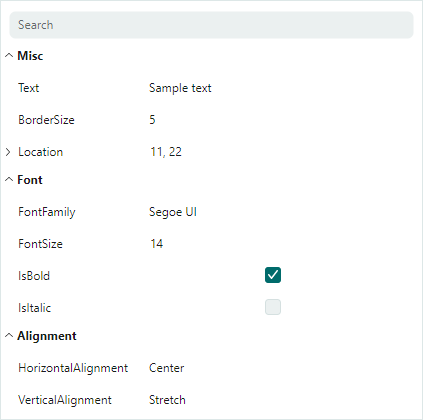

# 数据绑定与行创建

本主题介绍如何将 PropertyGrid 绑定到单个和多个对象。默认情况下，控件会自动为绑定对象的公共属性生成行。您可以禁用自动行生成、手动创建行、自定义行选项，并指定行模板。

## 绑定到单个对象

使用 `PropertyGridControl.SelectedObject` 属性将控件绑定到单个对象。绑定后，控件会自动显示该对象的属性。

### 示例

下面的示例将 PropertyGrid 绑定到在 ViewModel 中定义的 _MyBusinessObject_ 对象。



``` xml
xmlns:mxpg="https://schemas.eremexcontrols.net/avalonia/propertygrid"
xmlns:local="using:PropertyGridTest"

<Window.DataContext>
    <local:SampleViewModel/>
</Window.DataContext>

<mxpg:PropertyGridControl 
    Name="propertyGridControl1"
    SelectedObject="{Binding MyBusinessObject}"
    BorderThickness="1"
    UseModernAppearance="True" 
    Margin="5"/>
```

``` csharp
using CommunityToolkit.Mvvm.ComponentModel;

public partial class SampleViewModel : ViewModelBase
{
    [ObservableProperty]
    MyBusinessObject myBusinessObject;
}

public partial class MyBusinessObject : ViewModelBase
{
    [ObservableProperty]
    string text = "Sample text";

    [ObservableProperty]
    double borderSize = 5;

    [property: Category("Font")]
    [ObservableProperty]
    string fontFamily = FontManager.Current.DefaultFontFamily.Name;

    [property: Category("Font")]
    [ObservableProperty]
    double fontSize = 14;

    [property: Category("Font")]
    [ObservableProperty]
    bool isBold = true;

    [property: Category("Font")]
    [ObservableProperty]
    bool isItalic;

    [property: Category("Alignment")]
    [ObservableProperty]
    HorizontalAlignment horizontalAlignment = HorizontalAlignment.Center;

    [property: Category("Alignment")]
    [ObservableProperty]
    VerticalAlignment verticalAlignment;

    [ObservableProperty]
    Point location = new Point(11, 22);
}

public class ViewModelBase : ObservableObject
{
}
```

## 绑定到多个对象

`PropertyGridControl` 可以显示和编辑两个或更多对象共有的属性。将这些对象的列表赋值给 `PropertyGridControl.SelectedObjects` 属性。这会使控件仅显示匹配的属性（即名称和数据类型相同的属性）。

``` xml
xmlns:mxpg="https://schemas.eremexcontrols.net/avalonia/propertygrid"

<mxpg:PropertyGridControl>
    <mxpg:PropertyGridControl.SelectedObjects>
        <local:MyList>
            <local:MyBusinessObject1/>
            <local:MyBusinessObject2/>
        </local:MyList>
    </mxpg:PropertyGridControl.SelectedObjects>
</mxpg:PropertyGridControl>
```
``` csharp
public class MyList : List<object>
{        
}
```

## 行创建

将 PropertyGrid 绑定到对象后，控件的默认行为是自动生成行，以显示和编辑绑定对象的属性。在初始化过程中，控件会自动生成以下类型的行：

- 数据行（`PropertyGridRow` 对象）会为所有公共属性生成。这些行显示绑定属性的名称和值。
  
  

- 分类行（`PropertyGridCategoryRow` 对象）根据应用于底层公共属性的 `System.ComponentModel.CategoryAttribute` 特性生成。对应的数据行会被分组到这些分类行内。

  

PropertyGrid 提供以下行自定义功能：

- 使用 `PropertyGridControl.AutoGenerateRows` 属性禁用自动行生成。
- 手动创建行。
- 使用注解特性自定义行选项。
- 指定用于渲染单个行的数据模板。
- 从行视图模型集合（`RowsSource`）生成行。

有关详细信息，请参阅以下主题：[行](rows.md)。

<br>
<br>

<sup>*</sup> 本页面使用机器翻译技术翻译。
