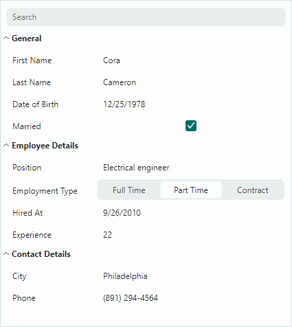

# PropertyGrid

`PropertyGridControl` 控件允许用户浏览单个或多个对象的属性。该控件以垂直列表的形式显示绑定对象的公共属性及其值，并允许用户编辑属性值。

该控件的主要功能包括：

- 自动创建行 — 控件可以使用绑定对象提供的信息自动生成行。
- 手动创建行 — 您可以为特定的一组对象属性手动创建行。
- 数据编辑操作 — 如果启用了数据编辑，用户可以编辑单元格值。您可以在单元格中嵌入 Eremex 编辑器和自定义编辑器，以特定方式编辑和显示单元格值。
- 数据注解特性支持 — PropertyGrid 会考虑应用于绑定对象属性的专用 Data Annotation 特性。您可以使用 Data Annotation 特性为自动生成的行指定自定义可见性、只读状态、显示名称、类别和类型转换器。
- 分类行 — 允许将行组合成可展开的组。
- 选项卡行 — 允许将行组合成带选项卡的界面。
- 搜索面板 — 帮助用户按名称快速定位行

有关更多信息，请参阅以下主题：[PropertyGrid 概述](propertygrid-overview.md)。

 
 

* 本页面使用机器翻译技术翻译。
