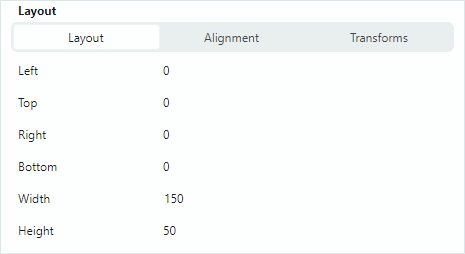
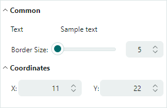

# PropertyGrid 行

PropertyGrid 可以自动为绑定对象公开的属性创建行（请参阅 `PropertyGridControl.SelectedObject` 和 `PropertyGridControl.SelectedObjects`）。
默认情况下会启用自动行生成。
您可以使用 `PropertyGridControl.AutoGenerateRows` 选项禁用自动行生成，然后手动创建行。


PropertyGrid 支持三种行类型：

- 常规行（数据行）（`PropertyGridRow`）— 显示绑定属性的名称和值。
  
  

- 分类行（`PropertyGridCategoryRow`）— 用于将其他行分组到类别中。用户可以折叠和展开分类行，以隐藏/显示其子项。
  
  

- 选项卡行（`PropertyGridTabRow`）— 用于将行组织为带选项卡的界面。选项卡行不支持折叠/展开功能。
  
  

## 创建行

启用自动行生成功能后，空的 PropertyGrid 控件会根据从绑定对象获取的信息创建数据行和分类行：

- 会为所有公共属性创建常规行。
- 分类行根据应用于底层公共属性的 `System.ComponentModel.CategoryAttribute` 特性生成。相应的数据行会被分组到这些类别中。

如果已手动向控件添加了任何行（例如在 XAML 中），则自动行生成不再生效。将 `PropertyGridControl.AutoGenerateRows` 属性设置为 `false`，可强制禁用自动行生成。

使用 `PopulateRows` 方法可在后台代码中从绑定对象生成数据行和分类行。该方法会在添加新行之前清除现有的行集合。

您可以将特定的数据注解特性应用于绑定对象的属性，从而控制所生成的 PropertyGrid 行的存在与否、显示名称和只读状态。有关详细信息，请参阅以下部分：[使用特性自定义行设置](#use-attributes-to-customize-row-settings)。

`PropertyGridControl.Rows` 集合允许您访问控件的行，并添加或删除单个项。

### 创建数据行

使用 `PropertyGridRow` 对象创建数据行。要在根级别添加数据行，请将 `PropertyGridRow` 对象添加到 `PropertyGridControl.Rows` 集合中。

`PropertyGridRow` 类的主要设置包括：

- `PropertyGridRow.FieldName` — 获取或设置该行所绑定的公共属性的名称。
- `PropertyGridRow.Caption` — 获取或设置行的标题。对于自动生成的行，`Caption` 属性包含该属性的显示名称。
- `PropertyGridRow.AllowEditing` — 获取或设置是否启用值编辑操作。
- `PropertyGridRow.EditorProperties` — 允许您为该行的值分配自定义的内嵌编辑器。参见 [数据编辑](data-editing.md)。

#### 示例

以下 XAML 代码创建了三个数据行（`PropertyGridRow` 对象），并将它们绑定到分配给控件数据上下文的对象的字段。

``` xml
xmlns:mxpg="https://schemas.eremexcontrols.net/avalonia/propertygrid"

<mxpg:PropertyGridControl x:Name="pGrid1" SelectedObject="{Binding}" Grid.Column="1">
    <mxpg:PropertyGridRow FieldName="Caption">
    </mxpg:PropertyGridRow>
    <mxpg:PropertyGridRow FieldName="OrderNo">
    </mxpg:PropertyGridRow>
    <mxpg:PropertyGridRow FieldName="InvoiceNo">
    </mxpg:PropertyGridRow>
</mxpg:PropertyGridControl>
```

#### 示例

以下示例在后台代码中创建数据行：

``` xml
xmlns:mxpg="https://schemas.eremexcontrols.net/avalonia/propertygrid"

<mxpg:PropertyGridControl x:Name="pGrid1" AutoGenerateRows="False" 
 SelectedObject="{Binding}" Grid.Column="1">
</mxpg:PropertyGridControl>
```
``` csharp
using Eremex.AvaloniaUI.Controls.PropertyGrid;

pGrid1.Rows.Add(new PropertyGridRow() { FieldName = "Caption" });
pGrid1.Rows.Add(new PropertyGridRow() { FieldName = "OrderNo" });
pGrid1.Rows.Add(new PropertyGridRow() { FieldName = "InvoiceNo" });
```

### 创建分类行

PropertyGrid 可以根据应用于底层公共属性的 `System.ComponentModel.CategoryAttribute` 特性生成分类行。相应的数据行会被分组到这些分类行中。

您可以禁用自动行生成，并创建一组自定义的数据行和分类行。使用 `PropertyGridCategoryRow` 对象定义分类行。将 `PropertyGridCategoryRow` 对象添加到 `PropertyGridControl.Rows` 集合中，即可在根级别显示它们。

`PropertyGridCategoryRow` 类的主要设置包括：

- `PropertyGridCategoryRow.Rows` — 作为分类行子项显示的行集合。通常，您会将数据行（`PropertyGridRow` 对象）添加到该集合中。
- `PropertyGridCategoryRow.Caption` — 获取或设置分类行的显示名称。对于自动生成的分类行，此属性返回 `CategoryAttribute` 的值。

#### 示例

以下 XAML 代码创建了两个分类行（_Name_ 和 _Details_）。它们分别有一个和两个数据行作为子项。

``` xml
xmlns:mxpg="https://schemas.eremexcontrols.net/avalonia/propertygrid"
<mxpg:PropertyGridControl x:Name="pGrid1" SelectedObject="{Binding}" Grid.Column="1">
    <mxpg:PropertyGridCategoryRow Caption="Name">
        <mxpg:PropertyGridRow FieldName="Caption">
        </mxpg:PropertyGridRow>
    </mxpg:PropertyGridCategoryRow>
    <mxpg:PropertyGridCategoryRow Caption="Details">
        <mxpg:PropertyGridRow FieldName="OrderNo">
        </mxpg:PropertyGridRow>
        <mxpg:PropertyGridRow FieldName="InvoiceNo">
        </mxpg:PropertyGridRow>
    </mxpg:PropertyGridCategoryRow>
</mxpg:PropertyGridControl>
```

#### 示例
以下示例创建分类行，并在后台代码中将数据行放置到所创建的类别中。

``` xml
xmlns:mxpg="https://schemas.eremexcontrols.net/avalonia/propertygrid"

<mxpg:PropertyGridControl x:Name="pGrid1" AutoGenerateRows="False" 
 SelectedObject="{Binding}" Grid.Column="1">
</mxpg:PropertyGridControl>
```
``` csharp
using Eremex.AvaloniaUI.Controls.PropertyGrid;

PropertyGridCategoryRow categoryRowName = new PropertyGridCategoryRow() 
{ 
    Caption = "Name" 
};
pGrid1.Rows.Add(categoryRowName);
categoryRowName.Rows.Add(new PropertyGridRow() 
{ 
    FieldName = "Caption" 
});

PropertyGridCategoryRow categoryRowDetails = new PropertyGridCategoryRow() 
{ 
    Caption = "Details" 
};
pGrid1.Rows.Add(categoryRowDetails);
categoryRowDetails.Rows.Add(new PropertyGridRow() { FieldName = "OrderNo" });
categoryRowDetails.Rows.Add(new PropertyGridRow() { FieldName = "InvoiceNo" });
```

## 创建选项卡行

选项卡行（`PropertyGridTabRow`）允许您将若干行分组到带选项卡的界面中。它由标题、选项卡切换器和客户区组成。当用户选择某个选项卡时，客户区会显示与所选选项卡对应的一组属性。下图展示了带有两个选项卡行（_Appearance_ 和 _Layout_）的 PropertyGrid 控件：


控件会根据选项卡行的子项（`PropertyGridTabRowItem` 对象）填充选项卡集合。每个 `PropertyGridTabRowItem` 对象都定义了与该选项卡关联的一组行。

### 示例

以下示例创建了由两个选项卡（_Text_ 和 _Border_）组成的 _Appearance_ 选项卡行。每个选项卡被选中时都会显示其自己的一组属性。


``` xml
xmlns:mxpg="https://schemas.eremexcontrols.net/avalonia/propertygrid"
xmlns:mxe="https://schemas.eremexcontrols.net/avalonia/editors"

<UserControl.Resources>
    <DataTemplate x:Key="spinEditorTemplate1">
        <mxe:SpinEditor x:Name="PART_Editor" HorizontalContentAlignment="Stretch"/>
    </DataTemplate>
    <DataTemplate x:Key="spinEditorTemplate2">
        <mxe:SpinEditor x:Name="PART_Editor" HorizontalContentAlignment="Stretch" 
         Increment="0.1"/>
    </DataTemplate>
</UserControl.Resources>

<mxpg:PropertyGridControl x:Name="propertyGrid" 
                          SelectedObject="{Binding}" 
                          UseModernAppearance="True" 
                          ImmediatePostEditor="True" 
                          BorderThickness="1,0" Grid.Column="1"
                          ShowSearchPanel="False"
                          >
    <mxpg:PropertyGridRow FieldName="Content"/>

    <mxpg:PropertyGridTabRow Caption="Appearance">
        <mxpg:PropertyGridTabRowItem Header="Text">
            <mxpg:PropertyGridRow FieldName="Foreground"/>
            <mxpg:PropertyGridRow FieldName="FontFamily">
                <mxpg:PropertyGridRow.EditorProperties>
                    <mxe:ComboBoxEditorProperties 
                        IsTextEditable="False" 
                        ItemsSource="{Binding Source={x:Static FontManager.Current}, 
                         Path=SystemFonts}" 
                        ValueMember="Name" DisplayMember="Name"/>
                </mxpg:PropertyGridRow.EditorProperties>
            </mxpg:PropertyGridRow>
            <mxpg:PropertyGridRow FieldName="FontSize" 
             CellTemplate="{StaticResource spinEditorTemplate1}"/>

        </mxpg:PropertyGridTabRowItem>

        <mxpg:PropertyGridTabRowItem Header="Border">
            <mxpg:PropertyGridRow FieldName="Background"/>
            <mxpg:PropertyGridRow FieldName="Opacity" 
             CellTemplate="{StaticResource spinEditorTemplate2}"/>
            <mxpg:PropertyGridRow FieldName="BorderThickness" 
             CellTemplate="{StaticResource spinEditorTemplate1}"/>
            <mxpg:PropertyGridRow FieldName="BorderBrush"/>
        </mxpg:PropertyGridTabRowItem>
    </mxpg:PropertyGridTabRow>
</mxpg:PropertyGridControl>
```

## 使用特性自定义行设置

您可以将特性应用于绑定对象的属性，以自定义 PropertyGridControl 中相应行的可见性状态、外观和行为设置。支持以下特性：

### `Browsable` 特性
`System.ComponentModel.BrowsableAttribute` 特性控制与绑定对象中特定属性相对应的 PropertyGrid 行是否存在。要阻止创建某个行，请对相关属性应用 **Browsable(false)** 特性。

``` csharp
public partial class MyBusinessObject : ObservableObject
{
    [Browsable(false)]
    public string Caption {
        get;set;
    }
}
```

### `Category` 特性

`System.ComponentModel.CategoryAttribute` 特性为属性设置类别名称。当 PropertyGrid 检测到某个属性应用了该特性时，控件会创建一个具有指定类别名称的分类行，并将相应的数据行放置在该分类行内。

``` csharp
[Category("Title")]
public string Caption {
    get;set;
}
```

### `DisplayName` 特性

`System.ComponentModel.DisplayNameAttribute` 特性为属性指定一个自定义显示名称。指定该特性后，PropertyGrid 控件会将此显示名称用作相应行的标题。

``` csharp
[DisplayName("Name")]
public string Caption {
    get;set;
}
```

### `ReadOnly` 特性

`System.ComponentModel.ReadOnlyAttribute` 特性将属性标记为只读，并阻止对 PropertyGrid 控件中相应行进行编辑操作。

``` csharp
[ReadOnly(true)]
public string OrderId {
    get; set;
}
```

### `TypeConverter` 特性

`System.ComponentModel.TypeConverterAttribute` 特性允许您为属性关联一个 `TypeConverter` 对象（`System.ComponentModel.TypeConverter` 的派生类）。PropertyGrid 使用该转换器在显示值和编辑值之间进行转换。类型转换器的功能会在以下情况下被调用：

- 当控件即将在单元格中显示值时，或单元格的编辑值发生更改时。`TypeConverter` 会将单元格的编辑值转换为显示值。
- 当用户编辑某个单元格后，将焦点移到另一个单元格时。`TypeConverter` 会执行反向转换。

## 自定义行模板

数据行的默认渲染由标题区域和值区域组成。

您可以使用 `CellTemplate` 属性来指定用于渲染行值区域的模板。有关详细信息，请参阅以下主题：[数据编辑](data-editing.md) 和 [自定义编辑器](custom-editors.md)。

使用 `PropertyGridRow.RowTemplate` 属性可以按自定义方式渲染整行（标题和值区域）。该属性指定一个自定义行模板。

### 示例 - 自定义行模板

以下代码将 PropertyGrid 绑定到一个 _MyBusinessObject_ 对象，该对象分别拥有 `Integer` 和 `Point` 类型的 _BorderSize_ 和 _Location_ 属性。代码定义了三个 `PropertyGridRow` 对象，其中两个使用了自定义模板。这些模板包含用于呈现和编辑 _BorderSize_ 和 _Location_ 属性的自定义控件。



_BorderSize_ 属性的行模板显示一个标签、一个滑块和一个 `SpinEditor`。滑块和编辑器都绑定到目标 _BorderSize_ 属性。

用于编辑 _Location_ 属性的行模板包含两个标签和两个 `SpinEditor`。相应的 `PropertyGridRow` 对象绑定到 _Location_ 属性，而 `SpinEditor` 则绑定到嵌套字段 _X_ 和 _Y_。另一种做法是为编辑器使用 _Location.X_ 和 _Location.Y_ 绑定路径。

``` xml
xmlns:mxpg="https://schemas.eremexcontrols.net/avalonia/propertygrid"
xmlns:mxe="https://schemas.eremexcontrols.net/avalonia/editors"

<Window.DataContext>
    <local:SampleViewModel/>
</Window.DataContext>

<mxpg:PropertyGridControl
            x:Name="propertyGrid1" 
            SelectedObject="{Binding Path=MyBusinessObject}"
            UseModernAppearance="True"
            Margin="10"
            BorderThickness="1"
            ShowSearchPanel="False"
            >
            
    <mxpg:PropertyGridCategoryRow Caption="Common">
                
        <mxpg:PropertyGridRow FieldName="Text" />
                
        <mxpg:PropertyGridRow>
            <mxpg:PropertyGridRow.RowTemplate>
                <DataTemplate>
                    <Grid ColumnDefinitions="Auto, 2*, *" Margin="18,5,5,5">
                        <TextBlock Text="Border Size: "  VerticalAlignment="Center" 
                         Classes="PropertyGridRow_Modern"/>
                        <Slider Value="{Binding BorderSize, 
                         Converter={local:MyDoubleToIntConverter}}" 
                         Maximum="500" Focusable="False" Margin="0,0,5,0" Grid.Column="1" />
                        <mxe:SpinEditor EditorValue="{Binding BorderSize}" Maximum="500" 
                         Minimum="0" Grid.Column="2" />
                    </Grid>
                </DataTemplate>
            </mxpg:PropertyGridRow.RowTemplate>
        </mxpg:PropertyGridRow>
    </mxpg:PropertyGridCategoryRow>
            
    <mxpg:PropertyGridCategoryRow Caption="Coordinates">
        <mxpg:PropertyGridRow FieldName="Location">
            <mxpg:PropertyGridRow.RowTemplate>
                <DataTemplate>
                    <Grid ColumnDefinitions="*, 20, *"  Margin="18,5,5,5" Grid.Column="0">
                        <Grid ColumnDefinitions="Auto, *" >
                            <TextBlock Text="X:" HorizontalAlignment="Right" 
                             Classes="PropertyGridRow_Modern" VerticalAlignment="Center"/>
                            <mxe:SpinEditor EditorValue="{Binding X}" Minimum="0" 
                             Maximum="10000" Grid.Column="1" VerticalAlignment="Center"/>
                        </Grid>
                        <Grid ColumnDefinitions="Auto, *" Grid.Column="2">
                            <TextBlock Text="Y:" HorizontalAlignment="Right" 
                             Classes="PropertyGridRow_Modern" VerticalAlignment="Center"/>
                            <mxe:SpinEditor EditorValue="{Binding Y}" Minimum="0" 
                             Maximum="10000" Grid.Column="1" VerticalAlignment="Center"/>
                        </Grid>
                    </Grid>
                </DataTemplate>
            </mxpg:PropertyGridRow.RowTemplate>
        </mxpg:PropertyGridRow>
    </mxpg:PropertyGridCategoryRow>
</mxpg:PropertyGridControl>
```
``` csharp
using System.Drawing;
using CommunityToolkit.Mvvm.ComponentModel;

public partial class SampleViewModel : ViewModelBase
{
    [ObservableProperty]
    MyBusinessObject myBusinessObject = new MyBusinessObject();
}
public partial class MyBusinessObject : ViewModelBase
{
    [ObservableProperty]
    string text = "Sample text";

    [ObservableProperty]
    double borderSize = 5;

    [ObservableProperty]
    string fontFamily = FontManager.Current.DefaultFontFamily.Name;

    [ObservableProperty]
    double fontSize = 14;

    [ObservableProperty]
    Point location = new Point(11, 22);
}

public class ViewModelBase : ObservableObject
{
}
```

## 从行视图模型集合生成行（MVVM）
 
PropertyGrid 允许您使用 MVVM 设计模式，用行填充控件，并从视图模型初始化行。

以下 PropertyGrid 属性支持 MVVM 设计模式：
 
- `PropertyGridControl.RowsSource` — 将渲染为根级行的行视图模型来源。  
- `PropertyGridCategoryRow.RowsSource` — 将渲染为分类行子项的行视图模型来源。
- `PropertyGridControl.RowsDataTemplates` — 定义 `PropertyGridRow` 和 `PropertyGridCategoryRow` 对象的数据模板集合，用于渲染 `RowsSource` 集合中相应的行视图模型。

### 示例 

以下教程演示了填充行的 MVVM 方法。此示例从视图模型初始化 PropertyGrid 行，并创建如下所示的界面：


该示例根据 _CategoryRowViewModel_ 对象创建 _Common_、_Coordinates_ 和 _Alignment_ 分类行（`PropertyGridCategoryRow` 对象）。

以下视图模型用于在分类行内创建常规行：

- _DefaultRowViewModel_ — 对应默认行（具有默认设置的 `PropertyGridRow` 对象）的视图模型。默认行的值数据类型决定了内嵌编辑器的类型。_DefaultRowViewModel_ 对象用于创建 _Display Text_、_Horz Alignment_ 和 _Vert Alignment_ 这几行。

- _NumericSpinEditorRowViewModel_ — 对应带有内嵌 SpinEditor 的 PropertyGrid 行的视图模型。该视图模型用于创建 _Value_ 行。

- _PointEditorViewModel_ — 对应带有自定义行模板的 PropertyGrid 行的视图模型。该行模板显示两个排成一行的 SpinEditor 和两个标签，用于呈现和编辑 `Point` 数据类型的值。

步骤：

1. 定义一个目标业务对象，其数据需要在 PropertyGrid 中显示/编辑。使用 `PropertyGridControl.SelectedObject` 成员将该对象绑定到控件。

    ``` csharp
    public partial class MyBusinessObject : ViewModelBase
    {
        [ObservableProperty]
        string text = "Sample text";

        [ObservableProperty]
        int value = 99;

        [ObservableProperty]
        double borderSize = 5;

        [property: Category("Font")]
        [ObservableProperty]
        string fontFamily = FontManager.Current.DefaultFontFamily.Name;

        [property: Category("Font")]
        [ObservableProperty]
        double fontSize = 14;

        [property: Category("Font")]
        [ObservableProperty]
        bool isBold = true;

        [property: Category("Font")]
        [ObservableProperty]
        bool isItalic;

        [property: Category("Alignment")]
        [ObservableProperty]
        HorizontalAlignment horizontalAlignment = HorizontalAlignment.Center;

        [property: Category("Alignment")]
        [ObservableProperty]
        VerticalAlignment verticalAlignment;

        [ObservableProperty]
        Point location = new Point(11, 22);
    }

    ```

    ``` xml
    xmlns:mxpg="https://schemas.eremexcontrols.net/avalonia/propertygrid"

    <mxpg:PropertyGridControl
        SelectedObject="{Binding MyBusinessObject}"
        ...
        >
        ...
    </mxpg:PropertyGridControl>
    ```

2. 创建行视图模型类，其中包含用于初始化 PropertyGrid 行的设置（例如，用于初始化行的 `PropertyGridRow.FieldName` 和 `PropertyGridRow.Caption` 属性的设置）。每个行视图模型通常都会公开一组独特的属性和功能。分类行的视图模型应公开一个包含子行视图模型的 `IEnumerable` 对象。

    ``` csharp
    // A View Model that corresponds to regular data rows.
    public class DefaultRowViewModel
    {
        // The path to a target object's property.
        public string? FieldName { get; set; }

        // The property's display name.
        public string? Caption { get; set; }
    }

    // A View Model that corresponds to category rows.
    public class CategoryRowViewModel
    {
        // The category's display name.
        public string? Caption { get; set; }

        // Child row View Models that will be rendered as child rows.
        public IEnumerable? Items { get; set; }
    }

    // A View Model that corresponds to a data row with an embedded SpinEditor 
    // used to edit numeric values.
    public class NumericSpinEditorRowViewModel
    {
        public string? FieldName { get; set; }

        public string? Caption { get; set; }

        // The minimum allowed value for the SpinEditor.
        public int? MinValue { get; set; }
        // The maximum allowed value for the SpinEditor.
        public int? MaxValue { get; set; }
    }

    // A View Model for a data row that uses two standalone SpinEditors 
    // to edit values of the Point data type.
    // This data row will be created from a custom row template.
    public class PointEditorViewModel
    {
        public string? FieldName { get; set; }
    }
    ```

3. 创建一个 `IEnumerable` 对象，按照 PropertyGrid 应当用来显示相应行的顺序，存储行视图模型的实例。

    ``` csharp
    public partial class SampleViewModel : ViewModelBase
    {
        [ObservableProperty]
        IEnumerable myRowSource = GetMyRowSource();

        public static IEnumerable GetMyRowSource()
        {
            return new List<object>
                {
                    new CategoryRowViewModel()
                    {
                        Caption = "Common",
                        Items = new List<object>
                        {
                            new DefaultRowViewModel() 
                            { 
                                FieldName = "Text", Caption = "Display Text" 
                            },
                            new NumericSpinEditorRowViewModel() 
                            { 
                                FieldName = "Value", Caption = "Value", 
                             MinValue=1, MaxValue=100 
                            },
                        }
                    },

                    new CategoryRowViewModel()
                    {
                        Caption = "Coordinates",
                        Items = new List<object>
                        {
                            new PointEditorViewModel() 
                            { 
                                FieldName = "Location" 
                            }
                        }
                    },

                    new CategoryRowViewModel()
                    {
                        Caption = "Alignment",
                        Items = new List<object>
                        {
                            new DefaultRowViewModel() 
                            { 
                                FieldName = "HorizontalAlignment", 
                                Caption = "Horz Alignment" 
                            },
                            new DefaultRowViewModel() 
                            { 
                                FieldName = "VerticalAlignment", 
                             Caption = "Vert Alignment" 
                            },
                        }
                    }
                };
        }
    }
    ```

4. 将 `PropertyGridControl.RowsSource` 属性设置为所创建的 `IEnumerable` 对象。

    ``` xml
    xmlns:local="using:PropertyGridSample"
    xmlns:mxpg="https://schemas.eremexcontrols.net/avalonia/propertygrid"

    <Window.DataContext>
        <local:SampleViewModel/>
    </Window.DataContext>

    <mxpg:PropertyGridControl
        SelectedObject="{Binding MyBusinessObject}"
        RowsSource="{Binding MyRowSource}"
        ...
        >
    ...
    </mxpg:PropertyGridControl>
    ```

5. 使用 `PropertyGridControl.RowsDataTemplates` 集合创建数据模板，将行视图模型映射为 PropertyGrid 行。每个数据模板都应定义一个 `PropertyGridRow` 或 `PropertyGridCategoryRow` 对象，并使用相应行视图模型中包含的信息来初始化该行的设置。

    定义 `PropertyGridCategoryRow` 对象时，请将 `PropertyGridCategoryRow.RowsSource` 属性设置为子行视图模型的来源。

    ``` xml
    <mxpg:PropertyGridControl
        ...>
        <mxpg:PropertyGridControl.RowsDataTemplates>
            <DataTemplates>
                <DataTemplate DataType="local:CategoryRowViewModel">
                    <mxpg:PropertyGridCategoryRow 
                        Caption="{Binding Path=Caption}"
                        RowsSource="{Binding Path=Items}"/>
                </DataTemplate>
                <DataTemplate DataType="local:DefaultRowViewModel">
                    <mxpg:PropertyGridRow 
                        FieldName="{Binding Path=FieldName}" 
                        Caption="{Binding Path=Caption}"/>
                </DataTemplate>

                <DataTemplate DataType="local:NumericSpinEditorRowViewModel">
                    <mxpg:PropertyGridRow FieldName="{Binding Path=FieldName}">
                        <mxpg:PropertyGridRow.EditorProperties >
                            <mxe:SpinEditorProperties 
                                Minimum="{Binding MinValue}" 
                                Maximum="{Binding MaxValue}"/>
                        </mxpg:PropertyGridRow.EditorProperties>
                    </mxpg:PropertyGridRow>
                </DataTemplate>
                <DataTemplate DataType="local:PointEditorViewModel">
                    <mxpg:PropertyGridRow 
                        FieldName="{Binding Path=FieldName}" 
                        RowTemplate="{DynamicResource ResourceKey=pointEditorTemplate}"/>
                </DataTemplate>
            </DataTemplates>
        </mxpg:PropertyGridControl.RowsDataTemplates>
    </mxpg:PropertyGridControl>
    ```

    !!! tip
    
        Avalonia UI 支持在逻辑树中对目标 `DataTemplate` 进行分层查找。除了使用 `RowsDataTemplates` 属性外，您还可以在控件的父级（或更上层）、`Window` 或 `Application` 对象的 `DataTemplates` 集合中定义模板。

6. 定义自定义的 _pointEditorTemplate_ 模板，以渲染与 _PointEditorViewModel_ 对象对应的 `PropertyGridRow`。

    ``` xml
    <Window.Resources>
        <DataTemplate x:Key="pointEditorTemplate">
            <Grid ColumnDefinitions="*, 20, *"  Margin="18,5,5,5" Grid.Column="0">
                <Grid ColumnDefinitions="Auto, *" >
                    <TextBlock Text="X:" HorizontalAlignment="Right" 
                     Classes="PropertyGridRow_Modern" VerticalAlignment="Center"/>
                    <mxe:SpinEditor EditorValue="{Binding X}" Minimum="0" Maximum="10000" 
                     Grid.Column="1" VerticalAlignment="Center"/>
                </Grid>
                <Grid ColumnDefinitions="Auto, *" Grid.Column="2">
                    <TextBlock Text="Y:" HorizontalAlignment="Right" 
                     Classes="PropertyGridRow_Modern" VerticalAlignment="Center"/>
                    <mxe:SpinEditor EditorValue="{Binding Y}" Minimum="0" Maximum="10000" 
                     Grid.Column="1" VerticalAlignment="Center"/>
                </Grid>
            </Grid>
        </DataTemplate>
    </Window.Resources>
    ```

#### 完整代码

以下是本教程的完整代码。

``` xml
xmlns:mxpg="https://schemas.eremexcontrols.net/avalonia/propertygrid"
xmlns:local="using:PropertyGridSample"

<Window.DataContext>
    <local:SampleViewModel/>
</Window.DataContext>

<Window.Resources>
    <DataTemplate x:Key="pointEditorTemplate">
        <Grid ColumnDefinitions="*, 20, *"  Margin="18,5,5,5" Grid.Column="0">
            <Grid ColumnDefinitions="Auto, *" >
                <TextBlock Text="X:" HorizontalAlignment="Right" 
                 Classes="PropertyGridRow_Modern" VerticalAlignment="Center"/>
                <mxe:SpinEditor EditorValue="{Binding X}" Minimum="0" Maximum="10000" 
                 Grid.Column="1" VerticalAlignment="Center"/>
            </Grid>
            <Grid ColumnDefinitions="Auto, *" Grid.Column="2">
                <TextBlock Text="Y:" HorizontalAlignment="Right" 
                 Classes="PropertyGridRow_Modern" VerticalAlignment="Center"/>
                <mxe:SpinEditor EditorValue="{Binding Y}" Minimum="0" Maximum="10000" 
                 Grid.Column="1" VerticalAlignment="Center"/>
            </Grid>
        </Grid>
    </DataTemplate>
</Window.Resources>

<mxpg:PropertyGridControl
    Background="FloralWhite" BorderThickness="1"
    SelectedObject="{Binding MyBusinessObject}"
    RowsSource="{Binding MyRowSource}"
    UseModernAppearance="true"
    Margin="10">

    <mxpg:PropertyGridControl.RowsDataTemplates>
        <DataTemplates>
            <DataTemplate DataType="local:CategoryRowViewModel">
                <mxpg:PropertyGridCategoryRow 
                    Caption="{Binding Path=Caption}"
                    RowsSource="{Binding Path=Items}"/>
            </DataTemplate>
            <DataTemplate DataType="local:DefaultRowViewModel">
                <mxpg:PropertyGridRow 
                    FieldName="{Binding Path=FieldName}" 
                    Caption="{Binding Path=Caption}"/>
            </DataTemplate>

            <DataTemplate DataType="local:NumericSpinEditorRowViewModel">
                <mxpg:PropertyGridRow FieldName="{Binding Path=FieldName}">
                    <mxpg:PropertyGridRow.EditorProperties >
                        <mxe:SpinEditorProperties 
                            Minimum="{Binding MinValue}" 
                            Maximum="{Binding MaxValue}"/>
                    </mxpg:PropertyGridRow.EditorProperties>
                </mxpg:PropertyGridRow>
            </DataTemplate>
            <DataTemplate DataType="local:PointEditorViewModel">
                <mxpg:PropertyGridRow 
                    FieldName="{Binding Path=FieldName}" 
                    RowTemplate="{DynamicResource ResourceKey=pointEditorTemplate}"/>
            </DataTemplate>
        </DataTemplates>
    </mxpg:PropertyGridControl.RowsDataTemplates>
</mxpg:PropertyGridControl>
```

``` csharp
using Eremex.AvaloniaUI.Controls.Common;
using Avalonia.Layout;
using System.Drawing;
using CommunityToolkit.Mvvm.ComponentModel;

namespace PropertyGridSample;

public partial class SampleViewModel : ViewModelBase
{
    [ObservableProperty]
    IEnumerable myRowSource = GetMyRowSource();

    [ObservableProperty]
    MyBusinessObject myBusinessObject = new MyBusinessObject();

    public static IEnumerable GetMyRowSource()
    {
        return new List<object>
            {
                new CategoryRowViewModel()
                {
                    Caption = "Common",
                    Items = new List<object>
                    {
                        new DefaultRowViewModel() 
                        { 
                            FieldName = "Text", 
                            Caption = "Display Text" 
                        },
                        new NumericSpinEditorRowViewModel() 
                        { 
                            FieldName = "Value", Caption = "Value", 
                         MinValue=1, MaxValue=100 
                        },
                    }
                },

                new CategoryRowViewModel()
                {
                    Caption = "Coordinates",
                    Items = new List<object>
                    {
                        new PointEditorViewModel() { FieldName = "Location" }
                    }
                },

                new CategoryRowViewModel()
                {
                    Caption = "Alignment",
                    Items = new List<object>
                    {
                        new DefaultRowViewModel() 
                        { 
                            FieldName = "HorizontalAlignment", 
                            Caption = "Horz Alignment" 
                        },
                        new DefaultRowViewModel()
                        { 
                            FieldName = "VerticalAlignment", 
                            Caption = "Vert Alignment" 
                        },
                    }
                }
            };
    }
}

// A View Model that corresponds to regular data rows.
public class DefaultRowViewModel
{
    // The path to a target object's property.
    public string? FieldName { get; set; }

    // The property's display name.
    public string? Caption { get; set; }
}

// A View Model that corresponds to category rows.
public class CategoryRowViewModel
{
    // The category's display name.
    public string? Caption { get; set; }

    // Child row View Models that will be rendered as child rows.
    public IEnumerable? Items { get; set; }
}

// A View Model that corresponds to a data row 
// with an embedded SpinEditor used to edit numeric values.
public class NumericSpinEditorRowViewModel
{
    public string? FieldName { get; set; }

    public string? Caption { get; set; }

    // The minimum allowed value for the SpinEditor.
    public int? MinValue { get; set; }
    // The maximum allowed value for the SpinEditor.
    public int? MaxValue { get; set; }
}

// A View Model for a data row that uses two standalone SpinEditors 
// to edit values of the Point data type.
// This data row will be created from a custom row template.
public class PointEditorViewModel
{
    public string? FieldName { get; set; }
}

public partial class MyBusinessObject : ViewModelBase
{
    [ObservableProperty]
    string text = "Sample text";

    [ObservableProperty]
    int value = 99;

    [ObservableProperty]
    double borderSize = 5;

    [property: Category("Font")]
    [ObservableProperty]
    string fontFamily = FontManager.Current.DefaultFontFamily.Name;

    [property: Category("Font")]
    [ObservableProperty]
    double fontSize = 14;

    [property: Category("Font")]
    [ObservableProperty]
    bool isBold = true;

    [property: Category("Font")]
    [ObservableProperty]
    bool isItalic;

    [property: Category("Alignment")]
    [ObservableProperty]
    HorizontalAlignment horizontalAlignment = HorizontalAlignment.Center;

    [property: Category("Alignment")]
    [ObservableProperty]
    VerticalAlignment verticalAlignment;

    [ObservableProperty]
    Point location = new Point(11, 22);
}
```

<br>
<br>

<sup>*</sup> 本页面使用机器翻译技术翻译。
