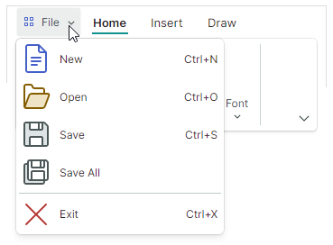

# Application Button 和主菜单

Ribbon control 有一个内置应用程序按钮。单击 Application Button 通常会调用 associated dropdown 应用程序菜单。单击此 button 时，您还可以执行自定义操作。


## Application Button 内容

Application Button 可以显示 image 和内容（文本）。

- `RibbonControl.ApplicationButtonContent` — 指定 Application Button 的标题。
- `RibbonControl.ApplicationButtonContentTemplate` — 用于以自定义方式呈现 Application Button 标题的数据模板。
- `RibbonControl.ApplicationButtonGlyph` — 指定在标题之前显示的 image。

以下代码将自定义标题和 image 分配给 Application Button：



``` xml
xmlns:icons="https://schemas.eremexcontrols.net/avalonia/icons"

<mxr:RibbonControl Name="ribbon1" 
  ApplicationButtonContent="File" 
  ApplicationButtonGlyph="{x:Static icons:Basic.Small_Images}" 
  ApplicationButtonKeyTip="F" >
```

## Application Button 可见性

Application Button 位于左边缘，功能区页眉之前。

当不需要 Application Button 和菜单时，可以使用 `RibbonControl.IsApplicationButtonVisible` 属性隐藏应用程序按钮。

## 点击Application Button

单击 Application Button 会调用 [Application Menu](#application-menu)（如果已指定）。

您还可以使用以下 API 成员处理 Application Button 单击：

- `RibbonControl.ApplicationButtonCommand` — 右键单击​​应用程序按钮时触发的命令。使用 `RibbonControl.ApplicationButtonCommandParameter` 属性指定命令的参数。
- `RibbonControl.ApplicationButtonClick` — 右键单击​​ Application Button 时引发的事件。
- `RibbonControl.ApplicationButtonPress` — 在应用程序按钮上按下任意鼠标 button 时引发的事件。


## 应用菜单

使用 `RibbonControl.ApplicationButtonDropDownControl` 属性指定单击 Application Button 时调用的弹出菜单/dropdown control。您可以将 `ApplicationButtonDropDownControl` 属性设置为以下对象：

- `PopupMenu` — 可以显示各种项目（按钮、检查按钮、子菜单等）的弹出菜单。请参阅 [Popup and Context Menus](../toolbars-and-menus/popup-and-context-menus.md) 了解更多信息。
  


- `PopupContainer` — 可以显示自定义内容的弹出窗口 control。


以下示例将 `PopupMenu` 组件指定为 Ribbon 控件的应用程序菜单。


``` xml
<mxr:RibbonControl Name="ribbon1" ApplicationButtonContent="File">
    <mxr:RibbonControl.ApplicationButtonDropDownControl>
        <mxb:PopupMenu MinWidth="250" ContentRightIndent="30">
            <mxb:ToolbarButtonItem Header="New" Glyph="{x:Static icons:Basic.Doc}" 
              GlyphSize="24,24" HotKey="Ctrl+N"/>
            <mxb:ToolbarButtonItem Header="Open" Glyph="{x:Static icons:Basic.Folder_Open}" 
              GlyphSize="24,24" HotKey="Ctrl+O"/>
            <mxb:ToolbarButtonItem Header="Save" Glyph="{x:Static icons:Basic.Save}" 
              GlyphSize="24,24"  HotKey="Ctrl+S"/>
            <mxb:ToolbarButtonItem Header="Exit" Glyph="{x:Static icons:Basic.Cancel}" 
              ShowSeparator="True" GlyphSize="24,24"  HotKey="Ctrl+X"/>
        </mxb:PopupMenu>
    </mxr:RibbonControl.ApplicationButtonDropDownControl>
    <!-- ... -->
</mxr:RibbonControl>
```

<br>
<br>

<sup>*</sup> 本页面使用机器翻译技术翻译。
