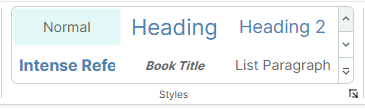
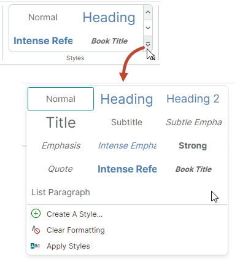
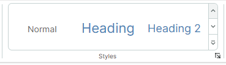
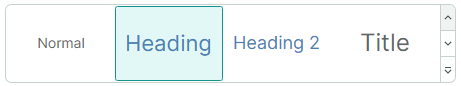

# 画廊

画廊是一种 [Ribbon 项](ribbon-items.md)，可以显示一组图形丰富的元素（例如带图片的格式化文本），并根据指定的数据模板进行渲染。画廊项从左到右、再从上到下排列，形成一个多列列表。

下图展示了一个显示 3 列项的内嵌 Ribbon 画廊。



内嵌 Ribbon 画廊包含两个用于垂直滚动的按钮。这些按钮下方是一个下拉按钮，用于在下拉窗口中显示画廊的全部内容。




## 创建 Ribbon 画廊

使用 `RibbonGalleryItem` 项将画廊添加到 Ribbon 界面。您可以将 `RibbonGalleryItem` 对象添加到[页面分组](page-groups.md)、弹出菜单、[页面标题区域](page-header-items.md)或[快速访问工具栏](quick-access-toolbar.md)中，方式与添加其他 [Ribbon 项](ribbon-items.md)相同。例如，要将 Ribbon 项添加到页面分组中，请在 &lt;RibbonPageGroup&gt; 起始和结束标签之间定义它们。在后台代码中，您可以使用 `RibbonPageGroup.Items` 集合添加项。

以下代码片段来自 _WordPad Example_ 演示，将一个画廊添加到 _Styles_ 页面分组中。画廊项的来源由视图模型中定义的 _FontStyles_ 集合指定。



``` xml
<mxr:RibbonPageGroup Header="Styles" IsHeaderButtonVisible="True">
    <mxr:RibbonGalleryItem MaxColumnCount="3" ItemWidth="108" StretchItemVertically="True"
                           ItemHeight="80"
                           Header="Styles"
                           MaxDropDownColumnCount="3"
                           ItemsSource="{Binding FontStyles}">
</mxr:RibbonPageGroup>
```

## 画廊项

使用 `RibbonGalleryItem.ItemsSource` 属性提供一个业务对象集合，以作为画廊项显示。要在画廊中渲染这些业务对象，请定义相应的数据模板。

要定义画廊项模板，您也可以使用 `RibbonGalleryItem.ItemTemplate` 属性。

### 示例 - 为画廊项使用多个模板

在以下来自 _WordPad Example_ 演示的代码中，画廊项由视图模型中定义的 _FontStyles_ 集合填充。_FontStyles_ 集合的元素是业务对象（_NormalGalleryItem_、_HeadingGalleryItem_ 和 _TitleGalleryItem_），其数据模板定义在 `UserControl.DataTemplates` 集合中。


``` xml
<mxr:RibbonGalleryItem 
  ItemsSource="{Binding FontStyles}"
  ...
  >
```

``` cs
public partial class WordPadExampleViewModel : PageViewModelBase
{
    [ObservableProperty] private ObservableCollection<FontStyleGalleryItem> fontStyles;
    //...
    fontStyles = new ObservableCollection<FontStyleGalleryItem>();
    fontStyles.Add(new NormalGalleryItem() { Header = "Normal" });
    fontStyles.Add(new HeadingGalleryItem() { Header = "Heading" });
    fontStyles.Add(new TitleGalleryItem() { Header = "Title" });
}
```

``` xml
<!-- Define data templates -->
<UserControl.DataTemplates>
    <DataTemplate DataType="vm:NormalGalleryItem">
        <Grid>
            <TextBlock Text="{Binding Header}"
                        FontSize="14"
                        HorizontalAlignment="Center"
                        VerticalAlignment="Center" />
        </Grid>
    </DataTemplate>
    <DataTemplate DataType="vm:HeadingGalleryItem">
        <Grid>
            <TextBlock Text="{Binding Header}"
                        FontSize="22"
                        Foreground="SteelBlue"
                        HorizontalAlignment="Center"
                        VerticalAlignment="Center" />
        </Grid>
    </DataTemplate>
    <DataTemplate DataType="vm:TitleGalleryItem">
        <Grid>
            <TextBlock Text="{Binding Header}"
                        FontSize="24"
                        HorizontalAlignment="Center"
                        VerticalAlignment="Center" />
        </Grid>
    </DataTemplate>
</UserControl.DataTemplates>
```

完整代码请参见 _WordPad Example_ 演示。


### 示例 - 为所有画廊项使用一个模板

下面的示例使用 `RibbonGalleryItem.ItemTemplate` 属性定义一个数据模板，用于渲染所有画廊项。该模板绘制一个文本块，其文本和颜色由存储在视图模型 _CellStyles_ 集合中的画廊项对象（_CellStyle_ 对象）的设置指定。

`RibbonGalleryItem.FocusedItem` 属性用于标识当前[被选中的画廊项](#focus-and-select-gallery-items)。在该示例中，`RibbonGalleryItem.FocusedItem` 属性绑定到视图模型中的 _SelectedCellStyle_ 属性。为了在选中某个画廊项时执行操作，视图模型的 `PropertyChanged` 事件处理程序会跟踪 _SelectedCellStyle_ 属性的更改。


``` xml
<mxb:ToolbarManager IsWindowManager="True">
    <mxr:RibbonControl IsApplicationButtonVisible="False">
        <mxr:RibbonPage Header="Home">
            <mxr:RibbonPageGroup Header="Styles" IsHeaderButtonVisible="True">
                <mxr:RibbonGalleryItem MaxColumnCount="3"
                                        ItemWidth="108"
                                        ItemHeight="40"
                                        Header="Cell Styles"
                                        MaxDropDownColumnCount="4"
                                        ItemsSource="{Binding CellStyles}"
                                        FocusedItem="{Binding SelectedCellStyle, Mode=TwoWay}"
                                        >
                    <mxr:RibbonGalleryItem.ItemTemplate>
                        <DataTemplate>
                            <Border Background="{Binding BackColor}">
                                <TextBlock Text="{Binding Text}" 
                                  HorizontalAlignment="Center" 
                                  VerticalAlignment="Center"
                                  Foreground="{Binding TextColor}"/>
                            </Border>
                        </DataTemplate>
                    </mxr:RibbonGalleryItem.ItemTemplate>
                </mxr:RibbonGalleryItem>
            </mxr:RibbonPageGroup>
        </mxr:RibbonPage>
    </mxr:RibbonControl>
</mxb:ToolbarManager>
```

``` cs
public partial class MainWindowViewModel : ViewModelBase
{
    [ObservableProperty] private ObservableCollection<CellStyle> cellStyles;
    [ObservableProperty] private CellStyle selectedCellStyle;

    public MainWindowViewModel()
    {
        cellStyles = new ObservableCollection<CellStyle>
        {
            new CellStyle(){ Text="Normal", TextColor=Brushes.Black, BackColor=Brushes.White },
            new CellStyle(){ Text="Bad", TextColor=Brushes.Maroon, BackColor=Brushes.Pink },
            new CellStyle(){ Text="Good", TextColor=Brushes.Green, BackColor=Brushes.Honeydew },
            new CellStyle(){ Text="Neutral", TextColor=Brushes.Sienna, BackColor=Brushes.Khaki }
        };
        //Add accent colors
        Color[] accentColors = new Color[] { Colors.MediumOrchid, Colors.Chocolate, Colors.CadetBlue };
        for (int accentColorIndex=1; accentColorIndex<= accentColors.Length; accentColorIndex++)
        {
            Color accentColor = accentColors[accentColorIndex-1];
            string accentTitle = $"Accent {accentColorIndex}";
            cellStyles.Add(new CellStyle() { 
              Text = accentTitle, 
              TextColor=Brushes.White, 
              BackColor=new SolidColorBrush(accentColor) 
            });
            for (double opacity = 0.6; opacity > 0.1; opacity -= 0.2)
            {
                cellStyles.Add(new CellStyle() { 
                  Text = $"{opacity:p0} - " + accentTitle, 
                  TextColor=Brushes.Black, 
                  BackColor=new SolidColorBrush(accentColor, opacity)  
                });
            }
        };
        selectedCellStyle = cellStyles[0];
        PropertyChanged += PropertyChanged1;
    }

    // Perform actions when a gallery item is selected.
    private void PropertyChanged1(object? sender, System.ComponentModel.PropertyChangedEventArgs e)
    {
        if (e.PropertyName == nameof(SelectedCellStyle))
        {
            string selectedCellStyleName = SelectedCellStyle.Text;
            //...
        }
    }
}

public class CellStyle : ObservableObject
{
    public CellStyle() 
    {
        Text = "Default";
        TextColor = Brushes.Black;
        BackColor = Brushes.White;
    }
    public string Text { get; set; }
    public IBrush TextColor { get; set; }
    public IBrush BackColor { get; set; }
}
```

## 画廊显示设置

- `RibbonGalleryItem.Header` — 画廊的标题。  

  ``` xml
  <mxr:RibbonGalleryItem Header="Styles" ...>
  ```


  画廊的标题会在以下情况下显示：

  - 在启用了 `IsDropDownHeaderVisible` 选项的下拉画廊中。

    
    

  - 当 `RibbonGalleryItem` 对象被渲染为带有关联下拉画廊的按钮时。这种情况出现在 `RibbonGalleryItem` 对象嵌入到弹出菜单中，或使用[简化命令布局](ribbon-command-layouts.md)时。`RibbonGalleryItem.Header` 属性指定该按钮的标题。
  
    

    有关详细信息，请参阅以下部分：[简化命令布局中的画廊](#galleries-in-the-simplified-command-layout) 和 [工具栏、弹出菜单和上下文菜单中的画廊](#galleries-in-toolbars-popups-and-context-menus)。

- `RibbonGalleryItem.ItemHeight` — 指定画廊项的高度。此属性的优先级高于 `RibbonGalleryItem.StretchItemVertically` 设置。

  如果未设置 `RibbonGalleryItem.ItemHeight` 属性，则默认的画廊项高度由第一个画廊项的高度指定。该高度来自相应的数据模板。

- `RibbonGalleryItem.ItemWidth` — 指定画廊项的宽度。
- `RibbonGalleryItem.MaxColumnCount` — 指定内嵌 Ribbon 画廊中的最大列数。
- `RibbonGalleryItem.MaxDropDownColumnCount` — 指定下拉画廊中的最大列数。
- `RibbonGalleryItem.StretchItemVertically` — 指定是否在垂直方向拉伸画廊项的第一行，以适应内嵌 Ribbon 画廊的高度。该自动高度会传播到其他行，包括下拉画廊中的行。

  

  如果设置了 `RibbonGalleryItem.ItemHeight` 属性，则 `RibbonGalleryItem.StretchItemVertically` 属性不会生效。

  当 `RibbonGalleryItem.StretchItemVertically` 属性为 `false`，且未使用 `RibbonGalleryItem.ItemHeight` 属性时，默认的画廊项高度由第一个画廊项的高度指定。该高度来自相应的数据模板。

## 聚焦和选择画廊项

- `RibbonGalleryItem.FocusedItem` — 允许您获取与当前获得焦点的画廊项对应的业务对象。获得焦点的项是指接收到焦点的项。您可以通过焦点框来识别获得焦点的项。

  
  

- `RibbonGalleryItem.ItemSelectionMode` — 允许您在单项选择和多项选择模式之间进行选择。当 `ItemSelectionMode` 属性设置为 `Multiple` 时，用户可以同时选择多个画廊项。
  
  在单项选择模式下，使用 `RibbonGalleryItem.FocusedItem` 属性获取/设置获得焦点（被选中）的项。
  
  在多项选择模式下，使用 `RibbonGalleryItem.SelectedItems` 属性获取/设置当前选中的项。

  在多选模式下点击某个项时，该项会自动获得焦点并被选中。
  被选中的项具有高亮背景。画廊项周围的边框表示该项已获得焦点。

  
  
  要选择多个项，请在按住 CTRL 和/或 SHIFT 键的同时点击各项。
  
  按住 CTRL 键点击可切换获得焦点项的选中状态，从而允许用户取消选中该获得焦点的项。

  

- `RibbonGalleryItem.SelectedItems` — 与被选中的画廊项对应的业务对象集合。将 `RibbonGalleryItem.ItemSelectionMode` 属性设置为 `Multiple` 以允许多项选择。

  
  在单项选择模式下，`RibbonGalleryItem.SelectedItems` 属性只包含一个元素，它与 `RibbonGalleryItem.FocusedItem` 属性一致。

  


## 显示和关闭下拉画廊

- `RibbonGalleryItem.IsPopupOpen` — 获取或设置下拉画廊是否处于打开状态。
- `RibbonGalleryItem.ClosePopup` — 关闭下拉画廊。

## 下拉画廊中的附加命令

下拉画廊可以在底部显示附加的 Ribbon 项（命令）。


使用 `RibbonGalleryItem.DropDownItems` 属性指定这些附加项。

``` xml
<mxr:RibbonPageGroup Header="Styles" IsHeaderButtonVisible="True">
    <mxr:RibbonGalleryItem MaxColumnCount="3" ItemWidth="108" StretchItemVertically="True"
                           ItemHeight="80"
                           Header="Styles"
                           MaxDropDownColumnCount="3"
                           ItemsSource="{Binding FontStyles}">
        <mxr:RibbonGalleryItem.DropDownItems>
            <mxb:ToolbarButtonItem Header="Create A Style..." Glyph="{x:Static icons:Basic.Add}" />
            <mxb:ToolbarButtonItem Header="Clear Formatting"
                                   Glyph="{x:Static icons:Filter.Does_not_contain}" />
            <mxb:ToolbarButtonItem Header="Apply Styles" Glyph="{x:Static icons:Filter.Starts_with}" />
        </mxr:RibbonGalleryItem.DropDownItems>
    </mxr:RibbonGalleryItem>
</mxr:RibbonPageGroup>
```

## 简化命令布局中的画廊

在[简化命令布局](ribbon-command-layouts.md)中，添加到页面分组中的画廊会渲染为一个按钮。点击该按钮会调出整个画廊。


按钮的文本由 `RibbonGalleryItem.Header` 属性指定。

## 工具栏、弹出菜单和上下文菜单中的画廊

当您将画廊添加到传统工具栏或弹出菜单中时，画廊会显示为一个子菜单。


子菜单的标题由 `RibbonGalleryItem.Header` 属性指定。

<br>
<br>

<sup>*</sup> 本页面使用机器翻译技术翻译。
