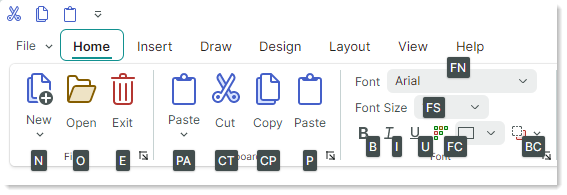

# Key Tips

您可以按 ALT 键将焦点移动到 Ribbon 控件，然后使用键盘上的方向键在 Ribbon 界面中导航。


在键盘导航过程中，Ribbon 控件还支持使用 **Key Tips** 快速访问 Ribbon 元素。Key Tips 是按下 ALT 键时显示的访问键（一到三个字符）。它们允许用户快速使某个 Ribbon 元素获得焦点或将其激活。

按 ALT 键可显示顶级 Ribbon 元素（[Ribbon 页面](pages.md)、[Application Button](application-button-and-main-menu.md)、[快速访问工具栏](quick-access-toolbar.md)以及[页面标题项](page-header-items.md)）的 Key Tips。Key Tips 以小型工具提示的形式显示。


- 按下分配给某个命令的可见 Key Tip 会激活该命令。
- 按下分配给某个内嵌编辑器的可见 Key Tip 会将焦点移动到该编辑器。
- 按下分配给 [Application Button](application-button-and-main-menu.md) 的可见 Key Tip 会调用关联的[应用程序菜单/下拉控件](application-button-and-main-menu.md)。
- 按下分配给某个页面的可见 Key Tip，会显示该页面中各命令的 Key Tips。

  例如，在上图所示的 Ribbon 控件状态下，按下“H”键会显示 _Home_ 页面中命令的 Key Tips。

  

  此时，您可以按下任意一个显示出来的 Key Tip，以激活活动页面中对应的命令。

- 按下当前不可见的 Key Tip 不会产生任何效果。

    !!! tip
        您可以使用 `HotKey` 属性为 Ribbon 命令分配键盘快捷键（例如 CTRL+O、CTRL+B 等）。只要焦点位于快捷键的作用范围内（默认的快捷键作用范围由 `ToolbarManager` 组件的边界定义），这些快捷键就允许用户激活命令。有关详细信息，请参阅 [Ribbon 项 - 快捷键](ribbon-items.md#hot-keys)。

## 在键盘导航期间返回上一步

要返回上一步并查看之前的 Key Tips，请按 Esc 键。

如果按错了字符，请按退格键将其删除。

## 取消键盘导航

- 反复按 ESC 键，直到 Key Tips 消失。

或者

- 将焦点移出 Ribbon 控件（例如，点击另一个控件）。

## 指定 Key Tips

以下属性允许您为 Ribbon 元素分配 Key Tips：

- `ToolbarItem.KeyTip`
- `RibbonPage.KeyTip`
- `RibbonControl.ApplicationButtonKeyTip`

``` xml
<!-- Specify a Key Tip for the Application Menu-->
<mxr:RibbonControl ApplicationButtonContent="File" ApplicationButtonKeyTip="F" Name="ribbon">
    <mxr:RibbonControl.ApplicationButtonDropDownControl>
        <!-- Define the Application Menu displayed when the Application Button is clicked
            or activated with the "F" Key Tip.
         -->
        <mxb:PopupMenu MinWidth="250" >
            <!-- ... -->
        </mxb:PopupMenu>
    </mxr:RibbonControl.ApplicationButtonDropDownControl>
    <!-- Specify a Key Tip for the Home Page -->
    <mxr:RibbonPage Header="Home" KeyTip="H">
        <mxr:RibbonPageGroup Header="File">
            <!-- Specify Key Tips for ribbon commands -->
            <mxb:ToolbarButtonItem Header="New" KeyTip="N" .../>
            <mxb:ToolbarButtonItem Header="Open" KeyTip="O".../>
        </mxr:RibbonPageGroup>
        <mxr:RibbonPageGroup Header="Clipboard">
            <mxb:ToolbarButtonItem Header="Paste" KeyTip="PA" .../>
            <mxb:ToolbarButtonItem Header="Cut" KeyTip="CT" .../>
        </mxr:RibbonPageGroup>
    </mxr:RibbonPage>
</mxr:RibbonControl>
```

请确保同时显示的 Key Tips 是唯一的。例如，您需要为 Ribbon 页面中的命令分配互不相同的 Key Tips。

<br>
<br>

<sup>*</sup> 本页面使用机器翻译技术翻译。
