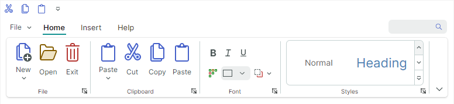
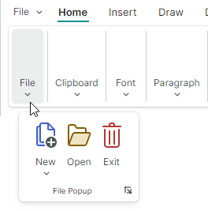
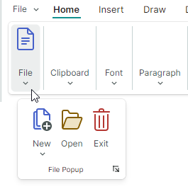
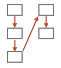
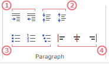

# 页面分组

[Ribbon 页面](pages.md)中的[项（命令）](ribbon-items.md)可以在逻辑上划分为若干分组。Ribbon 页面分组之间以竖直分隔线分隔。当应用[经典命令布局](ribbon-command-layouts.md)时，它们会在底部显示标题。下图展示了 _Home_ 页面中显示的 _File_、_Clipboard_、_Font_ 和 _Styles_ 页面分组：



## 定义和访问 Ribbon 页面分组

Ribbon 页面分组由 `RibbonPageGroup` 类的对象封装。在后台代码中，您可以使用 `RibbonPage.Groups` 集合创建、访问和修改页面分组。要在 XAML 中定义页面分组，请在 **&lt;RibbonPage&gt;** 起始和结束标签之间添加 `RibbonPageGroup` 对象。

``` xml
<mxr:RibbonPage Header="Home" KeyTip="H" Name="pageHome">
    <mxr:RibbonPageGroup Header="File" IsHeaderButtonVisible="True">
        <!-- ... -->
    </mxr:RibbonPageGroup>
    <mxr:RibbonPageGroup Header="Clipboard" IsHeaderButtonVisible="True">
        <!-- ... -->
    </mxr:RibbonPageGroup>
    <mxr:RibbonPageGroup Header="Font" IsHeaderButtonVisible="True">
        <!-- ... -->
    </mxr:RibbonPageGroup>
    <!-- ... -->
</mxr:RibbonPageGroup>
```

您也可以使用 `RibbonPage.GroupsSource` 属性，从视图模型中的业务对象集合创建页面分组。相应的数据模板应定义一个 `RibbonPageGroup` 对象，并根据业务对象初始化其设置。

<!-- TODO
GroupsSource example
 -->


## 页面分组标题

当应用[经典命令布局](ribbon-command-layouts.md)时，页面分组会在底部显示标题。分组标题显示一个标题文字（`RibbonPageGroup.Header`）和一个标题按钮。


点击标题按钮默认没有任何动作。您可以按以下方式为标题按钮关联一个动作：

- 处理 `RibbonPageGroup.HeaderButtonClick` 或 `RibbonPageGroup.HeaderButtonPress` 事件。例如，您的事件处理程序可以显示一个对话框或菜单，展示与该分组相关的更多设置。

  `HeaderButtonClick` 事件会在鼠标左键在标题按钮上按下并释放之后触发。`HeaderButtonPress` 事件则会在用户在标题按钮上按下任意鼠标按键后立即触发。

- 将命令分配给 `RibbonPageGroup.HeaderButtonCommand` 属性。您可以使用 `RibbonPageGroup.HeaderButtonCommandParameter` 属性指定一个可选的命令参数。

使用 `RibbonPageGroup.IsHeaderButtonVisible` 属性可以隐藏标题按钮。


## 页面分组内容


页面分组显示一组紧密相关的 Ribbon 项。Ribbon 项包括按钮、复选按钮、按钮组、子菜单、内嵌编辑器、画廊等。有关详细信息，请参阅以下主题：[Ribbon 项](ribbon-items.md) 和 [画廊](galleries.md)

要为 Ribbon 页面分组填充项，请使用 `RibbonPageGroup.Items` 集合。在 XAML 中，您可以在 **&lt;RibbonPageGroup&gt;** 起始和结束标签之间定义各项。


``` xml
 <mxr:RibbonPage Header="Home" KeyTip="H">
    <mxr:RibbonPageGroup Header="File" IsHeaderButtonVisible="True">
        <mxb:ToolbarButtonItem Header="New" KeyTip="N" Glyph="{x:Static icons:Basic.Docs_Add}"
                               mxr:RibbonControl.DisplayMode="Large"/>
        <mxb:ToolbarButtonItem Header="Open" KeyTip="O"
                               Glyph="{x:Static icons:Basic.Folder_Open}" />
        <mxb:ToolbarButtonItem Header="Exit" KeyTip="E"
                               Glyph="{x:Static icons:Basic.Remove}" />
    </mxr:RibbonPageGroup>
    <mxr:RibbonPageGroup Header="Font" IsHeaderButtonVisible="True">
        <mxb:ToolbarCheckItemGroup ShowSeparator="True">
            <mxb:ToolbarCheckItem Header="Bold" KeyTip="B" Glyph="{x:Static icons:Basic.Font_Bold}" />
            <mxb:ToolbarCheckItem Header="Italic" KeyTip="I" Glyph="{x:Static icons:Basic.Font_Italic}" />
            <mxb:ToolbarCheckItem Header="Underline" KeyTip="U" Glyph="{x:Static icons:Basic.Font_Underline}"  />
        </mxb:ToolbarCheckItemGroup>
       <!-- ... -->
    </mxr:RibbonPageGroup>
</mxr:RibbonPage>
```

您也可以使用 `RibbonPageGroup.ItemsSource` 属性，从视图模型中的业务对象集合创建各项。相应的数据模板应定义 Ribbon 项，并根据底层业务对象初始化其设置。

<!-- TODO
ItemsSource example
 -->


## 页面分组图像

当 Ribbon 控件被调整大小时，自适应布局功能可能会折叠特定的页面分组。在折叠状态下，分组的项会显示在一个下拉窗口中。



您可以使用 `RibbonPageGroup.Glyph` 属性，在折叠分组的按钮上显示一张图像：



``` xml
xmlns:icons="https://schemas.eremexcontrols.net/avalonia/icons"
<mxr:RibbonPageGroup Header="File" Glyph="{x:Static icons:Basic.Doc}">
```


## 页面分组中项的布局

### 自适应布局

Ribbon 控件支持自适应布局功能，该功能会在 Ribbon 控件被调整大小时，调整 Ribbon 页面分组中各项的布局。


#### 在分组中组合项

您可以使用 [ToolbarItemGroup](ribbon-items.md#non-breaking-groups-of-items-toolbaritemgroup) 和 [ToolbarCheckItemGroup](ribbon-items.md#non-breaking-groups-of-check-items-toolbarcheckitemgroup)，将若干组 [Ribbon 项](ribbon-items.md)分组到不可分割的容器（分组）中。
这些容器可确保各项始终显示在同一行中，即使应用了自适应布局功能，这种布局也会得到保留。当 Ribbon 被调整大小时，只有整个容器可以被折叠，而不是容器内的单个项。

例如，在上面的动画中，、 和  这几个项被组合到一个不可分割的容器中。

#### 项图像

当应用[经典命令布局](ribbon-command-layouts.md)时，自适应布局功能还会在您调整 Ribbon 大小时调整各项的显示尺寸——从带文字的大图标，到小图标，再反过来。


`RibbonControl.DisplayMode` 附加属性允许您指定在[经典命令布局](ribbon-command-layouts.md)下，Ribbon 页面分组中的 Ribbon 项所支持的显示模式。
您可以强制某个项只使用大图标、只使用小图标、使用带文字的小图标，或使用这些显示模式的组合。

  ``` xml
  <mxb:ToolbarButtonItem Header="Open" KeyTip="O" mxr:RibbonControl.DisplayMode="Large"
                            Glyph="{x:Static icons:Basic.Folder_Open}" />
  ```

  有关详细信息，请参阅以下主题：[经典命令布局中的自适应图标大小](ribbon-items.md#adaptive-glyph-size-in-the-classic-command-layout)


#### 相关 API

- `AllowCollapse` — 指定当 Ribbon 控件宽度缩小时，某个分组是否可以被折叠。
- `IsCollapsed` — 返回当前分组是否处于折叠状态。


### 自定义页面分组中的项布局

Ribbon 控件为页面分组中的项支持两种布局模式：

- 列（先向下，再向右）

    

    如果分组高度不足以在前一个同级项下方显示某个项，该项就会被移到新的一列。

    目前，除[不可分割分组](ribbon-items.md#non-breaking-groups-of-items-toolbaritemgroup)外，所有 Ribbon 项都只支持“列”布局模式。
    

- 行（先向右，再向下）

    

    如果分组宽度不足以在前一个同级项右侧显示某个项，该项就会被移到新的一行。

    不可分割容器（[ToolbarItemGroup](ribbon-items.md#non-breaking-groups-of-items-toolbaritemgroup) 和 [ToolbarCheckItemGroup](ribbon-items.md#non-breaking-groups-of-check-items-toolbarcheckitemgroup)）默认使用“行”布局模式。

`RibbonPageGroup.ItemLayouMode` 附加属性允许您将[不可分割容器](ribbon-items.md#non-breaking-groups-of-items-toolbaritemgroup)的布局模式从默认的“行”改为“列”。`RibbonPageGroup.ItemLayouMode` 属性目前对其他 Ribbon 项不生效。

`RibbonPageGroup.ItemLayouMode` 属性的默认值为 `Default`，对不可分割容器而言相当于 `Row`，对其他 Ribbon 项而言相当于 `Column`。

- 如果两个连续的项使用不同的布局模式（Column 和 Row），第二个项会被自动移到新的一列。
- 若要以 Column 或 Row 布局模式排列一组连续的项，请确保这些项都（显式或隐式地）应用了所需的布局模式。
- 提示：您可以将两个 Ribbon 项组合到一个独立的[不可分割容器](ribbon-items.md#non-breaking-groups-of-items-toolbaritemgroup)中，使它们作为一个整体来处理。

#### 示例 - 将项排列为一列
以下示例使用 `RibbonPageGroup.ItemLayouMode` 附加属性将各项排列为一列。


该布局由三行 Ribbon 项组成：

- 第 1 行显示一个复选项。

    ``` xml
    <mxb:ToolbarCheckItem Name="btnSort" Header="Sort Results Alphabetically" CheckBoxStyle="CheckBox"/>
    ```

- 第 2 行显示一个容器（`ToolbarItemGroup`），组合了一个文本编辑器和一个按钮。将这些项分组到一个容器中，是为了让它们彼此相邻显示。

    ``` xml
    <mxb:ToolbarItemGroup Name="groupSearchBox">
        <mxb:ToolbarEditorItem Header="Search" EditorWidth="150">
            <mxb:ToolbarEditorItem.EditorProperties>
                <mxe:TextEditorProperties/>
            </mxb:ToolbarEditorItem.EditorProperties>
        </mxb:ToolbarEditorItem>
        <mxb:ToolbarButtonItem
                Header="Find"
                Glyph="{SvgImage 'avares://Ribbon-Layout/Assets/arrow-right.svg'}"
                Command="{Binding FindCommand}"/>
    </mxb:ToolbarItemGroup>
    ```
    
- 第 3 行显示一个容器（`ToolbarCheckItemGroup`），组合了三个复选项：

    ``` xml
    <mxb:ToolbarCheckItemGroup Name="groupSearchProperties"  >
        <mxb:ToolbarCheckItem
            Header="Match case"
            IsChecked="{Binding IsMatchCase}"
            Glyph="{SvgImage 'avares://Ribbon-Layout/Assets/match-case.svg'}"/>
        <mxb:ToolbarCheckItem
            Header="Match whole word"
            IsChecked="{Binding IsMatchWholeWord}"
            Glyph="{SvgImage 'avares://Ribbon-Layout/Assets/match-whole-word.svg'}"/>
        <mxb:ToolbarCheckItem
            Header="Use regular expressions"
            IsChecked="{Binding IsUseRegExp}"
            Glyph="{SvgImage 'avares://Ribbon-Layout/Assets/match-regexp.svg'}"/>
    </mxb:ToolbarCheckItemGroup>
    ```

将 _btnSort_、_groupSearchBox_ 和 _groupSearchProperties_ 这几个项放置到一个 `RibbonPageGroup` 中：

``` xml
<mxr:RibbonControl>
    <mxr:RibbonPage Header="Home">
        <mxr:RibbonPageGroup Header="Sort">
            <mxb:ToolbarCheckItem Name="btnSort" Header="Sort Results Alphabetically" CheckBoxStyle="CheckBox"/>
            <mxb:ToolbarItemGroup Name="groupSearchBox">
                <!-- ... -->
            </mxb:ToolbarItemGroup>
            <mxb:ToolbarCheckItemGroup Name="groupSearchProperties" >
                <!-- ... -->
            </mxb:ToolbarCheckItemGroup
        </mxr:RibbonPageGroup>
    </mxr:RibbonControl>
</mxr:RibbonPage
```

这段代码会产生一个不理想的布局：_groupSearchBox_ 和 _groupSearchProperties_ 这两个容器被移到了单独的一列。这是因为 _btnSort_ 项使用的是 Column 布局模式，而这两个容器默认使用的是 Row 布局模式。

 

要将这些容器排列在 _btnSort_ 按钮下方，请将这些容器的 `RibbonPageGroup.ItemLayouMode` 附加属性设置为 Column。

``` xml
<mxr:RibbonControl ApplicationButtonContent="File" ApplicationButtonKeyTip="F">
    <mxr:RibbonPage Header="Home" KeyTip="M">
        <mxr:RibbonPageGroup Header="Sort">
            <mxb:ToolbarCheckItem Name="btnSort" Header="Sort Results Alphabetically" CheckBoxStyle="CheckBox"/>
            <mxb:ToolbarItemGroup Name="groupSearchBox"
                                  mxr:RibbonPageGroup.ItemLayoutMode="Column">
                <mxb:ToolbarEditorItem Header="Search" EditorWidth="150">
                    <mxb:ToolbarEditorItem.EditorProperties>
                        <mxe:TextEditorProperties/>
                    </mxb:ToolbarEditorItem.EditorProperties>
                </mxb:ToolbarEditorItem>
                <mxb:ToolbarButtonItem
                        Header="Find"
                        Glyph="{SvgImage 'avares://Ribbon-Layout/Assets/arrow-right.svg'}"
                        Command="{Binding FindCommand}"/>
            </mxb:ToolbarItemGroup>

            <mxb:ToolbarCheckItemGroup Name="groupSearchProperties" 
                                       mxr:RibbonPageGroup.ItemLayoutMode="Column" >
                <mxb:ToolbarCheckItem
                    Header="Match case"
                    IsChecked="{Binding IsMatchCase}"
                    Glyph="{SvgImage 'avares://Ribbon-Layout/Assets/match-case.svg'}"/>
                <mxb:ToolbarCheckItem
                    Header="Match whole word"
                    IsChecked="{Binding IsMatchWholeWord}"
                    Glyph="{SvgImage 'avares://Ribbon-Layout/Assets/match-whole-word.svg'}"/>
                <mxb:ToolbarCheckItem
                    Header="Use regular expressions"
                    IsChecked="{Binding IsUseRegExp}"
                    Glyph="{SvgImage 'avares://Ribbon-Layout/Assets/match-regexp.svg'}"/>
            </mxb:ToolbarCheckItemGroup>
        </mxr:RibbonPageGroup>
    </mxr:RibbonPage>
</mxr:RibbonControl>
```

现在，_btnSort_、_groupSearchBox_ 和 _groupSearchProperties_ 这几个项都使用 Column 布局模式，因此它们被排列在同一列中，如下图所示：

 


### 将不可分割容器排列为两行或三行

如果页面分组足够宽，组合在不可分割容器（[ToolbarItemGroup](ribbon-items.md#non-breaking-groups-of-items-toolbaritemgroup) 和 [ToolbarCheckItemGroup](ribbon-items.md#non-breaking-groups-of-check-items-toolbarcheckitemgroup)）中的项会被排列为两行。当页面分组的宽度减小时，容器会被排列为三行，以形成更紧凑的布局。


在某些特定情况下，您可能需要强制将不可分割容器排列为两行或三行。
为此，请将第一个不可分割容器的 `RibbonPageGroup.ItemGroupLayoutMode` 附加属性设置为 `Layout2Rows` 或 `Layout3Rows`（该属性的默认值为 `AdaptiveLayout`）。

#### 示例 - 强制将容器排列为两行

假设有一个 `RibbonPageGroup`，其中包含四个不可分割的项容器（分组）。



当您调整 Ribbon 控件的大小时，自适应布局功能会将这些容器排列为两行或三行，以适应可用空间。


要强制将这些容器排列为两行，请将第一个不可分割容器的 `RibbonPageGroup.ItemGroupLayoutMode` 附加属性设置为 `Layout2Rows`。

``` xml
<mxr:RibbonPageGroup Header="Paragraph">
    <mxb:ToolbarItemGroup Name="gIndent"
                          mxr:RibbonPageGroup.ItemGroupLayoutMode="Layout2Rows">
        <mxb:ToolbarButtonItem Header="Increase Indent" Glyph="{x:Static icons:Basic.Level_Increase}"/>
        <mxb:ToolbarButtonItem Header="Decrease Indent" Glyph="{x:Static icons:Basic.Level_Reduce}"/>
    </mxb:ToolbarItemGroup>

    <mxb:ToolbarItemGroup  Name="gLineSpacing">
        <mxb:ToolbarButtonItem Header="Increase Line Spacing" Glyph="{x:Static icons:Basic.List_Collapse}"/>
        <mxb:ToolbarButtonItem Header="Decrease Line Spacing" Glyph="{x:Static icons:Basic.List_Expand}"/>
    </mxb:ToolbarItemGroup>
            
    <mxb:ToolbarItemGroup  Name="gParaNumbering">
        <mxb:ToolbarButtonItem Header="Bullets" Glyph="{x:Static icons:Office.Bullets}" />
        <mxb:ToolbarButtonItem Header="Numbering" Glyph="{x:Static icons:Office.Line_Numbering}" />
        <mxb:ToolbarButtonItem Header="Multilevel List" Glyph="{x:Static icons:Office.Multilevel_List}" />
    </mxb:ToolbarItemGroup>
            
    <mxb:ToolbarCheckItemGroup  Name="gAlign" CheckType="Radio">
        <mxb:ToolbarCheckItem Header="Align Left" Glyph="{x:Static icons:Alignment.Align_Left}"/>
        <mxb:ToolbarCheckItem Header="Align Center" Glyph="{x:Static icons:Alignment.Align_Horizontal_Centers}"/>
        <mxb:ToolbarCheckItem Header="Align Right" Glyph="{x:Static icons:Alignment.Align_Right}"/>
    </mxb:ToolbarCheckItemGroup>
</mxr:RibbonPageGroup>
```

结果是这些容器被排列为两行。如果没有足够的空间完整显示这些容器，它们会自动折叠。


如果您需要让某个特定的项从新的一列开始，请在该项之前放置一个 `ToolbarSeparatorItem` 对象。

``` xml
<mxr:RibbonPageGroup Header="Paragraph">
    <mxb:ToolbarItemGroup Name="gIndent" mxr:RibbonPageGroup.ItemGroupLayoutMode="Layout2Rows">
        <!-- ... -->
    </mxb:ToolbarItemGroup>

    <mxb:ToolbarItemGroup  Name="gLineSpacing">
        <!-- ... -->    
    </mxb:ToolbarItemGroup>
            
    <mxb:ToolbarItemGroup  Name="gParaNumbering">
        <!-- ... -->
    </mxb:ToolbarItemGroup>
    
    <mxb:ToolbarSeparatorItem/>
            
    <mxb:ToolbarCheckItemGroup  Name="gAlign" CheckType="Radio">
        <!-- ... -->        
    </mxb:ToolbarCheckItemGroup>
</mxr:RibbonPageGroup>
```


<br>
<br>

<sup>*</sup> 本页面使用机器翻译技术翻译。
