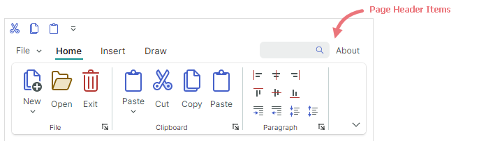

# 页眉项目

页眉项目为 [ribbon items](ribbon-items.md)，显示在带有页眉的 line 中。这些项目固定在 Ribbon control 的右边缘。



使用 `RibbonControl.PageHeaderItems` 集合添加、访问和修改页眉项目。

``` xml
<mxr:RibbonControl.PageHeaderItems>
    <mxb:ToolbarEditorItem EditorWidth="100">
        <mxb:ToolbarEditorItem.EditorProperties>
            <mxe:ButtonEditorProperties>
                <mxe:ButtonEditorProperties.Buttons>
                    <mxe:ButtonSettings Glyph="{x:Static icons:Basic.Search}" GlyphSize="12, 12"/>
                </mxe:ButtonEditorProperties.Buttons>
            </mxe:ButtonEditorProperties>
        </mxb:ToolbarEditorItem.EditorProperties>
    </mxb:ToolbarEditorItem>
    <mxb:ToolbarButtonItem Name="btnAbout" Header="About" Click="BtnAbout_Click" />
</mxr:RibbonControl.PageHeaderItems>
```

您还可以使用 `RibbonControl.PageHeaderItemsSource` 属性从存储在视图模型中的业务对象集合创建页眉项。相应的数据模板should定义[ribbon items](ribbon-items.md)。

<br>
<br>

<sup>*</sup> 本页面使用机器翻译技术翻译。
