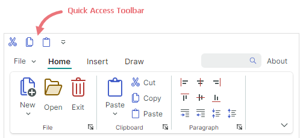

# 快速访问工具栏

Ribbon 快速访问工具栏是一个可自定义的工具栏，显示常用的 [ribbon items](ribbon-items.md)。



用户可以在运行时使用上下文菜单向 Ribbon 快速访问工具栏添加项目或从中删除项目。

## 在快速访问工具栏中添加和删除项目

要将项目添加到快速访问工具栏 at runtime，用户可以右键单击 item，然后在出现的上下文菜单中选择“**添加到快速访问工具栏**”。


要从快速访问工具栏删除 item，请右键单击 item 并选择 **从快速访问工具栏删除**。


要了解如何在应用程序运行之间保存和恢复对 Ribbon 快速访问工具栏的用户更改，请遵循以下主题：

- [Ribbon Serialization and Deserialization](ribbon-serialization-and-deserialization.md)

### 禁用快速访问工具栏自定义

将 `RibbonControl.AllowQuickAccessToolbarCustomizationMenu` 属性设置为 `false` 可隐藏 **添加到快速访问工具栏** 和 **从快速访问工具栏删除** 命令，从而阻止用户自定义快速访问工具栏。

### 在代码中将项目添加到快速访问工具栏

要使用代码中的项目填充快速访问工具栏，请使用 `RibbonControl.QuickAccessToolbarItems` 集合。您还可以使用此集合来访问然后修改代码隐藏中的快速访问工具栏项目。

``` xml
<mxr:RibbonControl.QuickAccessToolbarItems>
    <mxb:ToolbarButtonItem Header="Cut" KeyTip="CT"
                           Glyph="{x:Static icons:Basic.Cut}" />
    <mxb:ToolbarButtonItem Header="Copy" KeyTip="CP"
                           Glyph="{x:Static icons:Basic.Copy}" />
    <mxb:ToolbarButtonItem Header="Paste" KeyTip="P"
                           Glyph="{x:Static icons:Basic.Paste}" />
</mxr:RibbonControl.QuickAccessToolbarItems>
```

使用 `RibbonControl.QuickAccessToolbarItemsSource` 属性可使用存储在视图模型中的业务对象集合中的项目填充快速访问工具栏。相应的数据模板 should 定义功能区项目并从 underlying 业务对象初始化其设置。


## 更改位置和可见性

Ribbon 快速访问工具栏可以显示在 Ribbon 主命令区域的上方（默认）或下方。

用户可以单击快速访问工具栏中的 dropdown button，然后选择 **在 Ribbon 下方/上方显示快速访问工具栏** 命令来更改工具栏的位置。


您可以使用 `RibbonControl.IsQuickAccessToolbarCustomizationButtonVisible` 属性隐藏快速访问工具栏中的 dropdown button。

以下属性允许您在代码中 control position 和快速访问工具栏的可见性：

- `RibbonControl.QuickAccessToolbarLocation` — 允许您将快速访问工具栏设置为 choose between、`Top` 和 `Bottom` 位置。
- `RibbonControl.IsQuickAccessToolbarVisible` — 允许您隐藏快速访问工具栏。

## 另请参阅

- [Ribbon Serialization and Deserialization](ribbon-serialization-and-deserialization.md)

<br>
<br>

<sup>*</sup> 本页面使用机器翻译技术翻译。
