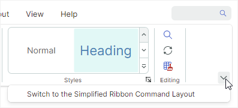

# Ribbon 命令布局

功能区命令 layout 确定 Ribbon 栏中命令的排列。 Ribbon control 支持两种布局：经典和简化。

## 经典命令布局


- Ribbon bar 足够高，可以显示三行带有小图标的命令。
- 页面组标题可见
- 当 Ribbon 调整大小时，组不能部分折叠
- 支持内联画廊
- 小图标默认大小为`16x16`。您可以使用 `RibbonControl.SmallGlyphSize` 属性来更改小图标的大小。大图标的大小是小图标的两倍。
- 当 Ribbon 调整大小时，[adaptive layout feature](ribbon-items.md#adaptive-glyph-size-in-the-classic-command-layout) 会调整图标的大小 - 从大到小，将文本调整到小字形，然后向后调整。


## 简化的命令布局


- 按钮排列成一排
- 页面组标题被隐藏
- 调整 Ribbon 大小时，组可能会部分折叠。折叠按钮可从组的 dropdown 菜单访问。
- 图库显示在 dropdown 菜单中
- 简化命令布局中图标的默认大小为 `22x22`。使用 `RibbonControl.GlyphSizeInSimplifiedLayout` 属性指定自定义图标大小。

    ``` xml
    <mxr:RibbonControl GlyphSizeInSimplifiedLayout="32">
    ```


## 选择命令布局

用户可以通过单击 Ribbon 右下角的命令布局选择 button 在经典视图和简化视图 at runtime 之间切换。



将 `RibbonControl.IsCommandLayoutSelectionButtonVisible` option 设置为 `false` 以隐藏此按钮。

`RibbonControl.CommandLayout` 属性允许您在代码中指定命令 layout。

``` xml
<mxr:RibbonControl Name="ribbon" CommandLayout="Simplified">
    <!-- ... -->
</mxr:RibbonControl>
```

<br>
<br>

<sup>*</sup> 本页面使用机器翻译技术翻译。
