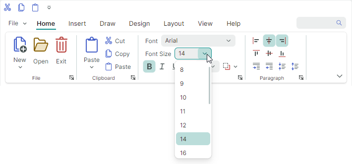
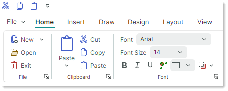
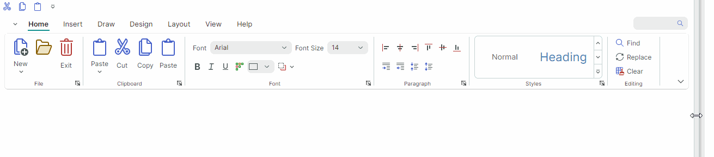

# Ribbon 物品

您可以向 Ribbon control 及其菜单添加各种项目：按钮、检查按钮、文本标签、子菜单、in-place 编辑器等。



除了这些经典项目外，Ribbon control 还支持图库。它们旨在显示图形丰富的元素，按列和行排列。请参阅 [Galleries](galleries.md) 了解更多信息。

所有项目（包括画廊）都可以添加到 [traditional toolbars and context menus](../toolbars-and-menus/index.md)。

## 添加 Ribbon 项目

您可以在不同的 Ribbon 元素中显示各种项目：[ribbon page groups](page-groups.md)、[Quick Access Toolbar](quick-access-toolbar.md)、[Page Header Area](page-header-items.md)、[Main (Application) Menu](application-button-and-main-menu.md) 和子菜单。

若要在 XAML 中将项目添加到功能区页面组，请在 **&lt;RibbonPageGroup&gt;** 开始标记和结束标记之间定义这些项目。在代码隐藏中，您可以使用 `RibbonPageGroup.Items` 集合添加、访问和修改项目。其他功能区元素以相同的方式填充项目。

以下示例将三个按钮（`ToolbarButtonItem` 对象）添加到 `RibbonPageGroup` 对象。

``` xml
<mxb:ToolbarManager IsWindowManager="True">
    <mxr:RibbonControl ApplicationButtonContent="File" ApplicationButtonKeyTip="F">
        <mxr:RibbonPage Header="Home" KeyTip="H">
            <mxr:RibbonPageGroup Header="Editing" IsHeaderButtonVisible="False">
                <mxb:ToolbarButtonItem Header="Find" KeyTip="FN" 
                  Glyph="{x:Static icons:Basic.Search}" 
                  Command="FindButtonClick" />
                <mxb:ToolbarButtonItem Header="Replace" KeyTip="RP" 
                  Glyph="{x:Static icons:Basic.Update}" 
                  Command="ReplaceButtonClick"/>
                <mxb:ToolbarButtonItem Header="Clear" KeyTip="CL" 
                  Glyph="{x:Static icons:Basic.Table_Clear}" 
                  Command="ClearButtonClick"/>
            </mxr:RibbonPageGroup>
        </mxr:RibbonPage>
    </mxr:RibbonControl>
</mxb:ToolbarManager>
```

## Ribbon 物品类型

您可以添加到 Ribbon、control 和传统工具栏的所有项目都是 `ToolbarItem` 类的后代。以下部分介绍可用的功能区项目及其设置。


### 常规按钮 (ToolbarButtonItem)

`ToolbarButtonItem` 对象允许您实现常规按钮和 [buttons with dropdown functionality](#buttons-with-dropdown-functionality-toolbarbuttonitem)。

常规 button 会在单击时引发操作。


#### 单击按钮

要对 button 实施操作，您可以指定命令或处理 button 的事件：

- `ToolbarItem.Command` — 单击 button 时执行的命令。

    ``` xml
    <mxb:ToolbarButtonItem Header="Open" KeyTip="O" 
    Command="{Binding OpenFileCommand}" 
    Glyph="{x:Static icons:Basic.Folder_Open}" />
    ```
    ``` cs
    [RelayCommand]
    public void OpenFile()
    {
        //...
    }
    ```
    
- `CommandParameter` — 传递给指定命令的命令参数。

- `ToolbarItem.Click` — 左键单击 item 时触发（按下鼠标左键 button 然后释放后）。
- `ToolbarItem.Press` — 当在该项目上按下任何鼠标 button 时触发。

#### 按钮标题和字形

- `Header` — item 的显示文本。
- `Glyph` — item 的图像。另请参阅：[Glyph Size](#glyph-size)。
- `GlyphTemplate` — 用于渲染 item 图像的自定义数据模板。

#### 字形大小

[Ribbon page groups](page-groups.md) 中的命令字形大小在简化版和经典版 [command layouts](ribbon-command-layouts.md) 中是不同的。以下部分提供了更多详细信息：

- [Glyph Size in the Simplified Command Layout](#glyph-size-in-the-simplified-command-layout)
- [Glyph Size in the Classic Command Layout](#glyph-size-in-the-classic-command-layout)
- [Adaptive Glyph Size in the Classic Command Layout](#adaptive-glyph-size-in-the-classic-command-layout)


!!!提示

要在弹出菜单和上下文菜单中自定义 item 字形的大小，请使用 item 的 `GlyphSize` 属性。
    
    ``` xml
    <mxb:PopupMenu MinWidth="250" ContentRightIndent="30">
        <mxb:ToolbarButtonItem Header="New" Glyph="{x:Static icons:Basic.Doc}" GlyphSize="32,32" HotKey="Ctrl+N"/>
    </mxb:PopupMenu>
    ```


#### 简化命令布局中的字形大小

页面组中的所有命令都使用 [Simplified Command Layout](ribbon-command-layouts.md) 中的一种图标大小。


默认图标大小为 `22x22`。您可以使用 `RibbonControl.GlyphSizeInSimplifiedLayout` 属性来指定自定义图标大小。

#### 经典命令布局中的字形大小

页组中的命令可以显示 [Classic Command Layout](ribbon-command-layouts.md) 中的大字形和小字形。



小图标的默认大小是 `16x16`。您可以使用 `RibbonControl.SmallGlyphSize` 属性来更改小图标的大小。大图标的大小是小图标的两倍。

`RibbonControl.DisplayMode` attached property 可用于指定功能区页面组中的命令的显示尺寸（大、小和带文本的小）。请参阅 [Adaptive Glyph Size in the Classic Command Layout](#adaptive-glyph-size-in-the-classic-command-layout) 了解更多信息。

#### 经典命令布局中的自适应字形大小

当调整 Ribbon control 的大小时，Ribbon control 的 [adaptive layout feature](page-groups.md#adaptive-layout) 会调整 [ribbon page groups](page-groups.md) 中项目的 layout。当使用经典命令 layout 时，此功能还会在 Ribbon 调整大小期间调整项目的显示大小。



`RibbonControl.DisplayMode` attached property 允许您为 [Classic command layout](ribbon-command-layouts.md) 中的功能区页面组中的功能区项目指定支持的显示模式。
您可以强制 item 仅使用大图像、小图像、带文本的小图像或这些显示模式的组合。

预定义的 glyph 显示模式由 `RibbonItemDisplayMode` 枚举定义：

- `Large` — item 显示大 glyph 和文本。
  


- `Small` — item 显示小 glyph 和文本。


- `SmallGlyph` — item 显示一个小字形。


- `Auto` — item 支持 `Large`、`Small` 和 `SmallGlyph` 显示模式。根据 item 的父级 [group](page-groups.md) 中的可用空间，Ribbon control 自动为项目选择其中一种显示模式。

以下代码片段将功能区 item 的 `RibbonControl.DisplayMode` attached property 设置为 `Large`。这迫使 item 仅使用大图像。

``` xml
<mxr:RibbonPage Header="Home" KeyTip="H">
    <mxr:RibbonPageGroup Header="File" IsHeaderButtonVisible="True">
        <mxb:ToolbarButtonItem Header="Open" KeyTip="O" mxr:RibbonControl.DisplayMode="Large"
                            Glyph="{x:Static icons:Basic.Folder_Open}" />
    </mxr:RibbonPageGroup>
</mxr:RibbonPage>
```

`RibbonItemDisplayMode` 枚举用 `[Flags]` 属性标记。因此，当 setting 和 `RibbonControl.DisplayMode` 附加属性时，您可以使用 `Large`、`Small` 和 `SmallGlyph` 标志的任意组合。

以下代码允许功能区 item 仅使用 `Small` 和 `SmallGlyph` 显示模式：

``` xml
<mxb:ToolbarButtonItem Header="Help" KeyTip="LP" Glyph="{x:Static icons:Basic.Info}"
                       mxr:RibbonControl.DisplayMode="Small, SmallGlyph" />
```

#### 常用项目显示设置

- `ShowSeparator` — 获取或设置是否在项目前显示分隔符。您还可以使用 `ToolbarSeparatorItem` bar item 插入分隔符。

<!-- TODO
 Check:
  - `GlyphAlignment` — The glyph alignment relative to the item's header. 
-->

    
### 具有下拉功能的按钮 (ToolbarButtonItem)

`ToolbarButtonItem` item 允许您使用 associated dropdown control 或菜单创建 button。


使用 `ToolbarButtonItem.DropDownControl` 属性指定 dropdown control/菜单。当用户单击 button 或内置向下箭头 button（取决于 `DropDownArrowVisibility` setting；见下文）时，将调用此 dropdown control。
  

  
``` xml
<mxb:ToolbarButtonItem Name="btnNew" Header="New" KeyTip="N" 
    Glyph="{x:Static icons:Basic.Docs_Add}"
    mxr:RibbonControl.DisplayMode="Large"
    DropDownArrowVisibility="ShowSplitArrow">
    <mxb:ToolbarButtonItem.DropDownControl>
        <mxb:PopupMenu>
            <mxb:ToolbarButtonItem Header="New Document" KeyTip="ND" 
                Glyph="{x:Static icons:Basic.Doc_Add}" />
            <mxb:ToolbarButtonItem Header="New Excel Document" KeyTip="NX"
                                    Glyph="{x:Static icons:Basic.Doc_Excel}" />
        </mxb:PopupMenu>
    </mxb:ToolbarButtonItem.DropDownControl>
</mxb:ToolbarButtonItem>
```
  
#### 下拉控件和向下箭头按钮

- `DropDownControl` — 获取或设置具有该项目的 dropdown control（`Eremex.AvaloniaUI.Controls.Bars.IPopup` 对象）associated。当用户单击 item 或内置向下箭头 button（请参阅 `DropDownArrowVisibility`）时，会弹出 control。以下对象实现了 `Eremex.AvaloniaUI.Controls.Bars.IPopup` 接口，因此它们可以显示为 dropdown controls：

- `Eremex.AvaloniaUI.Controls.Bars.PopupMenu` — [popup menu](../toolbars-and-menus/popup-and-context-menus.md)。您可以将所有类型的工具栏项添加到菜单中以填充内容。
    - `Eremex.AvaloniaUI.Controls.Bars.PopupContainer` — 控件容器。使用 `PopupContainer` 在下拉列表中显示自定义 controls。
    
- `DropDownArrowVisibility` — 获取或设置 item 是否显示用于调用 associated dropdown 控件的 dropdown 箭头。


- `ShowSplitArrow` 或 `Default` — dropdown 箭头可见。它充当嵌入项目中的单独 button。单击 dropdown 箭头将调用 associated dropdown control 并引发 `DropDownPress` 事件。单击 item 会调用其命令 (`Command`) 和事件（`Click` 和 `Press`）。

- `ShowArrow` — dropdown 箭头可见。 item 和箭头充当单个按钮。单击它们会显示 associated dropdown 控件。

- `Hide` — dropdown 箭头已隐藏。单击 item 将调用 dropdown 控件。

<!-- - `DropDownArrowAlignment` — Gets or sets the position of the dropdown arrow. -->

#### 调用下拉控件

- `DropDownOpenMode` — 获取或设置当用户触摸 item/dropdown 箭头时是否以及何时调用 dropdown control。支持的选项包括：
    - `Press` 或 `Default` — dropdown 在鼠标按下事件上显示。
    - `Click` — 在项目上按下并释放鼠标后，将显示 dropdown。
    - `Never` — 不显示 dropdown。
- `DropDownPress` — 按下 dropdown 箭头时触发的事件。
  


### 检查按钮 (ToolbarCheckItem)


`ToolbarCheckItem` item 允许您创建复选按钮。检查按钮支持两种状态——正常和按下。


``` xml
xmlns:mxb="https://schemas.eremexcontrols.net/avalonia/bars"

<mxb:ToolbarCheckItem Header="Bold" 
 IsChecked="{Binding #textBox.FontWeight, 
  Converter={helpers:BoolToFontWeightConverter}, Mode=TwoWay}" 
 Glyph="{SvgImage 'avares://DemoCenter/Images/FontBold.svg'}" />
```

#### 检查按钮

- `IsChecked` — 获取或设置 button 的检查状态。
- `CheckedChanged` — 当 check state 更改时触发的事件。


#### 标题、字形和显示设置

- `Header` — item 的显示文本。
- `Glyph` — item 的图像。 check button 支持大图像和小图像。请参阅以下部分以了解更多信息：

- [Glyph Size](#glyph-size)
  - [Adaptive Glyph Size in the Classic Command Layout](#adaptive-glyph-size-in-the-classic-command-layout)

- `GlyphTemplate` — 用于渲染 item 图像的自定义数据模板。

- `CheckBoxStyle` — Gets or sets display mode for a `ToolbarCheckItem` object.可用选项包括：

- `CheckBoxStyle.CheckButton` — item 呈现为复选按钮。当 `IsChecked` 为 `true` 时，button 显示为按下状态。


- `CheckBoxStyle.CheckBox` — item 在其文本和字形之前显示一个切换框。 When `IsChecked` is `true` the toggle box has a check mark.


    
- `CheckBoxStyle.RadioButton` — The item displays a radio button before its text and glyph.当 `IsChecked` 为 `true` 时，无线电 button 将呈现为实心圆。

您可以将 RadioButton 样式应用到组合在检查组 ([`ToolbarCheckItemGroup`](#non-breaking-groups-of-check-items-toolbarcheckitemgroup)) 中的 `ToolbarCheckItem` 对象。 In this case, the group appears as a typical radio group.

    ``` xml
    <mxb:ToolbarCheckItemGroup CheckType="Radio">
        <mxb:ToolbarCheckItem Header="E-mail" CheckBoxStyle="RadioButton" />
        <mxb:ToolbarCheckItem Header="Phone" CheckBoxStyle="RadioButton" />
    </mxb:ToolbarCheckItemGroup>
    ```
    

    
- `CheckBoxAlignment` — Gets or sets whether the check box (or radio button) are displayed before or after an item's glyph and text.当 `CheckBoxStyle` 属性设置为 `CheckBoxStyle.CheckBox` 或 `CheckBoxStyle.RadioButton` 时，此 option 有效。

    ```xml
    <mxb:ToolbarCheckItem Header="Status bar" CheckBoxAlignment="After"
                        CheckBoxStyle="CheckBox"
                        Hint="Show and hide the status bar"/>
    <mxb:ToolbarSeparatorItem/>
    ```
    

    


您可以按照与常规按钮相同的方式自定义复选按钮的常规显示设置。

- [Common Item Display Settings](#common-item-display-settings)

### 子菜单 (ToolbarMenuItem)

使用 `ToolbarMenuItem` 创建一个 item，单击即可显示子菜单。


#### 子菜单的内容

要指定子菜单的内容，请在 XAML 中的 **&lt;ToolbarMenuItem&gt;** 开始标记和结束标记之间定义项目，或将项目添加到代码隐藏中的 `ToolbarMenuItem.Items` 集合中。

``` xml
xmlns:mxb="https://schemas.eremexcontrols.net/avalonia/bars"

<mxb:ToolbarMenuItem Header="File" Category="File">
    <mxb:ToolbarButtonItem Header="New" 
     Glyph="{SvgImage 'avares://DemoCenter/Images/Group=Context Menu, Icon=NewDraftAction.svg'}" 
     Category="File" Command="{Binding NewFileCommand}"/>
    <mxb:ToolbarButtonItem Header="Open" 
     Glyph="{SvgImage 'avares://DemoCenter/Images/Group=Basic, Icon=Folder Open.svg'}" 
     Category="File" Command="{Binding OpenFileCommand}"/>
    <mxb:ToolbarButtonItem Header="Save" 
     Glyph="{SvgImage 'avares://DemoCenter/Images/Group=Basic, Icon=Save.svg'}" 
     Category="File" Command="{Binding SaveFileCommand}"/>
    <mxb:ToolbarButtonItem Header="Print" 
     Glyph="{SvgImage 'avares://DemoCenter/Images/Group=Basic, Icon=Print.svg'}" 
     ShowSeparator="True"  Category="File" Command="{Binding PrintFileCommand}"/>
</mxb:ToolbarMenuItem>
```

您还可以使用 `ToolbarMenuItem.ItemsSource` 属性用视图模型中业务对象集合中的项目填充子菜单。相应的数据模板 should 定义功能区项目并从 underlying 业务对象初始化其设置。


#### 调用子菜单

当调用子菜单时，会引发以下事件：

- `Opening` — 当菜单即将显示时触发。该事件允许您取消菜单的显示。
- `Opened` — 显示菜单后触发。
- `Closing` — 当菜单即将关闭时触发。该事件允许您取消关闭菜单。
- `Closed` — 菜单关闭后触发。

以下属性允许您取消子菜单的显示，并指​​定是否在鼠标单击或按下事件时显示子菜单。

- `DropDownOpenMode` — 获取或设置当用户触摸该项目时是否以及如何调用子菜单。支持的选项包括：
    - `Press` 或 `Default` — 按下鼠标事件时显示菜单。
    - `Click` — 在项目上按下并释放鼠标后，将显示菜单。
    - `Never` — 不显示菜单。


#### 标题、字形和显示设置

- `Header` — 子菜单的标题文本。
- `Glyph` — 子菜单的图像。子菜单支持标题中的大图像和小图像。请参阅以下部分，了解如何在 Ribbon control 中指定 item 字形的大小：

- [Glyph Size](#glyph-size)
  - [Adaptive Glyph Size in the Classic Command Layout](#adaptive-glyph-size-in-the-classic-command-layout)

- `GlyphTemplate` — 用于渲染 item 图像的自定义数据模板。

您可以按照与常规按钮相同的方式自定义子菜单的常规显示设置。

- [Common Item Display Settings](#common-item-display-settings)


### 就地编辑器 (ToolbarEditorItem)

使用 `ToolbarEditorItem` 对象将 in-place 编辑器嵌入到 Ribbon 控件中。


`ToolbarEditorItem` 对象支持以下方法来指定 in-place 编辑器：

- [Specify an Editor Type](#specify-an-editor-type)。  这是指定 Eremex in-place 编辑器的推荐方法。

- [Specify an Editor in a Data Template](#specify-an-editor-in-a-data-template)


#### 指定编辑器类型

这种方法允许您嵌入 Eremex 编辑器。

要指定编辑器类型，请将 `ToolbarEditorItem.EditorProperties` 属性设置为以下对象之一：

- `ButtonEditorProperties` — 对应于 `ButtonEditor` in-place 编辑器。
- `CheckEditorProperties` — 对应于 `CheckEditor` in-place 编辑器。
- `ColorEditorProperties` — 对应于 `ColorEditor` in-place 编辑器。
- `ComboBoxEditorProperties` — 对应于 `ComboBoxEditor` in-place 编辑器。
- `HyperlinkEditorProperties` — 对应于 `HyperlinkEditor` in-place 编辑器。
- `PopupColorEditorProperties` — 对应于 `PopupColorEditor` in-place 编辑器。
- `PopupEditorProperties` — 对应于 `PopupEditor` in-place 编辑器。
- `SegmentedEditorProperties` — 对应于 `SegmentedEditor` in-place 编辑器。
- `SpinEditorProperties` — 对应于 `SpinEditor` in-place 编辑器。
- `TextEditorProperties` — 对应于 `TextEditor` in-place 编辑器。
- `MemoEditorProperties` — 对应于 `MemoEditor` in-place 编辑器。

这些对象是 `BaseEditorProperties` 的后代。它们包含用于自定义相应 in-place 编辑器的设置。

以下示例定义 _Font_ item（`ToolbarEditorItem` 对象），该对象使用组合框 in-place 编辑器显示字体列表。 `ToolbarEditorItem.EditorProperties` 属性设置为 `ComboBoxEditorProperties` 对象，该对象对应于 `ComboBoxEditor` 编辑器。完整代码请参见_写字板示例_演示。

``` xml
<mxb:ToolbarEditorItem Header="Font" EditorWidth="150" 
 EditorValue="{Binding #textBox.FontFamily, Converter={helpers:FontNameToFontFamilyConverter}}">
    <mxb:ToolbarEditorItem.EditorProperties>
        <mxe:ComboBoxEditorProperties 
         ItemsSource="{Binding $parent[view:ToolbarAndMenuPageView].Fonts}"
         IsTextEditable="False" PopupMaxHeight="300"/>
    </mxb:ToolbarEditorItem.EditorProperties>
</mxb:ToolbarEditorItem>      
```

#### 在数据模板中指定编辑器

使用 `ToolbarEditorItem.EditorTemplate` 属性在数据模板中指定编辑器。在这种情况下，您需要手动设置编辑器的值（例如，使用数据绑定）。

``` xml
<mxb:ToolbarEditorItem Width="150">
    <mxb:ToolbarEditorItem.EditorTemplate>
        <DataTemplate>
            <mxe:TextEditor EditorValue="{Binding Count}" Width="80"/>
        </DataTemplate>
    </mxb:ToolbarEditorItem.EditorTemplate>
</mxb:ToolbarEditorItem>
```

#### 更改并返回编辑器的值

- `ToolbarEditorItem.EditorValue` — 获取或设置 in-place 编辑器的值。使用此属性进行数据绑定。

- `ToolbarEditorItem.EditorValueChanged` — 编辑器值更改后触发的事件。

当您使用 `ToolbarEditorItem.EditorProperties` 属性指定编辑器时，这些成员有效。

#### 编辑器的宽度

<!-- TODO 
Not supported in Ribbon

- `ToolbarEditorItem.SizeMode` — 获取或设置 item 的尺寸模式。此属性允许您拉伸 bar item，因此它会占据栏内所有可用的空白空间。 -->
- `ToolbarEditorItem.EditorWidth` — 获取或设置 in-place 编辑器的宽度。当您使用 `ToolbarEditorItem.EditorProperties` 属性指定编辑器时，此属性有效。如果在数据模板中指定编辑器，则可以使用 `ToolbarEditorItem.Width` 属性设置编辑器宽度，或设置编辑器本身的宽度。
<!-- 待办事项
不起作用：

- `ToolbarEditorItem.EditorHeight` — 获取或设置 in-place 编辑器的高度。 
- `ToolbarEditorItem.EditorAlignment` — 获取或设置编辑器相对于 item 标题的对齐方式。
-->

<!--TODO - `ToolbarEditorItem.Editor` -  

-->

#### 标题和字形

- `Header` — item 的显示文本。

- `Glyph` — item 的图像。 `ToolbarEditorItem` 对象仅支持小图像。小图像的大小由经典命令 layout 中的 `RibbonControl.SmallGlyphSize` 属性和简化命令布局中的 `RibbonControl.GlyphSizeInSimplifiedLayout` 属性指定。
- `GlyphTemplate` — 用于渲染 item 图像的自定义数据模板。

您可以按照与常规按钮相同的方式自定义 `ToolbarEditorItem` 对象的常规显示设置。

- [Common Item Display Settings](#common-item-display-settings)


### 文本标签 (ToolbarTextItem)


使用 `ToolbarTextItem` 对象显示用户无法编辑的文本 label。


``` xml
<mxb:ToolbarTextItem 
 Header="{Binding #scaleDecorator.Scale, StringFormat={}Zoom: {0:P0}}" 
 ShowBorder="False" 
 />
```

#### 标题和字形

- `Header` — item 的显示文本。
- `Glyph` — item 的图像。文本label同时支持大图像和小图像。请参阅以下部分，了解如何在 Ribbon control 中指定 item 字形的大小：

- [Glyph Size](#glyph-size)
  - [Adaptive Glyph Size in the Classic Command Layout](#adaptive-glyph-size-in-the-classic-command-layout)


#### 文本标签的显示设置

- `ToolbarTextItem.ShowBorder` — 获取或设置 item 的边框是否可见。


您可以使用 `ToolbarTextItem.BorderTemplate` 属性来指定自定义模板到 paint 的边框。
- `ToolbarTextItem.BorderTemplate` — 获取或设置 paint 和 item 边框的自定义模板。如果启用了 `ToolbarTextItem.ShowBorder` option，则该模板有效。


参见：

- [Common Item Display Settings](#common-item-display-settings)


### 非破坏性项目组 (ToolbarItemGroup)

使用 `ToolbarItemGroup` 创建工具栏项目的不间断容器（组）。此容器中的项目始终一起显示在 line 中，并且当调整 Ribbon 大小时，它们充当一个内聚单元。


在[Classic command layout](ribbon-command-layouts.md)中，`ToolbarItemGroup`的项目仅支持小图像。

#### 小组内容

要指定容器的内容，请在 XAML 中定义 **&lt;ToolbarItemGroup&gt;** 开始标记和结束标记之间的项，或将项添加到代码隐藏中的 `ToolbarItemGroup.Items` 集合中。

``` xml
<mxb:ToolbarItemGroup>
    <mxb:ToolbarButtonItem Header="Increase" KeyTip="CR" Glyph="{x:Static icons:Basic.Level_Increase}" />
    <mxb:ToolbarButtonItem Header="Decrease" KeyTip="DC" Glyph="{x:Static icons:Basic.Level_Reduce}" />
    <mxb:ToolbarButtonItem Header="Collapse" KeyTip="CL" Glyph="{x:Static icons:Basic.List_Collapse}" />
    <mxb:ToolbarButtonItem Header="Expand" KeyTip="EX" Glyph="{x:Static icons:Basic.List_Expand}" />
</mxb:ToolbarItemGroup>
```

您还可以使用 `ToolbarItemGroup.ItemsSource` 属性用存储在视图模型中的业务对象集合中的项目填充容器。相应的数据模板 should 定义功能区项目并从 underlying 业务对象初始化其设置。

参见：

- [Customize Item Layout in Page Groups](page-groups.md#customize-item-layout-in-page-groups)
- [Arrange Non-Breaking Containers in Two or Three Rows](page-groups.md#arrange-non-breaking-containers-in-two-or-three-rows)

### 非中断检查项组 (ToolbarCheckItemGroup)

使用 `ToolbarCheckItemGroup` 创建检查项目 ([`ToolbarCheckItem` objects](#check-buttons-toolbarcheckitem)) 的不间断容器（组）。与 `ToolbarItemGroup` 对象一样，`ToolbarCheckItemGroup` 对象在调整其父对象大小时作为一个整体（容器的内容无法部分隐藏；项目始终显示在单个 line 中，并且不支持换行）。


`ToolbarCheckItemGroup` 容器可以是其子 `ToolbarCheckItem` 项目的 control 和 check state。您可以使用 `ToolbarCheckItemGroup` 容器创建以下组类型：

- 一组互斥的项目（单选组）。
- 允许多个项目同时为checked的组。

在[Classic command layout](ribbon-command-layouts.md)中，`ToolbarCheckItemGroup`的项目仅支持小图像。

#### 小组内容

要指定容器的内容，请在 XAML 中的 **&lt;ToolbarCheckItemGroup&gt;** 开始标记和结束标记之间定义 `ToolbarCheckItem` 项，或将项添加到代码隐藏中的 `ToolbarCheckItemGroup.Items` 集合中。

``` xml
<mxb:ToolbarCheckItemGroup>
    <mxb:ToolbarCheckItem Header="Bold" KeyTip="B" Glyph="{x:Static icons:Basic.Font_Bold}" />
    <mxb:ToolbarCheckItem Header="Italic" KeyTip="I" Glyph="{x:Static icons:Basic.Font_Italic}" />
    <mxb:ToolbarCheckItem Header="Underline" KeyTip="U" Glyph="{x:Static icons:Basic.Font_Underline}" />
</mxb:ToolbarCheckItemGroup>
```

您还可以使用 `ToolbarCheckItemGroup.ItemsSource` 属性用存储在视图模型中的业务对象集合中的项目填充容器。相应的数据模板 should 定义功能区项目并从 underlying 业务对象初始化其设置。


#### 检查组的项目

- `ToolbarCheckItemGroup.CheckType` — 获取或设置组中一次是否可以有一个或多个项目 checked。支持以下选项：

- `Default` 或 `Multiple` — 一次可以有多个项目为 checked。
    - `Radio` — 一组互斥的项目。用户无法取消选中 item，除非选中另一个 item。
    - `Single` — 一组互斥的项目。用户可以取消选中组内的所有项目。

- `ToolbarCheckItem.IsChecked` — 获取或设置 button 的检查状态。


参见：

- [Customize Item Layout in Page Groups](page-groups.md#customize-item-layout-in-page-groups)
- [Arrange Non-Breaking Containers in Two or Three Rows](page-groups.md#arrange-non-breaking-containers-in-two-or-three-rows)

### 分隔符 (ToolbarSeparatorItem)

`ToolbarSeparatorItem` 对象允许您插入分隔符。


``` xml
<mxb:ToolbarMenuItem Header="File" Category="File">
    <mxb:ToolbarButtonItem Header="New" 
     Glyph="{SvgImage 'avares://DemoCenter/Images/Group=Context Menu, Icon=NewDraftAction.svg'}" 
     Category="File"/>
    <mxb:ToolbarButtonItem Header="Open" 
     Glyph="{SvgImage 'avares://DemoCenter/Images/Group=Basic, Icon=Folder Open.svg'}" 
     Category="File"/>
    <mxb:ToolbarButtonItem Header="Save" 
     Glyph="{SvgImage 'avares://DemoCenter/Images/Group=Basic, Icon=Save.svg'}" 
     Category="File"/>
    <mxb:ToolbarSeparatorItem/>
    <mxb:ToolbarButtonItem Header="Print" 
     Glyph="{SvgImage 'avares://DemoCenter/Images/Group=Basic, Icon=Print.svg'}" 
     Category="File"/>
</mxb:ToolbarMenuItem>
```

### 画廊

要创建图库，请使用 `RibbonGalleryItem` 项目。以下 image 显示功能区内图库。


当您将 `RibbonGalleryItem` 对象添加到传统工具栏或弹出菜单时，库将显示为子菜单。

有关详细信息，请参阅以下主题：[Galleries](galleries.md)

## 热键

您可以使用 `ToolbarItem.HotKey` 属性为项目分配热键。

``` xml
<mxb:ToolbarButtonItem 
    Header="Open" Command="{Binding OpenCommand}" HotKey="Ctrl+O"
    Glyph="{x:Static icons:Basic.Folder_Open}"/>
```

只要焦点位于热键范围内，按下热键即可激活 item 的命令。 default hotkey scope 是 `ToolbarManager` 组件边界内的 UI 区域。当输入焦点超出热键范围时，`ToolbarManager` 无法拦截热键。

`ToolbarManager.IsWindowManager` 属性允许您将热键范围扩展到整个窗口。当您将此属性设置为 `true` 时，`ToolbarManager` 组件会在窗口中注册 item 热键。即使焦点位于其客户区域之外，它也能够拦截和处理热键。

## 工具提示

使用 `ToolbarItem.Hint` 属性指定功能区项目的工具提示：

``` xml
<mxb:ToolbarButtonItem Header="Increase" HotKey="CTRL+J" 
  Glyph="{x:Static icons:Basic.Level_Increase}" 
  Hint="Increase the indent"/>
```


## 另请参阅

- [Key Tips](key-tips.md)
- [Customize Item Layout in Page Groups](page-groups.md#customize-item-layout-in-page-groups)

<br>
<br>

<sup>*</sup> 本页面使用机器翻译技术翻译。
