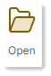
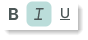
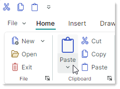

# Ribbon 概述

使用 `RibbonControl` 可以创建类似 Microsoft Office 应用程序中的功能区（ribbon）菜单。`RibbonControl` 是一个工具栏，它将命令和其他元素组织到一系列页面（选项卡）中。页面由若干组组成，而组又显示 Ribbon 元素（命令、内嵌编辑器、标签、元素库等）。


## Ribbon 视觉元素

`RibbonControl` 由以下元素组成：

- [页面](pages.md)——Ribbon 页面允许您创建选项卡。您可以根据需要添加任意数量的页面。至少必须创建一个页面。

    每个页面显示一个或多个元素组。

- [页面组](page-groups.md)——Ribbon 组提供了一种在页面内以逻辑方式组合元素集合的方法。组之间用竖线分隔。

- [Application Button](application-button-and-main-menu.md)——此按钮会调用一个下拉式应用程序菜单，该菜单通常包含用于处理文件的命令。

  

    如果启用，Application Button 会显示在页面标题之前。

- [快速访问工具栏](quick-access-toolbar.md)——此工具栏提供对常用命令的访问。用户可以通过上下文菜单将命令添加到此工具栏。

  

  快速访问工具栏可以显示在 Ribbon 页面的上方或下方。

- [页面标题元素](page-header-items.md)——您可以在 Ribbon 的右边缘显示元素，与页面标题对齐。存储这些元素的集合称为页面标题元素。

- [Ribbon 命令布局选择按钮](ribbon-command-layouts.md)——此按钮显示一个菜单，允许用户在经典和简化 Ribbon 命令布局之间切换。

  
  

  `Classic`（经典）命令布局将 Ribbon 元素排列为三行：

  


  `Simplified`（简化）布局使用一行元素：

  

  有关更多信息，请参阅 [Ribbon 命令布局](ribbon-command-layouts.md)。


## 演示 

有关演示 `RibbonControl` 功能的示例，请参阅 Eremex Controls Demo 应用程序。

## 创建 Ribbon 界面

简而言之，创建 Ribbon 界面包括以下几个阶段：

1. 创建 `RibbonControl`。
2. 向 Ribbon 添加 Ribbon 页面（选项卡）。
3. 向页面添加 Ribbon 页面组。
4. 向页面组添加 Ribbon 元素（命令、元素库等）。

您还可以将 Ribbon 元素添加到[页面标题区域](page-header-items.md)、[快速访问工具栏](quick-access-toolbar.md)、弹出菜单和子菜单中。

### 定义 RibbonControl

`RibbonControl` 是一个功能丰富的工具栏。与[传统工具栏](../toolbars-and-menus/index.md)一样，`RibbonControl` 由 `ToolbarManager` 组件管理。

!!! tip

    `ToolbarManager` 组件不仅可以管理 `RibbonControl`。您可以使用此组件为控件创建[传统工具栏](../toolbars-and-menus/index.md)（例如状态栏）和[上下文菜单](../toolbars-and-menus/popup-and-context-menus.md)。

要创建 `RibbonControl`，请在 `ToolbarManager` 组件内定义它。

``` xml
<mxb:ToolbarManager IsWindowManager="True">
    <mxr:RibbonControl Name="ribbon1">
      <!-- ... -->
    </mxr:RibbonControl>
</mxb:ToolbarManager>
```

### 定义和访问 Ribbon 页面

Ribbon [页面](pages.md)（选项卡）由 `RibbonPage` 类封装。

要在 XAML 中添加 Ribbon 页面，请将 **&lt;RibbonPage&gt;** 对象定义为 **&lt;RibbonControl&gt;** 标签的内容。要在后台代码（code-behind）中添加和访问 Ribbon 页面，请使用 `RibbonControl.Pages` 集合。

``` xml
<mxb:ToolbarManager IsWindowManager="True">
    <mxr:RibbonControl>
      <mxr:RibbonPage Header="Home" KeyTip="H"> 
        <!-- ... -->
      </mxr:RibbonPage>
      <mxr:RibbonPage Header="View" KeyTip="V">
        <!-- ... -->
      </mxr:RibbonPage>
      <mxr:RibbonPage Header="Design" KeyTip="S">
        <!-- ... -->
      </mxr:RibbonPage>
    </mxr:RibbonControl>
</mxb:ToolbarManager>
```


### 定义和访问 Ribbon 页面组

Ribbon [页面组](page-groups.md)由 `RibbonPageGroup` 类封装。它们是 Ribbon 页面的子元素。

要在 XAML 中创建页面组，请将 **&lt;RibbonPageGroup&gt;** 对象定义为 **&lt;RibbonPage&gt;** 元素的内容。要在后台代码中添加和访问页面组，请使用 `RibbonPage.Groups` 集合。

``` xml
<mxr:RibbonPage Header="Home" KeyTip="H" Name="pageHome">
  <mxr:RibbonPageGroup Header="File" IsHeaderButtonVisible="True">
    <!-- ... -->
  </mxr:RibbonPageGroup>
  <mxr:RibbonPageGroup Header="Clipboard" IsHeaderButtonVisible="True">
    <!-- ... -->
  </mxr:RibbonPageGroup>
  <mxr:RibbonPageGroup Header="Font" IsHeaderButtonVisible="True">
    <!-- ... -->
  </mxr:RibbonPageGroup>
</mxr:RibbonPage>
```

### 定义 Ribbon 元素（命令、子菜单、元素库等）

Ribbon 元素是可以添加到 Ribbon 界面（Ribbon 页面组、快速访问工具栏和页面标题元素集合）中的基本元素。它们包括：

- 按钮（`ToolbarButtonItem`）——常规按钮或下拉按钮。

  常规按钮在被点击时执行命令（`ToolbarButtonItem.Command`）并触发事件（`Click` 和 `Press`）。
  
  

  您还可以将下拉控件与按钮关联。当用户点击按钮或内置的向下箭头时，将显示此控件。

  

  Ribbon 控件允许您指定按钮的显示大小。您可以使用附加属性 `RibbonControl.DisplayMode` 在大尺寸、带文本的小尺寸和不带文本的小尺寸之间进行选择。

    

- 复选按钮（`ToolbarCheckItem`）——支持两种状态（正常和按下）的按钮。按钮的状态由 `ToolbarCheckItem.IsChecked` 属性指定。当选中状态发生变化时，会触发 `ToolbarCheckItem.CheckedChanged` 事件。

  

- 子菜单（`ToolbarMenuItem`）——点击时显示子菜单。

  
  
- 内嵌编辑器（`ToolbarEditorItem`）——显示由 `ToolbarEditorItem.EditorProperties` 属性指定的内嵌编辑器。例如，您可以在 Ribbon 界面中嵌入 [SpinEditor](../editors/spineditor.md) 或 [TextEditor](../editors/texteditor.md)。

  

- 文本标签（`ToolbarTextItem`）——显示由 `ToolbarTextItem.Header` 属性指定的静态文本。

  

- 元素组（`ToolbarItemGroup`）——不可拆分的元素组。

  
 
  Ribbon 的自适应布局功能会在控件调整大小时自动折叠和恢复元素。组作为一个整体运作。调整 Ribbon 大小时，只能折叠整个组，而不能折叠其中的单个元素。

- 复选按钮组（`ToolbarCheckItemGroup`）——不可拆分的复选按钮组（`ToolbarCheckItem` 对象）。`ToolbarCheckItemGroup` 类允许您创建互斥元素组（单选组），以及允许同时选中多个元素的组。

  

- 分隔符（`ToolbarSeparatorItem`）——在 Ribbon 元素之间显示分隔符。

  

- 元素库（`RibbonGalleryItem`）——元素的库。使用 `RibbonGalleryItem.ItemsSource` 属性指定要渲染为库项的对象列表。

  

  内嵌于 Ribbon 中的元素库具有一个下拉按钮，可激活元素库的下拉视图。下拉元素库可以在底部显示由 `RibbonGalleryItem.DropDownItems` 属性指定的其他命令。

  
  

以上列出的所有 Ribbon 元素都是 `ToolbarItem` 类的派生类。
它们同样可以添加到传统工具栏和上下文菜单中。


要将元素添加到 Ribbon 页面组，请在 **&lt;RibbonPageGroup&gt;** 的开始和结束标签之间定义相应的 Ribbon 元素。要在后台代码中添加和访问 Ribbon 元素，请使用 `RibbonPageGroup.Items` 集合。

以下代码片段将四个常规按钮（`ToolbarButtonItem` 对象）添加到 _Clipboard_ 组中。完整代码请参见 _WordPad Example_ 演示。



``` xml
<mxr:RibbonPageGroup Header="Clipboard" IsHeaderButtonVisible="True">
    <mxb:ToolbarButtonItem Header="Paste" KeyTip="PA" Glyph="{x:Static icons:Basic.Paste}"
                           mxr:RibbonControl.DisplayMode="Large"
                           DropDownArrowVisibility="ShowSplitArrow">
        <mxb:ToolbarButtonItem.DropDownControl>
            <mxb:PopupMenu>
                <mxb:ToolbarButtonItem Header="Paste Special" KeyTip="PS" 
                  Glyph="{x:Static icons:Basic.Paste}" 
                  Command="{Binding PasteSpecialCommand}"/>
                <mxb:ToolbarButtonItem Header="Set Default Paste..." KeyTip="SP" 
                  Command="{Binding SetDefaultPasteCommand}"
                />
            </mxb:PopupMenu>
        </mxb:ToolbarButtonItem.DropDownControl>
    </mxb:ToolbarButtonItem>
    <mxb:ToolbarButtonItem Header="Cut" KeyTip="CT"
                           Glyph="{x:Static icons:Basic.Cut}" Command="{Binding CutCommand}"/>
    <mxb:ToolbarButtonItem Header="Copy" KeyTip="CP"
                           Glyph="{x:Static icons:Basic.Copy}" Command="{Binding CopyCommand}"/>
    <mxb:ToolbarButtonItem Header="Paste" KeyTip="P"
                           Glyph="{x:Static icons:Basic.Paste}" Command="{Binding PasteCommand}"/>
</mxr:RibbonPageGroup>
```

有关更多信息，请参阅以下主题：

- [Ribbon 元素](ribbon-items.md)
- [元素库](galleries.md)


## MVVM 设计模式支持

Ribbon 控件支持 MVVM 设计模式，允许您根据在视图模型（View Model）中定义的业务对象集合来创建页面、页面组和元素（在页面组、快速访问工具栏和页面标题区域中）。以下属性支持 MVVM 设计模式：

- `RibbonControl.PagesSource`——用于填充 Ribbon 控件页面的业务对象集合。相应的数据模板应定义 `RibbonPage` 对象。
- `RibbonPage.GroupsSource`——用于填充 Ribbon 页面中组的业务对象集合。相应的数据模板应定义 `RibbonPageGroup` 对象。
- `RibbonPageGroup.ItemsSource`——用于在页面组中创建 Ribbon 元素的业务对象集合。相应的数据模板应定义 [Ribbon 元素](ribbon-items.md)。
- `RibbonControl.QuickAccessToolbarItemsSource`——用于在[快速访问工具栏](quick-access-toolbar.md)中创建 Ribbon 元素的业务对象集合。相应的数据模板应定义 [Ribbon 元素](ribbon-items.md)。
- `RibbonControl.PageHeaderItemsSource`——用于创建[页面标题元素](page-header-items.md)的业务对象集合。相应的数据模板应定义 [Ribbon 元素](ribbon-items.md)。
- `ToolbarMenuItem.ItemsSource`——用于填充子菜单元素的业务对象集合。相应的数据模板应定义 Ribbon 元素。


<br>
<br>

<sup>*</sup> 本页面使用机器翻译技术翻译。
