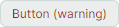
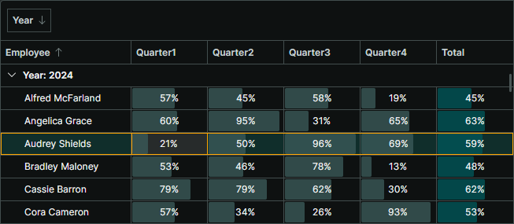

# 修改控件主题

Avalonia UI 中的控件主题（control theme）是一组样式、[控件主题](https://docs.avaloniaui.net/docs/basics/user-interface/styling/control-themes)和资源的集合，用于定义控件的模板和外观设置。

本主题介绍了如何为项目中单个 Eremex 控件或所有 Eremex 控件修改主题设置和样式。

## 默认主题

_Eremex.Avalonia.Themes.DeltaDesign_ 主题目前是 Eremex 控件的默认主题。要使用 Eremex Controls 库，您需要在项目中包含此主题，并在 _App.axaml_ 文件中[注册](register-an-eremex-paint-theme.md)它。否则，Eremex 控件将显示为空白。

要修改特定的主题设置（例如控件元素的颜色或模板），请参阅主题的源代码。您可以在 GitHub 上找到并下载它：[Eremex Controls Themes](https://github.com/Eremex/controlthemes)。

修改主题设置涉及两个步骤：

- 确定需要覆盖的目标主题设置（样式、资源或模板）。
- 为所有控件或单个控件修改目标主题设置。

<!-- To override a resource in your application, you must know the key of this resource. -->

## 概念：定位目标样式、资源或模板

您可以浏览主题的源代码，以确定要修改的主题设置。

下图展示了 _DeltaDesign_ 主题源代码的结构：


- _Controls_ 文件夹 — 包含 Eremex 控件和标准 Avalonia UI 控件的主题文件。
- _Charts_ 文件夹 — 包含 Eremex 图表控件的主题文件。
- _Variants_ — 包含 `Light` 和 `Dark` 主题变体的定义。

在这些文件中，主题设置（模板、颜色、边距等）被定义为动态资源或静态资源。

### 在 Eremex 视觉主题中声明动态资源

依赖于主题变体（Light 或 Dark）的主题设置被定义为动态资源（`DynamicResource`）。这些主题设置包括 Eremex 控件的大多数颜色。

以下代码片段展示了一个样式选择器，它在 TreeList 控件中设置 `ColumnHeaderControl.Foreground` 属性。该属性决定了 TreeList 列标题的前景色。`ColumnHeaderControl.Foreground` 属性的值绑定到键为 **Text/Neutral/Secondary** 的动态资源。

``` xml
<!-- Eremex.Avalonia.Themes.DeltaDesign\Controls\TreeListControl.axaml -->
<Styles ...>
    <Style Selector="mxdcv|ColumnHeaderControl">
        <Setter Property="Foreground" Value="{DynamicResource Text/Neutral/Secondary}" />
        <!-- ... -->
    </Style>
</Styles>
```

**Text/Neutral/Secondary** 资源在 Light 和 Dark 主题变体中具有不同的值：

``` xml
<!-- Eremex.Avalonia.Themes.DeltaDesign\Variants\Light\Colors.axaml file -->
<SolidColorBrush x:Key="Text/Neutral/Secondary" Color="#ff424d4d"/>

<!-- Eremex.Avalonia.Themes.DeltaDesign\Variants\Dark\Colors.axaml file -->
<SolidColorBrush x:Key="Text/Neutral/Secondary" Color="#ffc6d2d2"/>
```

**Text/Neutral/Secondary** 资源被多个控件使用。您可以在主题源代码中搜索此键，以查找它的所有引用。

视觉主题将 Light 和 Dark 主题变体的资源组织到两个资源字典中：

- 键为 **"Default"** 的资源字典 — 汇集与 Light 主题变体相关的资源。参见 _Eremex.Avalonia.Themes.DeltaDesign\Variants\Light\Variant.axaml_ 文件。
- 键为 **"Dark"** 的资源字典 — 汇集与 Dark 主题变体相关的资源。参见 _Eremex.Avalonia.Themes.DeltaDesign\Variants\Dark\Variant.axaml_ 文件。

要在项目中为特定主题变体覆盖动态资源，您必须知道其对应字典的键（"Default" 或 "Dark"）。

### 在 Eremex 视觉主题中声明静态资源

许多主题设置在 Light 和 Dark 主题变体中是相同的。这些设置被定义为静态资源（`StaticResource`）。它们包括：

- 布局设置（例如 UI 元素的大小和边距）
- 用于渲染内部元素和上下文菜单的模板


例如，_Eremex.Avalonia.Themes.DeltaDesign\Controls\TreeListControl.axaml_ 文件包含 TreeList 控件的主题设置。在该文件中，TreeList 列标题的字体大小被定义为键为 **"ColumnHeaderFontSize"** 的静态资源。

``` xml
<!-- Eremex.Avalonia.Themes.DeltaDesign\Controls\TreeListControl.axaml file -->
<Styles ...>
    <Style Selector="mxdcv|ColumnHeaderControl">
        <Setter Property="FontSize" Value="{StaticResource ColumnHeaderFontSize}" />
        <!-- ... -->
    </Style>

    <Styles.Resources>
        <x:Double x:Key="ColumnHeaderFontSize">12</x:Double>
    </Styles.Resources>
</Styles>
```

### 使用样式类进行样式设置

_DeltaDesign_ 主题包含[控件主题](https://docs.avaloniaui.net/docs/basics/user-interface/styling/control-themes)和样式选择器，它们针对 Eremex 控件和标准 Avalonia 控件的特定[样式类](https://docs.avaloniaui.net/docs/basics/user-interface/styling/style-classes)。
当您为控件指定特定的_样式类_（使用控件的 `Classes` 属性）时，主题会应用相应的样式选择器。
 
例如，要用不同的边框颜色突出显示 CheckBox，请应用 `warning` _样式类_：

``` xml
<CheckBox Content="Important" Classes="warning"/>
```


在 _DeltaDesign_ 主题中，带有 `warning` _样式类_的 CheckBox 的样式选择器定义如下：

``` xml
<!-- Eremex.Avalonia.Themes.DeltaDesign\Controls\StandardControls\CheckBox.axaml -->

<ControlTheme x:Key="{x:Type CheckBox}" TargetType="CheckBox">
    <!-- Warning State -->
    <Style Selector="^.warning /template/ Border#NormalRectangle">
        <Setter Property="BorderBrush" Value="{DynamicResource CheckBoxWarningRectBorderBrush}" />
    </Style>
    <!-- ... -->
</ControlTheme>
```

以下是 _DeltaDesign_ 主题自定义的主要_样式类_：

- `accent` — 强调外观设置。

    - 目标标准 Avalonia 控件：Button 和 RepeatButton。

    

- `warning` — 用于表示警告和错误的外观设置。

    - 目标标准 Avalonia 控件：Button、RepeatButton、CheckBox 和 RadioButton。

    

    您可以组合使用 `accent` 和 `warning` 样式类：

    

- `secondary` — 用于在灰色背景上显示的控件的外观设置。

    - 目标 Eremex 控件：带内置文本框的编辑器（TextEditor、ButtonEditor、ComboBoxEditor、SpinEditor、DateEditor 等）以及 SegmentedEditor。
    
    - 目标标准 Avalonia 控件：TextBox、Button、RepeatButton、ToggleButton、CheckBox、ProgressBar、RadioButton 和 Slider。

    


## 修改共享动态资源

多个控件可以使用同一个动态资源。
要为整个应用程序中的所有目标控件修改共享资源，请使用 `Application.Resources` 属性在应用程序级别覆盖该资源。
要仅在特定窗口内应用更改，请改用 `Window.Resources` 属性。

### 示例 — 为应用程序中 Light 和 Dark 主题变体修改控件的聚焦行边框画刷

假设您需要修改整个应用程序中用于绘制 DataGrid、TreeList 和 ListView 控件中聚焦行边框的画刷。新画刷在 Light 和 Dark 主题变体中应具有不同的值。

默认视觉主题将聚焦行的边框画刷定义为键为 **Outline/Accent/Focus** 的动态资源。

``` xml
<!-- Eremex.Avalonia.Themes.DeltaDesign\Controls\DataGridControl.axaml file -->
<Style Selector="mxdgv|DataGridRowControl:focusedState /template/ Border#FocusBorder, mxdgv|DataGridRowControl:focusedAndSelectedState /template/ Border#FocusBorder">
    <!-- ... -->
    <Setter Property="BorderBrush" Value="{DynamicResource Outline/Accent/Focus}" />
</Style>

<!-- Eremex.Avalonia.Themes.DeltaDesign\Controls\ListViewControl.axaml -->
<Style Selector="mxl|ListViewGroupControl:focus-visible/template/Rectangle#PART_Border">
    <Setter Property="Stroke" Value="{DynamicResource Outline/Accent/Focus}"/>
</Style>

<!-- Eremex.Avalonia.Themes.DeltaDesign\Controls\TreeListControl.axaml -->
<Style Selector="mxtlv|TreeListRowControl:focusedState /template/ Border#FocusBorder, mxtlv|TreeListRowControl:focusedAndSelectedState /template/ Border#FocusBorder">
	<Setter Property="BorderThickness" Value="1" />
	<Setter Property="BorderBrush" Value="{DynamicResource Outline/Accent/Focus}" />
</Style>
```

<!-- TODO
Update the declaration of style selectors above when DataGrid moves to ControlThemes 
 -->


在默认主题中，**Outline/Accent/Focus** 资源在 Light 和 Dark 主题变体中具有不同的值：

``` xml
<!-- Eremex.Avalonia.Themes.DeltaDesign\Variants\Light\Colors.axaml file -->
<ResourceDictionary xmlns="https://github.com/avaloniaui" 
  xmlns:x="http://schemas.microsoft.com/winfx/2006/xaml">
    <!-- ... -->
    <SolidColorBrush x:Key="Outline/Accent/Focus" Color="#ff129190"/>
</ResourceDictionary>

<!-- Eremex.Avalonia.Themes.DeltaDesign\Variants\Dark\Colors.axaml file -->
<ResourceDictionary xmlns="https://github.com/avaloniaui" 
  xmlns:x="http://schemas.microsoft.com/winfx/2006/xaml">
    <!-- ... -->
    <SolidColorBrush x:Key="Outline/Accent/Focus" Color="#ff36afb0"/>
</ResourceDictionary>
```


要在您的应用程序中为 Light 和 Dark 主题变体修改此资源，请执行以下步骤：

1. 在项目中的 "Resources" 文件夹内创建 "ModifiedResources.axaml" 文件。

2. 在该文件中，定义两个键分别为 **"Default"** 和 **"Dark"** 的资源字典（分别对应 Light 和 Dark 主题变体）。

``` xml
<ResourceDictionary xmlns="https://github.com/avaloniaui"
                    xmlns:x="http://schemas.microsoft.com/winfx/2006/xaml">
    <ResourceDictionary.ThemeDictionaries>

        <!-- Override resources for the Light theme variant -->
        <ResourceDictionary x:Key="Default">
            
        </ResourceDictionary>

        <!-- Override resources for the Dark theme variant -->
        <ResourceDictionary x:Key="Dark">
            
        </ResourceDictionary>
        
    </ResourceDictionary.ThemeDictionaries>   
</ResourceDictionary>
```

3. 在 **"Default"** 和 **"Dark"** 资源字典中为 **Outline/Accent/Focus** 资源定义新值：

``` xml
<ResourceDictionary xmlns="https://github.com/avaloniaui"
                    xmlns:x="http://schemas.microsoft.com/winfx/2006/xaml">
    <ResourceDictionary.ThemeDictionaries>

        <!-- Override resources for the Light theme variant -->
        <ResourceDictionary x:Key="Default">
            <SolidColorBrush x:Key="Outline/Accent/Focus" Color="Blue"/>
        </ResourceDictionary>

        <!-- Override resources for the Dark theme variant -->
        <ResourceDictionary x:Key="Dark">
            <SolidColorBrush x:Key="Outline/Accent/Focus" Color="Orange"/>
        </ResourceDictionary>
        
    </ResourceDictionary.ThemeDictionaries>   
</ResourceDictionary>
```

4. 在您的 `App.axaml` 文件中，将 "Resources/ModifiedResources.axaml" 文件中的资源合并到应用程序的资源中。

``` xml
<Application ...>
    <Application.Resources>
        <ResourceDictionary>
            <ResourceDictionary.MergedDictionaries>
                <ResourceInclude Source="/Resources/ModifiedResources.axaml"/>
            </ResourceDictionary.MergedDictionaries>
        </ResourceDictionary>
    </Application.Resources>
</Application>
```

5. 运行应用程序以查看结果。
当浅色主题变体处于活动状态时，聚焦行边框绘制为蓝色。
当应用深色主题变体时，使用橙色。




## 为特定控件修改主题资源

您可以使用控件的 `Resources` 属性来仅为该控件更改特定资源。
此修改不会影响其他控件。

### 示例 — 修改单个 Button 在按下和聚焦状态下的颜色

_DeltaDesign_ 主题包含[控件主题](https://docs.avaloniaui.net/docs/basics/user-interface/styling/control-themes)和样式选择器，用于调整标准 Avalonia UI 控件的颜色，使其在与 Eremex 控件位于同一窗口时外观保持一致。

下图展示了标准 Button 控件在按下状态下由 _DeltaDesign_ 主题绘制的默认外观：


在按下状态下，应用了以下样式选择器：

``` xml
<!-- Eremex.Avalonia.Themes.DeltaDesign\Controls\StandardControls\Button.axaml -->
<ControlTheme x:Key="{x:Type Button}" TargetType="Button">
    <!-- Pressed State -->
    <Style Selector="^:pressed">
        <Style Selector="^ /template/ Border#PART_BackgroundBorder">
            <Setter Property="Background" Value="{DynamicResource ButtonBackgroundPressed}" />
        </Style>
        <Style Selector="^  /template/ ContentPresenter#PART_ContentPresenter">
            <Setter Property="Foreground" Value="{DynamicResource ButtonForegroundPressed}" />
            <Setter Property="Opacity" Value="0.8"/>
        </Style>
    </Style>
    <!--Focus Border-->
    <Style Selector="^:focus /template/ Border#PART_ButtonBorder">
        <Setter Property="BorderBrush" Value="{DynamicResource ButtonFocusBorderBrush}" />
        <Setter Property="BorderThickness" Value="{StaticResource EditorBorderThickness}"/>
    </Style>
    <!-- ... -->
</ControlTheme>
```

要更改单个 Button 在按下和聚焦状态下的颜色，请从 `Button.Resources` 属性中修改 `ButtonBackgroundPressed`、`ButtonForegroundPressed` 和 `ButtonFocusBorderBrush` 资源。


``` xml
<Button Content="Simple Button" HorizontalAlignment="Center" >
    <Button.Resources>
        <SolidColorBrush x:Key="ButtonBackgroundPressed" Color="LightSeaGreen" />
        <SolidColorBrush x:Key="ButtonForegroundPressed" Color="Snow" />
        <SolidColorBrush x:Key="ButtonFocusBorderBrush" Color="SlateGray" />
    </Button.Resources>
</Button>
```


## 为窗口内的控件修改主题资源

您可以从 `Window.Resources` 属性修改主题资源，以将主题修改应用于该窗口内的相应控件。

### 示例 — 为窗口内 Light 和 Dark 主题变体修改强调按钮

_DeltaDesign_ 主题包含特定的样式选择器，当您为标准 Avalonia Button 控件设置 `accent` 和/或 `warning` 样式类时会应用这些选择器。此示例展示了如何为 Light 和 Dark 主题变体覆盖窗口中强调按钮的外观设置。

您可以应用 `accent` 和 `warning` 样式类来突出显示按钮：

``` xml
<Button Content="Warning&amp;Accent Button" Classes="warning accent"/>
```


请参阅 _Eremex.Avalonia.Themes.DeltaDesign\Controls\StandardControls\Button.axaml_ 文件，以查看应用于强调按钮在正常、悬停、按下和禁用状态下的样式选择器。下面的代码片段展示了强调按钮正常状态下的两个样式选择器：

``` xml
<!-- Eremex.Avalonia.Themes.DeltaDesign\Controls\StandardControls\Button.axaml file -->
<ControlTheme x:Key="{x:Type Button}" TargetType="Button">
    <!-- WarningAccent style -->
    <Style Selector="^.warning.accent">
        <Style Selector="^ /template/ Border#PART_BackgroundBorder">
            <Setter Property="Background" Value="{DynamicResource ButtonWarningAccentBackground}" />
        </Style>
        <Style Selector="^ /template/ ContentPresenter#PART_ContentPresenter">
            <Setter Property="Foreground" Value="{DynamicResource ButtonWarningAccentForeground}" />
        </Style>
        <!-- ... -->
    </Style>
    <!-- ... -->
</ControlTheme>
```

使用 `Window.Resources` 属性在窗口级别为 Light 和 Dark 主题变体覆盖强调按钮的背景颜色。以下代码在 `Default`（Light）和 `Dark` 资源字典中覆盖了相应的主题资源：

``` xml
<mx:MxWindow 
    xmlns:mx="https://schemas.eremexcontrols.net/avalonia">

    <mx:MxWindow.Resources>
        <ResourceDictionary>
            <ResourceDictionary.ThemeDictionaries>
                <!--Resources for the Light theme variant-->
                <ResourceDictionary x:Key="Default">
                    <SolidColorBrush x:Key="ButtonWarningAccentBackground" Color="Purple" />
                </ResourceDictionary>

                <!--Resources for the Dark theme variant-->
                <ResourceDictionary x:Key="Dark">
                    <SolidColorBrush x:Key="ButtonWarningAccentBackground" Color="LightYellow" />
                </ResourceDictionary>
            </ResourceDictionary.ThemeDictionaries>
        </ResourceDictionary>
    </mx:MxWindow.Resources>
    <!-- ... -->
</mx:MxWindow>
```


您还可以修改按钮其他状态的画刷：

- 悬停 — `ButtonWarningAccentBackgroundPointerOver` 和 `ButtonWarningAccentForegroundPointerOver`
- 按下 — `ButtonWarningAccentBackgroundPressed` 和 `ButtonWarningAccentForegroundPressed`
- 禁用 — `ButtonWarningAccentBackgroundDisabled` 和 `ButtonWarningAccentForegroundDisabled`。


## 修改 Eremex 视觉主题中定义的控件样式

当您浏览 _DeltaDesign_ 视觉主题源代码时，会发现不仅改变颜色和画刷，还会改变控件其他外观设置的样式选择器。这些包括内部元素的大小以及定义布局和内容的控件模板。

您可以使用以下属性在应用程序中覆盖这些样式选择器：

- `Application.Styles` — 应用于整个应用程序中控件的样式集合。
- `Window.Styles` — 应用于窗口内控件的样式集合。
- `Control.Styles` — 应用于特定控件的样式集合。


### 示例 — 在应用程序级别修改 ColorEditor 控件中颜色切换按钮的样式

此示例展示了如何更改 `ColorEditor` 和 [PopupColorEditor](../editors/popupcoloreditor.md) 控件中颜色切换按钮的外观和模板。新样式将应用于应用程序中所有 `ColorEditor` 和 `PopupColorEditor` 控件。


首先，在 _DeltaDesign_ 主题源代码中找到颜色切换按钮的默认样式。

``` xml
<!-- Eremex.Avalonia.Themes.DeltaDesign\Controls\Editors\ColorEditor.axaml -->
<!--Color Toggle Button-->
<ControlTheme x:Key="{x:Type mxev:ColorToggleButton}" TargetType="mxev:ColorToggleButton">
    <Setter Property="CornerRadius" Value="{StaticResource EditorCornerRadius}"/>
    <Setter Property="BorderThickness" Value="{StaticResource EditorBorderThickness}"/>
    <Setter Property="Width" Value="{StaticResource ColorButtonDefaultSize}"/>
    <!-- ... -->
    <Setter Property="Template">
        <ControlTemplate>
            <Border x:Name="PART_ExternalBorder"
                    CornerRadius="{TemplateBinding CornerRadius}"
                    BorderThickness="{TemplateBinding BorderThickness}"
                    ...>
                <Border x:Name="PART_InternalBorder"
                        CornerRadius="{TemplateBinding CornerRadius}"
                        BorderThickness="{TemplateBinding BorderThickness}"
                        ...>
                    <Path x:Name="PART_CheckGlyph"
                            Stretch="None"
                            Fill="{Binding $parent[mxev:ColorToggleButton].BorderBrush}"
                            Data="{StaticResource CheckBoxCheckIcon}"
                            .../>
                </Border>
            </Border>
        </ControlTemplate>
    </Setter>
</ControlTheme>
```

按照以下步骤在应用程序级别更改颜色切换按钮的外观：

1. 在项目的 "Resources" 文件夹内创建 "ModifiedStyles.axaml" 文件。

2. 将以下代码添加到 "ModifiedStyles.axaml" 文件中。此代码覆盖了 `ColorToggleButton` 类的样式

``` xml
<Styles xmlns="https://github.com/avaloniaui"
        xmlns:x="http://schemas.microsoft.com/winfx/2006/xaml"
        xmlns:mxev="clr-namespace:Eremex.AvaloniaUI.Controls.Editors.Visuals;assembly=Eremex.Avalonia.Controls">
    <Styles.Resources>
        <RectangleGeometry x:Key="ColorCheckedIcon" Rect="0,0,7,7" />
    </Styles.Resources>
    
    <Style Selector="mxev|ColorToggleButton">
        <Setter Property="CornerRadius" Value="3"/>
        <Setter Property="Template">
            <ControlTemplate>
                <Border x:Name="PART_ExternalBorder"
                                CornerRadius="{TemplateBinding CornerRadius}"
                                BorderThickness="2"
                                BorderBrush="LightSteelBlue"
                                Background="{TemplateBinding Background}">
                    <Border x:Name="PART_InternalBorder"
                                    CornerRadius="{TemplateBinding CornerRadius}"
                                    BorderThickness="{TemplateBinding BorderThickness}"
                                    BorderBrush="{TemplateBinding BorderBrush}"
                                    Background="{TemplateBinding Background}">
                        <Path x:Name="PART_CheckGlyph"
                                    Stretch="None"
                                    VerticalAlignment="Center"
                                    HorizontalAlignment="Center"
                                    Data="{StaticResource ColorCheckedIcon}"
                                    Margin="0"
                                    Width = "7"
                                    Height="7"
                        />
                    </Border>
                </Border>
            </ControlTemplate>
        </Setter>
    </Style>
</Styles>
```

3. 在 `App.axaml` 文件中，将 "Resources/ModifiedStyles.axaml" 文件中的样式合并到 `Application.Styles` 集合中。

``` xml
<Application ...>
    <Application.Styles>
        <theme:DeltaDesignTheme/>
        <StyleInclude Source="/Resources/ModifiedStyles.axaml"/>
    </Application.Styles>
</Application>
```

4. 运行应用程序以查看结果。


<br>
<br>

<sup>*</sup> 本页面使用机器翻译技术翻译。
