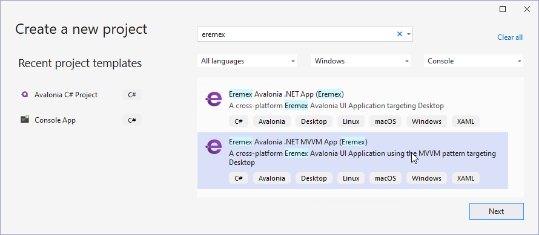
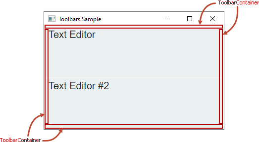
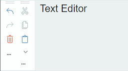
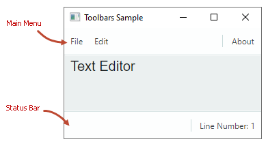
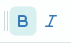
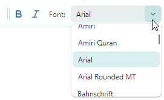
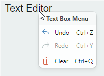
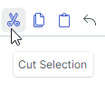
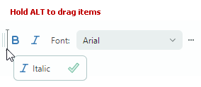

# 工具栏入门

本教程演示如何使用 Eremex Toolbars 库从头开始创建工具栏 UI。教程介绍了用于实现工具栏 UI 的控件，并演示了主要的工具栏设置。


本教程为放置在窗口中央的两个文本编辑器创建一个工具栏 UI。工具栏 UI 由主菜单、状态栏，以及显示各种项目的常规工具栏组成：按钮、检查按钮、内嵌编辑器、子菜单和文本项目。

除其中一个工具栏外，所有工具栏都停靠在窗口的边缘。这些工具栏包含与第一个文本编辑器配合使用的命令。一个工具栏（独立工具栏）放置在两个文本编辑器之间，为第二个文本编辑器提供命令。

本教程还展示了如何将文本编辑器与 Toolbars&Menu 库中的上下文菜单关联起来。

## 1. 创建新项目

请确保您已安装 [Eremex Avalonia Templates](../../whats-included/project-templates.md)，它可以简化使用 Eremex 控件创建 Avalonia UI 项目的过程。从 `Eremex Avalonia .NET MVVM App` 模板创建一个新项目，并将其命名为 "Bars-sample"。



该模板会将包含 Eremex 控件和 DeltaDesign [视觉主题](../themes/index.md) 的程序集添加到创建的项目中，并[注册](../themes/register-an-eremex-paint-theme.md)该视觉主题以供使用。

## 2. 添加 ToolbarManager 组件

首先在 XAML 中定义 `ToolbarManager` 组件。

``` xml
<mx:MxWindow ...
    xmlns:mx="https://schemas.eremexcontrols.net/avalonia"
    xmlns:mxb="https://schemas.eremexcontrols.net/avalonia/bars"
    xmlns:mxe="https://schemas.eremexcontrols.net/avalonia/editors"
    xmlns:vm="using:Bars_sample.ViewModels"
    xmlns:view="clr-namespace:Bars_sample.Views"
    Title="Toolbars Sample"
    >

    <mx:MxWindow.DataContext>
        <vm:MainWindowViewModel/>
    </mx:MxWindow.DataContext>

    <mxb:ToolbarManager IsWindowManager="True">
        <Grid RowDefinitions="Auto, *, Auto, *, Auto" ColumnDefinitions="Auto, *, Auto">
            <TextBox Grid.Row="1" Grid.Column="1" x:Name="textBox1"  
            Text="Text Editor" AcceptsReturn="True"/>
            <TextBox x:Name="textBox2"  Grid.Row="3" Grid.Column="1" 
            Text="Text Editor #2" AcceptsReturn="True"/>
        </Grid>
    </mxb:ToolbarManager>            
</mx:MxWindow>
```

`ToolbarManager` 是管理工具栏、上下文菜单和菜单项的主要组件。该组件处理键盘快捷键，调用与相应项关联的命令，维护工具栏在运行时的自定义设置，并执行工具栏 UI 的序列化和反序列化。

`ToolbarManager` 组件应该包装为其创建工具栏 UI 的客户端控件（多个控件）。


## 3. 创建工具栏容器

要允许工具栏停靠在窗口/UserControl 中的特定位置，请先创建一个工具栏容器（`ToolbarContainerControl`）。工具栏容器是一种控件，用于在停靠状态下显示工具栏，并维护工具栏的拖放操作。

在 XAML 中，沿窗口的顶部、底部、左侧和右侧边缘创建四个工具栏容器（`ToolbarContainerControl` 对象）。这样您就可以将工具栏停靠在这些位置。



``` xml
xmlns:mxb="https://schemas.eremexcontrols.net/avalonia/bars"

<mxb:ToolbarManager IsWindowManager="True">
    <Grid RowDefinitions="Auto, *, Auto, *, Auto" ColumnDefinitions="Auto, *, Auto">
        <mxb:ToolbarContainerControl DockType="Top" Grid.ColumnSpan="3"/>

        <mxb:ToolbarContainerControl DockType="Left" Grid.Row="1" 
         Grid.Column="0" Grid.RowSpan="3" />

        <TextBox Grid.Row="1" Grid.Column="1" x:Name="textBox1"  
         Text="Text Editor" AcceptsReturn="True"/>
        <TextBox x:Name="textBox2"  Grid.Row="3" Grid.Column="1" 
         Text="Text Editor #2" AcceptsReturn="True"/>

        <mxb:ToolbarContainerControl DockType="Right" Grid.Row="1" 
         Grid.Column="2" Grid.RowSpan="3"/>

        <mxb:ToolbarContainerControl DockType="Bottom" 
         Grid.Row="4" Grid.ColumnSpan="3"/>
    </Grid>
</mxb:ToolbarManager>
```

### 工具栏容器选项

`ToolbarContainerControl` 的主要设置是 `ToolbarContainerControl.DockType`，它指定容器如何停靠到其父容器。您可以将 `DockType` 属性设置为 `Left`、`Right`、`Top`、`Bottom` 和 `Standalone`。

`DockType` 设置决定容器边框的可见性以及嵌套工具栏的默认对齐方式。例如，如果容器的 `DockType` 选项为 `Left`，则容器会在其右边缘绘制边框，并将嵌套的工具栏垂直排列。下图展示了 `DockType` 选项设置为 `Left` 的工具栏容器。子工具栏根据 `DockType` 设置垂直排列。



## 4. 创建工具栏

将工具栏（`Toolbar` 对象）添加到所需的工具栏容器中。


``` xml
xmlns:mxb="https://schemas.eremexcontrols.net/avalonia/bars"

<mxb:ToolbarManager IsWindowManager="True">
    <Grid RowDefinitions="Auto, *, Auto, *, Auto" ColumnDefinitions="Auto, *, Auto">
        <mxb:ToolbarContainerControl DockType="Top" Grid.ColumnSpan="3">
            <mxb:Toolbar x:Name="MainMenu" ToolbarName="Main Menu" DisplayMode="MainMenu">
            </mxb:Toolbar>

            <mxb:Toolbar x:Name="EditToolbar" ToolbarName="Edit" 
             ShowCustomizationButton="True">
            </mxb:Toolbar>

            <mxb:Toolbar x:Name="FontToolbar" ToolbarName="Font" 
             ShowCustomizationButton="True">
            </mxb:Toolbar>
        </mxb:ToolbarContainerControl>

        <mxb:ToolbarContainerControl DockType="Left" Grid.Row="1" 
         Grid.Column="0" Grid.RowSpan="3">
            <mxb:Toolbar x:Name="TextEditingToolbar" ToolbarName="Text Editing" 
             ShowCustomizationButton="True" >
            </mxb:Toolbar>
        </mxb:ToolbarContainerControl>
                
        <TextBox Grid.Row="1" Grid.Column="1" x:Name="textBox1"  Text="Text Editor" 
         AcceptsReturn="True" CornerRadius="0" FontFamily="Arial" FontSize="20"/>
        <TextBox x:Name="textBox2"  Grid.Row="3" Grid.Column="1" Text="Text Editor #2" 
         AcceptsReturn="True" CornerRadius="0" FontFamily="Arial" FontSize="20"/>

        <mxb:ToolbarContainerControl DockType="Right" Grid.Row="1" 
         Grid.Column="2" Grid.RowSpan="3"/>

        <mxb:ToolbarContainerControl DockType="Bottom" Grid.Row="4" Grid.ColumnSpan="3">
            <mxb:Toolbar DisplayMode="StatusBar" ToolbarName="Status Bar" x:Name="StatusBar">
            </mxb:Toolbar>
        </mxb:ToolbarContainerControl>
    </Grid>
</mxb:ToolbarManager>
```

上面的代码片段用工具栏填充了三个工具栏容器，并将一个工具栏容器留空。用户将能够在运行时把工具栏拖放到这四个工具栏容器中的任意一个。

### 指定主菜单和状态栏

要指明某个工具栏是主菜单还是状态栏，请分别将其 `Toolbar.DisplayMode` 属性设置为 `MainMenu` 和 `StatusBar`。

``` xml
<mxb:Toolbar x:Name="MainMenu" ToolbarName="Main Menu" DisplayMode="MainMenu">
</mxb:Toolbar>
```

主菜单和状态栏具有独特的外观设置和行为。例如，它们不包含拖动手柄，因此用户无法拖动它们。用户也无法在运行时隐藏主菜单和状态栏。



### 工具栏选项

`Toolbar` 对象公开了许多选项，用于自定义其视图、布局和行为设置。其中一些选项包括：

- `ToolbarName` — 工具栏的显示名称。工具栏名称显示在"自定义"窗口中，工具栏处于浮动状态时也会显示。
    
    
    
- `ShowCustomizationButton` — 指定用于激活自定义模式并打开"自定义"窗口的自定义按钮的可见性。
    
    

- `AllowDragToolbar` — 指定拖动手柄的可见性，该手柄使用户能够拖动工具栏。
    
    

- `DockType` — 该属性允许您在代码隐藏文件中将工具栏移动到特定的工具栏容器，或使工具栏处于浮动状态。
- `StretchToolbar` — 启用工具栏拉伸。在此模式下，同一行中不能显示其他工具栏。
- `WrapItems` — 为工具栏启用多行布局。


## 5. 创建工具栏项

下一步是用工具栏项填充工具栏：常规按钮、检查按钮、内嵌编辑器、子菜单和文本项目。工具栏项由派生自 `ToolbarItem` 类的类封装，该类公开了通用的工具栏项选项。

本教程将创建以下工具栏项：

### ToolbarButtonItem

一个常规按钮，用于触发由 `Command` 属性指定的命令。


``` xml
<mxb:Toolbar x:Name="EditToolbar" ToolbarName="Edit" ShowCustomizationButton="True"  >
    <mxb:ToolbarButtonItem Header="Cut" Command="{Binding #textBox1.Cut}" 
     IsEnabled="{Binding #textBox1.CanCut}" 
     Glyph="{SvgImage 'avares://Bars-sample/Images/Toolbars/EditCut.svg'}" 
     Category="Edit"/>
    <mxb:ToolbarButtonItem Header="Copy" Command="{Binding #textBox1.Copy}" 
     IsEnabled="{Binding #textBox1.CanCopy}" 
     Glyph="{SvgImage 'avares://Bars-sample/Images/Toolbars/EditCopy.svg'}" 
     Category="Edit"/>
</mxb:Toolbar>
```

#### 常用工具栏项选项

基础 `ToolbarItem` 类提供了所有工具栏项继承的通用选项。其中一些选项包括：

- `Alignment` — 项在工具栏中的对齐方式。
- `Category` — 项所属的类别。类别用于在"自定义"窗口中将项组织为逻辑分组。
- `Command` — 单击按钮时执行的命令。
- `CommandParameter` — 传递给指定命令的命令参数。
- `DisplayMode` — 获取是仅显示图形符号、标题，还是两者都显示。
- `Header` — 项的显示文本。
- `Glyph` — 项的图像。
- `GlyphAlignment` — 图形符号相对于项标题的对齐方式。
- `GlyphSize` — 图形符号的显示尺寸。
- `ShowSeparator` — 允许您在项之前显示分隔符。

#### 为 ToolbarButtonItem 分配下拉控件/菜单

您可以将下拉控件/菜单与 `ToolbarButtonItem` 对象关联起来。单击内置的下拉箭头或项本身即可激活下拉内容（有关详细信息，请参阅下面的 `DropDownArrowVisibility` 选项）。

下面让我们将_粘贴_按钮（`ToolbarButtonItem`）与一个下拉菜单关联起来。该下拉菜单将显示_粘贴_和_粘贴为_命令。


``` xml
<mxb:ToolbarButtonItem Header="Paste" Command="{Binding #textBox1.Paste}" 
 IsEnabled="{Binding #textBox1.CanPaste}" 
 Glyph="{SvgImage 'avares://Bars-sample/Images/Toolbars/EditPaste.svg'}" 
 Category="Edit">
    <mxb:ToolbarButtonItem.DropDownControl>
        <mxb:PopupMenu>
            <mxb:ToolbarButtonItem Header="Paste" Command="{Binding #textBox1.Paste}" 
             IsEnabled="{Binding #textBox1.CanPaste}" 
             Glyph="{SvgImage 'avares://Bars-sample/Images/Toolbars/EditPaste.svg'}"/>
            <mxb:ToolbarButtonItem Header="Paste As" 
             Command="{Binding PasteAsCommand}" 
             IsEnabled="{Binding #textBox1.CanPaste}"/>
        </mxb:PopupMenu>
    </mxb:ToolbarButtonItem.DropDownControl>
</mxb:ToolbarButtonItem>
```

以下属性用于指定下拉控件及其显示方式：

- `DropDownControl` — 获取或设置与该项关联的下拉控件/菜单。此属性接受 `PopupContainer` 和 `PopupMenu` 对象。

- `DropDownArrowVisibility` — 指定该项是否显示用于调用关联下拉控件的下拉箭头。支持的选项包括：
    - `ShowArrow` — 下拉箭头可见。该项和箭头充当单个按钮。单击它们会显示关联的下拉控件。

    - `ShowSplitArrow` 或 `Default` — 下拉箭头可见。它充当嵌入该项中的独立按钮。单击下拉箭头会调用关联的下拉控件。单击该项本身会调用其命令。

    - `Hide` — 下拉箭头处于隐藏状态。单击该项会调用下拉控件。


### ToolbarMenuItem

一个用于调用子菜单的按钮。要向子菜单添加项，请在 XAML 标记中的起始和结束 `<ToolbarMenuItem>` 标记之间定义它们，或将它们添加到 `Items` 集合中。


``` xml
<mxb:Toolbar x:Name="MainMenu" ToolbarName="Main Menu" DisplayMode="MainMenu">
    <mxb:ToolbarMenuItem Header="File" Category="File">
        <mxb:ToolbarButtonItem Header="New" 
         Glyph="{SvgImage 'avares://Bars-sample/Images/Toolbars/FileNew.svg'}" 
         Category="File" Command="{Binding NewFileCommand}"/>
        <mxb:ToolbarButtonItem Header="Open" 
         Glyph="{SvgImage 'avares://Bars-sample/Images/Toolbars/FileOpen.svg'}" 
         Category="File" Command="{Binding OpenFileCommand}"/>
        <mxb:ToolbarButtonItem Header="Print" 
         Glyph="{SvgImage 'avares://Bars-sample/Images/Toolbars/FilePrint.svg'}" 
         Category="File" Command="{Binding PrintCommand}" ShowSeparator="True"/>
    </mxb:ToolbarMenuItem>
</mxb:Toolbar>
```

您可以将所有受支持的项类型添加到子菜单中。

    

### ToolbarCheckItem

一个检查按钮，可以处于正常状态或按下状态。



``` xml
<mxb:Toolbar x:Name="FontToolbar" ToolbarName="Font" ShowCustomizationButton="False">
    <mxb:ToolbarCheckItem Header="Bold" 
     IsChecked="{Binding #textBox1.FontWeight, 
      Converter={view:BoolToFontWeightConverter}, Mode=TwoWay}" 
     Glyph="{SvgImage 'avares://Bars-sample/Images/Toolbars/FontBold.svg'}" 
     Category="Font"/>
    ...
</mxb:Toolbar>
```

#### ToolbarCheckItem 选项

- `IsChecked` — 获取或设置按钮的检查状态。
- `CheckedChanged` — 当检查状态更改时触发的事件。

### ToolbarEditorItem

一个允许您在工具栏或菜单中嵌入 Eremex 编辑器的项。



``` xml
<mxb:Toolbar x:Name="FontToolbar" ToolbarName="Font" ShowCustomizationButton="False">
    <mxb:ToolbarEditorItem Header="Font:" EditorWidth="150" Category="Font" 
     EditorValue="{Binding #textBox1.FontFamily, 
      Converter={view:FontNameToFontFamilyConverter}}">
        <mxb:ToolbarEditorItem.EditorProperties>
            <mxe:ComboBoxEditorProperties 
             ItemsSource="{Binding $parent[view:MainWindow].Fonts}" 
             IsTextEditable="False"/>
        </mxb:ToolbarEditorItem.EditorProperties>
    </mxb:ToolbarEditorItem>
    ...
</mxb:Toolbar>
```

#### ToolbarEditorItem 选项

- `EditorValue` — 允许您设置和读取内嵌编辑器的值。
- `EditorProperties` — 指定要嵌入工具栏/菜单中的编辑器类型。在上面的代码片段中，`EditorProperties` 属性被设置为一个 `ComboBoxEditorProperties` 对象。该对象包含 `ComboBoxEditor` 控件特有的设置。工具栏会在运行时根据指定的 `ComboBoxEditorProperties` 对象自动创建 `ComboBoxEditor` 控件。

### ToolbarTextItem

一个文本标签。单击文本标签不会触发任何操作（命令）。


``` xml
<mxb:Toolbar DisplayMode="StatusBar" ToolbarName="Status Bar" 
 x:Name="StatusBar" ShowCustomizationButton="False">
    <mxb:ToolbarTextItem  Name="tbTextItem1" Alignment="Far" 
     ShowSeparator="True" ShowBorder="False" Category="Info" 
     CustomizationName="Position Info" 
     Header="{Binding $parent[view:MainWindow].LineNumber}"/>
</mxb:Toolbar>
```

#### ToolbarTextItem 选项

- `SizeMode` — 获取或设置该项是自动调整大小以适应其内容，还是拉伸以占据工具栏中的可用空间。
- `ShowBorder` — 获取或设置是否在该项周围显示边框。

### 其他工具栏项类型

Toolbars 库还支持本教程中未演示的其他工具栏项类型：

- `ToolbarItemGroup` — 一组工具栏项。
- `ToolbarCheckItemGroup` — 一组检查按钮。使用它可以创建一组互斥的检查项，或者创建一个支持一次选择多个项的分组。

有关详细信息，请参阅以下主题：[Toolbar Items](toolbar-items.md)。

## 6. 创建独立工具栏

您可以将工具栏放置在窗口内的任意位置，而不仅仅是沿其边缘放置。例如，您可以将带有命令的工具栏放置在目标控件旁边。这些工具栏被称为"独立"（standalone）工具栏，因为它们位于"独立"工具栏容器内。


要创建独立工具栏，请执行以下操作：
1. 在所需位置创建一个工具栏容器（`ToolbarContainerControl`），并将其 `DockType` 属性设置为 `Standalone`。
   
   独立工具栏容器没有边框。

2. 将带有命令的工具栏添加到此工具栏容器中。

下面的代码在两个文本编辑器之间显示一个独立工具栏。该工具栏的_全选_命令会选中第二个文本编辑器中的文本。

``` xml
<mxb:ToolbarManager Name="toolbarManager1" IsWindowManager="True" >
    <Grid RowDefinitions="Auto, *, Auto, *, Auto" ColumnDefinitions="Auto, *, Auto">
        ...
        <TextBox Grid.Row="1" Grid.Column="1" x:Name="textBox1" Text="Text Editor" 
         AcceptsReturn="True"/>

        <mxb:ToolbarContainerControl DockType="Standalone" Grid.Row="2" Grid.Column="1">
            <mxb:Toolbar x:Name="TextEditor2Toolbar" ToolbarName="Standalone Toolbar" 
             ShowCustomizationButton="True" AllowDragToolbar="true"  >
                <mxb:ToolbarButtonItem Header="Select All" 
                 Command="{Binding #textBox2.SelectAll}" Category="TextEditor2 Toolbar" />
                <mxb:ToolbarButtonItem Header="Make Toolbar Floating" 
                 Command="{Binding $parent[view:MainWindow].MakeToolbar2Floating}" 
                 ShowSeparator="True"
                 Category="TextEditor2 Toolbar"/>
            </mxb:Toolbar>
        </mxb:ToolbarContainerControl>

        <TextBox x:Name="textBox2"  Grid.Row="3" Grid.Column="1" Text="Text Editor #2" 
         AcceptsReturn="True"/>
    </Grid>
</mxb:ToolbarManager>
```

## 7. 为文本编辑器分配上下文菜单

要为控件指定上下文菜单，请创建一个 `PopupMenu` 对象，并使用 `ToolbarManager.ContextPopup` 附加属性将其分配给目标控件。任何类型的工具栏项都可以添加到弹出菜单中。




``` xml
<TextBox Grid.Row="1" Grid.Column="1" x:Name="textBox1"  Text="Text Editor" 
 AcceptsReturn="True" CornerRadius="0" FontFamily="Arial" FontSize="20" >
    <mxb:ToolbarManager.ContextPopup>
        <mxb:PopupMenu ShowIconStrip="True" Header="Text Box Menu" ShowHeader="True">
            <mxb:ToolbarButtonItem Header="Undo" HotKeyDisplayString="Ctrl+Z" 
             Command="{Binding #textBox1.Undo}" IsEnabled="{Binding #textBox1.CanUndo}"
             Glyph="{SvgImage 'avares://Bars-sample/Images/Toolbars/EditUndo.svg'}"  
             Category="Edit"/>
            <mxb:ToolbarButtonItem Header="Redo" HotKeyDisplayString="Ctrl+Y"  
             Command="{Binding #textBox1.Redo}" IsEnabled="{Binding #textBox1.CanRedo}"
             Glyph="{SvgImage 'avares://Bars-sample/Images/Toolbars/EditRedo.svg'}"  
             Category="Edit"/>
            <mxb:ToolbarSeparatorItem/>
            <mxb:ToolbarButtonItem Header="Clear" Command="{Binding #textBox1.Clear}" 
             HotKeyDisplayString="Ctrl+Q"  Category="Edit"
             Glyph="{SvgImage 'avares://Bars-sample/Images/Toolbars/EditDelete.svg'}"/>
        </mxb:PopupMenu>
    </mxb:ToolbarManager.ContextPopup>
</TextBox>
```

### PopupMenu 选项

- `ContentRightIndent` — 指定菜单项文本右侧空白区域的宽度。

  

- `Header` — 允许您指定菜单标题。
- `ShowHeader` — 获取或设置菜单标题是否可见。
- `ShowIconStrip` — 获取或设置是否显示菜单项的垂直图标条。菜单项的图标由该项的 `Glyph` 属性指定。


## 8. 为工具栏项指定热键

使用 `ToolbarItem.HotKey` 属性为项分配快捷键。

``` xml
<mxb:ToolbarButtonItem
    Header="Clear" Command="{Binding #textBox1.Clear}" HotKey="Ctrl+Q"
    Glyph="{SvgImage 'avares://Bars-sample/Images/Toolbars/EditDelete.svg'}"  Category="Edit"/>
```

`ToolbarManager` 组件的边界定义了默认的热键作用范围。如果焦点位于热键作用范围内，`ToolbarManager` 就可以拦截并处理热键。
您可以将 `ToolbarManager.IsWindowManager` 属性设置为 `true`，将热键作用范围扩展到整个窗口。在这种情况下，`ToolbarManager` 会在窗口中注册热键，即使焦点超出了 `ToolbarManager` 的边界，它也可以处理热键。

有关详细信息，请参阅以下主题：[Toolbar Item Hotkeys](toolbar-items.md#hotkeys)。


## 9. 为工具栏项分配工具提示

`ToolTip` 属性允许您为工具栏项指定工具提示。



``` xml
<mxb:ToolbarButtonItem Header="Cut" Command="{Binding #textBox1.Cut}" 
 IsEnabled="{Binding #textBox1.CanCut}"
 Glyph="{SvgImage 'avares://Bars-sample/Images/Toolbars/EditCut.svg'}"
 Category="Edit"
 ToolTip.Tip="Cut Selection"/>
```


## 10. 使工具栏浮动

下面让我们在代码隐藏文件中创建一个浮动工具栏。请确保目标工具栏具有名称，以便您可以访问它。获取工具栏对象后，将其 `Toolbar.DockType` 属性设置为 `Floating`。使用 `Toolbar.FloatingPosition` 属性设置浮动工具栏的位置。

``` csharp
EditToolbar.DockType = Eremex.AvaloniaUI.Controls.Bars.MxToolbarDockType.Floating;
EditToolbar.FloatingPosition = new PixelPoint(200, 200);
```

要在 XAML 中创建浮动工具栏，请在 `ToolbarManager.Toolbars` 集合中定义一个 `Toolbar` 对象，并将 `Toolbar.DockType` 属性设置为 `Floating`。

有关详细信息，请参阅以下主题：[Floating Toolbars](toolbars.md#floating-toolbars)。

<!--TODO ## 10. Save and Restore a Toolbars Layout

 -->

## 11. 运行时

Toolbars 库支持用户在运行时自定义工具栏。运行应用程序，即可实际体验这些功能：

- 拖放工具栏 — 工具栏会显示拖动手柄，允许您重新排列各个工具栏。


- 快速自定义工具栏 — 按住 Alt 键，即可通过拖放操作在工具栏内部及工具栏之间快速移动项。



- 自定义模式和"自定义"窗口 — 单击工具栏的自定义按钮（"..."），然后选择"Customize"命令。激活自定义模式将显示"自定义"窗口：


在自定义模式下，您可以执行以下操作：

- 隐藏和恢复工具栏。
- 创建和管理用户工具栏。
- 在工具栏和子菜单之间隐藏、恢复和重新排列工具栏项。


## 12. 完整代码

您可以在下面找到本教程的完整代码。

本示例中使用的 SVG 图像放置在 `Bars-sample/Images/Toolbars` 文件夹中。它们的 `Build Action` 属性设置为 `AvaloniaResource`。

_MainWindow.axaml_：

``` xml
<mx:MxWindow xmlns="https://github.com/avaloniaui"
        xmlns:x="http://schemas.microsoft.com/winfx/2006/xaml"
        xmlns:vm="using:Bars_sample.ViewModels"
        xmlns:d="http://schemas.microsoft.com/expression/blend/2008"
        xmlns:mc="http://schemas.openxmlformats.org/markup-compatibility/2006"
        xmlns:mx="https://schemas.eremexcontrols.net/avalonia"
        xmlns:mxe="https://schemas.eremexcontrols.net/avalonia/editors"
        xmlns:mxb="https://schemas.eremexcontrols.net/avalonia/bars"
        xmlns:view="clr-namespace:Bars_sample.Views"
        mc:Ignorable="d" d:DesignWidth="800" d:DesignHeight="450"
        x:Class="Bars_sample.Views.MainWindow"
        x:DataType="vm:MainWindowViewModel"
        Icon="/Assets/EMXControls.ico"
        Title="Toolbars Sample"
        Width="800" Height="600">

    <mx:MxWindow.DataContext>
        <vm:MainWindowViewModel/>
    </mx:MxWindow.DataContext>

    <mxb:ToolbarManager Name="toolbarManager1" IsWindowManager="True" >
        <Grid RowDefinitions="Auto, *, Auto, *, Auto" ColumnDefinitions="Auto, *, Auto">
            <mxb:ToolbarContainerControl DockType="Top" Grid.ColumnSpan="3">
                <mxb:Toolbar x:Name="MainMenu" ToolbarName="Main Menu" DisplayMode="MainMenu" >
                    <mxb:ToolbarMenuItem Header="File" Category="File">
                        <mxb:ToolbarButtonItem Header="New"
                         Glyph="{SvgImage 'avares://Bars-sample/Images/Toolbars/FileNew.svg'}"
                         Category="File"
                         Command="{Binding NewFileCommand}"/>
                        <mxb:ToolbarButtonItem Header="Open"
                         Glyph="{SvgImage 'avares://Bars-sample/Images/Toolbars/FileOpen.svg'}"
                         Category="File"
                         Command="{Binding OpenFileCommand}"/>
                        <mxb:ToolbarButtonItem Header="Print"
                         Glyph="{SvgImage 'avares://Bars-sample/Images/Toolbars/FilePrint.svg'}"
                         Category="File"
                         Command="{Binding PrintCommand}" ShowSeparator="True"/>
                    </mxb:ToolbarMenuItem>

                    <mxb:ToolbarMenuItem Header="Edit" Category="Edit" >
                        <mxb:ToolbarButtonItem Header="Cut"
                         Glyph="{SvgImage 'avares://Bars-sample/Images/Toolbars/EditCut.svg'}"
                         Category="Edit"
                         Command="{Binding #textBox1.Cut}" IsEnabled="{Binding #textBox1.CanCut}"/>
                        <mxb:ToolbarButtonItem Header="Copy"
                         Glyph="{SvgImage 'avares://Bars-sample/Images/Toolbars/EditCopy.svg'}"
                         Category="Edit"
                         Command="{Binding #textBox1.Copy}" IsEnabled="{Binding #textBox1.CanCopy}"/>
                        <mxb:ToolbarButtonItem Header="Paste"
                         Glyph="{SvgImage 'avares://Bars-sample/Images/Toolbars/EditPaste.svg'}"
                         Category="Edit"
                         Command="{Binding #textBox1.Paste}" IsEnabled="{Binding #textBox1.CanPaste}"/>
                    </mxb:ToolbarMenuItem>
                    <mxb:ToolbarButtonItem Header="About" Category="Options" ShowSeparator="True"
                     Alignment="Far" Command="{Binding AboutCommand}"/>
                </mxb:Toolbar>

                <mxb:Toolbar x:Name="EditToolbar" ToolbarName="Edit" ShowCustomizationButton="True"  >
                    <mxb:ToolbarButtonItem Header="Cut" Command="{Binding #textBox1.Cut}"
                     IsEnabled="{Binding #textBox1.CanCut}"
                     Glyph="{SvgImage 'avares://Bars-sample/Images/Toolbars/EditCut.svg'}"
                     Category="Edit" ToolTip.Tip="Cut Selection"/>
                    <mxb:ToolbarButtonItem Header="Copy" Command="{Binding #textBox1.Copy}"
                     IsEnabled="{Binding #textBox1.CanCopy}"
                     Glyph="{SvgImage 'avares://Bars-sample/Images/Toolbars/EditCopy.svg'}"
                     Category="Edit"/>
                    <mxb:ToolbarButtonItem Header="Paste"
                     Command="{Binding #textBox1.Paste}"
                     IsEnabled="{Binding #textBox1.CanPaste}"
                     Glyph="{SvgImage 'avares://Bars-sample/Images/Toolbars/EditPaste.svg'}"
                     Category="Edit"
                     DropDownArrowVisibility="ShowArrow" DropDownArrowAlignment="Default">
                        <mxb:ToolbarButtonItem.DropDownControl>
                            <mxb:PopupMenu>
                                <mxb:ToolbarButtonItem Header="Paste"
                                 Command="{Binding #textBox1.Paste}"
                                 IsEnabled="{Binding #textBox1.CanPaste}"/>
                                <mxb:ToolbarButtonItem Header="Paste As"
                                 Command="{Binding PasteAsCommand}"
                                 IsEnabled="{Binding #textBox1.CanPaste}"/>
                            </mxb:PopupMenu>
                        </mxb:ToolbarButtonItem.DropDownControl>
                    </mxb:ToolbarButtonItem>
                </mxb:Toolbar>

                <mxb:Toolbar x:Name="FontToolbar" ToolbarName="Font" ShowCustomizationButton="True" >
                    <mxb:ToolbarCheckItem Header="Bold"
                     IsChecked="{Binding #textBox1.FontWeight, 
                      Converter={view:BoolToFontWeightConverter}, Mode=TwoWay}"
                     Glyph="{SvgImage 'avares://Bars-sample/Images/Toolbars/FontBold.svg'}"
                     Category="Font"/>
                    <mxb:ToolbarCheckItem Header="Italic"
                     IsChecked="{Binding #textBox1.FontStyle, 
                      Converter={view:BoolToFontStyleConverter}, Mode=TwoWay}"
                     Glyph="{SvgImage 'avares://Bars-sample/Images/Toolbars/FontItalic.svg'}"
                     Category="Font"/>
                    <mxb:ToolbarEditorItem Header="Font:" IsVisible="" EditorWidth="150" Category="Font"
                    EditorValue="{Binding #textBox1.FontFamily, 
                     Converter={view:FontNameToFontFamilyConverter}}">
                        <mxb:ToolbarEditorItem.EditorProperties>
                            <mxe:ComboBoxEditorProperties
                             ItemsSource="{Binding $parent[view:MainWindow].Fonts}"
                             IsTextEditable="False" PopupMaxHeight="145"/>
                        </mxb:ToolbarEditorItem.EditorProperties>
                    </mxb:ToolbarEditorItem>
                </mxb:Toolbar>
            </mxb:ToolbarContainerControl>

            <mxb:ToolbarContainerControl DockType="Left" Grid.Row="1" Grid.Column="0"
             Grid.RowSpan="3">
                <mxb:Toolbar x:Name="TextEditingToolbar" ToolbarName="Text Editing"
                 ShowCustomizationButton="True" >
                    <mxb:ToolbarButtonItem Header="Undo" HotKeyDisplayString="Ctrl+Z"
                     Command="{Binding #textBox1.Undo}" IsEnabled="{Binding #textBox1.CanUndo}"
                     Glyph="{SvgImage 'avares://Bars-sample/Images/Toolbars/EditUndo.svg'}"
                     Category="Edit"/>
                    <mxb:ToolbarButtonItem Header="Redo" HotKeyDisplayString="Ctrl+Y"
                     Command="{Binding #textBox1.Redo}" IsEnabled="{Binding #textBox1.CanRedo}"
                     Glyph="{SvgImage 'avares://Bars-sample/Images/Toolbars/EditRedo.svg'}"
                     Category="Edit"/>
                    <mxb:ToolbarButtonItem Header="Clear" Command="{Binding #textBox1.Clear}"
                     HotKey="Ctrl+Q"
                     Glyph="{SvgImage 'avares://Bars-sample/Images/Toolbars/EditDelete.svg'}"
                     Category="Edit"/>
                </mxb:Toolbar>
            </mxb:ToolbarContainerControl>

            <TextBox Grid.Row="1" Grid.Column="1" x:Name="textBox1"  Text="Text Editor"
            AcceptsReturn="True" CornerRadius="0" FontFamily="Arial" FontSize="20">
                <mxb:ToolbarManager.ContextPopup>
                    <mxb:PopupMenu ShowIconStrip="True" Header="Text Box Menu" ShowHeader="True">
                        <mxb:ToolbarButtonItem Header="Undo" HotKeyDisplayString="Ctrl+Z"
                         Command="{Binding #textBox1.Undo}" IsEnabled="{Binding #textBox1.CanUndo}"
                         Glyph="{SvgImage 'avares://Bars-sample/Images/Toolbars/EditUndo.svg'}"
                         Category="Edit"/>
                        <mxb:ToolbarButtonItem Header="Redo" HotKeyDisplayString="Ctrl+Y"
                         Command="{Binding #textBox1.Redo}" IsEnabled="{Binding #textBox1.CanRedo}"
                         Glyph="{SvgImage 'avares://Bars-sample/Images/Toolbars/EditRedo.svg'}"
                         Category="Edit"/>
                        <mxb:ToolbarSeparatorItem/>
                        <mxb:ToolbarButtonItem Header="Clear" Command="{Binding #textBox1.Clear}"
                         HotKeyDisplayString="Ctrl+Q"  Category="Edit"
                         Glyph="{SvgImage 'avares://Bars-sample/Images/Toolbars/EditDelete.svg'}"/>
                    </mxb:PopupMenu>
                </mxb:ToolbarManager.ContextPopup>
            </TextBox>

            <mxb:ToolbarContainerControl DockType="Standalone" Grid.Row="2" Grid.Column="1">
                <mxb:Toolbar x:Name="TextEditor2Toolbar" ToolbarName="Standalone Toolbar"
                 ShowCustomizationButton="True" AllowDragToolbar="true"  >
                    <mxb:ToolbarButtonItem Header="Select All"
                     Command="{Binding #textBox2.SelectAll}" Category="TextEditor2 Toolbar"/>
                    <mxb:ToolbarButtonItem Header="Make Toolbar Floating"
                     Command="{Binding $parent[view:MainWindow].MakeToolbar2Floating}"
                     ShowSeparator="True"
                     Category="TextEditor2 Toolbar"/>
                </mxb:Toolbar>
            </mxb:ToolbarContainerControl>

            <TextBox x:Name="textBox2"  Grid.Row="3" Grid.Column="1" Text="Text Editor #2"
             AcceptsReturn="True" CornerRadius="0" FontFamily="Arial" FontSize="20"/>

            <mxb:ToolbarContainerControl DockType="Right" Grid.Row="1" Grid.Column="2"
             Grid.RowSpan="3"/>

            <mxb:ToolbarContainerControl DockType="Bottom" Grid.Row="4" Grid.ColumnSpan="3">
                <mxb:Toolbar DisplayMode="StatusBar" ToolbarName="Status Bar" x:Name="StatusBar">
                    <mxb:ToolbarTextItem  Name="tbTextItem1" Alignment="Far"
                     ShowSeparator="True" ShowBorder="False" Category="Info"
                     CustomizationName="Position Info"
                     Header="{Binding $parent[view:MainWindow].LineNumber}"/>
                </mxb:Toolbar>
            </mxb:ToolbarContainerControl>
        </Grid>
    </mxb:ToolbarManager>

</mx:MxWindow>
```

_App.axaml_：

``` xml
<Application xmlns="https://github.com/avaloniaui"
             xmlns:x="http://schemas.microsoft.com/winfx/2006/xaml"
             x:Class="Bars_sample.App"
             xmlns:theme="clr-namespace:Eremex.AvaloniaUI.Themes.DeltaDesign;assembly=Eremex.Avalonia.Themes.DeltaDesign"
             RequestedThemeVariant="Default">
             <!-- "Default" ThemeVariant follows system theme variant. "Dark" or "Light" are other available options. -->
    <Application.Styles>
        <theme:DeltaDesignTheme/>
    </Application.Styles>
</Application>
```

_MainWindow.axaml.cs_：

``` csharp
using Avalonia;
using Avalonia.Controls;
using Eremex.AvaloniaUI.Controls.Common;
using System;
using System.Collections.Generic;
using System.ComponentModel;
using System.Globalization;
using System.Runtime.CompilerServices;

using Avalonia.Data.Converters;
using Avalonia.Markup.Xaml;
using Avalonia.Media;
using System.Linq;
using CommunityToolkit.Mvvm.Input;

namespace Bars_sample.Views;

public partial class MainWindow : MxWindow, INotifyPropertyChanged
{
    public MainWindow()
    {
        InitializeComponent();
        textBox1.PropertyChanged += TextBox_PropertyChanged;
    }

    private void TextBox_PropertyChanged(object? sender, AvaloniaPropertyChangedEventArgs e)
    {
        if (e.Property == TextBox.CaretIndexProperty)
        {
            NotifyPropertyChanged("LineNumber");
        }
    }

    public event PropertyChangedEventHandler PropertyChanged;
    private void NotifyPropertyChanged([CallerMemberName] string propertyName = "")
    {
        PropertyChanged?.Invoke(this, new PropertyChangedEventArgs(propertyName));
    }

    IReadOnlyList<string> fonts;
    public IReadOnlyList<string> Fonts => fonts ??
    (
        fonts = FontManager.Current.SystemFonts.Select(x => x.Name).OrderBy(x => x).ToList()
    );

    [RelayCommand]
    public void MakeToolbar2Floating()
    {
        TextEditor2Toolbar.DockType = Eremex.AvaloniaUI.Controls.Bars.MxToolbarDockType.Floating;
        TextEditor2Toolbar.FloatingPosition = new PixelPoint(200, 200);
    }

    public string LineNumber
    {
        get
        {
            TextBox textBox = this.textBox1;
            string text = textBox.Text;
            string newLine = textBox.NewLine;

            int currentIndex = 0;
            int lineNumber = 0;
            while (currentIndex <= textBox.CaretIndex)
            {
                lineNumber++;
                int newLineIndex = 1;
                if(text!=null) newLineIndex = text.IndexOf(newLine, currentIndex);
                if (newLineIndex >= 0)
                    currentIndex = newLineIndex + newLine.Length;
                else
                    break;
            }
            return "Line Number: " + lineNumber;
        }
    }
}

public class BoolToFontWeightConverter : MarkupExtension, IValueConverter
{
    public override object ProvideValue(IServiceProvider serviceProvider)
    {
        return this;
    }

    public object Convert(object value, Type targetType, object parameter, CultureInfo culture)
    {
        return ((FontWeight)value) == FontWeight.Bold;
    }

    public object ConvertBack(object value, Type targetType, object parameter, CultureInfo culture)
    {
        return (bool)value ? FontWeight.Bold : FontWeight.Normal;
    }
}

public class BoolToFontStyleConverter : MarkupExtension, IValueConverter
{
    public override object ProvideValue(IServiceProvider serviceProvider)
    {
        return this;
    }

    public object Convert(object value, Type targetType, object parameter, CultureInfo culture)
    {
        return (FontStyle)value == FontStyle.Italic;
    }

    public object ConvertBack(object value, Type targetType, object parameter, CultureInfo culture)
    {
        return (bool)value ? FontStyle.Italic : FontStyle.Normal;
    }
}

public class FontNameToFontFamilyConverter : MarkupExtension, IValueConverter
{
    public override object ProvideValue(IServiceProvider serviceProvider)
    {
        return this;
    }

    public object Convert(object value, Type targetType, object parameter, CultureInfo culture)
    {
        return ((FontFamily)value).Name;
    }

    public object ConvertBack(object value, Type targetType, object parameter, CultureInfo culture)
    {
        return new FontFamily((string)value);
    }
}
```

_MainWindowViewModel.cs_：
``` csharp
using CommunityToolkit.Mvvm.Input;

namespace Bars_sample.ViewModels;

public partial class MainWindowViewModel : ViewModelBase
{
    [RelayCommand]
    void About()
    {

    }

    [RelayCommand]
    void NewFile()
    {

    }

    [RelayCommand]
    void OpenFile()
    {

    }

    [RelayCommand]
    void Print()
    {

    }
}
```

## 另请参阅

- [Toolbars](toolbars.md)
- [Popup and Context Menus](popup-and-context-menus.md)
- [Toolbar Items](toolbar-items.md)
- [Toolbar Serialization](toolbar-serialization-and-deserialization.md)

<br>
<br>

<sup>*</sup> 本页面使用机器翻译技术翻译。
