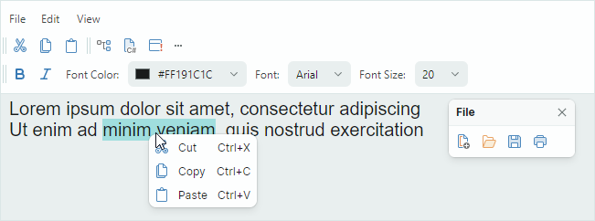

# 工具栏和菜单

EMX Controls 库包含 `ToolbarManager` 组件，允许您在应用程序中创建传统的 Toolbars & Menus 或 [Ribbon UI](../ribbon/index.md)。 `ToolbarManager` 为 arrange 提供了丰富的功能，可以管理传统工具栏、创建上下文菜单、调整工具栏视图和行为设置以及在运行时自定义工具栏。

您可以使用多种 bar item 类型来创建菜单 UI：常规按钮、复选按钮、编辑器、标签、子菜单和组项目。

用户可以自定义工具栏。在运行时他们可以选择显示他们需要的命令。

Toolbar&Menu 库的主要特性包括：

- 用户定制：
    - 栏拖放 — 允许用户使用拖动手柄重新排列栏。
    - 自定义模式和自定义窗口 - 在自定义窗口中，用户可以更改现有工具栏的可见性，并创建自定义工具栏。用户可以使用拖放操作隐藏、恢复和移动工具栏项目。
    - 快速自定义 - 用户可以按住 Alt 键，使用拖放功能在栏内和栏之间移动项目。无需激活定制模式/定制窗口即可执行快速定制。

- 众多 bar layout 选项：
    - 各个条的水平和垂直方向。
    - 窗口内的任何 position。
    - 杠铃伸展。
    - 栏自适应 layout — 工具栏在其容纳的空间发生变化时自动隐藏和恢复其项目。
    - option 用于显示/隐藏 bar 拖动手柄。
    - option 用于显示/隐藏 bar 自定义按钮。
    
- 支持的 bar 项目：`ToolbarButtonItem`、`ToolbarCheckItem`、`ToolbarMenuItem`、`ToolbarEditorItem`、`ToolbarTextItem`、`ToolbarItemGroup` 和 `ToolbarCheckItemGroup`。

- 上下文菜单 — 您可以为外部控件创建上下文菜单。上下文菜单的样式设置与Toolbar&Menu库的所有组件一致。

请参阅以下主题以获取更多信息：

- [Get Started With Toolbars](get-started-with-toolbars.md)
- [Toolbars](toolbars.md)
- [Popup and Context Menus](popup-and-context-menus.md)
- [Toolbar Items](toolbar-items.md)
- [Toolbar Serialization](toolbar-serialization-and-deserialization.md)

 
 

* 本页面使用机器翻译技术翻译。
