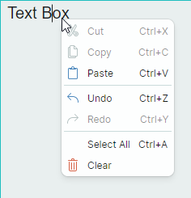

# 弹出菜单和上下文菜单

Toolbar&Menu 库包含 `PopupMenu` 组件，允许您为控件创建弹出菜单和上下文菜单。

## 上下文菜单

要指定上下文菜单，请将目标控件的 `ToolbarManager.ContextPopup` 附加属性设置为一个 `PopupMenu` 对象。


您可以将所有类型的[工具栏项](toolbar-items.md)添加到上下文菜单中。在 XAML 中的起始和结束 `<PopupMenu>` 标记之间定义这些项，或在代码隐藏文件中将它们添加到 `PopupMenu.Items` 集合中。

``` xml
xmlns:mxb="https://schemas.eremexcontrols.net/avalonia/bars"

<TextBox x:Name="textBox"  Text="Text Editor" AcceptsReturn="True" 
 CornerRadius="0" FontFamily="Arial" FontSize="20" Height="200">
    <mxb:ToolbarManager.ContextPopup>
        <mxb:PopupMenu ShowIconStrip="True">
            <mxb:ToolbarButtonItem Header="Undo" HotKeyDisplayString="Ctrl+Z" 
             Command="{Binding $parent[TextBox].Undo}" 
             IsEnabled="{Binding $parent[TextBox].CanUndo}"
             Glyph="{SvgImage 'avares://bars_sample/Images/Toolbars/EditUndo.svg'}"/>
            <mxb:ToolbarButtonItem Header="Redo" HotKeyDisplayString="Ctrl+Y"  
             Command="{Binding $parent[TextBox].Redo}" 
             IsEnabled="{Binding $parent[TextBox].CanRedo}"
             Glyph="{SvgImage 'avares://bars_sample/Images/Toolbars/EditRedo.svg'}"/>
            <mxb:ToolbarSeparatorItem/>
            <mxb:ToolbarButtonItem Header="Clear" 
             Command="{Binding $parent[TextBox].Clear}" HotKey="Ctrl+Q"
             Glyph="{SvgImage 'avares://bars_sample/Images/Toolbars/EditDelete.svg'}"/>
        </mxb:PopupMenu>
    </mxb:ToolbarManager.ContextPopup>
</TextBox>
```

## PopupMenu 的主要设置和事件

- `ShowIconStrip` — 获取或设置是否显示菜单项的垂直图标条。
- `Header` — 允许您指定菜单的标题。
- `ShowHeader` — 获取或设置菜单标题是否可见。
- `ContentRightIndent` — 指定菜单项文本右侧空白区域的宽度。

**事件**

- `Opening` — 当菜单即将显示时触发。该事件允许您取消菜单的显示。
- `Opened` — 菜单显示后触发。
- `Closing` — 当菜单即将关闭时触发。该事件允许您取消菜单的关闭。
- `Closed` — 菜单关闭后触发。

## 示例 — 如何将上下文菜单分配给特定类型的控件

如果您需要为同一类型的多个控件指定同一个上下文菜单，可以在 `Styles` 集合中定义该菜单。以下示例为位于 UserControl 内的 `TextBox` 控件设置 `ToolbarManager.ContextPopup` 附加属性。



``` xml
xmlns:mxb="https://schemas.eremexcontrols.net/avalonia/bars"

<UserControl.Styles>
    <Style Selector="TextBox">
        <Setter Property="mxb:ToolbarManager.ContextPopup">
            <Setter.Value>
                <Template>
                    <mxb:PopupMenu Focusable="False">
                        <mxb:ToolbarButtonItem Header="Cut" HotKeyDisplayString="Ctrl+X" 
                         Command="{Binding $parent[TextBox].Cut}" 
                         IsEnabled="{Binding $parent[TextBox].CanCut}"
                         Glyph="{SvgImage 
                         'avares://DemoCenter/Images/Group=Context Menu, Icon=Cut.svg'}"/>
                        <mxb:ToolbarButtonItem Header="Copy" HotKeyDisplayString="Ctrl+C" 
                         Command="{Binding $parent[TextBox].Copy}" 
                         IsEnabled="{Binding $parent[TextBox].CanCopy}"
                         Glyph="{SvgImage 
                         'avares://DemoCenter/Images/Group=Context Menu, Icon=Copy.svg'}"/>
                        <mxb:ToolbarButtonItem Header="Paste" HotKeyDisplayString="Ctrl+V" 
                         Command="{Binding $parent[TextBox].Paste}" 
                         IsEnabled="{Binding $parent[TextBox].CanPaste}"
                         Glyph="{SvgImage 
                         'avares://DemoCenter/Images/Group=Context Menu, Icon=Paste.svg'}"/>
                        <mxb:ToolbarSeparatorItem/>
                        <mxb:ToolbarButtonItem Header="Undo" HotKeyDisplayString="Ctrl+Z" 
                         Command="{Binding $parent[TextBox].Undo}" 
                         IsEnabled="{Binding $parent[TextBox].CanUndo}"
                         Glyph="{SvgImage 
                         'avares://DemoCenter/Images/Group=Basic, Icon=Undo.svg'}"/>
                        <mxb:ToolbarButtonItem Header="Redo" HotKeyDisplayString="Ctrl+Y" 
                         Command="{Binding $parent[TextBox].Redo}" 
                         IsEnabled="{Binding $parent[TextBox].CanRedo}"
                         Glyph="{SvgImage 
                         'avares://DemoCenter/Images/Group=Basic, Icon=Redo.svg'}"/>
                        <mxb:ToolbarSeparatorItem/>
                        <mxb:ToolbarButtonItem Header="Select All" HotKeyDisplayString="Ctrl+A" 
                         Command="{Binding $parent[TextBox].SelectAll}"/>
                        <mxb:ToolbarButtonItem Header="Clear" 
                         Command="{Binding $parent[TextBox].Clear}"
                         Glyph="{SvgImage 
                         'avares://DemoCenter/Images/Group=Context Menu, Icon=Delete.svg'}"/>
                    </mxb:PopupMenu>
                </Template>
            </Setter.Value>
        </Setter>
    </Style>
</UserControl.Styles>
```


<br>
<br>

<sup>*</sup> 本页面使用机器翻译技术翻译。
