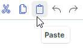
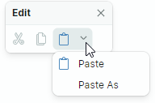
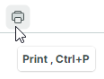

# 工具栏项

工具栏项用于在工具栏和菜单中显示按钮、检查按钮、文本标签、子菜单和内嵌编辑器。您可以向每个工具栏/菜单添加任意数量的项，并使用子菜单创建多个层级。


## 向工具栏和上下文菜单添加工具栏项

使用 `Toolbar.Items` 和 `PopupMenu.Items` 集合，为工具栏和菜单填充项。在 XAML 中，您可以直接在起始和结束的 `<Toolbar>`/`<PopupMenu>` 标记之间定义项。

以下示例在工具栏中显示三个项。

``` xml
xmlns:mxb="https://schemas.eremexcontrols.net/avalonia/bars"

<mxb:Toolbar x:Name="EditToolbar" ToolbarName="Edit" ShowCustomizationButton="False">
    <mxb:ToolbarButtonItem Header="Cut" Command="{Binding #textBox.Cut}" 
     IsEnabled="{Binding #textBox.CanCut}" 
     Glyph="{SvgImage 'avares://DemoCenter/Images/Group=Context Menu, Icon=Cut.svg'}" 
     Category="Edit"/>
    <mxb:ToolbarButtonItem Header="Copy" Command="{Binding #textBox.Copy}" 
     IsEnabled="{Binding #textBox.CanCopy}" 
     Glyph="{SvgImage 'avares://DemoCenter/Images/Group=Context Menu, Icon=Copy.svg'}" 
     Category="Edit"/>
    <mxb:ToolbarButtonItem Header="Paste" Command="{Binding #textBox.Paste}" 
     IsEnabled="{Binding #textBox.CanPaste}" 
     Glyph="{SvgImage 'avares://DemoCenter/Images/Group=Context Menu, Icon=Paste.svg'}" 
     Category="Edit"/>
</mxb:Toolbar>
```
## 工具栏项类型

工具栏库支持多种工具栏项类型。它们都是 `ToolbarItem` 类的派生类，该类包含所有工具栏项通用的设置。

### 通用工具栏项设置

- `Alignment` — 项在工具栏中的对齐方式。
- `Category` — 项所属的类别。类别用于在"自定义"窗口中将项组织为逻辑分组。有关详细信息，请参阅以下部分：[工具栏项类别](#toolbar-item-categories)。
- `Command` — 单击按钮时执行的命令。
- `CommandParameter` — 传递给指定命令的命令参数。
- `DisplayMode` — 获取或设置是仅显示图形符号、标题，还是两者都显示。
- `Glyph` — 项的图像。
- `GlyphAlignment` — 图形符号相对于项标题的对齐方式。
- `GlyphSize` — 图形符号的显示尺寸。
- `Header` — 项的显示文本。
- `ShowSeparator` — 获取或设置是否在该项之前显示分隔符。您也可以使用 `ToolbarSeparatorItem` 工具栏项来插入分隔符。

**事件**

- `Click` — 在项上单击左键时触发（在按下并释放鼠标左键之后）。
- `Press` — 在该项上按下任意鼠标按钮时触发。

### 常规按钮和下拉按钮（ToolbarButtonItem）

使用 `ToolbarButtonItem` 创建常规按钮。单击常规按钮会调用由 `Command` 属性指定的命令，并触发相关事件（`Click` 和 `Press`）。



``` xml
xmlns:mxb="https://schemas.eremexcontrols.net/avalonia/bars"

<mxb:ToolbarButtonItem Header="Open" 
 Glyph="{SvgImage 'avares://bars_sample/Images/Toolbars/FileOpen.svg'}" 
 Category="File" Command="{Binding OpenFileCommand}"/>
```

您可以将下拉控件或菜单与 `ToolbarButtonItem` 对象关联起来。在这种情况下，`ToolbarButtonItem` 可以充当下拉按钮：单击该项本身或内置的向下箭头即可调用指定的下拉控件/菜单。



``` xml
xmlns:mxb="https://schemas.eremexcontrols.net/avalonia/bars"

<mxb:ToolbarButtonItem Header="Paste"
                       Command="{Binding #textBox.Paste}"
                       IsEnabled="{Binding #textBox.CanPaste}"
                       Glyph="{SvgImage 'avares://bars_sample/Images/Toolbars/EditPaste.svg'}"
                       Category="Edit"
                       DropDownArrowVisibility="ShowArrow" DropDownArrowAlignment="Default"
                       >
    <mxb:ToolbarButtonItem.DropDownControl>
        <mxb:PopupMenu>
            <mxb:ToolbarButtonItem Header="Paste" Command="{Binding #textBox.Paste}" 
             IsEnabled="{Binding #textBox.CanPaste}"/>
            <mxb:ToolbarButtonItem Header="Paste As" Command="{Binding PasteAsCommand}" 
             IsEnabled="{Binding #textBox.CanPaste}"/>
        </mxb:PopupMenu>
    </mxb:ToolbarButtonItem.DropDownControl>
</mxb:ToolbarButtonItem>
```

#### 按钮的主要设置

- `DropDownControl` — 获取或设置与该项关联的下拉控件（一个 `Eremex.AvaloniaUI.Controls.Bars.IPopup` 对象）。当用户单击该项或内置的向下箭头按钮时（参见 `DropDownArrowVisibility`），该控件会弹出显示。以下对象实现了 `Eremex.AvaloniaUI.Controls.Bars.IPopup` 接口，因此可以作为下拉控件显示：

    - `Eremex.AvaloniaUI.Controls.Bars.PopupMenu` — 一个[弹出菜单](../toolbars-and-menus/popup-and-context-menus.md)。您可以将所有类型的工具栏项添加到该菜单中，以填充其内容。
    - `Eremex.AvaloniaUI.Controls.Bars.PopupContainer` — 控件容器。使用 `PopupContainer` 可以在下拉内容中显示自定义控件。
    
- `DropDownArrowVisibility` — 获取或设置该项是否显示用于调用关联下拉控件的下拉箭头。

    

    - `ShowArrow` — 下拉箭头可见。该项和箭头充当单个按钮。单击它们会显示关联的下拉控件。

    - `ShowSplitArrow` 或 `Default` — 下拉箭头可见。它充当嵌入该项中的独立按钮。单击该项本身会调用其命令（`Command`）并触发相关事件（`Click` 和 `Press`）。

    - `Hide` — 下拉箭头处于隐藏状态。单击该项会调用下拉控件。

- `DropDownArrowAlignment` — 获取或设置下拉箭头的位置。
- `DropDownOpenMode` — 获取或设置当用户触碰该项/下拉箭头时是否以及何时调用下拉控件。支持的选项包括：
    - `Press` 或 `Default` — 在鼠标按下事件时显示下拉内容。
    - `Click` — 在该项上按下并释放鼠标后显示下拉内容。
    - `Never` — 不显示下拉内容。
- `DropDownPress` — 按下下拉箭头时触发的事件。

另请参阅：[通用工具栏项设置](#common-toolbar-item-settings)。

### 检查按钮（ToolbarCheckItem）

`ToolbarCheckItem` 封装了一个检查按钮，支持正常和按下两种状态。


``` xml
xmlns:mxb="https://schemas.eremexcontrols.net/avalonia/bars"

<mxb:ToolbarCheckItem Header="Bold" 
 IsChecked="{Binding #textBox.FontWeight, 
  Converter={helpers:BoolToFontWeightConverter}, Mode=TwoWay}" 
 Glyph="{SvgImage 'avares://DemoCenter/Images/FontBold.svg'}" Category="Font"/>
```

#### 检查按钮的主要设置和事件

- `IsChecked` — 获取或设置按钮的检查状态。
- `CheckedChanged` — 检查状态更改时触发的事件。

- `CheckBoxStyle` — 获取或设置 `ToolbarCheckItem` 对象的显示模式。可用选项包括：

  - `CheckBoxStyle.CheckButton` — 该项呈现为检查按钮。当 `IsChecked` 为 `true` 时，按钮显示为按下状态。

    

  - `CheckBoxStyle.CheckBox` — 该项在其文本和图形符号之前显示一个复选框。当 `IsChecked` 为 `true` 时，复选框会显示一个勾选标记。

    
    
  - `CheckBoxStyle.RadioButton` — 该项在其文本和图形符号之前显示一个单选按钮。当 `IsChecked` 为 `true` 时，单选按钮呈现为一个填充的圆圈。

    您可以将 RadioButton 样式应用于组合在检查组（`ToolbarCheckItemGroup`）中的 `ToolbarCheckItem` 对象。在这种情况下，该组会呈现为典型的单选按钮组。

    ``` xml
    <mxb:ToolbarCheckItemGroup CheckType="Radio">
        <mxb:ToolbarCheckItem Header="E-mail" CheckBoxStyle="RadioButton" />
        <mxb:ToolbarCheckItem Header="Phone" CheckBoxStyle="RadioButton" />
    </mxb:ToolbarCheckItemGroup>
    ```
    
    

- `CheckBoxAlignment` — 获取或设置复选框（或单选按钮）显示在该项的图形符号和文本之前还是之后。当 `CheckBoxStyle` 属性设置为 `CheckBoxStyle.CheckBox` 或 `CheckBoxStyle.RadioButton` 时，此选项才会生效。

    ```xml
    <mxb:ToolbarCheckItem Header="Status bar" CheckBoxAlignment="After"
                        CheckBoxStyle="CheckBox"
                        Hint="Show and hide the status bar"/>
    <mxb:ToolbarSeparatorItem/>
    ```
    
    

另请参阅：[通用工具栏项设置](#common-toolbar-item-settings)。

### 子菜单（ToolbarMenuItem）

`ToolbarMenuItem` 是一个单击后显示子菜单的项。


要指定子菜单的内容，请在 XAML 中的起始和结束 `<ToolbarMenuItem>` 标记之间定义项，或在代码隐藏文件中将项添加到 `ToolbarMenuItem.Items` 集合中。

``` xml
xmlns:mxb="https://schemas.eremexcontrols.net/avalonia/bars"

<mxb:ToolbarMenuItem Header="File" Category="File">
    <mxb:ToolbarButtonItem Header="New" 
     Glyph="{SvgImage 'avares://DemoCenter/Images/Group=Context Menu, Icon=NewDraftAction.svg'}" 
     Category="File" Command="{Binding NewFileCommand}"/>
    <mxb:ToolbarButtonItem Header="Open" 
     Glyph="{SvgImage 'avares://DemoCenter/Images/Group=Basic, Icon=Folder Open.svg'}" 
     Category="File" Command="{Binding OpenFileCommand}"/>
    <mxb:ToolbarButtonItem Header="Save" 
     Glyph="{SvgImage 'avares://DemoCenter/Images/Group=Basic, Icon=Save.svg'}" 
     Category="File" Command="{Binding SaveFileCommand}"/>
    <mxb:ToolbarButtonItem Header="Print" 
     Glyph="{SvgImage 'avares://DemoCenter/Images/Group=Basic, Icon=Print.svg'}" 
     ShowSeparator="True"  Category="File" Command="{Binding PrintFileCommand}"/>
</mxb:ToolbarMenuItem>
```

#### 子菜单的主要设置和事件

- `DropDownOpenMode` — 获取或设置当用户触碰该项时是否以及如何调用子菜单。支持的选项包括：
    - `Press` 或 `Default` — 在鼠标按下事件时显示菜单。
    - `Click` — 在该项上按下并释放鼠标后显示菜单。
    - `Never` — 不显示菜单。
- `Items` — 子菜单中显示的项的集合。
- `ItemsSource` — 视图模型中业务对象的集合，用于创建子菜单的项。相应的数据模板应定义工具栏项，并根据底层业务对象初始化它们的设置。

**事件**

- `Opening` — 当菜单即将显示时触发。该事件允许您取消菜单的显示。
- `Opened` — 菜单显示后触发。
- `Closing` — 当菜单即将关闭时触发。该事件允许您取消菜单的关闭。
- `Closed` — 菜单关闭后触发。

另请参阅：[通用工具栏项设置](#common-toolbar-item-settings)。

### 内嵌编辑器（ToolbarEditorItem）

`ToolbarEditorItem` 允许您显示一个内嵌编辑器。


要指定内嵌编辑器的类型和设置，请使用 `ToolbarEditorItem.EditorProperties` 属性。您可以将 `ToolbarEditorItem.EditorProperties` 设置为以下对象之一：

- `ButtonEditorProperties` — 对应于 `ButtonEditor` 内嵌编辑器。
- `CheckEditorProperties` — 对应于 `CheckEditor` 内嵌编辑器。
- `ColorEditorProperties` — 对应于 `ColorEditor` 内嵌编辑器。
- `ComboBoxEditorProperties` — 对应于 `ComboBoxEditor` 内嵌编辑器。
- `HyperlinkEditorProperties` — 对应于 `HyperlinkEditor` 内嵌编辑器。
- `PopupColorEditorProperties` — 对应于 `PopupColorEditor` 内嵌编辑器。
- `PopupEditorProperties` — 对应于 `PopupEditor` 内嵌编辑器。
- `SegmentedEditorProperties` — 对应于 `SegmentedEditor` 内嵌编辑器。
- `SpinEditorProperties` — 对应于 `SpinEditor` 内嵌编辑器。
- `TextEditorProperties` — 对应于 `TextEditor` 内嵌编辑器。
- `MemoEditorProperties` — 对应于 `MemoEditor` 内嵌编辑器。

在以下示例中，_Font_ `ToolbarEditorItem` 对象使用一个组合框内嵌编辑器显示字体列表。`ToolbarEditorItem.EditorProperties` 属性被设置为 `ComboBoxEditorProperties`，对应于 `ComboBoxEditor` 控件。

``` xml
<mxb:ToolbarEditorItem Header="Font:" EditorWidth="150" Category="Font" 
 EditorValue="{Binding #textBox.FontFamily, Converter={helpers:FontNameToFontFamilyConverter}}">
    <mxb:ToolbarEditorItem.EditorProperties>
        <mxe:ComboBoxEditorProperties 
         ItemsSource="{Binding $parent[view:ToolbarAndMenuPageView].Fonts}"
         IsTextEditable="False" PopupMaxHeight="300"/>
    </mxb:ToolbarEditorItem.EditorProperties>
</mxb:ToolbarEditorItem>      
```

#### 内嵌编辑器的主要设置和事件

- `ToolbarEditorItem.EditorProperties` — 获取或设置指定内嵌编辑器类型和设置的对象。
- `ToolbarEditorItem.EditorValue` — 获取或设置内嵌编辑器的值。请将此属性用于数据绑定。
- `ToolbarEditorItem.SizeMode` — 获取或设置该项的大小模式。此属性允许您拉伸该工具栏项，使其占据工具栏中所有可用的空白空间。
- `ToolbarEditorItem.EditorWidth` — 获取或设置内嵌编辑器的宽度。
- `ToolbarEditorItem.EditorHeight` — 获取或设置内嵌编辑器的高度。
- `ToolbarEditorItem.EditorAlignment` — 获取或设置编辑器相对于该项标题的对齐方式。

- `ToolbarEditorItem.EditorValueChanged` — 编辑器的值更改后触发的事件。

<!--TODO - `ToolbarEditorItem.Editor` -  

-->

另请参阅：[通用工具栏项设置](#common-toolbar-item-settings)。


### 文本标签（ToolbarTextItem）

`ToolbarTextItem` 显示由 `ToolbarTextItem.Header` 属性指定的文本标签。使用此项可以呈现用户无法编辑的文本。


``` xml
<mxb:ToolbarTextItem 
 Header="{Binding #scaleDecorator.Scale, StringFormat={}Zoom: {0:P0}}" 
 ShowBorder="True" Alignment="Far" ShowSeparator="True" Category="Info" 
 CustomizationName="Zoom Info"/>
```

#### 文本标签的主要设置和事件

- `ToolbarTextItem.SizeMode` — 获取或设置该项的大小模式。此属性允许您拉伸该项，使其占据工具栏中所有可用的空白空间。
- `ToolbarTextItem.ShowBorder` — 获取或设置该项的边框是否可见。您可以使用 `ToolbarTextItem.BorderTemplate` 属性指定用于绘制边框的自定义模板。
- `ToolbarTextItem.BorderTemplate` — 获取或设置用于绘制该项边框的自定义模板。仅当 `ToolbarTextItem.ShowBorder` 选项启用时，此模板才会生效。

另请参阅：[通用工具栏项设置](#common-toolbar-item-settings)。

### 不间断项组（ToolbarItemGroup）

使用 `ToolbarItemGroup` 创建一个不间断的工具栏项组。不间断组是一个项容器，在其父容器调整大小时会作为一个整体行动（组的内容不能被部分隐藏；项始终显示在同一行中，且不支持换行）。


要指定组的内容，请在起始和结束 `<ToolbarItemGroup>` 标记之间定义项，或在代码隐藏文件中将项添加到 `ToolbarItemGroup.Items` 集合中。

``` xml
<mxb:ToolbarItemGroup CustomizationName="Clipboard" >
    <mxb:ToolbarButtonItem Header="Cut" Command="{Binding #textBox.Cut}" 
     IsEnabled="{Binding #textBox.CanCut}" 
     Glyph="{SvgImage 'avares://DemoCenter/Images/Group=Context Menu, Icon=Cut.svg'}" 
     Category="Edit"/>
    <mxb:ToolbarButtonItem Header="Copy" Command="{Binding #textBox.Copy}" 
     IsEnabled="{Binding #textBox.CanCopy}" 
     Glyph="{SvgImage 'avares://DemoCenter/Images/Group=Context Menu, Icon=Copy.svg'}" 
     Category="Edit"/>
    <mxb:ToolbarButtonItem Header="Paste" Command="{Binding #textBox.Paste}" 
     IsEnabled="{Binding #textBox.CanPaste}" 
     Glyph="{SvgImage 'avares://DemoCenter/Images/Group=Context Menu, Icon=Paste.svg'}" 
     Category="Edit"/>
</mxb:ToolbarItemGroup>
```

#### 组的主要设置和事件

- `ToolbarItemGroup.Items` — 允许您访问该组的子项。

### 不间断检查项组（ToolbarCheckItemGroup）

使用 `ToolbarCheckItemGroup` 创建一个不间断的检查项组。不间断组是一个项容器，在其父容器调整大小时会作为一个整体行动（组的内容不能被部分隐藏；项始终显示在同一行中，且不支持换行）。


`ToolbarCheckItemGroup` 容器可以控制其子项（[`ToolbarCheckItem` 对象](#check-buttons-toolbarcheckitem)）的检查状态。您可以使用 `ToolbarCheckItemGroup` 创建以下类型的组：

- 一组互斥的项（单选组）。
- 一个允许同时检查多个项的组。


要指定组的内容，请在 XAML 中的起始和结束 `<ToolbarCheckItemGroup>` 标记之间添加 `ToolbarCheckItem` 项，或在代码隐藏文件中将项添加到 `ToolbarCheckItemGroup.Items` 集合中。

``` xml
<mxb:ToolbarCheckItemGroup CustomizationName="Check group" CheckType="Radio" >
    <mxb:ToolbarCheckItem Header="1" IsChecked="{Binding Option1}"  
     Category="Settings"/>
    <mxb:ToolbarCheckItem Header="2" IsChecked="{Binding Option2}" 
     Category="Settings"/>
    <mxb:ToolbarCheckItem Header="3" IsChecked="{Binding Option3}" 
     Category="Settings"/>
</mxb:ToolbarCheckItemGroup>
```

`ToolbarCheckItemGroup` 对象可以接受所有受支持的工具栏项类型作为子项。但该组只会处理嵌套的 `ToolbarCheckItem` 对象的检查状态。

#### 检查组的主要设置和事件

- `ToolbarCheckItemGroup.CheckType` — 获取或设置组中一次可以检查一个还是多个项。支持以下选项：

    - `Default` 或 `Multiple` — 可以同时检查多个项。
    - `Radio` — 一组互斥的项。用户只能通过检查另一个项来取消检查当前项。
    - `Single` — 一组互斥的项。用户可以取消检查组内的所有项。

- `ToolbarCheckItemGroup.Items` — 允许您访问该组的子项。

另请参阅：[通用工具栏项设置](#common-toolbar-item-settings)。

### 分隔符（ToolbarSeparatorItem）

`ToolbarSeparatorItem` 用于绘制一个分隔符。


``` xml
<mxb:ToolbarMenuItem Header="File" Category="File">
    <mxb:ToolbarButtonItem Header="New" 
     Glyph="{SvgImage 'avares://DemoCenter/Images/Group=Context Menu, Icon=NewDraftAction.svg'}" 
     Category="File"/>
    <mxb:ToolbarButtonItem Header="Open" 
     Glyph="{SvgImage 'avares://DemoCenter/Images/Group=Basic, Icon=Folder Open.svg'}" 
     Category="File"/>
    <mxb:ToolbarButtonItem Header="Save" 
     Glyph="{SvgImage 'avares://DemoCenter/Images/Group=Basic, Icon=Save.svg'}" 
     Category="File"/>
    <mxb:ToolbarSeparatorItem/>
    <mxb:ToolbarButtonItem Header="Print" 
     Glyph="{SvgImage 'avares://DemoCenter/Images/Group=Basic, Icon=Print.svg'}" 
     Category="File"/>
</mxb:ToolbarMenuItem>
```


## 工具栏项类别

您可以将工具栏项分类，以便在"自定义"窗口中对项进行分组。用户可以在"自定义"窗口中选择一个类别，以访问相关的项。


使用 `ToolbarItem.Category` 属性将某个项分配到一个类别。此属性指定类别的名称。要将一组项分配到同一类别，请将它们的 `ToolbarItem.Category` 属性设置为相同的类别名称。

``` xml
<mxb:ToolbarMenuItem Header="Edit" Category="Edit">
    <mxb:ToolbarButtonItem Header="Cut" 
     Glyph="{SvgImage 'avares://DemoCenter/Images/Group=Context Menu, Icon=Cut.svg'}" 
     Category="Edit"/>
    <mxb:ToolbarButtonItem Header="Copy" 
     Glyph="{SvgImage 'avares://DemoCenter/Images/Group=Context Menu, Icon=Copy.svg'}" 
     Category="Edit"/>
    <mxb:ToolbarButtonItem Header="Paste" 
     Glyph="{SvgImage 'avares://DemoCenter/Images/Group=Context Menu, Icon=Paste.svg'}" 
     Category="Edit"/>
    <mxb:ToolbarButtonItem Header="Select All" 
     Command="{Binding #textBox.SelectAll}" Category="Edit" ShowSeparator="True"/>
    <mxb:ToolbarButtonItem Header="Clear all" 
     Command="{Binding #textBox.Clear}" 
     Glyph="{SvgImage 'avares://DemoCenter/Images/Group=Basic, Icon=Clear.svg'}" 
     Category="Edit"/>
</mxb:ToolbarMenuItem>       
```

## 热键

您可以使用 `ToolbarItem.HotKey` 属性为项分配热键。

``` xml
<mxb:ToolbarButtonItem 
    Header="Clear" Command="{Binding #textBox.Clear}" HotKey="Ctrl+Q"
    Glyph="{SvgImage 'avares://bars_sample/Images/Toolbars/EditDelete.svg'}"/>
```

只要焦点位于热键作用范围内，按下热键就会激活该项的命令。默认的热键作用范围是 `ToolbarManager` 组件边界内的 UI 区域。当输入焦点超出热键作用范围时，`ToolbarManager` 将无法拦截热键。

`ToolbarManager.IsWindowManager` 属性允许您将热键作用范围扩展到整个窗口。将此属性设置为 `true` 后，`ToolbarManager` 组件会在窗口中注册项的热键。即使焦点位于其客户区域之外，它也能够拦截并处理热键。

### 显示热键

分配给工具栏项的热键会在以下情况下显示：

- 当项位于子菜单或弹出菜单中时。
- 在项的工具提示中。



您可以使用 `ToolbarItem.HotKeyDisplayString` 属性指定热键的显示文本。即使该项未分配热键，此文本也会显示。当目标热键已被另一个对象注册用于执行特定操作，而您希望表明同一热键与某个工具栏项相关联时，这一属性会很有用。

例如，TextBox 注册了 _Ctrl+Z_ 快捷键用于执行撤销操作。如果某个工具栏项对该 TextBox 执行相同的撤销操作，请不要为该项分配 _Ctrl+Z_ 热键。相反，请将该项的 `ToolbarItem.HotKeyDisplayString` 设置为 "_Ctrl+Z_"，以便在工具提示和子菜单/弹出菜单中向用户显示该快捷键。

``` xml
<mxb:ToolbarButtonItem Header="Undo" HotKeyDisplayString="Ctrl+Z" 
    Command="{Binding $parent[TextBox].Undo}" 
    IsEnabled="{Binding $parent[TextBox].CanUndo}" 
    Glyph="{SvgImage 'avares://bars_sample/Images/Toolbars/EditUndo.svg'}"/>
```


<br>
<br>

<sup>*</sup> 本页面使用机器翻译技术翻译。
