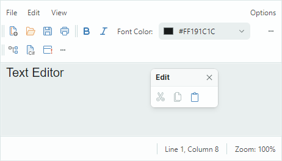
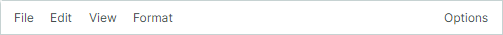
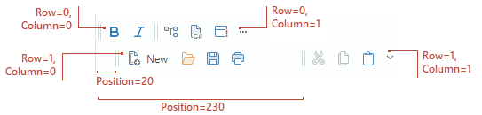
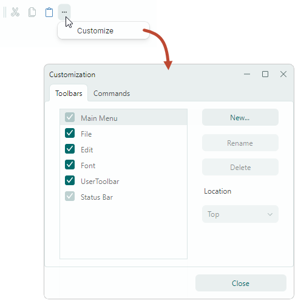
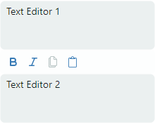
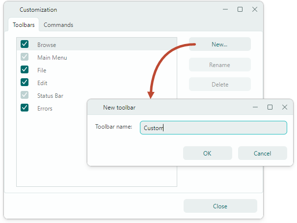

# 工具栏

`ToolbarManager` 是一个可以管理应用程序中的传统工具栏、[popup and context menus](popup-and-context-menus.md) 和 [Ribbon UI](../ribbon/index.md) 的组件。您可以将dock传统工具栏移动到window/UserControl的边缘，并创建浮动工具栏。 Eremex 工具栏库还允许您将工具栏放置在窗口/用户控件内的任何位置。



当您使用`ToolbarManager`组件来实现传统工具栏时，您需要创建这些工具栏的工具栏容器to dock。 toolbar container 是用于显示停靠工具栏的可视容器。工具栏容器是 `ToolbarManager` 组件的子元素。

## 创建工具栏

`Toolbar` control 实现了一个工具栏。使用它可以将常规 bar、主菜单和状态 bar 添加到您的应用程序中。

按照以下步骤创建工具栏：

- 创建 `ToolbarManager` 组件。
- 创建工具栏容器。
- 创建工具栏。
- 用项目填充工具栏。

### 创建工具栏管理器

要创建工具栏，首先定义一个 `ToolbarManager` 组件（`Avalonia.Controls.Border` 类的后代）。为其创建工具栏 UI 的客户端 control 需要放置在 `ToolbarManager` 组件内。 `ToolbarManager` 对象确定工具栏和弹出菜单的功能区域。

``` xml
xmlns:mxb="https://schemas.eremexcontrols.net/avalonia/bars"

<mxb:ToolbarManager IsWindowManager="True">
    <Grid RowDefinitions="Auto, *, Auto" ColumnDefinitions="Auto, *, Auto">

        <TextBox x:Name="textBox" Text="Text Editor" AcceptsReturn="True" 
         CornerRadius="0" FontFamily="Arial" FontSize="20" 
         helpers:TextBoxHelper.IsEnabled="True"/>

    </Grid>
</mxb:ToolbarManager>        
```

!!!提示

您可以将热键分配给工具栏项目。要允许 `ToolbarManager` 对象在键盘焦点超出 `ToolbarManager` 的客户区域时处理这些热键，请启用 `ToolbarManager.IsWindowManager` 选项。有关工具栏项的热键范围的信息，请参阅以下主题：[Hotkeys](#hotkey-scope)。

### 创建工具栏容器

将工具栏容器 (`ToolbarContainerControl`) 添加到 `ToolbarManager` 组件，以允许工具栏停靠在窗口/用户控件内的特定 position 处。 toolbar container 指定工具栏可以停靠和拖动的区域。

以下示例在 Grid control 的边缘创建四个工具栏容器，允许您稍后在这些位置使用 dock 工具栏。

``` xml
xmlns:mxb="https://schemas.eremexcontrols.net/avalonia/bars"

<mxb:ToolbarManager IsWindowManager="True">
    <Grid RowDefinitions="Auto, *, Auto" ColumnDefinitions="Auto, *, Auto">
        <mxb:ToolbarContainerControl Grid.ColumnSpan="3" DockType="Top">
        </mxb:ToolbarContainerControl>

        <mxb:ToolbarContainerControl DockType="Left" Grid.Row="1"/>

        <TextBox x:Name="textBox" Text="Text Editor" AcceptsReturn="True" 
         CornerRadius="0" FontFamily="Arial" FontSize="20" 
         helpers:TextBoxHelper.IsEnabled="True"/>

        <mxb:ToolbarContainerControl DockType="Right" Grid.Row="1" Grid.Column="2"/>

        <mxb:ToolbarContainerControl Grid.Row="2" Grid.ColumnSpan="3" DockType="Bottom">
        </mxb:ToolbarContainerControl>
    </Grid>
</mxb:ToolbarManager>        
```
为创建的容器初始化 `ToolbarContainerControl.DockType` 属性以指定它们的停靠方式。容器的 dock type 确定嵌套工具栏的默认对齐方式以及应用于工具栏容器的外观设置。 Available dock types include:

- `Left`、`Right`、`Top`、`Bottom` — toolbar container 停靠在父控件的相应一侧。 The containers that have these dock types draw border lines to be separated from the rest of the client area.例如，停靠在顶部的 toolbar container 在底部绘制边框 line。
- `Standalone` — This mode should be applied to [standalone toolbar containers](#standalone-toolbars). standalone toolbar container 专门用于在窗口/用户控件内的自定义 position 上显示工具栏。 Standalone toolbar containers have no borders.

您可以定义一个空的 `ToolbarContainerControl` 以允许稍后将工具栏添加到此容器（由用户或通过代码）。

### 添加工具栏
Add `Toolbar` controls to toolbar containers to dock toolbars at corresponding positions.

``` xml
xmlns:mxb="https://schemas.eremexcontrols.net/avalonia/bars"

<mxb:ToolbarContainerControl Grid.ColumnSpan="3" DockType="Top">
    <mxb:Toolbar x:Name="MainMenu" ToolbarName="Main Menu" DisplayMode="MainMenu">
    </mxb:Toolbar>

    <mxb:Toolbar x:Name="EditToolbar" ToolbarName="Edit" ShowCustomizationButton="False">
    </mxb:Toolbar>
</mxb:ToolbarContainerControl>        

<mxb:ToolbarContainerControl Grid.Row="2" Grid.ColumnSpan="3" DockType="Bottom">
    <mxb:Toolbar DisplayMode="StatusBar" ToolbarName="Status Bar" x:Name="StatusBar">
    </mxb:Toolbar>
</mxb:ToolbarContainerControl>
```


有关更多信息，请参阅以下部分：

- [Floating Toolbars](#floating-toolbars)
- [Standalone Toolbars](#standalone-toolbars)

### 添加工具栏项

工具栏可以显示各种工具栏item类型，演示如下：

- `ToolbarButtonItem` — 一个 item，可以充当常规 button 或 dropdown button（如果您使用 associate dropdown control/菜单）。
- `ToolbarCheckItem` — 复选按钮。
- `ToolbarMenuItem` — 显示子菜单的 item。
- `ToolbarEditorItem` — 显示 in-place 编辑器的 item。
- `ToolbarTextItem` — 文本标签。
- `ToolbarItemGroup` — 一组工具栏项目。
- `ToolbarCheckItemGroup` — 一组检查按钮。 Use it to create a group of mutually exclusive check items, or a group that supports selecting multiple items at a time.
- `ToolbarSeparatorItem` — 在相邻项目之间绘制分隔符。

要将 bar 项添加到工具栏，请在 XAML 中将它们定义为 `Toolbar` control 的子元素，或者将它们添加到代码隐藏中的 `Toolbar.Items` 集合中。

``` xml
xmlns:mxb="https://schemas.eremexcontrols.net/avalonia/bars"

<mxb:Toolbar x:Name="EditToolbar" ToolbarName="Edit" ShowCustomizationButton="False">
    <mxb:ToolbarButtonItem Header="Cut" Command="{Binding #textBox.Cut}" 
     IsEnabled="{Binding #textBox.CanCut}" 
     Glyph="{SvgImage 'avares://DemoCenter/Images/Group=Context Menu, Icon=Cut.svg'}" 
     Category="Edit"/>
    <mxb:ToolbarButtonItem Header="Copy" Command="{Binding #textBox.Copy}" 
     IsEnabled="{Binding #textBox.CanCopy}" 
     Glyph="{SvgImage 'avares://DemoCenter/Images/Group=Context Menu, Icon=Copy.svg'}" 
     Category="Edit"/>
    <mxb:ToolbarButtonItem Header="Paste" Command="{Binding #textBox.Paste}" 
     IsEnabled="{Binding #textBox.CanPaste}" 
     Glyph="{SvgImage 'avares://DemoCenter/Images/Group=Context Menu, Icon=Paste.svg'}" 
     Category="Edit"/>
</mxb:Toolbar>
```

有关详细信息，请参阅 [Toolbar Items](toolbar-items.md) 主题。

## 选择工具栏类型 - 常规栏、主菜单或状态栏

`Toolbar.DisplayMode` 属性允许您指定工具栏类型。

### 常规工具栏

如果未指定 `Toolbar.DisplayMode` 属性或将其设置为 `ToolbarDisplayMode.Default`，则 `Toolbar` 对象将呈现为常规工具栏。


常规工具栏具有拖动手柄，用于通过拖放重新排列工具栏。

### 主菜单

设置 `Toolbar.DisplayMode` 至 `ToolbarDisplayMode.MainMenu` 以显示工具栏作为主菜单。



主菜单的功能包括：

- 用户无法在运行时隐藏它。 
- 当用户按下 ALT 键时，主菜单获得焦点。
- 主菜单水平拉伸 to fit 容器的宽度。
- 主菜单不支持多line item排列、浮动模式和拖放操作。

### 状态栏

将 `Toolbar.DisplayMode` 设置为 `ToolbarDisplayMode.StatusBar` 以将工具栏呈现为应用程序的状态栏。


bar状态的特点包括：

- 用户无法在运行时隐藏它。 
- 状态 bar 水平拉伸 to fit 容器的宽度。
- 状态bar不支持多line item排列、浮动模式和拖放操作。

以下示例创建包含两个项目的状态 bar。状态 bar 放置在父网格控件底部显示的 toolbar container 内。

``` xml
xmlns:mxb="https://schemas.eremexcontrols.net/avalonia/bars"

<mxb:ToolbarContainerControl Grid.Row="2" Grid.ColumnSpan="3" DockType="Bottom">
    <mxb:Toolbar DisplayMode="StatusBar" ToolbarName="Status Bar" x:Name="StatusBar" 
     ShowCustomizationButton="False">
        <mxb:ToolbarTextItem Alignment="Far" ShowSeparator="True" ShowBorder="False" 
         Category="Info" CustomizationName="Position Info">
            <mxb:ToolbarTextItem.Header>
                <MultiBinding Converter="{helpers:LineAndColumnToTextConverter}">
                    <Binding ElementName="textBox" Path="(helpers:TextBoxHelper.Line)"/>
                    <Binding ElementName="textBox" Path="(helpers:TextBoxHelper.Column)"/>
                </MultiBinding>
            </mxb:ToolbarTextItem.Header>
        </mxb:ToolbarTextItem>
        <mxb:ToolbarTextItem 
         Header="{Binding #scaleDecorator.Scale, StringFormat={}Zoom: {0:P0}}" 
         ShowBorder="False" Alignment="Far" ShowSeparator="True" Category="Info" 
         CustomizationName="Zoom Info"/>
    </mxb:Toolbar>
</mxb:ToolbarContainerControl>
```

## 工具栏的布局和位置

当工具栏驻留在工具栏容器内时，它们根据容器的 dock type（`ToolbarContainerControl.DockType` setting）对齐：

- 如果 `ToolbarContainerControl.DockType` 属性设置为 `Top`、`Bottom` 或 `Standalone`，则工具栏将水平定向。
- 如果 `ToolbarContainerControl.DockType` 属性设置为 `Left` 或 `Right`，则工具栏垂直定向。

`Toolbar` 对象具有由 `Toolbar.DockType` 属性指定的自己的 dock type setting。您可以使用 `Toolbar.DockType` 属性将工具栏移动到代码隐藏中的特定 toolbar container。当您将 `Toolbar.DockType` 属性设置为 `Left`、`Right`、`Top` 或 `Bottom` 时，工具栏将移动到 toolbar container，其 `ToolbarContainerControl.DockType`、option 设置为相应的值。

工具栏可以在其父工具栏容器内排列成多行。您可以使用以下属性在特定行中显示工具栏，并在该行内移动工具栏：

- `Toolbar.Row` — 获取或设置显示工具栏的行的 zero-based 索引。行索引从`0`开始。该属性仅对常规工具栏有效。无法更改主菜单的行索引，也无法在主菜单之前放置​​常规工具栏。
- `Toolbar.Column` — 获取或设置工具栏在一行中的 zero-based 顺序。
- `Toolbar.Position` — 获取或设置行内工具栏的最小偏移量。



## 工具栏中项目的布局

### 自适应布局

当父容器调整大小时，工具栏会自动隐藏和恢复其项目。
禁用 `Toolbar.AllowShrinkToolbar` option 以防止特定 bar 在容器大小减小时折叠。

### 工具栏拉伸

工具栏 can be stretched to fit 容器的宽度。将 `Toolbar.StretchToolbar` option 设置为 `true` 以启用工具栏拉伸。在此模式下，同一行中不能显示其他工具栏。

主菜单和状态 bar 始终占据整行。 `Toolbar.StretchToolbar` option 对这些工具栏无效。

### 多 line 物品排列

当父容器的宽度不足以在单行中显示项目时，工具栏可以在多行中显示其项目。将 `Toolbar.WrapItems` 属性设置为 `true` 以启用多行布局。


## 浮动工具栏

若要在 XAML 中创建浮动工具栏，请将 `Toolbar` 对象添加到 `ToolbarManager.Toolbars` 集合，并将 `Toolbar.DockType` 属性设置为 `Floating`。使用 `Toolbar.FloatingPosition` 属性设置浮动工具栏的位置。

``` xml
xmlns:mxb="https://schemas.eremexcontrols.net/avalonia/bars"

<mxb:ToolbarManager.Toolbars>
    <mxb:Toolbar x:Name="bar1" DockType="Floating" FloatingPosition="200,200" 
                        ToolbarName="Toolbar 1"  >
        <mxb:ToolbarButtonItem Header="Script" 
         Glyph="{SvgImage 'avares://DemoCenter/Images/Group=Script, Icon=CSharpFile.svg'}" 
         Category="UserCommands"/>
        <mxb:ToolbarButtonItem Header="Settings" 
         Glyph="{SvgImage 'avares://DemoCenter/Images/Group=Basic, Icon=List of Bugs.svg'}" 
         Category="UserCommands"/>
    </mxb:Toolbar>
</mxb:ToolbarManager.Toolbars>
```

以下代码片段展示了如何使工具栏在代码隐藏中浮动。

``` csharp
toolBar1.DockType = Eremex.AvaloniaUI.Controls.Bars.MxToolbarDockType.Floating;
toolBar1.FloatingPosition = new PixelPoint(200, 200);
```

## 运行时工具栏自定义

### 重新排列工具栏

如果启用 `Toolbar.AllowDragToolbar` option，工具栏会显示拖动手柄。用户可以按下该button，然后将工具栏拖动到另一个position，或者使工具栏浮动。


### 使用快速自定义重新排列项目

用户无需激活自定义模式即可重新设置 arrange 工具栏项目。他们需要按 ALT 键，然后将 item 拖放到所需位置。按 CTRL+ALT 组合键来复制正在拖动的 item，而不是按 ALT 键。

### 自定义模式和自定义窗口

工具栏支持自定义模式，用户可以执行以下操作：

- 访问可见和隐藏的工具栏，并显示和隐藏它们。
- 使用拖放操作访问所有项目并管理其可见性和工具栏中的 position。
- 创建和删除用户工具栏。

要激活工具栏自定义模式，用户可以单击工具栏的自定义 button（“...”），然后选择“自定义”命令。激活定制模式将显示定制窗口：



!!!提示

启用 `Toolbar.ShowCustomizationButton` option 以在工具栏中显示自定义 button（“...”）。

调用 `ToolbarManager.ShowCustomizationWindow` method 激活自定义模式并在代码中显示自定义窗口。

在自定义模式下，用户可以使用拖放操作来隐藏、显示和移动工具栏项：

- 将项目从工具栏/子菜单拖到自定义窗口的“命令”tab 上以隐藏这些项目。
- 将项目从自定义窗口的“命令”tab 拖动到工具栏/子菜单以显示这些项目。
- 在工具栏和子菜单之间拖动项目以重新调整它们。

自定义窗口还允许用户隐藏/显示工具栏并创建自定义工具栏。有关详细信息，请参阅以下部分：[User Toolbars](#user-toolbars)。


## 工具栏自定义选项

工具栏包含以下选项，允许您自定义其视图和行为设置：

- `Toolbar.ToolbarName` — 获取或设置工具栏标题。当工具栏浮动时，工具栏标题显示在自定义窗口中。
- `Toolbar.AllowDragToolbar` — 获取或设置工具栏是否显示拖动手柄。该 button 允许用户将工具栏拖动到另一个 dock position 或使其浮动。
- `Toolbar.ShowCustomizationButton` — 获取或设置工具栏是否显示自定义（“...”）按钮。单击此 button 会调用一个菜单，该菜单允许用户调用自定义窗口。


## 独立工具栏

您可以在窗口/用户控件内的任何 position 处显示工具栏。为此，请在此 position 上创建一个 `ToolbarContainerControl`，并将工具栏添加到该容器。

将 `ToolbarContainerControl.DockType` 属性设置为 `Standalone`。此 dock type 应用特定于 standalone 工具栏容器的外观设置。例如，standalone 容器在浅色和深色 Eremex 主题中没有边框。

standalone 工具栏容器内工具栏的默认方向是水平的。您可以使用 `ToolbarContainerControl.Orientation` 属性来垂直对齐 standalone 条。

以下示例在两个文本框之间显示 standalone 工具栏。 bar 包含对第二个文本框执行操作的命令。



``` xml
xmlns:mxb="https://schemas.eremexcontrols.net/avalonia/bars"

<StackPanel Grid.Row="1" Grid.Column="1">
    <TextBox x:Name="textBox" Text="Text Editor 1" AcceptsReturn="True" 
    FontSize="14" Height="70"/>
                
    <mxb:ToolbarContainerControl DockType="Standalone" Orientation="Horizontal"  >
        <mxb:Toolbar x:Name="EditToolbar2" ToolbarName="Edit (textBox2)" 
         AllowDragToolbar="False" ShowCustomizationButton="False" >
            <mxb:ToolbarCheckItemGroup>
                <mxb:ToolbarCheckItem Header="Bold" 
                 IsChecked="{Binding #textBox2.FontWeight, 
                  Converter={local:BoolToFontWeightConverter}, Mode=TwoWay}" 
                 Glyph="{SvgImage 'avares://bars_sample/Images/Toolbars/FontBold.svg'}" Category="Font"/>
                <mxb:ToolbarCheckItem Header="Italic" 
                 IsChecked="{Binding #textBox2.FontStyle, 
                  Converter={local:BoolToFontStyleConverter}, Mode=TwoWay}" 
                 Glyph="{SvgImage 'avares://bars_sample/Images/Toolbars/FontItalic.svg'}" Category="Font"/>
            </mxb:ToolbarCheckItemGroup>
            <mxb:ToolbarButtonItem Header="Copy" Command="{Binding #textBox2.Copy}" 
             IsEnabled="{Binding #textBox2.CanCopy}" 
             Glyph="{SvgImage 'avares://bars_sample/Images/Toolbars/EditCopy.svg'}" Category="Edit"/>
            <mxb:ToolbarButtonItem Header="Paste"
                                    Command="{Binding #textBox2.Paste}"
                                    IsEnabled="{Binding #textBox2.CanPaste}"
                                    Glyph="{SvgImage 'avares://bars_sample/Images/Toolbars/EditPaste.svg'}"
                                    Category="Edit"
                                />
        </mxb:Toolbar>
    </mxb:ToolbarContainerControl>
    <TextBox x:Name="textBox2" Text="Text Editor 2" AcceptsReturn="True" FontSize="14" Height="70"/>
</StackPanel>
```

## 用户工具栏

用户可以在运行时在自定义窗口中创建工具栏。这些栏称为“用户工具栏”，并且它们将 `Toolbar.UserToolbar` option 设置为 `true`。



与其他工具栏不同，用户工具栏可以在自定义窗口中重命名和删除。

需要时，您可以手动将 `Toolbar.UserToolbar` 属性设置为 `true`，以在代码中创建用户工具栏。用户也可以在自定义窗口中重命名和删除该工具栏。

创建用户工具栏后，用户可以使用拖放操作向其中填充命令。

## 热键范围

`ToolbarItem.HotKey` 属性允许您为项目分配热键。如果焦点位于热键范围内，`ToolbarManager` 组件可以拦截热键。

default hotkey scope 是`ToolbarManager` 的客户区。将 `ToolbarManager.IsWindowManager` 属性设置为 `true` 将热键范围扩展到整个窗口。在本例中，`ToolbarManager` 组件在窗口中注册 item 热键。即使焦点位于其客户区域之外，它也能够拦截和处理热键。

有关详细信息，请参阅以下主题：[Toolbar Item Hotkeys](toolbar-items.md#hotkeys)。

<br>
<br>

<sup>*</sup> 本页面使用机器翻译技术翻译。
