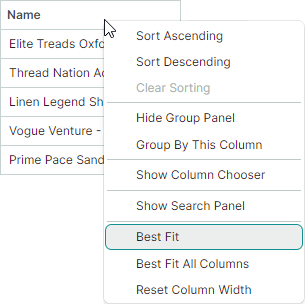
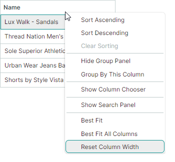
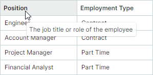

# Columns

TreeList 控件支持多列数据，而 TreeView 则在单列中显示数据。


## TreeView 控件中的列

TreeView 控件在单列中显示数据。此列无法删除。TreeView 列中显示的值从 `TreeViewControl.DataFieldName` 成员指定的字段/属性中获取。

`TreeViewControl.CellWidth` 属性允许您自定义此列的宽度。详情请参阅以下链接：[列宽](#column-width)。

## 创建 TreeList 列

TreeList 列由 `TreeListColumn` 类封装，该类是 `ColumnBase` 类的派生类。`GridColumn` 类（`DataGridControl` 中的列）同样派生自 `ColumnBase`。因此，DataGrid 和 TreeList 控件中的列共享许多相同的 API 成员。

将控件绑定到数据源后，TreeList 控件不会自动创建列。您可以通过以下四种方法创建列：

- **手动创建列**

    您可以在 `TreeList.Columns` 集合中手动定义所有 TreeList 列（在 XAML 或代码后置文件中）。使用此方法时，您可以在代码中通过名称访问已创建的列对象。

    以下示例创建两个 TreeList 列，并自定义第二列值的显示格式：

    ``` xml
    xmlns:mxtl="https://schemas.eremexcontrols.net/avalonia/treelist"

    <mxtl:TreeListControl Name="treeList1" >                
        <mxtl:TreeListControl.Columns>
            <mxtl:TreeListColumn Name="colName" FieldName="Name" />
            <mxtl:TreeListColumn Name="colBirthdate" FieldName="Birthdate" >
                <mxtl:TreeListColumn.EditorProperties>
                    <mxe:TextEditorProperties DisplayFormatString="yyyy-MM-dd"/>
                </mxtl:TreeListColumn.EditorProperties>
            </mxtl:TreeListColumn>
        </mxtl:TreeListControl.Columns>
    </mxtl:TreeListControl>
    ```


- **自动生成列**

    启用 `TreeListControl.AutoGenerateColumns` 选项后，控件绑定到数据源时会自动生成缺失的列。您可以将特定特性（来自 `System.ComponentModel` 和 `System.ComponentModel.DataAnnotations` 命名空间）应用于业务对象的属性，以管理列的自动生成，并自定义自动生成列的设置（例如列的显示名称和顺序）。参阅[自动生成列](#automatic-column-generation)。

- **结合使用手动创建列和自动生成**

    您可以结合上述两种方法：先在 `TreeList.Columns` 集合中手动创建所需的列，然后启用 `TreeListControl.AutoGenerateColumns` 选项，将其余列的生成交给 TreeList 处理。

- **从视图模型生成列**

    TreeList 可以从视图模型中定义的列数据源创建列。在此场景中使用 `ColumnsSource` 和 `ColumnTemplate` 属性。参阅[从视图模型生成列](#generate-columns-from-a-view-model)。


## 将列绑定到数据

`TreeListColumn.FieldName` 属性允许您将列绑定到底层数据表中的字段，或绑定到业务对象的公共属性。列绑定后，会从数据源中获取值。

TreeList 还允许您创建未绑定列，其值应该通过 `TreeListControl.CustomUnboundColumnData` 事件手动提供。详情请参阅[未绑定列](data-binding/unbound-columns.md)。

不建议将多个 TreeList 列绑定到同一个数据字段/属性。

以下示例创建 TreeList 列并将其绑定到数据。

``` xml
xmlns:mxtl="https://schemas.eremexcontrols.net/avalonia/treelist"

<mxtl:TreeListControl Grid.Column="3" Width="200" Name="treeListUnbound" 
 HorizontalAlignment="Stretch">
    <mxtl:TreeListControl.Columns>
        <mxtl:TreeListColumn Name="colFirstName" FieldName="FirstName" 
         Header="First Name" Width="*"  AllowSorting="False"  />
        <mxtl:TreeListColumn Name="colLastName" FieldName="LastName" 
         Header="Last Name" Width="*"/>
        <mxtl:TreeListColumn Name="colCity" FieldName="City" 
         Header="City" Width="*" ReadOnly="True" />
        <mxtl:TreeListColumn Name="colPhone" FieldName="Phone" 
         Header="Phone" Width="*"/>
    </mxtl:TreeListControl.Columns>
</mxtl:TreeListControl>
```

``` csharp
using Eremex.AvaloniaUI.Controls.TreeList;

TreeListColumn colFirstName = new TreeListColumn() 
{ 
    FieldName = "FirstName", Header = "First Name", AllowSorting = false, 
    Width= new GridLength(1, GridUnitType.Star) 
};
treeList1.Columns.Add(colFirstName);
```

## 自动生成列

将 `AutoGenerateColumns` 属性设置为 `true`（默认值为 `false`），以便为数据源中的属性启用自动生成列。当 `AutoGenerateColumns` 设置为 `true` 时，TreeList 控件会从数据源获取公共属性，生成列并将其绑定到这些属性。如果控件的 `Columns` 集合中已经包含绑定到特定属性/字段的列，则不会为同一属性/字段自动生成额外的列。

`AutoGeneratingColumn` 和 `AutoGeneratedColumns` 事件允许您自定义自动生成的列。当一个自动生成的列即将被添加到 `Columns` 集合时，会触发 `AutoGeneratingColumn` 事件。该事件允许您阻止该列被添加到集合中。

在所有列都自动生成完毕后，会触发 `AutoGeneratedColumns` 事件。

当您为控件分配另一个数据源时，TreeList 会先删除之前自动生成的列，然后为新数据源自动生成列。

### 使用特性自定义自动生成列的设置

您可以将特定特性（来自 `System.ComponentModel` 和 `System.ComponentModel.DataAnnotations` 命名空间）应用于业务对象（数据源记录）的属性，以自定义相应自动生成的 TreeList 列的可见性状态、外观和行为设置。支持以下特性：

#### `Browsable` 特性

`System.ComponentModel.BrowsableAttribute` 特性控制列的自动生成。将 **Browsable(false)** 特性应用于特定属性，以阻止相应的列被自动生成。

``` csharp
using CommunityToolkit.Mvvm.ComponentModel;
using System.ComponentModel;

public partial class MyBusinessObject : ObservableObject
{
    [ObservableProperty]
    [property: Browsable(false)]
    public int serviceId = "";
}
```

`System.ComponentModel.BrowsableAttribute` 特性等价于使用带有 `AutoGenerateField` 参数的 `System.ComponentModel.DataAnnotations.DisplayAttribute` 特性。

#### `Display` 特性
`System.ComponentModel.DataAnnotations.DisplayAttribute` 是一个通用特性，用于控制列的自动生成以及自动生成列的显示设置。该特性具有以下 TreeList 控件支持的参数：

- `AutoGenerateField` —— 指定是否自动生成对应的列。

- `Order` —— 指定自动生成列的可见位置（`ColumnBase.VisibleIndex`）。

- `Name` —— 指定自动生成列的标题（`ColumnBase.Header`）。

- `ShortName` —— 与 `Name` 参数等价。
 
- `GroupName` —— 指定要与自动生成列关联的列组名称。
如果 `TreeListControl.AutoGenerateBands` 选项为 `true`（默认值），此特性值将用于初始化 `TreeListColumn.BandName` 属性。

    当 TreeList 遇到 `DisplayAttribute.GroupName` 时，会检查是否存在名称匹配的列组（`TreeListBand.BandName`）。如果不存在，控件会自动创建该列组，并使用 `DisplayAttribute.GroupName` 的值初始化其 `TreeListBand.BandName` 属性。

    `DisplayAttribute.GroupName` 参数还支持嵌套列组。使用 '/' 字符分隔父列组和子列组（例如 "ParentBandName/ChildBandName"）。
    要将 '/' 作为字面字符使用，请使用 "//"。

 
``` csharp
using CommunityToolkit.Mvvm.ComponentModel;
using System.ComponentModel.DataAnnotations;

public partial class MyBusinessObject : ObservableObject
{
    [ObservableProperty]
    [property: Display(Name = "Birth date", Order=2, GroupName="General")]
    public DateTime? birthdate = null;

    [ObservableProperty]
    [property: Display(GroupName = "Details/Address")]
    public string country { get; set; }

    [ObservableProperty]
    [property: Display(GroupName = "Details/Contact")]
    public string phone { get; set; }
}
```


#### `DisplayName` 特性

`System.ComponentModel.DisplayNameAttribute` 特性允许您初始化自动生成列的标题（`ColumnBase.Header`）。

``` csharp
using CommunityToolkit.Mvvm.ComponentModel;
using System.ComponentModel;

public partial class MyBusinessObject : ObservableObject
{
    [ObservableProperty]
    [property: DisplayName("Birth date")]
    public DateTime? birthdate = null;
}
```

`System.ComponentModel.DisplayNameAttribute` 特性等价于使用带有 `Name` 或 `ShortName` 参数的 `System.ComponentModel.DataAnnotations.DisplayAttribute` 特性。

#### `Editable` 特性

将 `System.ComponentModel.EditableAttribute` 特性应用于属性会创建不可编辑的列。用户无法打开内嵌编辑器，因此也无法选择和复制文本。

``` csharp
using CommunityToolkit.Mvvm.ComponentModel;
using System.ComponentModel;

public partial class MyBusinessObject : ObservableObject
{
    [ObservableProperty]
    [property: Editable(false)]
    public int parentId = -1;
}
```

#### `Readonly` 特性

将 `System.ComponentModel.ReadonlyAttribute` 特性应用于属性会创建只读列。用户可以在只读列中选择和复制文本，但无法编辑值。

``` csharp
using CommunityToolkit.Mvvm.ComponentModel;
using System.ComponentModel;

public partial class MyBusinessObject : ObservableObject
{
    [ObservableProperty]
    [property: ReadOnly(true)]
    public int id = -1;
}
```

## 从视图模型生成列

您可以从视图模型中定义的列数据源中获取列，并用其填充 TreeList 控件。列数据源是一个业务对象集合，`TreeListColumn` 对象将根据指定的模板从中生成。以下 API 成员用于维护从视图模型生成列的过程：

- `TreeListControl.ColumnsSource` —— 用于根据 `ColumnTemplate` 模板生成 treelist 列的业务对象集合。

- `TreeListControl.ColumnTemplate` —— 用于从存储在列数据源中的业务对象初始化 `TreeListColumn` 对象的模板。

<!-- TODO
пример
 -->


## 移动列

使用 `TreeListColumn.VisibleIndex` 属性指定列的可视位置。要隐藏该列，请将其 `TreeListColumn.VisibleIndex` 属性设置为 **-1**，或将 `IsVisible` 属性设置为 `false`。

控件的默认行为允许用户重新排列列。使用以下属性可以禁止移动列：

- `TreeListControl.AllowColumnMoving` —— 指定用户是否可以移动任意列。
- `TreeListColumn.AllowMoving` —— 指定用户是否可以移动特定列。

## 列宽

您可以使用以下属性来控制 TreeList 和 TreeView 控件中的列宽：

**TreeList 设置：**

- `TreeListColumn.Width` —— 以 `GridLength` 值指定的列宽。
- `TreeListColumn.MinWidth` —— 列的最小宽度。
- `TreeListColumn.MaxWidth` —— 列的最大宽度。

**TreeView 设置：**

- `TreeViewControl.CellWidth` —— 以 `GridLength` 值指定的控件单元格宽度。

`TreeListColumn.Width` 和 `TreeViewControl.CellWidth` 属性均为 `GridLength` 类型。`GridLength` 类型允许您将列宽设置为：

- 固定宽度（以像素为单位）。
- 可用空间的加权比例（星号表示法）。
- `Auto` 值 —— 启用自动列宽计算以适应单元格内容。当用户垂直滚动控件时，控件可以增大列宽，以适应滚动过程中出现的新单元格值。

``` xml
xmlns:mxtl="https://schemas.eremexcontrols.net/avalonia/treelist"

<mxtl:TreeListControl Name="treeList1">
    <mxtl:TreeListControl.Columns>
        <mxtl:TreeListColumn Name="colFirstName" 
         FieldName="FirstName" Header="First Name" Width="*"/>
        <mxtl:TreeListColumn Name="colLastName" 
         FieldName="LastName" Header="Last Name" Width="2*"/>
        <mxtl:TreeListColumn Name="colPhone" 
         FieldName="Phone" Header="Phone" Width="*"/>
    </mxtl:TreeListControl.Columns>
</mxtl:TreeListControl>
```

以下属性用于控制用户执行的列大小调整操作。

- `TreeListControl.AllowColumnResizing` —— 指定用户是否可以调整任意列的大小。
- `TreeListColumn.AllowResizing` —— 指定用户是否可以调整特定列的大小。


## 层级列

TreeList 控件中的层级列用于显示节点层级结构，以及[节点图标](nodes.md#node-images)和[内置复选框](nodes.md#built-in-check-boxes)。


默认情况下，层级列是 TreeList 中第一个可见的列。如果您将另一列拖到第一个位置，该列将成为新的层级列。


`TreeListControl.TreeColumnFieldName` 属性允许您将任意列指定为层级列。此属性指定应显示节点层级结构的列的字段名称（`ColumnBase.FieldName`）。

然后，您可以使用 `ColumnBase.VisibleIndex` 属性，在其他列之间调整此列的位置（也就是节点层级结构的位置）。

以下示例将 _colDescription_ 列指定为层级列，并将其放置在第二个位置：

``` xml
<mxtl:TreeListControl x:Name="treeList" TreeColumnFieldName="Description">
    <mxtl:TreeListColumn FieldName="IsUrgent" Header="Urgent" VisibleIndex="0" />
    <mxtl:TreeListColumn Name="colDescription" FieldName="Description" Width="*" VisibleIndex=1 />
    <!-- ... -->
</mxtl:TreeListControl>
```


## 最佳适应（Best Fit）

“最佳适应”功能会将列的大小调整为最优宽度 —— 即完整显示列内容（值和标题）而不被截断所需的最小宽度。


“最佳适应”功能以**像素**为单位计算列的最优宽度，并将这些值赋给 `TreeListColumn.Width` 属性，替换之前设置的任何宽度。

!!! note

    “最佳适应”功能会用计算出的绝对像素值替换原始列宽。如果某列先前的宽度设置为 `Auto` 或星号值（`*`），该宽度同样会被替换为绝对像素宽度。原始宽度可以通过[重置列宽命令](#reset-column-width-user-modifications)恢复。

用户可以通过以下方式调用“最佳适应”功能：

- 双击列标题的右边缘。

    

- 右键单击列标题，然后从上下文菜单中选择 _Best Fit_ 或 _Best Fit All Columns_ 命令。

    

    - _Best Fit_ 命令 —— 将所选列的大小调整为其最优宽度。
    - _Best Fit All Columns_ 命令 —— 将所有列的大小调整为其最优宽度。


### 启用和禁用“最佳适应”操作

“最佳适应”功能默认启用。您可以使用以下属性来控制所有列以及单个列的“最佳适应”操作。

- `TreeListControl.AllowBestFit`（默认为 `true`）—— 指定是否为所有 TreeList 列启用“最佳适应”操作。您可以使用 `TreeListColumn.AllowBestFit` 属性为单个列覆盖此全局设置。
- `TreeListColumn.AllowBestFit`（默认为 `null`）—— 指定是否为特定列启用“最佳适应”操作。如果 `TreeListColumn.AllowBestFit` 属性设置为 `null`，则实际设置由全局的 `TreeListControl.AllowBestFit` 属性指定。

### “最佳适应”模式

您可以使用 `TreeListControl.BestFitMode` 和 `TreeListColumn.BestFitMode` 属性来控制“最佳适应”操作所处理的行值范围。

``` xaml
<mxtl:TreeListControl BestFitMode="Full" >
```

#### 可用的“最佳适应”计算模式

- `BestFitMode.Fast` 模式 —— 仅测量唯一行值的宽度，在大多数场景下能显著提升“最佳适应”的性能。

    !!! note

        - 如果目标单元格的显示文本依赖于其他单元格，则 `Fast` 模式不适用。在这种情况下，您需要切换到 `Full` 模式。

        - 如果使用单元格模板（`TreeListColumn.CellTemplate`）来分配自定义编辑器，或者单元格显示由数据源触发的验证错误（参阅 `ShowItemsSourceErrors`），`Fast` 模式可能会错误地计算列宽。

- `BestFitMode.Full` 模式 —— 测量所有行值的宽度，包括重复值。尽管此模式比 `Fast` 慢，但在使用单元格模板或验证错误的情况下，它能正确计算列宽。

#### 自动（默认）“最佳适应”计算模式

- 在大多数情况下，`Fast` 是默认模式。
- 在以下场景中，`Full` 会自动作为默认模式激活：
    - 使用单元格模板（`TreeListColumn.CellTemplate`）为列分配编辑器。
    - 控件的 `DataControlBase.ShowItemsSourceErrors` 属性设置为 `true`，并且在数据源层级对列应用了验证错误（使用验证特性、`IDataErrorInfo` 接口或 `INotifyDataErrorInfo` 接口）。

#### 选择“最佳适应”计算模式

使用以下属性为所有列或单个列指定“最佳适应”计算模式：

- `TreeListControl.BestFitMode` —— 指定所有 TreeList 列的全局“最佳适应”计算模式。
当 `TreeListControl.BestFitMode` 设置为 `null`（初始值）时，“最佳适应”计算模式将[自动](#automatic-default-best-fit-calculation-mode)确定。使用 `TreeListColumn.BestFitMode` 属性可以为特定列覆盖此全局设置。

- `TreeListColumn.BestFitMode` —— 允许您为单个列设置“最佳适应”计算模式，从而覆盖 `TreeListControl.BestFitMode` 属性。如果 `TreeListColumn.BestFitMode` 属性为 `null`（初始值），则实际设置由控件的 `TreeListControl.BestFitMode` 属性指定。

### 在代码中调用“最佳适应”操作

使用以下方法将 TreeList 列的大小调整为其最优宽度：

- `TreeListControl.BestFit(TreeListColumn column)` —— 将指定的列的大小调整为完整显示其内容所需的宽度。
- `TreeListControl.BestFitAllColumns()` —— 将所有列的大小调整为完整显示其内容所需的宽度。

要在 TreeList 控件初始化时执行“最佳适应”操作，请在 `TreeListControl.AttachedToVisualTree` 事件处理程序中调用 `BestFit` 或 `BestFitAllColumns` 方法。

## 重置用户对列宽的修改

在用户更改列宽后（通过拖动或使用“最佳适应”），_Reset Column Width_ 命令会出现在列的上下文菜单中。此命令会重置用户对列宽所做的更改，恢复用户修改之前在 XAML 或代码后置文件中应用于列的原始宽度。



### 相关 API

- `TreeListControl.AllowResetColumnWidth`（默认为 `true`）—— 指定 _Reset Column Width_ 命令在列的上下文菜单中是否可用。如果禁用此属性，用户将无法通过界面撤销其列大小调整操作。`TreeListControl.AllowResetColumnWidth` 不会影响使用 `TreeListControl.ResetColumnWidth` 方法重置列宽的行为。
- `TreeListControl.ResetColumnWidth` 方法 —— 将列的大小调整为其原始宽度，即在任何用户修改之前于 XAML 或代码后置文件中定义的宽度。


## 列标题

TreeList 列标题显示在标题面板中。您可以使用 `TreeListControl.ShowColumnHeaders` 属性隐藏此面板。

面板的高度会自动调整以适应列标题的内容。使用 `HeaderPanelMinHeight` 属性可以限制面板的最小高度。

列标题最初显示的是标题文字（文本标签），它是 `ColumnBase.Header` 属性的文本表示形式。如果未设置 `ColumnBase.Header` 属性，则列标题将根据该列的字段名称（`ColumnBase.FieldName`）生成。

使用 `ColumnBase.HeaderTemplate` 属性指定用于渲染列标题的模板。该模板允许您显示图像和自定义控件，并以自定义方式渲染文本。

以下代码会在列标题文字之前显示一个图像。`<TextBlock Text="{Binding}">` 表达式用于显示列的 `Header` 属性的内容：

``` xml
xmlns:mxtl="https://schemas.eremexcontrols.net/avalonia/treelist"

<mxtl:TreeListControl Name="treeList" HeaderPanelMinHeight="50">
    <mxtl:TreeListColumn FieldName="Number" Header="Position" 
     HeaderVerticalAlignment="Bottom">
        <mxtl:TreeListColumn.HeaderTemplate>
            <DataTemplate>
                <StackPanel Orientation="Horizontal">
                    <Image Source="/info24x24.png" Width="24" 
                     Height="24" Margin="0,0,5,0"/>
                    <TextBlock Text="{Binding}" VerticalAlignment="Center"/>
                </StackPanel>
            </DataTemplate>
        </mxtl:TreeListColumn.HeaderTemplate>
    </mxtl:TreeListColumn>
</mxtl:TreeListControl>
```

使用 `ColumnBase.HeaderHorizontalAlignment` 和 `ColumnBase.HeaderVerticalAlignment` 属性可以水平和垂直对齐列标题的内容。

## 列排序

用户可以点击列标题，或使用列标题的上下文菜单，按该列对 TreeList 进行排序。详情请参阅[数据排序](sorting.md)。

## 列值

要了解如何获取特定节点的单元格值，请参阅[节点](nodes.md)。

## 列标题工具提示

使用 `HeaderToolTip` 属性为列标题指定自定义工具提示。无论列标题文本是否被截断，鼠标悬停在列标题上时都会显示自定义工具提示。

``` xml
<mxtl:TreeListColumn FieldName="Position" HeaderToolTip="The job title or role of the employee"/>
```



如果未为列指定自定义工具提示，则在标题文本被截断时会显示该列标题的默认工具提示。默认工具提示会显示完整、未截断的标题文本。


## 固定列

如果列的总宽度超过控件的视口，将出现滚动条以执行水平滚动。TreeList 允许您将各个列固定（钉住）到左侧或右侧边缘。这些列在水平滚动期间保持不动，而非固定列则正常滚动。


!!! tip

    列的总宽度是各个列宽度之和（参阅 `TreeListColumn.Width`）。要激活水平滚动条，请设置各列的宽度，使其总和超过视口宽度。使用固定列时，请勿对列宽使用星号表示法（"*"）。

要固定某列或将其恢复为正常状态，请将 `TreeListColumn.FixedMode` 属性设置为以下值之一：

- `Left` —— 将列固定到左侧边缘。
- `Right` —— 将列固定到右侧边缘。
- `None` —— 取消固定该列。

``` xml
<mxtl:TreeListColumn FieldName="FirstName" FixedMode="Left"/>
<mxtl:TreeListColumn FieldName="Phone" FixedMode="Right"/>
```

### _Fixed_ 菜单

用户可以在运行时通过列上下文菜单中内置的 _Fixed_ 子菜单来固定某列。将控件的 `ShowColumnMenuFixedItem` 属性设置为 `true` 以启用此 _Fixed_ 子菜单：


### 固定列的位置

当某列被固定（钉住）或恢复为正常状态时，其可见位置（与 `TreeListColumn.VisibleIndex` 属性同步）会自动更新。

- 固定到左侧：该列将放置在现有的左侧固定列之后。
- 固定到右侧：该列将放置在现有的右侧固定列之前。
- 从左侧取消固定：该列将成为第一个可滚动的列。
- 从右侧取消固定：该列将成为最后一个可滚动的列。

### 固定列的宽度

要更改固定列的宽度，请将 `TreeListColumn.Width` 属性设置为绝对像素值，或设置为 `Auto` 以根据单元格内容自动计算宽度。固定列不支持使用星号表示法（按比例调整大小）来设置列宽。

当宽度为 `star` 值的列被固定时，其宽度会自动重置为 120 像素。

### 水平滚动条显示模式

默认情况下，水平滚动条仅显示在可滚动列的范围内。启用 `ExtendScrollbarToFixedColumns` 属性可以让水平滚动条显示在所有列（包括固定列）的范围内。


### 相关 API

- `TreeListControl.FixedColumnSeparatorWidth` —— 指定用于分隔固定列和可滚动列的分隔线宽度。


## 另请参阅

- [未绑定列](data-binding/unbound-columns.md)

<br>
<br>

<sup>*</sup> 本页面使用机器翻译技术翻译。
