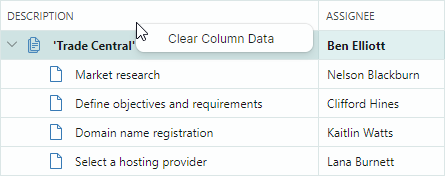
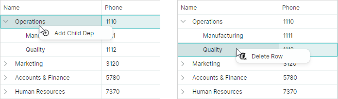
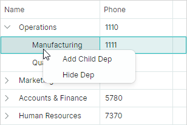

## 上下文菜单

TreeList 和 TreeView 控件支持内置的上下文菜单，当用户右键单击控件时会调用该菜单。您可以自定义这些菜单，为用户提供自定义的上下文相关命令。

## 内置列标题上下文菜单（TreeList）

当用户右键单击 TreeList 列标题时，控件会显示内置的列标题菜单。该菜单包含允许用户更改所单击列的排序设置的命令。


使用 `TreeListControl.ColumnMenu` 属性可以自定义此菜单。
您可以将 `Eremex.AvaloniaUI.Controls.Bars.PopupMenu` 对象分配给 `TreeListControl.ColumnMenu` 属性，以替换默认菜单。

要自定义现有的列标题菜单（添加或删除默认项），请在该菜单初始化完成后（例如，在 TreeList 的 `Initialized` 事件处理程序中）访问该菜单，然后对其进行修改。

### 数据上下文

列标题菜单及其菜单项（`ToolbarButtonItem` 对象）的 `DataContext` 属性指定了调用该菜单所针对的 `TreeListColumn` 对象。

### 示例 - 如何替换默认的列标题菜单

以下代码创建一个自定义的列标题菜单，其中包含 _Clear Column Data_ 菜单项。该代码将此菜单项绑定到在 ViewModel 中定义的 _ClearColumnDataCommand_ 命令。



请注意以下代码中菜单项的 `Command` 和 `CommandParameter` 属性的初始化方式。表达式 `CommandParameter="{Binding FieldName}"` 指定绑定到该菜单项 `DataContext`（即 `TreeListColumn.FieldName`）的 `FieldName` 属性。

`TreeListColumn` 的 `DataContext` 与 Tree List 的 `DataContext`（在本示例中为 _ViewModel_ 对象）相匹配。这使您可以通过表达式 `Command="{Binding DataContext.ClearColumnDataCommand}"` 访问该视图模型及其 _ClearColumnDataCommand_ 命令。


``` xml
xmlns:mxtl="https://schemas.eremexcontrols.net/avalonia/treelist"
xmlns:mxe="https://schemas.eremexcontrols.net/avalonia/editors"
xmlns:mxb="https://schemas.eremexcontrols.net/avalonia/bars"

<mxtl:TreeListControl Name="treeList1"
                    >
    <mxtl:TreeListControl.ColumnMenu>
        <mxb:PopupMenu>
            <mxb:ToolbarButtonItem
                Header="Clear Column Data"
                Command="{Binding DataContext.ClearColumnDataCommand}"
                CommandParameter="{Binding FieldName}">
            </mxb:ToolbarButtonItem>
        </mxb:PopupMenu>
    </mxtl:TreeListControl.ColumnMenu>
</mxtl:TreeListControl>
```
``` csharp
public MainView()
{
    DataContext = new ViewModel();
}

public partial class ViewModel : ObservableObject
{
    [RelayCommand]
    void ClearColumnData(string fieldName)
    {
        //...
    }
}
```

### 示例 - 如何修改现有的列标题菜单

以下示例向默认的列标题菜单添加了一个自定义命令。

该示例处理 `TreeListControl.Initialized` 事件，以便在默认列标题菜单初始化完成后访问它，并向该菜单添加 _Refresh Data_ 命令。


``` xml
xmlns:mxtl="https://schemas.eremexcontrols.net/avalonia/treelist"
xmlns:mxe="https://schemas.eremexcontrols.net/avalonia/editors"
xmlns:mxb="https://schemas.eremexcontrols.net/avalonia/bars"

<mxtl:TreeListControl Name="treeList1"
                      Initialized="OnInitialized"
                    >
```
``` csharp
using Eremex.AvaloniaUI.Controls.Bars;
using Eremex.AvaloniaUI.Controls.TreeList;

private void OnInitialized(object sender, System.EventArgs e)
{
    ToolbarButtonItem btn1 = new ToolbarButtonItem();
    btn1.Header = "Refresh Data";
    btn1.ShowSeparator = true;
    btn1.Command = new RelayCommand<TreeListControl>(UpdateTreeList);
    btn1.CommandParameter = treeList1;
    treeList1.ColumnMenu.Items.Add(btn1);
}

[RelayCommand]
void UpdateTreeList(TreeListControl treeList)
{
    //...
}
```


## 行单元格菜单（TreeList 和 TreeView）

TreeList 和 TreeView 控件都支持行单元格的内置上下文菜单（参阅 `TreeListControlBase.RowCellMenu` 属性）。该菜单最初为空，因此处于隐藏状态。要显示行单元格菜单，请在 XAML 或代码后置文件中为其填充菜单项。

### 数据上下文

行单元格菜单及其菜单项的 `DataContext` 包含一个 `CellData` 对象，该对象允许您访问上下文相关的信息：

- `CellData.DataControl` —— 返回调用该菜单所针对的容器控件（`TreeListControl`）。
- `CellData.Row` —— 返回被单击节点的底层数据对象。

### 示例 - 如何为所有行显示相同的上下文菜单命令

以下示例为所有行的行单元格菜单（`TreeListControlBase.RowCellMenu`）添加了 "_Delete Row_" 命令。


下面的 XAML 代码将一个弹出菜单分配给 `TreeListControlBase.RowCellMenu` 属性。该弹出菜单包含一个菜单项（`ToolbarButtonItem`），该菜单项绑定到在视图模型（Tree List 的 `DataContext`）中定义的 _DeleteRowCommand_ 命令。

``` xml
xmlns:mxtl="https://schemas.eremexcontrols.net/avalonia/treelist"
xmlns:mxe="https://schemas.eremexcontrols.net/avalonia/editors"
xmlns:mxb="https://schemas.eremexcontrols.net/avalonia/bars"

<mxtl:TreeListControl Name="treeList1"
                    AutoGenerateColumns="True"
                    ItemsSource="{Binding Departments}"
                    ChildrenFieldName="Children"
                    HasChildrenFieldName="HasChildren"
                    >
    <mxtl:TreeListControl.RowCellMenu>
        <mxb:PopupMenu>
            <mxb:PopupMenu.Items>
                <mxb:ToolbarButtonItem Header="Delete Row"
                 Command="{Binding DataControl.DataContext.DeleteRowCommand}"
                 CommandParameter="{Binding Row}">
                </mxb:ToolbarButtonItem>
            </mxb:PopupMenu.Items>
        </mxb:PopupMenu>
    </mxtl:TreeListControl.RowCellMenu>
</mxtl:TreeListControl>
```
``` csharp
public partial class MainView : UserControl
{
    MainViewModel viewModel = new MainViewModel();

    public MainView()
    {
        DataContext = viewModel;

        Department depOperations = new Department() 
        { 
            Name = "Operations", Phone = "1110", IsRoot = true 
        };
        Department depManufacturing = new Department() 
        { 
            Name = "Manufacturing", Phone = "1111" 
        };
        Department depQuality = new Department() 
        { 
            Name = "Quality", Phone = "1112" 
        };
        depOperations.Children.Add(depManufacturing);
        depOperations.Children.Add(depQuality);

        Department depMarketing = new Department() 
        { 
            Name = "Marketing", Phone = "3120", IsRoot = true 
        };
        Department depSales = new Department() 
        { 
            Name = "Sales", Phone = "3121" 
        };
        Department depCRM = new Department() 
        { 
            Name = "CRM", Phone = "3122" 
        };
        depMarketing.Children.Add(depSales);
        depMarketing.Children.Add(depCRM);

        Department depAccountsAndFinance = new Department() 
        { 
            Name = "Accounts & Finance", Phone = "5780", IsRoot = true 
        };
        Department depAccounts = new Department() 
        { 
            Name = "Sales", Phone = "5781" 
        };
        Department depFinance = new Department() 
        { 
            Name = "Finance", Phone = "5782" 
        };
        depAccountsAndFinance.Children.Add(depAccounts);
        depAccountsAndFinance.Children.Add(depFinance);

        Department depHumanResources = new Department() 
        { 
            Name = "Human Resources", Phone = "7370", IsRoot = true 
        };
        Department depHR = new Department() 
        { 
            Name = "HR", Phone = "7370" 
        };
        depHumanResources.Children.Add(depHR);

        viewModel.Departments.Add(depOperations);
        viewModel.Departments.Add(depMarketing);
        viewModel.Departments.Add(depAccountsAndFinance);
        viewModel.Departments.Add(depHumanResources);

        InitializeComponent();
    }
}

public partial class MainViewModel : ViewModelBase
{
    public MainViewModel() { }

    public ObservableCollection<Department> Departments { get; } = new();

    [RelayCommand]
    void DeleteRow(Department row)
    {
        DeleteRowRecursively(Departments, row);
    }

    bool DeleteRowRecursively(ObservableCollection<Department> departments, Department row)
    {
        foreach (Department dep in departments)
        {
            if (dep == row)
            {
                departments.Remove(row);
                return true;
            }
            if (DeleteRowRecursively(dep.Children, row))
                break;
        }
        return false;
    }
}

public partial class Department : ObservableObject
{
    [ObservableProperty]
    public string name = "";

    [ObservableProperty]
    public string phone = "0";

    [Browsable(false)]
    public bool IsRoot { get; set; } = false;

    public ObservableCollection<Department> Children { get; } = new();

    public bool HasChildren { get { return Children.Count > 0; } }

    public void AddDepartment(Department department)
    {
        Children.Add(department);
        if (Children.Count == 1)
            OnPropertyChanged(nameof(HasChildren));
    }
}
```

### 示例 - 如何为不同的行显示不同的上下文菜单命令

以下示例初始化了行的上下文菜单（`TreeListControlBase.RowCellMenu`），并为根行和嵌套行显示不同的菜单项。

根节点的上下文菜单显示 "_Add Child Dep_" 命令，而嵌套行的上下文菜单显示 "_Delete Row_" 命令。



XAML 代码定义了带有 "_Add Child Dep_" 和 "_Delete Row_" 命令的上下文菜单（`PopupMenu` 对象）。
对于根节点，会显示 "_Add Child Dep_" 命令。对于嵌套节点，会显示 "_Delete Row_" 命令。
这些命令的可见性由业务对象的 _IsRoot_ 属性动态管理。

``` xml
xmlns:mxtl="https://schemas.eremexcontrols.net/avalonia/treelist"
xmlns:mxe="https://schemas.eremexcontrols.net/avalonia/editors"
xmlns:mxb="https://schemas.eremexcontrols.net/avalonia/bars"

<mxtl:TreeListControl Name="treeList1"
                        AutoGenerateColumns="True"
                        ItemsSource="{Binding Departments}"
                        ChildrenFieldName="Children"
                        HasChildrenFieldName="HasChildren"
                    >
    <mxtl:TreeListControl.RowCellMenu>
        <mxb:PopupMenu>
            <mxb:PopupMenu.Items>
                <mxb:ToolbarButtonItem
                    Header="Add Child Dep"
                    Command="{Binding DataControl.DataContext.AddChildRowCommand}"
                    CommandParameter="{Binding Row}"
                    Glyph="/Assets/add.png"
                    IsVisible="{Binding Row.IsRoot}">
                </mxb:ToolbarButtonItem>
                <mxb:ToolbarButtonItem
                    Header="Delete Row"
                    Command="{Binding DataControl.DataContext.DeleteRowCommand}"
                    CommandParameter="{Binding Row}"
                    Glyph="/Assets/delete.png"
                    IsVisible="{Binding !Row.IsRoot}">
                </mxb:ToolbarButtonItem>
            </mxb:PopupMenu.Items>
        </mxb:PopupMenu>
    </mxtl:TreeListControl.RowCellMenu>
</mxtl:TreeListControl>
```
``` csharp
public partial class MainView : UserControl
{
    MainViewModel viewModel = new MainViewModel();

    public MainView()
    {
        DataContext = viewModel;

        Department depOperations = new Department() 
        { 
            Name = "Operations", Phone = "1110", IsRoot = true 
        };
        Department depManufacturing = new Department() 
        { 
            Name = "Manufacturing", Phone = "1111" 
        };
        Department depQuality = new Department() 
        { 
            Name = "Quality", Phone = "1112" 
        };
        depOperations.Children.Add(depManufacturing);
        depOperations.Children.Add(depQuality);

        Department depMarketing = new Department() 
        { 
            Name = "Marketing", Phone = "3120", IsRoot = true 
        };
        Department depSales = new Department() 
        { 
            Name = "Sales", Phone = "3121" 
        };
        Department depCRM = new Department() 
        { 
            Name = "CRM", Phone = "3122" 
        };
        depMarketing.Children.Add(depSales);
        depMarketing.Children.Add(depCRM);

        Department depAccountsAndFinance = new Department() 
        { 
            Name = "Accounts & Finance", Phone = "5780", IsRoot = true 
        };
        Department depAccounts = new Department() 
        { 
            Name = "Sales", Phone = "5781" 
        };
        Department depFinance = new Department() 
        { 
            Name = "Finance", Phone = "5782" 
        };
        depAccountsAndFinance.Children.Add(depAccounts);
        depAccountsAndFinance.Children.Add(depFinance);

        Department depHumanResources = new Department() 
        { 
            Name = "Human Resources", Phone = "7370", IsRoot = true 
        };
        Department depHR = new Department() 
        { 
            Name = "HR", Phone = "7370" 
        };
        depHumanResources.Children.Add(depHR);

        viewModel.Departments.Add(depOperations);
        viewModel.Departments.Add(depMarketing);
        viewModel.Departments.Add(depAccountsAndFinance);
        viewModel.Departments.Add(depHumanResources);

        InitializeComponent();
    }
}

public partial class MainViewModel : ViewModelBase
{
    public MainViewModel() { }

    public ObservableCollection<Department> Departments { get; } = new();

    [RelayCommand]
    void AddChildRow(Department parentRow)
    {
        parentRow.AddDepartment(new Department() 
        { 
            Name = "New dep", Phone = "0000" 
        });
    }

    [RelayCommand]
    void DeleteRow(Department row)
    {
        DeleteRowRecursively(Departments, row);
    }

    bool DeleteRowRecursively(ObservableCollection<Department> departments, Department row)
    {
        foreach (Department dep in departments)
        {
            if (dep == row)
            {
                departments.Remove(row);
                return true;
            }
            if (DeleteRowRecursively(dep.Children, row))
                break;
        }
        return false;
    }
}

public partial class Department : ObservableObject
{
    [ObservableProperty]
    public string name = "";

    [ObservableProperty]
    public string phone = "0";

    [Browsable(false)]
    public bool IsRoot { get; set; } = false;

    public ObservableCollection<Department> Children { get; } = new();

    public bool HasChildren { get { return Children.Count > 0; } }

    public void AddDepartment(Department department)
    {
        Children.Add(department);
        if (Children.Count == 1)
            OnPropertyChanged(nameof(HasChildren));
    }
}
```


### 示例 - 如何根据 ViewModel 生成上下文菜单命令

此示例展示了如何使用 ViewModel 中定义的菜单项来填充 TreeList 控件的行单元格菜单。



行单元格菜单（`TreeListControlBase.RowCellMenu`）中的菜单项（`ToolbarButtonItem` 对象）来自于 `PopupMenu.ItemsSource` 集合指定的项数据源。在本示例中，`PopupMenu.ItemsSource` 属性通过以下绑定表达式绑定到主视图模型中定义的 _MenuItems_ 集合：

``` xml
<mxb:PopupMenu ItemsSource="{Binding DataControl.DataContext.MenuItems}">
```

当 `PopupMenu` 为某个 TreeList 单元格显示时，该菜单的 `DataContext` 包含一个 `Eremex.AvaloniaUI.Controls.DataControl.Visuals.CellData` 对象。`CellData` 对象公开了 `DataControl` 属性，该属性允许您访问显示该菜单所针对的控件。
主视图模型被分配给了控件的 `DataContext`。因此，`DataControl.DataContext.MenuItems` 这种语法引用的是主视图模型中定义的 _MenuItems_ 集合。

`CellData` 对象还包含其他属性，允许您访问与单元格相关的信息（列、行对象等）。

这些菜单项使用样式进行初始化。菜单项的 `DataContext` 是 `PopupMenu.ItemsSource` 集合中的元素。在本示例中，`PopupMenu.ItemsSource` 属性存储了一个 _MenuItemViewModel_ 对象的集合。以下代码片段分别将 `ToolbarButtonItem.Header` 和 `ToolbarButtonItem.Command` 属性绑定到 _MenuItemViewModel.Header_ 和 _MenuItemViewModel.Command_ 属性。

``` xml
<mxb:PopupMenu.Styles>
    <Style Selector="mxb|ToolbarButtonItem">
        <Setter Property="Header" Value="{Binding Header}"/>
        <Setter Property="Command" Value="{Binding Command}"  />
    </Style>
</mxb:PopupMenu.Styles>
```

`ToolbarButtonItem` 的命令需要有关被右键单击的行的信息。为了将数据行传递给该命令，XAML 代码按如下方式设置了 `ToolbarButtonItem.CommandParameter` 属性：

``` xml
xmlns:mxvis="clr-namespace:Eremex.AvaloniaUI.Controls.DataControl.Visuals;
 assembly=Eremex.Avalonia.Controls"

<mxb:PopupMenu.Styles>
    <Style Selector="mxb|ToolbarButtonItem">
        ...
        <Setter Property="CommandParameter" 
         Value="{Binding $parent[mxvis:CellControl].DataContext.Row}"/>
    </Style>
</mxb:PopupMenu.Styles>
```

这里，表达式 `$parent[mxvis:CellControl]` 会遍历逻辑树以定位 `CellControl` 对象（它是 `ToolbarButtonItem` 的 `DataContext` 的父级）。`CellControl.DataContext` 对象包含一个 `Eremex.AvaloniaUI.Controls.DataControl.Visuals.CellData` 对象，该对象允许您通过 `CellData.Row` 属性访问数据行。

完整代码如下所示。

``` xml
xmlns:mxtl="https://schemas.eremexcontrols.net/avalonia/treelist"
xmlns:mxb="https://schemas.eremexcontrols.net/avalonia/bars"
xmlns:mxvis="clr-namespace:Eremex.AvaloniaUI.Controls.DataControl.Visuals;
 assembly=Eremex.Avalonia.Controls"

<mxtl:TreeListControl Name="treeList1"
                AutoGenerateColumns="True"
                ItemsSource="{Binding Departments}"
                ChildrenFieldName="Children"
                HasChildrenFieldName="HasChildren"
                ExpandStateFieldName="IsExpanded"
                FocusedItem="{Binding SelectedDepartment, Mode=TwoWay}"
            >
    <mxtl:TreeListControl.RowCellMenu>
        <mxb:PopupMenu ItemsSource="{Binding DataControl.DataContext.MenuItems}">
            <mxb:PopupMenu.Styles>
                <Style Selector="mxb|ToolbarButtonItem">
                    <Setter Property="Header" Value="{Binding Header}"/>
                    <Setter Property="Command" Value="{Binding Command }"  />
                    <Setter Property="CommandParameter" 
                     Value="{Binding $parent[mxvis:CellControl].DataContext.Row}"/>
                </Style>
            </mxb:PopupMenu.Styles>
        </mxb:PopupMenu>
    </mxtl:TreeListControl.RowCellMenu>
</mxtl:TreeListControl>
```
``` csharp
public partial class MainView : UserControl
{
    MainViewModel viewModel = new MainViewModel();

    public MainView()
    {
        DataContext = viewModel;

        Department depOperations = new Department() 
        { 
            Name = "Operations", Phone = "1110", IsRoot = true 
        };
        Department depManufacturing = new Department() 
        { 
            Name = "Manufacturing", Phone = "1111" 
        };
        Department depQuality = new Department() 
        { 
            Name = "Quality", Phone = "1112" 
        };
        depOperations.Children.Add(depManufacturing);
        depOperations.Children.Add(depQuality);

        Department depMarketing = new Department() 
        { 
            Name = "Marketing", Phone = "3120", IsRoot = true 
        };
        Department depSales = new Department() 
        { 
            Name = "Sales", Phone = "3121" 
        };
        Department depCRM = new Department() 
        { 
            Name = "CRM", Phone = "3122" 
        };
        depMarketing.Children.Add(depSales);
        depMarketing.Children.Add(depCRM);

        Department depAccountsAndFinance = new Department() 
        { 
            Name = "Accounts & Finance", Phone = "5780", IsRoot = true 
        };
        Department depAccounts = new Department() 
        { 
            Name = "Sales", Phone = "5781" 
        };
        Department depFinance = new Department() 
        { 
            Name = "Finance", Phone = "5782" 
        };
        depAccountsAndFinance.Children.Add(depAccounts);
        depAccountsAndFinance.Children.Add(depFinance);

        Department depHumanResources = new Department() 
        { 
            Name = "Human Resources", Phone = "7370", IsRoot = true 
        };
        Department depHR = new Department() 
        { 
            Name = "HR", Phone = "7370" 
        };
        depHumanResources.Children.Add(depHR);

        viewModel.Departments.Add(depOperations);
        viewModel.Departments.Add(depMarketing);
        viewModel.Departments.Add(depAccountsAndFinance);
        viewModel.Departments.Add(depHumanResources);

        InitializeComponent();
    }
}

public partial class MainViewModel : ViewModelBase
{
    [ObservableProperty]
    Department? selectedDepartment;

    public MainViewModel() 
    {
        MenuItemViewModel menuItem1 = new MenuItemViewModel();
        menuItem1.Header = "Add Child Dep";
        menuItem1.Command = new RelayCommand<Department>(AddChildRow);
        MenuItems.Add(menuItem1);

        MenuItemViewModel menuItem2 = new MenuItemViewModel();
        menuItem2.Header = "Hide Dep";
        menuItem2.Command = new RelayCommand<Department>(HideRow);
        MenuItems.Add(menuItem2);
    }

    public ObservableCollection<Department> Departments { get; } = new();

    public ObservableCollection<MenuItemViewModel> MenuItems { get; } = new();

    [RelayCommand]
    void AddChildRow(Department? parentRow)
    {
        if (parentRow == null) return;

        Department newDepartment = new() 
        { 
            Name = "New dep", Phone = "0000" 
        };
        parentRow.AddDepartment(newDepartment);
        parentRow.IsExpanded = true;
        SelectedDepartment = newDepartment;
    }

    [RelayCommand]
    void HideRow(Department? row)
    {
        //...
    }
}

public partial class MenuItemViewModel : ObservableObject
{
    [ObservableProperty]
    string? header;

    [ObservableProperty]
    ICommand? command;
}

public partial class Department : ObservableObject
{
    [ObservableProperty]
    public string name = "";

    [ObservableProperty]
    public string phone = "0";

    [ObservableProperty]
    public bool isExpanded;

    [Browsable(false)]
    public bool IsRoot { get; set; } = false;

    public ObservableCollection<Department> Children { get; } = new();

    public bool HasChildren => Children.Count > 0;

    public void AddDepartment(Department department)
    {
        Children.Add(department);
        if (Children.Count == 1)
            OnPropertyChanged(nameof(HasChildren));
    }
}
```

## 在显示时自定义菜单

您可以处理 `PopupMenu.Opening` 事件，以动态自定义 TreeList 的菜单。该事件会在 PopupMenu 即将显示之前发生。

## 示例 - 如何为第一列显示上下文菜单

以下示例将一个空的 `PopupMenu` 分配给 `TreeListControlBase.RowCellMenu` 属性，然后处理 `PopupMenu.Opening` 事件，以便在用户右键单击 TreeList 第一个可见列中的单元格时为该菜单填充菜单项。当用户在其他列中右键单击时，该菜单将保持为空（因此不会显示）。

创建的菜单包含 "_Show/Hide Root Indent_" 复选按钮，用于切换 TreeList 缩进（`TreeListControlBase.ShowRootIndent` 属性）的可见性。


``` xml
<mxtl:TreeListControl Name="treeList1" ...>
    <mxtl:TreeListControl.RowCellMenu>
        <mxb:PopupMenu Opening="RowCellMenuOpening"/>
    </mxtl:TreeListControl.RowCellMenu>
</mxtl:TreeListControl>
```
``` csharp
void RowCellMenuOpening(object sender, CancelEventArgs e)
{
    if (sender == null) return;
    PopupMenu menu = sender as PopupMenu;
    menu.Items.Clear();

    CellData cellData = menu.DataContext as CellData;
    TreeListControl control = cellData.DataControl as TreeListControl;
    TreeListColumn column = cellData.Column as TreeListColumn;
    //// Access the underlying data row, when required.
    //object dataRow = cellData.Row;

    if(column.VisibleIndex == 0)
    {
        ToolbarCheckItem btn1 = new ToolbarCheckItem();
        btn1.IsChecked = control.ShowRootIndent;
        btn1.Header = (control.ShowRootIndent) ? "Hide Root Indent" : "Show Root Indent";
        btn1.Command = new RelayCommand<TreeListControl>(ShowRootIndentCommand);
        btn1.CommandParameter = control;
        menu.Items.Add(btn1);
    }
}

[RelayCommand]
void ShowRootIndentCommand(TreeListControl treeList)
{
    treeList.ShowRootIndent = !treeList.ShowRootIndent;
}
```

## 使用 ToolbarManager 的附加属性为控件显示上下文菜单

`Eremex.AvaloniaUI.Controls.Bars.ToolbarManager` 组件提供了 `ContextPopup` 附加属性，允许您为任何控件（包括 TreeList 和 TreeView）分配上下文菜单。此上下文菜单会显示在没有默认上下文菜单的 TreeList/TreeView 区域，以及默认菜单为空的区域中。

### 示例 - 如何使用 _ToolbarManager.ContextPopup_ 附加属性分配上下文菜单

以下代码使用 `ToolbarManager.ContextPopup` 附加属性为 TreeList 控件指定一个上下文菜单。该菜单包含 _Show Column Header Panel_/_Hide Column Header Panel_ 菜单复选项，用于切换 `TreeListControl.ShowColumnHeaders` 选项的可见性。


``` xml
xmlns:mxtl="https://schemas.eremexcontrols.net/avalonia/treelist"

<mxtl:TreeListControl Name="treeList1">
    <mxtl:TreeListControl.Styles>
        <Style Selector="mxtl|TreeListControl">
            <Setter Property="mxb:ToolbarManager.ContextPopup" >
                <Template>
                    <mxb:PopupMenu Tag="treeList1">
                        <mxb:ToolbarCheckItem Header="Show Column Header Panel" 
                         IsChecked="{Binding $parent[mxtl:TreeListControl].ShowColumnHeaders, 
                          Mode=TwoWay}" 
                         IsVisible="{Binding !$parent[mxtl:TreeListControl].ShowColumnHeaders}"/>
                        <mxb:ToolbarCheckItem Header="Hide Column Header Panel" 
                        IsChecked="{Binding $parent[mxtl:TreeListControl].ShowColumnHeaders, 
                         Mode=TwoWay}" 
                        IsVisible="{Binding $parent[mxtl:TreeListControl].ShowColumnHeaders}"/>
                    </mxb:PopupMenu>
                </Template>
            </Setter>
        </Style>
    </mxtl:TreeListControl.Styles>
</mxtl:TreeListControl>
```

<br>
<br>

<sup>*</sup> 本页面使用机器翻译技术翻译。
