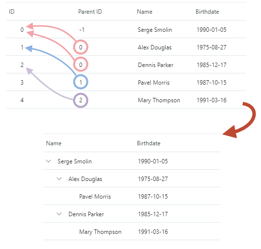

# 绑定到自引用数据源

您可以使用自引用数据源对记录之间的层次结构关系进行编码。自引用数据源是一个平面列表或记录集合。它的记录有两个指定父子关系的服务属性：

- _关键字段_ — 唯一的记录标识符（简单数据类型；例如，整数）。
- _父键字段_ — 父记录的_键字段_。

下图演示了自引用数据表的示例，以及在设置该控件的专用设置后显示此数据的 TreeList 控件。



应显示为根节点（在根级别）的所有记录都将“父键字段”设置为相同的根值。根值必须是唯一的——它不能与数据源中的任何关键字段匹配。

要将 TreeList/TreeView 控件绑定到自引用数据源，请执行以下操作：

- 确保数据源记录具有两个指定“键”字段和“父键字段”的公共属性。
- 将该控件的 `TreeListControlBase.KeyFieldName` 属性设置为键字段名称。
- 将该控件的 `TreeListControlBase.ParentFieldName` 属性设置为_父键字段_名称。
- 将该控件的 `TreeListControlBase.RootValue` 属性设置为为数据源中的根记录定义的根值。

## 服务栏的可见性

TreeList 默认情况下不创建绑定到服务关键字段的列。要允许该控件自动创建绑定到指定_键字段_和_父键字段_的列，请将 `AutoGenerateColumns` 和 `AutoGenerateServiceColumns` 属性设置为 `true`。

## 例子

以下示例将 TreeList 控件绑定到自引用数据源（_Employee_ 记录的集合）。Employee 类定义了两个属性（_ID_ 和 _ParentID_），分别指定记录的_键字段_和_父键字段_。根记录的_父键字段_设置为 **-1**，因此该控件的 `RootValue` 属性设置为该值。

``` xml
xmlns:mxtl="https://schemas.eremexcontrols.net/avalonia/treelist"
...
<mxtl:TreeListControl Grid.Column="0" Name="treeList2">                
    <mxtl:TreeListControl.Columns>
        <mxtl:TreeListColumn Name="colName1" FieldName="Name" />
        <mxtl:TreeListColumn Name="colBirthdate1" FieldName="Birthdate" >
            <mxtl:TreeListColumn.EditorProperties>
                <mxe:TextEditorProperties DisplayFormatString="yyyy-MM-dd"/>
            </mxtl:TreeListColumn.EditorProperties>
                        
        </mxtl:TreeListColumn>
    </mxtl:TreeListControl.Columns>
</mxtl:TreeListControl>
```
``` cs
using CommunityToolkit.Mvvm.ComponentModel;

ObservableCollection<Employee> employees = new ObservableCollection<Employee>();
employees.Add(new Employee() { 
    ID = 0, ParentID = -1, Name = "Serge Smolin", Birthdate = new DateTime(1990, 01, 5)});
employees.Add(new Employee() { 
    ID = 1, ParentID = 0, Name = "Alex Douglas", Birthdate = new DateTime(1975, 8, 27)});
employees.Add(new Employee() { 
    ID = 2, ParentID = 0, Name = "Dennis Parker", Birthdate = new DateTime(1985, 12, 17)});
employees.Add(new Employee() { 
    ID = 3, ParentID = 1, Name = "Pavel Morris", Birthdate = new DateTime(1987, 10, 15)});
employees.Add(new Employee() { 
    ID = 4, ParentID = 2, Name = "Mary Thompson", Birthdate = new DateTime(1991, 03, 16)});
employees.Add(new Employee() { 
    ID = 5, ParentID = 3, Name = "Vera Liskina", Birthdate = new DateTime(1991, 04, 16)});

treeList2.KeyFieldName = "ID";
treeList2.ParentFieldName = "ParentID";
treeList2.RootValue = -1;

treeList2.ItemsSource = employees;

public partial class Employee : ObservableObject
{
    [ObservableProperty]
    public string name = "";

    [ObservableProperty]
    public DateTime? birthdate = null;

    public int ID { get; set; }

    public int ParentID { get; set; }

}
```

# 另请参阅
- [数据绑定](./index.md)
- [绑定到层级数据](binding-to-hierarchical-data.md)
- [列](../columns.md)
- [如何创建 TreeView 控件并将其绑定到自引用数据源](../examples/how-to-create-a-treeview-control-and-bind-it-to-a-self-referential-data-source.md)

<br>
<br>

<sup>*</sup> 本页面使用机器翻译技术翻译。
