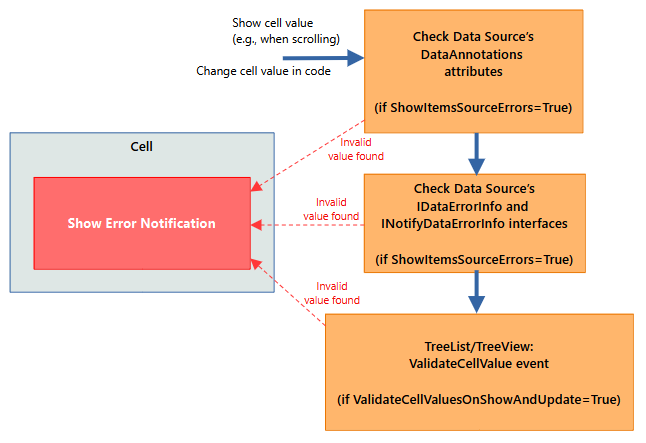

# 数据验证

数据验证机制允许您检查单元格值,并在包含无效数据的单元格中显示错误。

TreeList 和 TreeView 在用户修改单元格值并尝试保存(提交)该值时执行数据验证。控件还会对新显示的单元格以及在代码中更新的单元格调用验证机制,即使用户并未修改单元格值。

## 用户修改单元格数据时验证值

当用户修改单元格值并尝试将其保存到数据源中时(例如,用户按下 ENTER 键或将焦点移动到另一个单元格),TreeList 和 TreeView 会激活单元格值验证机制。下图展示了用户修改单元格值时执行的验证机制各个阶段:


1. 单元格的即时编辑器在数据输入期间执行初始值验证。例如,只接受数字值的 `SpinEditor` 会在用户尝试输入字母时显示错误。

    在输入有效值之前,用户无法离开该单元格,除非按下 ESC 键将值还原为先前的值。

1. TreeList/TreeView 会检查数据源的业务对象是否应用了[DataAnnotations 特性](#dataannotations-特性),然后根据这些规则验证数据。如果 `DataControlBase.ShowItemsSourceErrors` 属性设置为 `true`(默认值),则会启用此验证阶段。

    在输入有效值之前,用户无法离开该单元格,除非按下 ESC 键将值还原为先前的值。


1. 控件引发[`DataControlBase.ValidateCellValue` 事件](#控件的-validatecellvalue-事件),您可以处理该事件以实现自定义值验证。

    在输入有效值之前,用户无法离开该单元格,除非按下 ESC 键将值还原为先前的值。

1. 控件提交单元格值。在此步骤中,如果提交的数据无效,数据源可能会引发异常。如果捕获到任何异常,控件会在单元格中显示错误。

    在输入有效值之前,用户无法离开该单元格,除非按下 ESC 键将值还原为先前的值。

1. TreeList/TreeView 会检查业务对象是否实现了 [IDataErrorInfo](#idataerrorinfo-接口) 或 [INotifyDataErrorInfo 接口](#inotifydataerrorinfo-接口),并使用这些接口获取单元格错误(如果有)。如果 `DataControlBase.ShowItemsSourceErrors` 属性设置为 `true`(默认值),则会启用此验证阶段。

    由于值已经被提交,即使单元格值无效,控件也允许用户离开该单元格。


## 验证新显示的单元格和在代码中更新的单元格的值

即使用户未修改单元格值,控件也支持对新显示和已更新的单元格进行验证。控件会在以下情况下验证单元格值:

- 控件首次显示时,单元格会在可视区域内绘制。
- 滚动控件时单元格变为可见。
- 单元格值在代码中被修改,因此控件需要重新绘制该单元格。

下图展示了这些场景中验证机制的各个阶段:



1. TreeList/TreeView 会检查数据源的业务对象是否应用了[DataAnnotations 特性](#dataannotations-特性),然后根据这些规则验证数据。如果 `DataControlBase.ShowItemsSourceErrors` 属性的值为 `true`(默认值),则会启用此验证阶段。

1. TreeList/TreeView 会检查业务对象是否实现了 [IDataErrorInfo](#idataerrorinfo-接口) 或 [INotifyDataErrorInfo 接口](#inotifydataerrorinfo-接口),并使用这些接口获取单元格错误(如果有)。如果 `DataControlBase.ShowItemsSourceErrors` 属性设置为 `true`(默认值),则会启用此验证阶段。

1. 控件引发[`DataControlBase.ValidateCellValue` 事件](#控件的-validatecellvalue-事件),您可以处理该事件以实现自定义值验证。如果 `DataControlBase.ValidateCellValuesOnShowAndUpdate` 属性的值为 `true`(默认值为 `false`),则会启用此验证阶段。


## 数据源验证规则

如果启用了 `DataControlBase.ShowItemsSourceErrors` 属性(默认行为),TreeList/TreeView 会使用应用于数据源业务对象的 `DataAnnotations` 特性和 `IDataErrorInfo` 接口来验证数据。

### DataAnnotations 特性

您可以将 `DataAnnotations` 验证特性(`System.ComponentModel.DataAnnotations.ValidationAttribute` 的派生类)应用于业务对象,以指定该对象属性的验证规则。下表列出了最常用的验证特性:

- [`CompareAttribute`](https://learn.microsoft.com/en-us/dotnet/api/system.componentmodel.dataannotations.compareattribute?view=net-7.0) — 提供一个用于比较两个属性的特性。
- [`CustomValidationAttribute`](https://learn.microsoft.com/en-us/dotnet/api/system.componentmodel.dataannotations.customvalidationattribute?view=net-7.0) — 指定用于验证属性或类实例的自定义验证方法。
- [`MaxLengthAttribute`](https://learn.microsoft.com/en-us/dotnet/api/system.componentmodel.dataannotations.maxlengthattribute?view=net-8.0) — 指定属性中允许的数组或字符串数据的最大长度。
- [`MinLengthAttribute`](https://learn.microsoft.com/en-us/dotnet/api/system.componentmodel.dataannotations.minlengthattribute?view=net-8.0) — 指定属性中允许的数组或字符串数据的最小长度。
- [`RangeAttribute`](https://learn.microsoft.com/en-us/dotnet/api/system.componentmodel.dataannotations.rangeattribute?view=net-8.0) — 指定数据字段值的数值范围约束。
- [`RegularExpressionAttribute`](https://learn.microsoft.com/en-us/dotnet/api/system.componentmodel.dataannotations.regularexpressionattribute?view=net-8.0) — 指定数据字段值必须匹配指定的正则表达式。
- [`RequiredAttribute`](https://learn.microsoft.com/en-us/dotnet/api/system.componentmodel.dataannotations.requiredattribute?view=net-8.0) — 指定数据字段值为必填项。
- [`StringLengthAttribute`](https://learn.microsoft.com/en-us/dotnet/api/system.componentmodel.dataannotations.stringlengthattribute?view=net-8.0) — 指定数据字段中允许的字符的最小和最大长度。

#### 示例

以下代码将 `StringLength` 特性应用于业务对象的 _Code_ 属性。该特性要求用户输入长度不少于 4 个但不超过 8 个字符的字符串。

``` csharp
public partial class Department : ObservableObject, IDataErrorInfo
{
    //...

    [ObservableProperty]
    [property: StringLength(8, MinimumLength = 4)]
    public string code = "0000";
}
```

### 'IDataErrorInfo' 接口

您可以为业务对象实现 [`System.ComponentModel.IDataErrorInfo`](https://learn.microsoft.com/en-us/dotnet/api/system.componentmodel.idataerrorinfo?view=net-7.0) 接口,以指定该业务对象属性的验证规则。

目前,TreeList 和 TreeView 只支持为单个单元格设置的错误,不支持为整行设置错误。因此,只有 `IDataErrorInfo.Item[String]` 属性有效,`IDataErrorInfo.Error` 属性会被忽略。

#### 示例 - 实现 'IDataErrorInfo' 接口

以下示例为业务对象实现了 `IDataErrorInfo` 接口,当 _Phone_ 属性为空时返回错误。

``` csharp
public partial class Department : ObservableObject, IDataErrorInfo
{
    //... 

    [ObservableProperty]
    public string phone = "0";

    string IDataErrorInfo.this[string columnName]
    {
        get
        {
            if (columnName != "Phone")
                return "";
            return string.IsNullOrEmpty(this.Phone) ? "Please specify the phone number" : "";
        }
    }
    string IDataErrorInfo.Error
    {
        get { return ""; }
    } 
}
```

### 'INotifyDataErrorInfo' 接口

`System.ComponentModel.INotifyDataErrorInfo` 接口允许您在业务对象级别实现自定义验证规则。该接口支持同步和异步验证、每个属性的多个错误,以及跨属性的错误。

#### 示例 - 实现 'INotifyDataErrorInfo' 接口

以下示例演示了如何为业务对象(_ProjectTask_)实现 `INotifyDataErrorInfo` 接口。该接口用于为 _ProjectTask.EstimateTime_ 属性定义验证规则。当该属性的值违反验证规则时,TreeList 会在相应的单元格中显示错误。

下面展示的 `INotifyDataErrorInfo` 接口实现支持同一属性同时存在多个错误。


``` xml
<mxtl:TreeListControl x:Name="treeList" ItemsSource="{Binding Tasks}"...>
    <mxtl:TreeListColumn FieldName="EstimateTime" Header="Estimate Time (h)" Width="*" />
</mxtl:TreeListControl>
```

``` csharp
public partial class TreeListDataEditorsPageViewModel : PageViewModelBase
{
    //...
    public List<ProjectTask> Tasks { get; }
}


public partial class ProjectTask : ObservableObject, INotifyDataErrorInfo
{
    public ProjectTask(ProjectTask parent, string description, TaskStatus status, 
      int estimateTime, int timeSpent, string assignee, DateTime dueDate)
    {
        Tasks = new();
        Parent = parent;
        this.estimateTime = estimateTime;
        //...
    }

    [ObservableProperty]
    private int estimateTime;


    private Dictionary<string, List<string>> propertyErrors = new Dictionary<string, List<string>>();

    partial void OnEstimateTimeChanged(int oldValue, int newValue) => ValidateEstimateTime();

    public bool HasErrors => propertyErrors.Any();

    public event EventHandler<DataErrorsChangedEventArgs> ErrorsChanged;

    public System.Collections.IEnumerable GetErrors(string propertyName)
    {
        if (propertyErrors.ContainsKey(propertyName))
            return propertyErrors[propertyName];
        else
            return null;
    }

    private void RaiseErrorsChanged(string propertyName)
    {
        ErrorsChanged?.Invoke(this, new DataErrorsChangedEventArgs(propertyName));
    }

    private void ValidateEstimateTime()
    {
        ClearErrors(nameof(EstimateTime));

        if (EstimateTime < 1)
            AddError(nameof(EstimateTime), "The Estimate Time cannot be less than 1.");
        if (EstimateTime > 800)
            AddError(nameof(EstimateTime), "The Estimate Time cannot be greater than 800");
            
    }

    private void AddError(string propertyName, string error)
    {
        if (!propertyErrors.ContainsKey(propertyName))
            propertyErrors[propertyName] = new List<string>();

        if (!propertyErrors[propertyName].Contains(error))
        {
            propertyErrors[propertyName].Add(error);
            RaiseErrorsChanged(propertyName);
        }
    }

    private void ClearErrors(string propertyName)
    {
        if (propertyErrors.ContainsKey(propertyName))
        {
            propertyErrors.Remove(propertyName);
            RaiseErrorsChanged(propertyName);
        }
    }

    public ProjectTask Parent { get; }
    public List<ProjectTask> Tasks { get; }
    //...
}
```

## 控件的 'ValidateCellValue' 事件

`DataControlBase.ValidateCellValue` 事件允许您实现自定义的值验证逻辑。

引发 `DataControlBase.ValidateCellValue` 事件是验证机制中一个不可选的阶段,在用户修改单元格值之后被调用。

该验证机制也用于检查新显示的单元格和在代码中更新的单元格的有效性。在这种情况下,只有当继承的 `DataControlBase.ValidateCellValuesOnShowAndUpdate` 属性为 `true`(默认值为 `false`)时,`DataControlBase.ValidateCellValue` 事件才会被引发。

### 示例 

以下示例处理 `ValidateCellValue` 事件,以便在 _Date1_ 属性的值大于 _Date2_ 属性的值时显示错误。

``` csharp
public partial class Department : ObservableObject, IDataErrorInfo
{
    [ObservableProperty]
    public DateTime date1 = new DateTime();

    [ObservableProperty]
    public DateTime date2 = new DateTime();
}

treeList1.ValidateCellValue += TreeList1_ValidateCellValue;

// Uncomment the following code line to use the ValidateCellValue event handler
// to check cells when they are displayed or modified in code:

// treeList1.ValidateCellValuesOnShowAndUpdate = true;

private void TreeList1_ValidateCellValue(object? sender, TreeListValidateCellValueEventArgs e)
{
    Department dep = e.Node.Content as Department;
        
    if(e.Column.FieldName == "Date1")
    {
        DateTime value1 = Convert.ToDateTime(e.Value);
        DateTime value2 = dep.Date2;
        if(value1 > value2)
        {
            e.ErrorContent = "Date1 must be less than Date2";
            return;
        }
    }
}
```

<br>
<br>

<sup>*</sup> 本页面使用机器翻译技术翻译。
