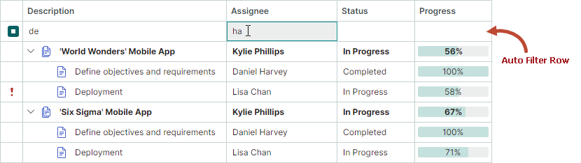

# 过滤和搜索

TreeList 和 TreeView 支持数据过滤和搜索功能,允许您根据节点的值来定位节点。


## 列过滤器 (TreeList)

用户可以使用过滤菜单来过滤 TreeList 的列。
要打开某一列的过滤菜单,请将鼠标悬停在该列的标题上,直到出现过滤按钮,然后点击它。打开的过滤菜单包含该列中所有唯一的值。在过滤菜单中选择一项,即可按该值过滤该列。


用户可以对多个列同时进行过滤。应用于多个列的过滤条件通过 AND 运算符组合。


### 'List' 和 'Checked List' 显示模式

过滤菜单可以使用以下两种显示模式之一来呈现项(列值):

- `List`(默认)— 一个常规列表,一次只能选择一项。

    


- `CheckedList` — 一个带复选框的列表,允许用户同时选择多项。

    


您可以全局为所有列设置过滤菜单的显示模式,也可以使用以下属性为单个列单独设置:

- `TreeListControl.ColumnFilterPopupMode`(默认值为 `List`)— 指定所有列过滤菜单的默认显示模式。此设置应用于其 `TreeListColumn.FilterPopupMode` 属性设置为 `null` 的列。

- `TreeListColumn.FilterPopupMode`(默认值为 `null`)— 指定单个列的过滤菜单显示模式。设置后,此属性会覆盖全局设置(`TreeListControl.ColumnFilterPopupMode`)。

以下示例将 `CheckedList` 显示模式应用于所有列,并将 `List` 显示模式应用于 _City_ 列。

``` cs
treeList.ColumnFilterPopupMode = Eremex.AvaloniaUI.Controls.DataControl.FilterPopupMode.CheckedList;
treeList.Columns["City"].FilterPopupMode = Eremex.AvaloniaUI.Controls.DataControl.FilterPopupMode.List;
```

### 过滤面板

应用过滤器后,底部会出现过滤面板。它显示当前应用的过滤条件,并允许您临时禁用和清除过滤器。


要了解如何以编程方式进行过滤,请参阅以下部分:

- [在代码中过滤](#在代码中过滤-treelist-和-treeview)


### 相关 API

**TreeList 成员**

- `AllowColumnFiltering` — 获取或设置是否为所有列启用过滤按钮。您可以使用列的 `ColumnBase.AllowColumnFiltering` 属性为单个列覆盖此全局设置。

    例如,若要禁用除某一列以外所有列的过滤按钮,请将 `TreeListControl.AllowColumnFiltering` 属性设置为 `false`,并将目标列的 `ColumnBase.AllowColumnFiltering` 属性设置为 `true`。

- `ColumnFilterButtonDisplayMode` — 获取或设置过滤按钮是始终可见,还是仅在用户将鼠标悬停在列标题上时才出现(默认)。

- `ColumnFilterPopupMode` — 获取或设置所有列过滤菜单的默认显示模式(`List` 或 `CheckedList`)。使用列的 `FilterPopupMode` 属性可为单个列覆盖此设置。

- `CustomColumnDisplayText` 事件 — 允许您为列值(包括过滤菜单和过滤面板中的值)提供自定义显示文本。当 `CustomColumnDisplayText` 事件针对过滤面板中的值触发时,该事件的 `Node` 参数返回 `null`。

- `FilterPanelText` — 获取过滤面板中显示的过滤器的文本表示形式。

- `FilterPanelDisplayMode` — 获取或设置过滤面板的可见性模式。可用选项包括:

    - `Auto`(默认)— 当任意列应用了过滤器时,过滤面板会出现。
    - `Never` — 过滤面板始终隐藏。

- `FilterString` — 获取或设置应用于控件的过滤条件。您可以使用此属性[在代码中构建过滤器](#在代码中过滤-treelist-和-treeview)。TreeList 和 TreeView 都支持 `FilterString` 属性。

- `IsFilterEnabled` — 获取或设置过滤器是否处于激活状态。TreeList 和 TreeView 都支持 `IsFilterEnabled` 属性。

- `IsFilterPanelVisible` — 获取过滤面板当前是否可见。


**列成员**

 - `ColumnBase.AllowColumnFiltering` — 获取或设置当前列是否允许显示过滤按钮。若要为所有列启用或禁用过滤按钮,请参见 `TreeListControl.AllowColumnFiltering` 设置。`ColumnBase.AllowColumnFiltering` 选项允许您为单个列覆盖 `TreeListControl.AllowColumnFiltering` 设置。
 - `ColumnBase.ColumnFilterMode` — 获取或设置列数据的过滤方式。可用选项包括:

    - `Value` — 按底层值过滤列数据。
    - `DisplayText` — 按单元格显示文本过滤列数据。

<!-- TODO 
Explore this feature. When data is filtered by values and when by display text by default.
-->

- `ColumnBase.FilterPopupMode` — 获取或设置单个列的过滤菜单显示模式(`List` 或 `CheckedList`)。设置后,此属性会覆盖控件的 `ColumnFilterPopupMode` 属性。

 - `ColumnBase.IsFiltered` — 获取当前列是否已应用过滤器。
 - `ColumnBase.RoundDateTimeForColumnFilter` — 获取或设置在为显示 DateTime 值的列构建过滤器时,是否忽略 DateTime 值中的时间部分。此属性对通过列过滤菜单和[自动筛选行](#自动筛选行-treelist)创建的过滤器生效。

<!-- TODO
Add screenshots for RoundDateTimeForColumnFilter
 -->


## 搜索面板 (TreeList 和 TreeView)

搜索面板可帮助用户根据行中所包含的数据快速定位行。当用户在搜索面板中输入文本时,控件会显示包含该文本的行。


- 搜索功能不区分大小写。
- 数据搜索使用**Contains**(包含)比较运算符。
- 数据搜索在 TreeList 的所有列中进行。

将控件的 `SearchPanelDisplayMode` 属性(继承自 `DataControlBase` 类)设置为以下值之一以启用搜索面板:

- `SearchPanelDisplayMode.Always` — 控件始终显示搜索面板。
- `SearchPanelDisplayMode.HotKey` — 当用户按下 CTRL+F 快捷键时,控件显示搜索面板。按 ESC 会清除搜索面板中的内容,再次按 ESC 则关闭该面板。用户还可以通过列标题的上下文菜单激活搜索面板。

`TreeListControlBase.FilterMode` 属性指定在找到匹配项时显示哪些节点。支持以下三种过滤模式:

- `FilterMode.ShowMatches` — 显示与搜索文本匹配的节点。
- `FilterMode.ShowMatchesWithAncestors` — 显示与搜索文本匹配的节点及其父节点。
- `FilterMode.ShowBranchesWithMatches` — 如果整个分支中包含匹配过滤条件的节点,则显示整个分支。

### 在折叠节点中搜索

在数据搜索/过滤期间,TreeList/TreeView 可以在已折叠的节点内进行搜索。将 `TreeListControlBase.ExpandNodesOnFiltering` 选项设置为 `true`,即可在折叠节点中进行搜索,并在找到匹配项时自动展开这些节点。

控件仅在当前已加载的节点中进行搜索。对于[层次化数据源](data-binding/index.md#层次化数据源),您可以将 `AllowDynamicDataLoading` 属性设置为 `false`,以禁用动态节点加载,一次性加载所有节点。

### 相关 API

- `DataControlBase.IsSearchPanelVisible` — 获取搜索面板当前是否可见。
- `DataControlBase.SearchPanelHighlightResults` — 指定是否在找到的节点中高亮显示搜索文本。该属性的默认值为 `true`。
- `DataControlBase.SearchText` — 获取或设置搜索文本。您可以为该属性赋值以在代码中过滤控件。即使搜索面板被隐藏或禁用(`SearchPanelDisplayMode` 属性设置为 `SearchPanelDisplayMode.Never`),此过滤功能依然受支持。
- `DataControlBase.ShowSearchPanelCloseButton` — 允许您隐藏搜索面板内置的关闭按钮。
- `TreeListControlBase.ExpandNodesOnFiltering` — 指定在数据搜索/过滤期间,当折叠节点的子节点匹配当前过滤/搜索条件时,是否展开该折叠节点。

### 示例
以下代码使搜索面板始终可见,并启用连同其父节点一起显示过滤后节点的功能。`SearchText` 属性用于设置搜索文本。

``` csharp
treeList.SearchPanelDisplayMode = SearchPanelDisplayMode.Always;
treeList.FilterMode = FilterMode.ShowMatchesWithAncestors;
treeList.SearchText = "department";
```

## 自动筛选行 (TreeList)

自动筛选行是显示在所有 TreeList 节点上方的一个特殊行。它允许用户在其单元格中输入文本,以按相应的列过滤数据。



- 过滤功能不区分大小写。
- 若要在折叠节点中搜索并在找到匹配项时展开这些节点,请将 `TreeListControlBase.ExpandNodesOnFiltering` 选项设置为 `true`。另请参阅:[在折叠节点中搜索](#在折叠节点中搜索)。
- 控件的默认过滤模式是仅显示与指定条件匹配的节点。将 `TreeListControlBase.FilterMode` 属性设置为 `FilterMode.ShowMatchesWithAncestors`,可以连同父节点一起显示目标节点。

### 启用自动筛选行

将 `TreeList.ShowAutoFilterRow` 属性设置为 `true`。

### 启用运行时过滤运算符选择器

您可以允许用户在运行时为自动筛选行的单元格选择过滤逻辑。启用此功能后,每个自动筛选行单元格中都会出现一个过滤运算符图标。用户可以点击此图标打开下拉菜单并选择所需的运算符。


使用以下属性可启用过滤运算符选择器:

- `TreeListControl.ShowConditionInAutoFilterRow`(默认为 `false`)— 指定所有自动筛选行单元格(列)的过滤运算符选择器的默认可见性。
- `ColumnBase.ShowConditionInAutoFilterRow` — 为单个列启用或禁用过滤运算符选择器。此属性会覆盖 `TreeListControl.ShowConditionInAutoFilterRow` 设置。


### 在代码中指定过滤运算符

使用 `ColumnBase.AutoFilterCondition` 属性以编程方式为单个自动筛选行单元格(列)指定过滤运算符。支持以下过滤运算符:

- `Contains`(适用于字符串值)— 行的值必须包含输入的文本。
- `Default` — 默认模式。

    - 对于 String 和 Object 数据类型,`Default` 等同于 `Contains` 选项。
    - 对于其他数据类型,`Default` 等同于 `Equals` 选项。

- `DoesNotContain`(适用于字符串值)— 行的值不得包含输入的文本。
- `DoesNotEqual` — 目标列中行的值不得与输入的值匹配。
- `EndsWith`(适用于字符串值)— 行的值必须以输入的文本结尾。
- `Equals` — 行的值必须与输入的值匹配。
- `Greater` — 行的值必须大于输入的值。
- `GreaterOrEqual` — 行的值必须大于或等于输入的值。
- `Less` — 行的值必须小于输入的值。
- `LessOrEqual` — 行的值必须小于或等于输入的值。
- `StartsWith`(适用于字符串值)— 行的值必须以输入的文本开头。


### 指定过滤值

`ColumnBase.AutoFilterValue` 属性允许您在代码中为特定的自动筛选行单元格设置值。即使自动筛选行被隐藏,您也可以使用 `ColumnBase.AutoFilterValue` 属性来过滤 TreeList。


### 示例

以下代码激活自动筛选行,并显示 'Name' 列中值以 "M" 开头的节点。

``` csharp
treeList1.ShowAutoFilterRow = true;
TreeListColumn colName = treeList1.Columns["Name"];
colName.AutoFilterCondition = AutoFilterCondition.StartsWith;
colName.AutoFilterValue = "M";
```

## 使用事件动态过滤节点

`CustomNodeFilter` 事件允许您根据自定义条件隐藏特定节点。此事件会在以下情况下针对每个节点触发:

- 控件的项源发生变化。
- 控件的节点被过滤(例如,使用搜索面板和/或自动筛选行)。
- 调用了控件的 `RefreshData` 方法。

使用 `Node` 事件参数来标识当前正在处理的节点。若要隐藏该节点,请将 `Visible` 事件参数设置为 `false`。

### 示例 - 使用事件过滤行

在以下示例中,一个 TreeList 控件显示 _ProjectTask_ 对象的列表。处理 `CustomNodeFilter` 事件以实现自定义的节点过滤。节点会根据 _ProjectTask.Status_ 属性的值被隐藏。

假设该示例包含一个 "Enable Filter" 切换按钮,用于激活和停用自定义过滤。点击该按钮时,`ToggleButton.IsCheckedChanged` 事件处理程序会调用 `RefreshData` 方法来刷新 TreeList 节点,并重新触发 `CustomNodeFilter` 事件。

``` xml
<ToggleButton Name="btnEnableFilter" Content="Enable Filter" IsCheckedChanged="BtnEnableFilter_IsCheckedChanged"/>

<mxtl:TreeListControl x:Name="treeList" CustomNodeFilter="TreeList_CustomNodeFilter">
<!-- ... -->
```

``` cs
using Eremex.AvaloniaUI.Controls.TreeList;

private void BtnEnableFilter_IsCheckedChanged(object sender, RoutedEventArgs e)
{
    treeList.RefreshData();
}

private void TreeList_CustomNodeFilter(object sender, TreeListCustomNodeFilterEventArgs e)
{
    bool filterEnabled = btnEnableFilter.IsChecked == true;
    if (!filterEnabled)
        return;
    ProjectTask task = e.Node.Content as ProjectTask;
    e.Visible = task.Status!= DemoData.TaskStatus.Completed;
}
```

## 在代码中过滤 (TreeList 和 TreeView)

从 1.2 版本开始,您可以使用 `DataControlBase.FilterString` 属性以编程方式过滤 TreeList 和 TreeView 中的数据。

``` cs
treeList.FilterString = "[Description] == 'Front-end development' && [Assignee] == 'Tim Robinson'";
```


过滤字符串由若干独立的过滤表达式组成,这些表达式通过[逻辑运算符(AND 或 OR)](#逻辑运算符)进行组合。

### 清除和禁用过滤器

- 若要清除过滤器,请将 `FilterString` 属性设置为 `null` 或空字符串。
- 若要临时禁用过滤器,请使用 `DataControlBase.IsFilterEnabled` 属性。

### 指定列

在过滤字符串中,列应通过用方括号括起来的字段名来引用。示例:

- `[FirstName]`
- `[Position]`

### 指定常量

- 数值常量必须使用标准的数值格式指定。示例:

    - `500`、`0`
    - `10.314`、`.5` 
    - `12.0m`/`12.0M`、`12d`/`12D`、`12f`/`12F`
    - `-32.5`
- 字符串常量必须用单引号字符(`'`)括起来。若要插入字面量 `'`,请使用 `''` 表示法。示例:

    - `'Research and Development'`
    - `'Clair de lune'`
    - `'O''Neil'`

- DateTime 和 DateTimeOffset 常量必须用 `#` 字符括起来,并使用固定区域性(invariant culture)格式指定。示例:

    - `#2018-03-22#`
    - `#2018-03-22 13:18:51#`
    - `#2018-03-22 13:18:51.94944#`

- DateOnly 和 TimeOnly 常量必须括在 `#!` 和 `!#` 字符串之间。示例:

    - `#!2026-01-01!#`
    - `#!12:23:45!#`

- 布尔常量:
    - `true`、`True` 或 `TRUE` 
    - `false`、`False` 或 `FALSE`


### 逻辑运算符

您可以使用以下逻辑运算符来组合过滤字符串中的各个表达式:

- `&&`、`and`、`And` 或 `AND`
- `||`、`or`、`Or` 或 `OR`

``` cs
treeList.FilterString = "[Price] < 5 OR [Price] > 15";
```

### 运算符和函数

下表列出了用于构建过滤表达式的可用运算符和函数:

| 运算符和函数 | 说明 | 示例 |
| --- | --- | --- |
| `=` 或 `==` | 等于 | `[Price] = 500` |
| `!=` 或 `<>` | 不等于 | `[Price] != 500` |
| `<` | 小于 | `[Price] < 700` |
| `>` | 大于 | `[Price] > 600` |
| `<=` | 小于或等于 | `[Price] <= 600` |
| `>=` | 大于或等于 | `[Price] >= 800` |
| `is null` | 选择 null 值 | `[Region] is null` |
| `is not null` | 选择非 null 值 | `[Region] is not null` |
| `IsNull` | 选择 null 值 | `IsNull([Region])` |
| `IsNullOrEmpty` | 选择 null 值和空字符串 | `IsNullOrEmpty([Region])` |
| `In` | 选择具有指定值之一的项。 | `[City] In ('Beijing', 'Shenzhen', 'Chengdu')` |
| `Contains` | 选择包含指定字符串的项。Contains 运算符不区分大小写。 | `Contains([Name], 'lan')` |
| `StartsWith` | 选择以指定字符串开头的项。StartsWith 运算符不区分大小写。 | `StartsWith([Product], 'CPU')` |
| `EndsWith` | 选择以指定字符串结尾的项。EndsWith 运算符不区分大小写。 | `EndsWith([Product], '9950X')` |
| `!`、`not`、`Not` 或 `NOT` | 否定运算符 | `!Contains([Maker], 'amd')` |


### 高级过滤表达式

您可以使用 `Eremex.AvaloniaUI.Controls.Data.Filtering.ExprStringBuilder` 类来创建高级过滤条件。这些过滤条件可以包括对操作数的运算、对支持的函数的调用等等。要构建过滤条件,请使用 `ExprStringBuilder` 类的成员。

要获取过滤字符串,请调用生成的 `ExprStringBuilder` 对象的 `ToString` 方法。然后,您可以将此过滤字符串赋值给目标控件的 `DataControlBase.FilterString` 属性。


``` cs
// [Price] * [Stock] > 5000m
// Note: All operands ([Price], [Stock] and '5000') must be of the same data type (e.g., decimal). Otherwise, the control will fail to evaluate the expression.
var filter = ExprStringBuilder.Property("Price").Multiply(ExprStringBuilder.Property("Stock")).GreaterThanValue(5000m);
var filterString = filter.ToString();
control.FilterString = filterString;
```

!!! Important

    目前,表达式的操作数(列数据类型和常量)必须具有相同的数据类型。目前不支持在同一表达式中使用不同的数据类型(例如 decimal 和 integer)。


``` cs 
// [PropertyA] IN (([PropertyB] + 2m) % 3.0, 'ABC', null)
var filterString = ExprStringBuilder.Property("PropertyA").In(ExprStringBuilder.Property("PropertyB").AddValue(2m) .ModuloValue(3d), ExprStringBuilder.Constant("ABC"), ExprStringBuilder.Null()).ToString();
control.FilterString = filterString;
```

### 指定枚举值

要在过滤字符串中指定枚举值,您应使用 `Eremex.AvaloniaUI.Controls.Data.Filtering.ExprStringBuilder` 类来构建过滤条件。
`ExprStringBuilder.ToString` 方法允许您获取过滤字符串,您可以将其赋值给目标控件的 `FilterString` 属性。

在将过滤字符串赋值给目标控件之前,您还需要使用 `EnumProcessingHelper.RegisterEnum` 方法注册该枚举类型。

#### 示例 - 在过滤表达式中使用枚举值

以下两个示例针对 _EmploymentType_ 列创建过滤表达式。该列显示 _EmploymentKind_ 枚举值。

``` cs
public enum EmploymentKind
{
    [Display(Name = "Full Time")]
    FullTime,
    [Display(Name = "Part Time")]
    PartTime,
    Contract
}
```

##### 示例 1

以下表达式使用 `ExprStringBuilder.EqualValue` 函数来选择 _EmploymentType_ 列等于 _EmploymentKind.Contract_ 的行。
请注意用于注册 _EmploymentKind_ 枚举的 `EnumProcessingHelper.RegisterEnum` 方法。

``` cs
using Eremex.AvaloniaUI.Controls.Data.Filtering;

EnumProcessingHelper.RegisterEnum(typeof(EmploymentKind));

// [EmploymentType] = 'Contract'
var filterString1 = ExprStringBuilder.Property("EmploymentType").EqualValue(EmploymentKind.Contract).ToString();
control.FilterString = filterString1;
```


##### 示例 2

以下表达式使用 `ExprStringBuilder.InValues` 函数生成 _In_ 运算符。该表达式检查 _EmploymentType_ 列是否等于 _EmploymentKind.FullTime_ 或 _EmploymentKind.PartTime_。

``` cs
// [EmploymentType] IN ('FullTime', 'PartTime')
var filterString2 = ExprStringBuilder.Property("EmploymentType").InValues(EmploymentKind.FullTime, EmploymentKind.PartTime).ToString();
control.FilterString = filterString2;
```


<br>
<br>

<sup>*</sup> 本页面使用机器翻译技术翻译。
