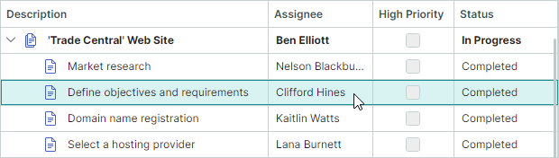

# 焦点和导航


## 单元格和行导航模式

TreeList 的默认行为允许用户使用键盘在单元格之间导航,或使用鼠标使单元格获得焦点。
使用 `TreeListControl.NavigationMode` 属性可以在单元格导航(Cell Navigation)模式和行导航(Row Navigation)模式之间切换。

**单元格导航(Cell Navigation)**(默认)

用户可以使用键盘或鼠标使任意单元格获得焦点。


**行(节点)导航(Row (Node) Navigation)**

用户无法使单个单元格获得焦点,单元格编辑操作也被禁用。点击单元格会高亮整个节点。

``` xml
<mxtl:TreeListControl x:Name="treeList" NavigationMode="Row">
```




## 获得焦点的列

使用 `TreeListControl.FocusedColumn` 属性获取当前获得焦点的列。若要将焦点移动到特定列,请将相应的 `TreeListColumn` 对象赋值给 `FocusedColumn` 属性。

!!! note

    只有在[单元格导航模式](#单元格和行导航模式)下,列才能获得焦点。

## 获得焦点的节点(行)

使用 `TreeListControlBase.FocusedNode` 属性访问当前获得焦点的节点(即接收键盘事件的节点)。若要获取获得焦点节点的数据(业务)对象,请使用继承的 `DataControlBase.FocusedItem` 属性。

`TreeListControlBase.FocusedNodeChanged` 事件允许您响应节点之间焦点的移动。


## 获得焦点的单元格

获得焦点的单元格由获得焦点的节点与获得焦点的列的交叉位置确定。若要将焦点移动到特定单元格,请使目标[行](#获得焦点的节点行)和[列](#获得焦点的列)获得焦点。

<!-- TODO
Example - focus a specific cell
 -->

<br>
<br>

<sup>*</sup> 本页面使用机器翻译技术翻译。
