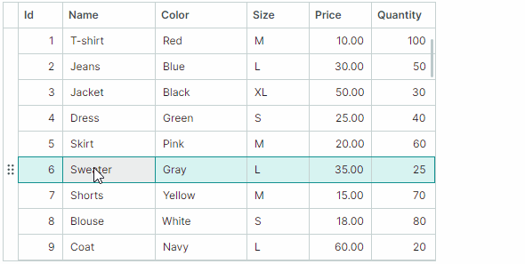

# 节点拖放（Drag-and-Drop）

TreeList 和 TreeView 支持在控件内部以及向外部控件拖放节点的功能。拖放功能在 TreeList 和 TreeView 的基类 `TreeListControlBase` 中实现。该类提供用于启用和处理节点拖放操作的 API。


<!-- TODO
Update animation with row previews
 -->

拖动节点时会显示节点预览。但是，如果启用了基于平台的节点拖放（[在应用程序之间拖动节点](#启用应用程序之间的节点拖放)所必需），则节点预览不可用。

## 启用节点拖放

将 `TreeListControlBase.AllowDragDrop` 属性设置为 `true` 以启用节点拖放。这样用户就可以在 TreeList/TreeView 控件内部以及外部拖动节点。
拖放操作会将节点移动到另一个位置，同时也会更改数据源中对应业务对象的位置。

如果节点被拖动到外部控件，TreeList/TreeView 控件的默认行为是从当前控件中移除该节点，并从控件的数据源中删除相应的业务对象。有关如何防止节点和业务对象被删除的信息，请参阅[控件之间的节点拖放](#控件之间的节点拖放)。

如果使用 `DataControlBase.SelectionMode` 属性启用了多节点选择（参阅[节点 - 多节点选择（高亮）](nodes.md#多节点选择高亮)），则支持多节点拖放。

TreeList 和 TreeView 控件在拖放期间不维护自动复制操作。按住 CTRL 键不会产生任何效果。

### 启用应用程序之间的节点拖放

要允许在应用程序之间拖动节点，请为作为拖放操作源的控件启用 `UsePlatformRowDragDrop` 属性。

!!! Tip

    `UsePlatformRowDragDrop` 属性启用了一种由 Avalonia 平台处理操作的拖放模式。在基于平台的拖动操作期间不会显示节点预览。


## 节点拖动模式 —— 在单元格中开始拖动操作或使用特殊拖动手柄

TreeList 支持两种节点拖放模式，它们的区别在于如何启动拖放操作。您可以使用控件的 `RowDragMode` 属性选择所需的模式。

- `RowDragMode.Row` 模式（默认）—— 用户可以在任意节点单元格中启动拖放操作。

    


    在此模式下，默认的单元格编辑器激活行为如下：
    
    1. 用户需要先聚焦某个单元格。
    
    2. 然后在已聚焦的单元格内点击即可激活单元格编辑器。
    
    要通过单击即可激活单元格编辑器，请启用在鼠标按键释放时激活单元格编辑器的功能。将控件的 `DataControlBase.EditorShowMode` 属性设置为 `EditorShowMode.PointerReleased`。

- `RowDragMode.DragHandle` 模式（自 v1.4 起新增）—— 用户可以通过拖动特殊的拖动手柄来启动拖放操作。拖动手柄显示在行指示器（Row Indicator）区域中，该区域会在激活 `RowDragMode.DragHandle` 模式时自动出现在节点左侧。

    

    在 `DragHandle` 模式下，默认情况下单元格编辑器会在单元格内单击一次即被激活。您可以使用控件的 `DataControlBase.EditorShowMode` 属性来更改此行为。

    启用多节点选择时，每个已选中的节点都会显示拖动手柄。


**相关 API：**

- `RowIndicatorWidth` —— 指定显示拖动手柄的行指示器区域的宽度。


## 已排序数据的拖放

TreeList 和 TreeView 节点可以进行[排序](sorting.md)。在已排序的 TreeList 和 TreeView 控件中，节点拖放操作默认处于禁用状态。将 `TreeListControlBase.AllowDragDropSortedNodes` 属性设置为 `true`，以在已排序的控件中启用拖放操作。

如果数据已排序，并且某个节点被拖动到另一个节点之前或之后的位置，控件会自动更新被拖动节点在已排序列中的值，以保持当前的排序顺序。被拖动节点在已排序列中的值会被设置为目标节点的相应值。

## 通过事件处理拖放操作

TreeList 和 TreeView 控件包含一些事件，可帮助您管理和响应节点拖放操作。

### 开始拖放

`TreeListControlBase.StartDrag` 事件会在拖放操作即将开始时触发。使用以下事件参数获取有关当前拖放操作的信息。

- `e.Data` —— 指定包含当前拖放操作数据的 `DragDropData` 对象。
- `e.DragElement` —— 正在被拖动的可视元素。
<!-- TODO
что такое параметр DragElement (Avalonia.Controls.Border)
 -->

- `e.Effects` —— 指定拖放效果。将此参数设置为 `DragDropEffects.None` 可取消当前拖放操作。拖放效果还决定鼠标指针的图标样式。
- `e.Nodes` —— 即将被拖动的 `TreeListNode` 对象数组。如果只拖动一个节点，则该数组只包含一个对象。


## 示例 —— 阻止特定节点开始拖放操作

以下 `StartDrag` 事件处理程序会禁用包含子节点的节点的拖放操作。

``` cs
private void TreeList_StartDrag(object sender, TreeListStartDragEventArgs e)
{
    if(e.Nodes[0].HasChildren)
        e.Effects = Avalonia.Input.DragDropEffects.None;
}
```

## 处理拖放过程中的拖动阶段

当用户将节点拖动到另一个节点上方时，`TreeListControlBase.DragOver` 事件会反复触发。该事件的参数可帮助您获取与当前拖放操作相关的信息：

- `e.DragNodes` —— 正在被拖动的 treelist [节点](nodes.md)（`TreeListNode`）数组。如果只拖动一个节点，则该数组只包含一个对象。
- `e.TargetNode` —— 节点被拖动经过的 treelist 目标节点。
- `e.DropPosition` —— 指定相对于目标节点的潜在放置位置。可用选项包括：
    - `DropPosition.Before` —— 如果放置，被拖动的节点将添加在与目标节点相同的层级、目标节点之前。
    - `DropPosition.After` —— 如果放置，被拖动的节点将添加在与目标节点相同的层级、目标节点之后。
    - `DropPosition.Inside` —— 如果放置，被拖动的节点将作为目标节点的子节点添加。

- `e.KeyModifiers` —— 指定在 `DragOver` 事件期间是否按下了 ALT、SHIFT 和/或 CTRL 键。
- `e.Data` —— 指定包含当前拖放操作数据的 `DragDropData` 对象。
- `e.Effects` —— 指定拖放效果。将此参数设置为 `DragDropEffects.None` 可取消当前拖放操作。拖放效果还决定鼠标指针的图标样式。


### 示例 —— 阻止节点被放置在根级别

以下 `DragOver` 事件处理程序阻止节点被放置在根节点旁边。该代码仍然允许将节点作为根节点的子节点放置。

``` cs
private void TreeList_DragOver(object sender, TreeListDragEventArgs e)
{
    if(e.TargetNode?.Level == 0 && (e.DropPosition==DropPosition.Before || e.DropPosition == DropPosition.After)) 
        e.Effects = Avalonia.Input.DragDropEffects.None;
}

```
## 完成拖放

有两个事件可帮助您管理拖放操作的放置阶段：

- `TreeListControlBase.Drop` —— 当节点即将被放置到另一个 treelist 节点上时触发。该事件的参数与 `TreeListControlBase.DragOver` 事件的参数相同。

    要在特定情况下取消放置操作，请处理 `Drop` 事件并将其 `e.Handled` 参数设置为 `true`。

    如果节点被放置在当前 TreeList/TreeView 控件之外，则该控件不会触发 `Drop` 事件。有关更多信息，请参阅下面的 `TreeListControlBase.CompleteDragDrop` 事件说明。

    ### 示例 —— 修改被放置节点的值

    以下 `Drop` 事件处理程序会在被拖动的节点放置时更改其值。假设数据源包含 _"Assignee"_ 字段。下面的代码将被放置节点的 _"Assignee"_ 字段设置为目标节点的 _"Assignee"_ 字段值。

    ``` cs
    private void TreeList_Drop(object sender, TreeListDragEventArgs e)
    {
        if (e.DropPosition != DropPosition.Inside)
            return;
        TreeListControl treeList = e.Source as TreeListControl;
        string newAssignee = treeList.GetCellValue(e.TargetNode, "Assignee").ToString();
        foreach (TreeListNode node in e.DragNodes)
        {
            treeList.SetCellValue(node, "Assignee", newAssignee);
        }
    }
    ```

- `TreeListControlBase.CompleteDragDrop` —— 在拖放操作于当前控件内部或外部完成后触发。

    `TreeListControlBase.CompleteDragDrop` 事件在 `TreeListControlBase.Drop` 事件之后触发。

    `TreeListControlBase.CompleteDragDrop` 事件提供以下参数：

    - `e.DragNodes` —— 已被放置的 treelist [节点](nodes.md)（`TreeListNode`）数组。
    - `e.Effects` —— 返回在节点被放置的目标控件的 `Drop` 事件处理程序中设置的拖放效果。

    另请参阅：[控件之间的节点拖放](#控件之间的节点拖放)

    
## 拖放选项

TreeList/TreeView 控件提供以下选项来自定义节点拖放操作：

- `TreeListControlBase.AutoExpandOnDrag` —— 获取或设置在拖放操作期间悬停时是否自动展开已折叠的节点。
- `TreeListControlBase.AutoExpandDelayOnDrag` —— 获取或设置在拖放操作期间鼠标悬停在已折叠节点上时自动展开该节点之前的延迟时间。
- `TreeListControlBase.AllowScrollingOnDrag` —— 获取或设置当您将节点拖动到控件的顶部或底部边缘时，TreeList/TreeView 是否自动滚动节点。


## 控件之间的节点拖放

`TreeListControl`、`TreeViewControl` 和 `DataGridControl` 控件之间自动支持节点（行）拖放。使用这些控件提供的 `AllowDragDrop` 选项为它们启用拖放功能。

### 拖放的可视化指示

拖动节点（行）时，`TreeListControl`、`TreeViewControl` 和 `DataGridControl` 控件会以可视方式指示潜在的放置位置。


### 节点（行）及其项从源控件到目标控件的自动移动

`TreeListControl`、`TreeViewControl` 和 `DataGridControl` 支持在拖放操作期间在这些控件之间自动移动被拖动的节点（行）：包含被拖动数据的新节点（行）会被添加到目标控件，然后从源控件中移除被拖动的节点（行）。相应的项（业务对象）也会在源控件和目标控件的数据源之间转移。

如果源控件中项的数据类型与目标控件中项的数据类型匹配或兼容，则会发生节点（行）及其对应项的自动移动。用于检查数据类型兼容性的方法是 `Type.IsAssignableFrom`。

要防止在向外部控件进行拖放操作期间源控件中的节点（行）和项被删除，您可以执行以下操作之一：

- 处理目标控件的 `Drop` 事件，并将其 `e.Effects` 事件参数设置为 `Avalonia.Input.DragDropEffects.None`。

- 处理源控件的 `TreeListControlBase.CompleteDragDrop` 事件，并将 `e.Handled` 事件参数设置为 `true`。

    ``` cs
    private void TreeList_CompleteDragDrop(object sender, TreeListCompleteDragDropEventArgs e)
    {
        e.Handled = true;
    }
    ```

### 拖放到其他控件

`TreeListControl`、`TreeViewControl` 和 `DataGridControl` 控件不维护向其他控件（例如标准 Avalonia `DataGrid`）自动拖放行/节点的功能。要允许将节点/行拖动到这些控件，请使用 `Avalonia.Input.DragDrop.AllowDrop` 附加属性为它们启用拖放功能。处理目标控件的 `Avalonia.Input.DragDrop.Drop` 附加事件以接受被拖动的节点（行）。在处理 `DragDrop.Drop` 事件时，您可以通过 `Data` 事件参数访问被拖动的节点（行）。

<br>
<br>

<sup>*</sup> 本页面使用机器翻译技术翻译。
