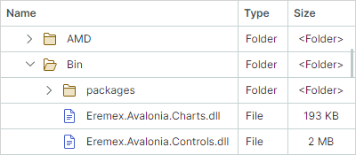
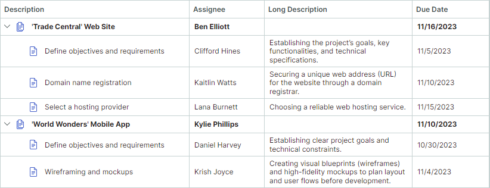

# 节点

`TreeListNode` 类封装了 TreeList 和 TreeView 控件中的节点。 
TreeView 节点显示单个值，而 TreeList 节点可以显示多个值（每个列一个值）。


## 创建并访问节点

在绑定模式下，TreeList 和 TreeView 控件自动为所有数据源项创建节点。
您可以使用以下属性访问创建的节点：

- `TreeListControlBase.Nodes` — 根节点。
- `TreeListNode.Nodes` — 节点的子节点。

当控件处于[非绑定模式](data-binding/unbound-mode.md)时，需要手动创建节点。

另请参阅：[查找节点](#find-nodes)。

## 获取和设置节点值

`TreeListNode.Content` 属性指定节点的底层数据对象。您可以将此属性值类型转换为您的业务对象，然后读取各个值。
在 [unbound mode](data-binding/unbound-mode.md) 中，您可以手动将对象分配给 `TreeListNode.Content` 属性。不要在绑定模式下将对象分配给 `TreeListNode.Content`。

要获取和设置单个单元格值，您可以使用以下方法：

- `GetCellValue` 和 `GetCellDisplayText`
- `SetCellValue`

## 聚焦节点

使用 `TreeListControlBase.FocusedNode` 属性访问当前焦点节点（接收键盘事件的节点）。要获取焦点节点的数据（业务）对象，请使用 `DataControlBase.FocusedItem` 继承属性。

`TreeListControlBase.FocusedNodeChanged` 事件允许您响应节点之间的移动焦点。

另请参阅：[多节点选择（突出显示）](#multiple-node-selection-highlight)。

## 节点图标

TreeList、TreeView 控件支持节点图标。这些图标显示在[层级列](columns.md#hierarchy-column)中的单元格值之前。




将 `TreeListControlBase.ShowNodeImages` 属性设置为 `true` 以启用节点图标。

以下方法允许您提供节点图标：

- 使用 `TreeListControlBase.NodeImageFieldName` 属性指定返回节点图标（`IImage` 对象）的业务对象的属性（字段）。

- 使用 `TreeListControlBase.NodeImageSelector` 属性指定返回特定节点的节点图标的选择器（`ITreeListNodeImageSelector` 对象）。

- 在非绑定模式下，您可以使用 `TreeListNode.Image` 属性设置节点的图像。

### 例子

以下代码显示具有特定单元值的节点的图像。

该示例创建一个 `NodeImageSelector` 对象，该对象根据业务对象的 _OnVacation_ 属性返回图像。

``` xml
xmlns:mxtl="https://schemas.eremexcontrols.net/avalonia/treelist"

<Grid.Resources>
    <local:MyNodeImageSelector x:Key="myNodeImageSelector" />
    ...
</Grid.Resources>

<mxtl:TreeListControl 
    Grid.Column="0" Grid.Row="1" Name="treeList2"
    ChildrenSelector="{StaticResource mySelector}"
    ItemsSource="{Binding Employees}"
    NodeImageSelector="{StaticResource myNodeImageSelector}"
    ShowNodeImages="True"
    >
...
</mxtl:TreeListControl>
```

``` csharp
using Avalonia.Media.Imaging;
using Avalonia.Platform;

public class MyNodeImageSelector : ITreeListNodeImageSelector
{
    IImage onVacationImage;
    IImage defaultImage;

    public MyNodeImageSelector()
    {
        onVacationImage = new Bitmap(AssetLoader.Open(
            new Uri("avares://AvaloniaApp1/Assets/plane.png")));
        defaultImage = null;
    }
    public IImage SelectImage(TreeListNode node)
    {
        Employee row = node.Content as Employee;
        return row.OnVacation? onVacationImage: defaultImage;
    }
}
```


## 展开和折叠节点

用户可以展开和折叠具有子节点的节点，如下所示：

- 单击节点展开按钮
 

  
- 按键盘上的“+”和“-”键


您可以使用 `TreeListControlBase.ShowExpandButtons` 属性隐藏节点展开按钮。在这种情况下，节点只能通过代码和键盘来展开和折叠。


在代码中，您可以使用以下API成员来扩展控件节点：

- `TreeListControlBase.AutoExpandAllNodes` — 指定是否自动扩展负载上的节点。
- `TreeListControlBase.CollapseAllNodes` — 折叠所有节点。
- `TreeListControlBase.ExpandAllNodes` — 展开所有节点。
- `TreeListControlBase.ExpandNodesOnFiltering` — 指定在数据搜索/过滤期间是否在折叠节点中 [search](filter-and-search.md)，并在其子节点匹配当前过滤/搜索条件时自动展开它们。 TreeList 和 TreeView controls 仅搜索当前加载的节点。对于 [hierarchical data sources](data-binding/index.md#hierarchical-data-source)，您可以将 `AllowDynamicDataLoading` 属性设置为 `false` 以禁用动态节点加载并一次加载所有节点。

- `TreeListNode.IsExpanded` — 允许您展开/折叠单个节点，或获取其展开状态。

控件的项源（`DataControlBase.ItemsSource`）中的布尔属性/字段可以存储节点的扩展状态。使用 `TreeListControlBase.ExpandStateFieldName` 属性来指定此属性。设置此属性后，节点的展开状态将与项源中此属性中存储的值同步。

展开和折叠节点时会引发以下事件：

- `TreeListControlBase.NodeExpanding` — 当节点即将扩展时触发。您可以使用 `Allow` 事件参数来阻止节点展开。
- `TreeListControlBase.NodeExpanded` — 在扩展节点后触发。
- `TreeListControlBase.NodeCollapsing` — 当节点即将折叠时触发。您可以使用 `Allow` 事件参数来防止节点折叠。
- `TreeListControlBase.NodeCollapsed` — 在节点崩溃后触发。


## 内置复选框

`TreeListControlBase.ShowNodeCheckBoxes` 属性启用 TreeList 和 TreeView 控件的内置节点复选框。复选框允许用户检查（选择）各个节点。


复选框默认有两种状态——选中和未选中。如果将 `AllowIndeterminateCheckState` 属性设置为 `true`，则复选框支持三种状态——选中、未选中和不确定。

对于 TreeList 控件，您可以启用 `TreeListControl.ShowCheckAllNodesCheckBox` 选项，在[层级列](columns.md#hierarchy-column)标题中显示 `Check All` 复选框。此复选框一次选择和取消选择所有节点。


### 获取和设置节点的检查状态

使用节点的 `TreeListNode.IsChecked` 属性来读取和指定节点的检查状态。 `TreeListNode.IsChecked` 属性为可为空的布尔值类型，因此可以将 `null` 赋给该属性，将节点切换到不确定状态。


### 获取已检查的节点

使用 `GetAllCheckedNodes` 方法检索状态为已选中的节点。

您还可以创建一个迭代器来检索与自定义条件匹配的节点。


### 将检查状态与数据源同步

使用 `CheckBoxFieldName` 属性将节点检查状态与特定数据源字段同步。此属性指定存储节点检查状态的布尔型或可为空布尔型数据源字段的名称。

### 递归检查

`AllowRecursiveNodeChecking` 支持递归节点检查。在此模式下，当父节点的检查状态更改时，子节点也会更改其检查状态，反之亦然。

## 多节点选择（突出显示）

TreeList 和 TreeView 控件支持多节点选择模式，该模式允许您和您的用户一次选择（突出显示）多个节点。


将 `SelectionMode` 属性设置为 `Multiple` 以启用多节点选择模式。

### 使用鼠标和键盘选择节点

用户可以通过鼠标和键盘选择多个节点。他们需要在按住 CTRL 和/或 SHIFT 键的同时单击节点。

### 在代码中使用节点选择

以下API允许您选择/取消选择节点，并识别是否选择节点：

- `SelectAll`
- `SelectNode`
- `SelectRange`
- `UnselectNode`
- `ClearSelection`
- `IsNodeSelected`

要检索节点选择，请使用以下成员：

- `GetSelectedNodes` — 返回当前选定的 `TreeListNode` 对象的集合。
- `SelectedItems` — 指定与选定节点对应的数据（业务）对象的集合。

处理 `SelectionChanged` 事件以响应节点选择的更改。

对任何更改节点选定状态的方法的调用会导致 TreeList/TreeView 控件更新，并引发 `SelectionChanged` 事件。

要对节点选择执行批量修改并防止不必要的更新，您可以使用 `BeginSelection` 和 `EndSelection` 方法对来包装修改节点选定状态的代码。在这种情况下，控件重新绘制选择，并且在调用 `EndSelection` 方法后触发 `SelectionChanged` 事件。

``` csharp
treeList1.SelectionMode = Eremex.AvaloniaUI.Controls.DataControl.RowSelectionMode.Multiple;
// Start a batch update of the node selection.
treeList1.BeginSelection();
treeList1.ClearSelection();
treeList1.SelectNode(node1);
treeList1.SelectNode(node2);
//...
// Finish the batch update.
treeList1.EndSelection();
```
### 聚焦节点与选定节点

焦点节点是接收用户输入的节点。在多选模式下，焦点节点可能与所选（突出显示）节点不同步。有关模式详细信息，请参阅以下部分。

#### 单选模式下的焦点节点

在单选模式下，焦点节点会自动获得选定状态。您可以使用 `FocusedNode` 属性和 `GetSelectedNodes` 方法来检索焦点节点。

#### 多选模式下的焦点节点

多节点选择模式下，聚焦状态和选中状态是不同的。 
节点是否被选中，可以通过节点的高亮来判断。仅突出显示选定的节点。


在多选模式下，单击某个节点会同时聚焦并选择该节点。但是，用户可以使用以下操作切换焦点节点的选定状态：

- 按 CTRL+空格键。
- 按住 CTRL 键的同时单击焦点节点。

当您在代码中选择一个节点时，该节点在多选模式下不会获得焦点状态，反之亦然。

## 查找节点

`TreeListControlBase.FindNode` 方法允许您查找符合自定义条件的节点。

以下代码启用多节点选择，并找到并选择 _Name_ 字段中包含特定值的两个节点。

``` csharp
treeList1.SelectionMode = Eremex.AvaloniaUI.Controls.DataControl.RowSelectionMode.Multiple;
treeList1.ExpandAllNodes();
TreeListNode node1 = treeList1.FindNode(node => 
    (node.Content as Employee).Name.Contains("Sam"));
TreeListNode node2 = treeList1.FindNode(node => 
    (node.Content as Employee).Name.Contains("Dan"));
treeList1.ClearSelection();
treeList1.SelectNode(node1);
treeList1.SelectNode(node2);
```

另请参阅：[Filter and Search](filter-and-search.md)。

## 遍历节点

您可以创建一个迭代器（`TreeListNodeIterator` 对象）来递归地迭代节点并对其执行操作。

使用以下构造函数之一创建 `TreeListNodeIterator` 对象：

``` csharp
// Recursively iterates through child nodes of the specified node, and their children.
public TreeListNodeIterator(TreeListNode? node, bool onlyExpanded = false)

// Recursively iterates through the specified nodes, and their children.
public TreeListNodeIterator(TreeListNodeCollection? nodes, bool onlyExpanded = false)
```

_onlyExpanded_ 参数指定是否迭代展开的节点或展开和折叠的节点。

``` csharp
foreach (var node in new TreeListNodeIterator(treeList1.Nodes))
{
    if (node != null)
    {
        //do smth
    }
}
```


## 节点高度

所有节点最初具有相同的高度，足以显示单行文本。您可以设置自定义节点高度，并启用自动节点高度计算以完整显示单元格中的大文本数据。

### 自定义节点高度

- `DataControlBase.RowMinHeight` 属性 — 获取或设置最小节点高度。

如果禁用自动节点高度功能，则所有节点都具有由 `DataControlBase.RowMinHeight` 属性指定的相同高度。

### 节点自动高度

对于包含较长文本的列，您可以启用文本换行以动态调整节点高度并显示完整的单元格内容。



要启用列单元格的文本换行，请将 `TextEditorProperties` 对象（或其后代；例如 `ButtonEditorProperties`）分配给 `GridColumn.EditorProperties` 属性，并将 `TextEditorProperties.TextWrapping` 选项设置为 `Wrap`。

!!!提示

`TextEditorProperties` 对象用于为列配置就地 `TextEditor` 编辑器。在运行时，编辑器将使用这些设置进行实例化。请参阅 [数据编辑](data-editing/index.md) 了解更多信息。

以下代码启用树列表列的文本换行。

``` xml
<mxtl:TreeListColumn FieldName="LongDescription" Width="2*">
    <mxtl:TreeListColumn.EditorProperties>
        <mxe:TextEditorProperties TextWrapping="Wrap"/>
    </mxtl:TreeListColumn.EditorProperties>
</mxtl:TreeListColumn>
```

#### 水平滚动时自动调整节点高度

TreeList 支持的水平[虚拟化](performance-and-data-virtualization.md)通过减少加载时间来增强控件的性能。

启用此功能（默认）后，将根据当前可见单元格的内容自动计算节点高度。视口之外的单元格不影响节点高度计算。当滚动到不同内容高度的单元格时，节点高度会动态调整。要防止水平滚动期间动态节点高度发生变化，请使用 `DataGridControl.AllowHorizontalVirtualization` 属性禁用水平虚拟化。

``` xml
<mxtl:TreeListControl x:Name="treeList" AllowHorizontalVirtualization="False">
```

<br>
<br>

<sup>*</sup> 本页面使用机器翻译技术翻译。
