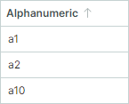

# 排序

数据排序功能允许您按升序或降序对 TreeList 和 TreeView 控件中的同级节点进行排序。

TreeList支持对一列或多列进行数据排序。该控件还允许您的用户通过在列标题上单击鼠标并使用列标题的上下文菜单来对数据进行排序。

## 最终用户操作 (TreeList)

在 TreeList 控件中，用户可以左键单击列标题来对该列进行排序。随后单击同一列标题会反转排序方向。要清除排序，请按住 CTRL 键并单击列标题。

要按多列对数据进行排序，用户需要按住 SHIFT 键，然后按所需顺序单击列标题。控件将根据第一个单击的列对数据进行排序，然后根据第二个列进行排序，依此类推。

用户还可以从列标题的上下文菜单更改列的排序设置。右键单击列标头以调用此菜单。

使用以下属性来阻止用户对数据进行排序：

- 将 `TreeListControl.AllowSorting` 设置为 `false` 以防止用户针对任何列进行排序。
- 将 `ColumnBase.AllowSorting` 设置为 `false` 以防止用户针对特定列进行排序。

这些属性不会阻止您对代码中的数据进行排序。

TreeView 控件不具备从 UI 中对数据进行排序的功能。您可以在此控件中对代码中的数据进行排序。

## 字母数字排序

对于 TreeListControl 和 TreeViewControl 中显示文本的列，可以使用继承的 `DataControlBase.TextSortMode` 属性在字母排序和字母数字排序之间进行选择。

- `Alphabetical` 排序（默认）：此模式逐个字符地比较字符串。如果文本包含数字，排序算法会将它们视为单个字符，而不是数字。例如：


- `Alphanumeric` 排序（自然排序）：此模式适用于包含文本和数字混合的字符串。排序算法通过将数字视为数值而不仅仅是字符，以人类友好的逻辑顺序排列字符串。例如：



以下代码应用字母数字排序顺序：

    ``` xml
    <mxtl:TreeListControl Name="treeList1" ItemsSource="{Binding MyData}" ChildrenSelector="{StaticResource childrenSelector}" 
                        TextSortMode="Alphanumeric"
                        />
    ```

`DataControlBase.TextSortMode` 属性影响显示文本值的所有列的排序。

以下图像演示了比较字母排序和字母数字排序模式的更多示例：


## 按代码排序 (TreeList)

您可以根据一列或多列对 TreeList 的数据进行排序。当您按多列对数据进行排序时，TreeList 控件根据第一个排序列的值对节点重新排序。然后，它按第二个排序列对已排序的节点重新排序，同时保持第一个列中的值顺序，依此类推。

使用以下属性按列对数据进行排序：

- 将 `ColumnBase.SortDirection` 属性设置为 `Ascending` 或 `Descending`。该属性指定列数据的排序顺序。

- 将 `ColumnBase.SortIndex` 属性设置为非负值，以根据列按升序对数据进行排序。 `ColumnBase.SortIndex` 属性指定排序列中该列的位置。

执行以下操作之一以清除排序：

- 将列的 `SortDirection` 属性设置为 `null` 以清除该列的排序。 
- 调用控件继承的 `DataControlBase.ClearSorting` 方法以删除应用于所有列的排序。

以下代码清除排序，然后根据两列对数据进行排序：

``` csharp
using CommunityToolkit.Mvvm.ComponentModel;
using System.ComponentModel;

treeList.ClearSorting();
treeListColumn1.SortDirection = ListSortDirection.Ascending;
treeListColumn3.SortDirection = ListSortDirection.Descending;
```

您可以使用 `BeginDataUpdate` 和 `EndDataUpdate` 方法包装代码，以防止在更改控件的多个设置（包括排序设置）时进行多余的更新。

``` csharp
using CommunityToolkit.Mvvm.ComponentModel;
using System.ComponentModel;

treeList.BeginDataUpdate();
treeList.ClearSorting();
treeListColumn1.SortIndex = 0;
treeListColumn3.SortIndex = 1;
treeListColumn2.SortDirection = ListSortDirection.Descending;
treeList.EndDataUpdate();
```

## 按代码排序 (TreeView)

要对 TreeView 中的数据进行排序，请使用 `TreeViewControl` 对象的 `SortDirection` 属性。将此属性设置为 `Ascending` 或 `Descending` 以按所需顺序对数据进行排序。

``` csharp
treeViewControl1.SortDirection = ListSortDirection.Ascending;
```

执行以下操作之一以清除排序：

- 将 `SortDirection` 属性设置为 `null`。 
- 调用控件继承的`DataControlBase.ClearSorting`方法。


## 可排序列和排序模式（TreeList 和 TreeView）

TreeList 和 TreeView 控件可以按编辑值、显示值或根据自定义排序算法对列进行排序。默认排序模式取决于列的就地编辑器和绑定属性的数据类型：

- 按编辑值排序 - 所有列，带有嵌入式 ComboBoxEditor 的列除外。
- 按显示文本排序 — 具有嵌入式 ComboBoxEditor 的列。
- 无排序 — 列绑定到未实现 `IComparable` 接口的对象。例如，图像数据类型没有实现此接口，因此默认情况下无法对相应的列进行排序。有关如何对这些列进行强制排序的信息，请参阅下面的 [自定义排序](#custom-sorting) 部分。

`ColumnBase.SortMode` 属性（在 TreeList 中）和 `TreeViewControl.SortMode` 属性（在 TreeView 中）允许您更改默认排序模式。可以使用以下选项：

- `SortMode.Value` — 按单元格编辑值排序。
- `SortMode.DisplayText` — 按单元格显示文本排序。
- `SortMode.Custom` — 自定义排序。将 `SortMode` 属性设置为 `Custom`，然后处理 `TreeListControl.CustomColumnSort`/`TreeViewControl.CustomSort` 事件以实现自定义排序例程。参见 [自定义排序](#custom-sorting)。

### 自定义排序

`CustomColumnSort`/`CustomSort` 事件允许您实现自定义排序逻辑。将 `ColumnBase.SortMode` 属性（在 TreeList 中）和 `TreeViewControl.SortMode` 属性（在 TreeView 中）设置为 `Custom` 以启用此事件。

如果列的绑定数据类型未实现 `IComparable` 接口（例如，图像数据类型），则 TreeList/TreeView 控件默认阻止对此列进行排序。不过，您可以为此列启用排序，如下所示：

- TreeList：将列的`AllowSorting` 属性设置为`true`（该属性的默认值为`null`）。
- TreeList 和 TreeView：将 `SortMode` 属性设置为 `Custom`。
- TreeList 和 TreeView：处理 `CustomColumnSort`/`CustomSort` 事件以实现自定义排序。

当您处理 `CustomColumnSort`/`CustomSort` 事件时，应比较事件参数中指定的两个节点。将比较结果分配给 `Result` 事件参数，如下所示：

- 当数据按升序排序时，如果第一个节点应显示在第二个节点之上，则将 `Result` 设置为 `-1`。

- 当数据按升序排序时，如果第一个节点应显示在第二个节点下方，则将 `Result` 设置为 `1`。

- 如果两个节点相等，则将 `Result` 设置为 `0`。
 

以下示例处理 `TreeListControl.CustomColumnSort` 事件，以自定义方式对“_FileName_”列中的数据进行排序。 “_FileName_”列以标准“_filename.ext_”格式存储文件名。自定义排序例程按文件名的扩展名对文件名进行排序。

``` csharp
<mxtl:TreeListControl Name="treeList" CustomColumnSort="TreeList_CustomColumnSort">
    <mxtl:TreeListControl.Columns>
        <mxtl:TreeListColumn  Width="*" FieldName="FileName"  SortMode="Custom" />
    </mxtl:TreeListControl.Columns>
</mxtl:TreeListControl>

private void TreeList_CustomColumnSort(object? sender, TreeListCustomColumnSortEventArgs e)
{
    if (e.Column.FieldName == "FileName")
    {
        string fileName1 = Convert.ToString(e.Value1);
        string fileName2 = Convert.ToString(e.Value2);

        string newfileName1 = extractFileExtension(fileName1) + "." + fileName1;
        string newfileName2 = extractFileExtension(fileName2) + "." + fileName2;
        e.Result = String.Compare(newfileName1, newfileName2);
    }
}

string extractFileExtension(string fileName)
{
    string res = "";
    int dotIndex = fileName.LastIndexOf('.');
    if (dotIndex > 0)
        res = fileName.Substring(dotIndex + 1);
    return res;
}
```

## 响应数据排序

处理以下事件以在数据排序时执行自定义操作：

- `DataControlBase.StartSorting` — 当数据即将排序时触发。
- `DataControlBase.EndSorting` — 数据排序完成时触发。

## 附加 API

- `TreeListControlBase.AutoScrollOnSorting` — 指定控件是否自动滚动视图端口以使焦点节点在数据排序时可见。

<br>
<br>

<sup>*</sup> 本页面使用机器翻译技术翻译。
