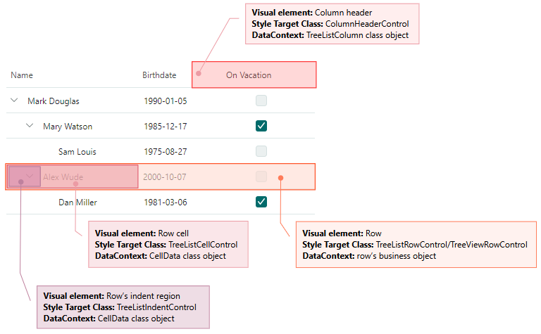
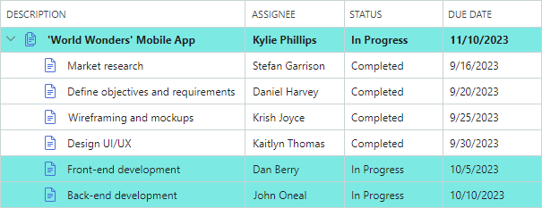

# 样式

TreeList 和 TreeView 控件支持 Avalonia 样式系统，该系统允许您自定义控件视觉元素的设置。 
使用 `TreeListControl.Styles` 属性将样式应用于以下视觉元素：

- 列标题
- 行
- 行单元格
- 行的缩进

典型的样式具有样式选择器和属性设置器的集合。选择器指定封装视觉元素的目标 Control 对象。属性设置器指定目标控件的属性及其值。

以下代码创建一个简单的样式，将所有 TreeList 行的背景设置为相同的颜色。

``` xml
xmlns:mxtl="https://schemas.eremexcontrols.net/avalonia/treelist"
xmlns:mxtlvis="clr-namespace:Eremex.AvaloniaUI.Controls.TreeList.Visuals;assembly=Eremex.Avalonia.Controls"

<mxtl:TreeListControl.Styles>
    <Style Selector="mxtlvis|TreeListRowControl">
        <Setter Property="Background" Value="Ivory" />
    </Style>
</mxtl:TreeListControl.Styles>
```

## 将样式应用于特定的控制状态

样式选择器支持 Avalonia 中的伪类。伪类是添加到选择器的关键字。它指定应用样式的目标控件的状态。

TreeList 和 TreeView 控件提供自定义伪类来处理控件视觉元素的特定状态。以下部分列出了控件视觉元素支持的自定义伪类。

下面的代码创建一个针对 TreeList 行的样式选择器。 `:focusedAndSelectedState` 伪类用于仅将样式应用于处于焦点状态的行。

``` xml
xmlns:mxtl="https://schemas.eremexcontrols.net/avalonia/treelist"
xmlns:mxtlvis="clr-namespace:Eremex.AvaloniaUI.Controls.TreeList.Visuals;assembly=Eremex.Avalonia.Controls"

<Style Selector="mxtlvis|TreeListRowControl:focusedAndSelectedState">
    ...
</Style>
```

## 视觉元素的控件

样式选择器的语法应指定应用样式的目标控件（封装可视元素的 Control 对象）。以下图像显示了 TreeList/TreeView 的视觉元素和相应的目标控件。



## 设置行样式（节点）

行是显示单元格的视觉元素。

使用以下信息自定义行的样式：

### 目标控制类 
`TreeListRowControl`（在TreeList 控件中）、`TreeViewRowControl`（在TreeView 控件中）

### 数据上下文
一行的数据（业务）对象

### 自定义伪类

- ":selectedState" — 一行已被选中，但未获得焦点。该状态在多行选择模式下有效。
- ":focusedState" — 一行已获得焦点，但未被选中。该状态在多行选择模式下有效。
- ":focusedAndSelectedState" — 一行已获得焦点并被选中。该状态在多行和单行选择模式下有效。
- ":editingState" — 节点具有活动的就地编辑器。

### 示例 - 如何自定义焦点节点的样式

以下代码创建一个自定义 TreeList 焦点节点背景的样式。

TreeList 行根据预定义的模板呈现。该模板包含一个 `Border` 对象（名为 _RowBorder_），该对象用边框和背景装饰单元格。 
下面的示例更改焦点节点的 _RowBorder_ 对象的 `Background` 设置。

``` xml
xmlns:mxtl="https://schemas.eremexcontrols.net/avalonia/treelist"
xmlns:mxtlvis="clr-namespace:Eremex.AvaloniaUI.Controls.TreeList.Visuals;assembly=Eremex.Avalonia.Controls"

<mxtl:TreeListControl.Styles>
    <Style Selector="mxtlvis|TreeListRowControl:focusedAndSelectedState /template/ Border#RowBorder">
        <Setter Property="Background" Value="SkyBlue" />
    </Style>
</mxtl:TreeListControl.Styles>
```

### 示例 - 如何根据单元格值自定义节点的外观设置

以下代码根据行值自定义行（节点）的背景颜色和字体设置。



行的背景取决于行的 _Status_ 属性。
_RowStatusToBrushConverter_ 对象指定用于 _Status_ 属性设置为 _InProgress_ 的行的画笔。

如果行有子行，则这些行的 _HasTasks_ 布尔属性返回 _true_。这些行以粗体绘制。

当行单元格不处于编辑模式时，它们将使用 _TextBlock_ 控件呈现。创建的样式会修改 _TextBlock.FontWeight_ 附加属性以调整所有行单元格中文本的字体粗细。 _Eremex.AvaloniaUI.Controls.BoolToObjectConverter_ 对象确定实际的字体粗细。转换器返回一个取决于行的 _HasTasks_ 属性的值。

``` xml
xmlns:mxtl="https://schemas.eremexcontrols.net/avalonia/treelist"
xmlns:mxtlvis="clr-namespace:Eremex.AvaloniaUI.Controls.TreeList.Visuals;assembly=Eremex.Avalonia.Controls"
xmlns:mx="https://schemas.eremexcontrols.net/avalonia"
xmlns:views="using:DemoCenter.Views"

<UserControl.Resources>
    <views:RowStatusToBrushConverter x:Key="myRowStatusToBrushConverter"/>
</UserControl.Resources>

<mxtl:TreeListControl.Styles>
    <Style Selector="mxtlvis|TreeListRowControl">
        <Setter Property="Background" Value="{Binding Status, 
         Converter={StaticResource myRowStatusToBrushConverter}}"/>
        <Setter Property="TextBlock.FontWeight">
            <Setter.Value>
                <Binding Path="HasTasks">
                    <Binding.Converter>
                        <mx:BoolToObjectConverter>
                            <mx:BoolToObjectConverter.TrueValue>
                                <FontWeight>Bold</FontWeight>
                            </mx:BoolToObjectConverter.TrueValue>
                            <mx:BoolToObjectConverter.FalseValue>
                                <FontWeight>Normal</FontWeight>
                            </mx:BoolToObjectConverter.FalseValue>
                        </mx:BoolToObjectConverter>
                    </Binding.Converter>
                </Binding>
            </Setter.Value>
        </Setter>
    </Style>
</mxtl:TreeListControl.Styles>
```
``` csharp
public class RowStatusToBrushConverter : IValueConverter
{
    static Brush lightGreenBrush = new SolidColorBrush(0xFFA8F0ED);
    public object Convert(object value, Type targetType, object parameter, 
     CultureInfo culture)
    {
        if (value == null) return null;
        DemoData.TaskStatus rowStatus = (DemoData.TaskStatus)value;

        if (rowStatus == DemoData.TaskStatus.InProgress)
            return lightGreenBrush;

        return null;
    }

    public object ConvertBack(object value, Type targetType, object parameter, 
     CultureInfo culture)
    {
        throw new NotImplementedException();
    }
}
```

## 设置行单元格样式

行（节点）单元格显示列值。在 TreeView 控件中，每一行仅显示一个值。

要自定义行单元格的样式，请使用以下信息：

### 目标控制类

`TreeListCellControl`

### 数据上下文

一个 `Eremex.AvaloniaUI.Controls.DataControl.Visuals.CellData` 对象。 `CellData` 对象公开的主要属性是：

- `Column` — 显示单元格的列（`ColumnBase` 对象）。当您将样式应用于 TreeView 对象时，`CellData.Column` 属性包含封装 TreeView 值列的 `ColumnBase` 对象。
- `DataControl` — TreeList/TreeView 控件（`DataControlBase` 对象）。
- `Row` — 行的底层数据（业务）对象。
- `ValidationInfo` — 包含单元格验证信息的对象。
- `Value` — 单元格的值。

### 自定义伪类

自定义伪类与应用于行对象的伪类相匹配。它们如下所示：

- ":selectedState" — 一行已被选中，但未获得焦点。该状态在多行选择模式下有效。
- ":focusedState" — 一行已获得焦点，但未被选中。该状态在多行选择模式下有效。
- ":focusedAndSelectedState" — 一行已获得焦点并被选中。该状态在多行和单行选择模式下有效。
- ":editingState" — 单元格的就地编辑器处于活动状态。

### 示例 - 如何根据单元格值自定义单元格样式

下面代码中的 Style 对象设置 _OnVacation_ 行属性中包含 `true` 值的单元格的背景。

样式将单元格控件（`TreeListCellControl` 对象）的 `Background` 属性设置为自定义 _OnVacationCellValueToBrushConverter_ 转换器返回的画笔。转换器根据单元格的列和值返回画笔。

``` xml
xmlns:mxtl="https://schemas.eremexcontrols.net/avalonia/treelist"
xmlns:mxtlvis="clr-namespace:Eremex.AvaloniaUI.Controls.TreeList.Visuals;assembly=Eremex.Avalonia.Controls"
xmlns:mx="https://schemas.eremexcontrols.net/avalonia"
xmlns:local="clr-namespace:AvaloniaApp1"

<Grid.Resources>
    <local:OnVacationCellValueToBrushConverter x:Key="myOnVacationCellValueToBrushConverter" />
</Grid.Resources>

<mxtl:TreeListControl.Styles>
    <Style Selector="mxtlvis|TreeListCellControl">
        <Setter Property="Background">
            <Setter.Value>
                <MultiBinding Converter="{StaticResource myOnVacationCellValueToBrushConverter}">
                    <Binding Path="Row.OnVacation" />
                    <Binding Path="Column" />
                </MultiBinding>
            </Setter.Value>
        </Setter>
    </Style>
</mxtl:TreeListControl.Styles>
```

``` csharp
public class OnVacationCellValueToBrushConverter : IMultiValueConverter
{
    public object? Convert(IList<object?> values, Type targetType, 
     object? parameter, CultureInfo culture)
    {
        bool onVacation = (bool)values[0];
        TreeListColumn column = (TreeListColumn)values[1];
        if (column.FieldName == "OnVacation" && onVacation)
            return new SolidColorBrush(Colors.Aqua);
        return null;
    }
}
```


## 设置行缩进区域的样式

缩进区域显示展开按钮和节点图标。缩进区域是显示节点层次结构的单元格的一部分。

要自定义行缩进区域的样式，请使用以下信息：

### 目标控制类

`TreeListIndentControl`

### 数据上下文

一个 `Eremex.AvaloniaUI.Controls.DataControl.Visuals.CellData` 对象。有关详细信息，请参阅 [设置行单元格样式](#style-a-row-cell) 部分。

### 自定义伪类

自定义伪类与应用于行对象的伪类相匹配。它们如下所示：

- ":selectedState" — 一行已被选中，但未获得焦点。该状态在多行选择模式下有效。
- ":focusedState" — 一行已获得焦点，但未被选中。该状态在多行选择模式下有效。
- ":focusedAndSelectedState" — 一行已获得焦点并被选中。该状态在多行和单行选择模式下有效。
- ":editingState" — 节点具有活动的就地编辑器。

### 示例 - 如何自定义特定行的缩进区域

以下代码创建一个样式，用于自定义 _HasChildren_ 行值设置为 `true` 的行中的缩进背景。

``` xml
xmlns:mxtl="https://schemas.eremexcontrols.net/avalonia/treelist"
xmlns:mxtlvis="clr-namespace:Eremex.AvaloniaUI.Controls.TreeList.Visuals;assembly=Eremex.Avalonia.Controls"
xmlns:mx="https://schemas.eremexcontrols.net/avalonia"

<mxtl:TreeListControl.Styles>
    <Style Selector="mxtlvis|TreeListIndentControl">
        <Setter Property="Background">
            <Setter.Value>
                <Binding Path="Row.HasChildren">
                    <Binding.Converter>
                        <mx:BoolToObjectConverter>
                            <mx:BoolToObjectConverter.TrueValue>
                                <SolidColorBrush Color="Coral"/>
                            </mx:BoolToObjectConverter.TrueValue>
                        </mx:BoolToObjectConverter>
                    </Binding.Converter>
                </Binding>
            </Setter.Value>
        </Setter>
    </Style>
</mxtl:TreeListControl.Styles>
```

## 设置列标题样式 (TreeList control)

列标头显示列的标题和排序指示符。

使用以下信息自定义列标头的样式：

### 目标控制类

`ColumnHeaderControl`

### 数据上下文

`TreeListColumn`

### 自定义伪类

- ":sortascending" — 列按升序排序。
- ":sortdescending" — 列按降序排序。
- ":dragging" — 正在拖动列。

### 示例 - 如何自定义特定列标头的外观设置

以下代码显示了如何将 _OnVacation_ TreeList 列标头绘制为粗体显示。

``` xml
xmlns:mxtl="https://schemas.eremexcontrols.net/avalonia/treelist"
xmlns:mxvis="Eremex.AvaloniaUI.Controls.DataControl.Visuals;assembly=Eremex.Avalonia.Controls"
xmlns:local="clr-namespace:AvaloniaApp1"

<Grid.Resources>
    <local:ColumnToFontWeightConverter x:Key="myColumnToFontWeightConverter" />
</Grid.Resources>

<mxtl:TreeListControl.Styles>
    <Style Selector="mxvis|ColumnHeaderControl">
        <Setter Property="FontWeight" 
         Value="{Binding Converter={StaticResource myColumnToFontWeightConverter}}">
        </Setter>
    </Style>
</mxtl:TreeListControl.Styles>
```
``` csharp
public class ColumnToFontWeightConverter : IValueConverter
{
    public object? Convert(object? value, Type targetType, object? parameter, 
     CultureInfo culture)
    {
        TreeListColumn col = value as TreeListColumn;
        if(col!=null && col.FieldName=="OnVacation")
        {
            return FontWeight.Bold;
        }

        return null;
    }

    public object? ConvertBack(object? value, Type targetType, object? parameter, 
     CultureInfo culture)
    {
        throw new NotImplementedException();
    }
}
```

<!--
<Style Selector="mxtl|ColumnHeaderControl">
    <Setter Property="Background">
        <Setter.Value>
            <Binding Path="HasChildren">
                <Binding.Converter>
                    <mx:BoolToObjectConverter>
                        <mx:BoolToObjectConverter.TrueValue>
                            <SolidColorBrush Color="LightYellow"/>
                        </mx:BoolToObjectConverter.TrueValue>
                        <mx:BoolToObjectConverter.FalseValue>
                            <SolidColorBrush Color="LightCyan"/>
                        </mx:BoolToObjectConverter.FalseValue>
                    </mx:BoolToObjectConverter>
                </Binding.Converter>
            </Binding>
        </Setter.Value>
    </Setter>
</Style>
-->

<br>
<br>

<sup>*</sup> 本页面使用机器翻译技术翻译。
