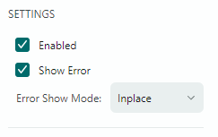
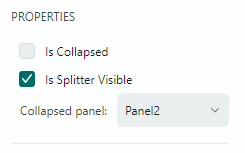

# GroupBox

`GroupBox` 是一个面板，具有标题和底部的 line，从视觉上将 `GroupBox` 与其他控件分开。



`GroupBox` 是 `Avalonia.Controls.Primitives.HeaderedContentControl` 的后代。

## 指定标题

使用 `Header` 属性设置 `GroupBox` 的标头。 `HeaderTemplate` 属性允许您设置模板以自定义方式呈现 control 的标头。

### 相关API

- `ShowHeader` — 获取或设置标题是否可见。
- `HeaderHorizontalAlignment` — 指定标题的水平对齐方式。
- `HeaderVerticalAlignment` — 指定标题的垂直对齐方式。

## 定义内容

您可以在 XAML 中的开始和结束 `<GroupBox>` 标记之间指定 `GroupBox` 的内容。在代码中，使用继承的 `Content` 属性来实现此目的。您可以设置 `ContentTemplate` 属性来指定用于呈现 control 内容的模板。

## 例子

以下示例定义了一个显示带有控件的 StackPanel 的 `GroupBox`。



``` xml
xmlns:mxe="https://schemas.eremexcontrols.net/avalonia/editors"

<mxe:GroupBox Header="PROPERTIES">
    <StackPanel>
        <mxe:CheckEditor x:Name="IsCollapsedSelector" 
         Content="Is Collapsed" Classes="LayoutItem"/>
        <mxe:CheckEditor x:Name="IsSplitterVisibleSelector" 
         Content="Is Splitter Visible" IsChecked="True" 
         Classes="LayoutItem"/>
        <DockPanel>
            <Label Content="Collapsed panel:" Classes="LayoutItem"/>
            <mxe:ComboBoxEditor EditorValue="{Binding CollapsedPanel, Mode=TwoWay}" 
            ItemsSource="{mxc:EnumItemsSource EnumType=mxe:SplitContainerControlCollapsePanel}"/>
        </DockPanel>
    </StackPanel>
</mxe:GroupBox>
```

<br>
<br>

<sup>*</sup> 本页面使用机器翻译技术翻译。
