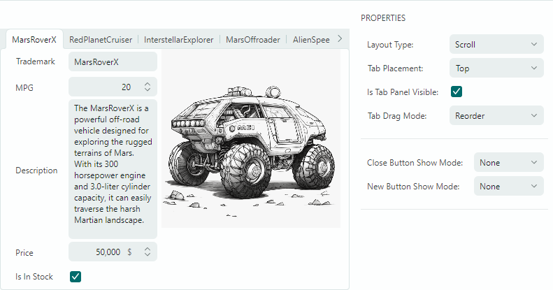

# 实用程序控件

Eremex Controls 库 help you 附带的多个实用程序 controls 创建了一个实用且有吸引力的 UI。

- [MxTabControl](tabcontrol.md) — control，允许您将面板组合到选项卡式 UI 中。
    - 无限数量的选项卡。
    - 从项目源填充选项卡和 tab 内容。
    - 通过拖放选项卡重新排序。
    - 选项卡 layout 模式：拉伸、滚动和多行。
    -“关闭 tab”按钮。
    - “新标签”按钮。
    - tab 标头区域中的自定义 controls。

- [MxSplitButton](splitbutton.md) — 将两个按钮组合在一个控件中。主 button 执行 control 的主要操作，而辅助 button 使用 `MxSplitButton` 调用 dropdown control/菜单 associated。
    - 您可以使用事件或命令指定主要操作。
    - MxSplitButton 的 dropdown 可以是弹出菜单或自定义弹出控件。
    
- [SplitContainerControl](splitcontainercontrol.md) — 使用分离器分隔两个面板。
    - 用户可以拖动拆分器来更改面板的大小。
    - 面板的垂直或水平布置。
    - 能够折叠/展开其中一个面板。
    - 用于隐藏分离器的 option。

- `ColorEditor` — standalone control，允许用户选择颜色。 
    - ColorEditor 用作 PopupColorEditor control 的一部分，也可用作 standalone control。
    - 三种调色板 - 默认、标准、自定义。
    - 默认调色板可以在代码中初始化。
    - 标准调色板显示预定义的标准颜色。
    - 自定义调色板允许用户使用内置颜色选择器添加和修改颜色。
    - 能够指定 RGB 和 HSB 格式的颜色。

<!--TODO Describe ColorEditor
 -->

- [CalendarControl](calendarcontrol.md) — 允许用户选择日期的 standalone control。 
    - CalendarControl 用作 DateEditor 控制的一部分。您也可以将其用作 standalone control。
    - 使用鼠标和键盘在日历中选择日期。
    - 导航 bar 允许浏览月份和年份。
    - 三种日历视图：月视图、年视图和年份范围视图。
    - 用于限制可用日期范围的 option。

- [GroupBox](groupbox.md) — 带标头的面板。
    - control 的标题允许您显示自定义文本。
    - control 在客户端区域下方显示 line。

- `CircleProgressIndicator` - 将操作进度显示为旋转圆圈。

<!-- TODO
Describe CircleProgressIndicator
 -->

 
 

* 本页面使用机器翻译技术翻译。
