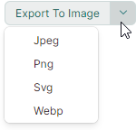
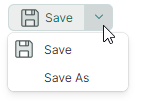

# SplitButton

`MxSplitButton` 将两个按钮组合在一个控件中。主 button 执行主要操作，可以将其实现为命令或事件。辅助 button 激活 associated dropdown control（菜单），您可以在其中显示自定义内容或命令。

以下 image 演示了将 PopupMenu 显示为 dropdown 控件的 SplitButton。


用于创建此 button 的代码如下所示。请参阅 [DemoCenter application](../../index.md#demo-application) 了解完整示例。

``` xml
xmlns:mx="https://schemas.eremexcontrols.net/avalonia"
xmlns:mxb="https://schemas.eremexcontrols.net/avalonia/bars"

<mx:MxSplitButton Name="splitButton1"
                  Content="Export To Image" Margin="0,8,0,0" 
                  Command="{Binding ExportImageCommand}" 
                  CommandParameter="{x:Static exports:MxImageFormat.Jpeg}" 
                  HorizontalAlignment="Left" Grid.Row="6"
                  >
    <mx:MxSplitButton.DropDownControl>
        <mxb:PopupMenu>
            <mxb:ToolbarButtonItem Header="Jpeg" Command="{Binding ExportImageCommand}" CommandParameter="{x:Static exports:MxImageFormat.Jpeg}"/>
            <mxb:ToolbarButtonItem Header="Png" Command="{Binding ExportImageCommand}" CommandParameter="{x:Static exports:MxImageFormat.Png}"/>
            <mxb:ToolbarButtonItem Header="Svg" Command="{Binding ExportImageCommand}" CommandParameter="{x:Static exports:MxImageFormat.Svg}"/>
            <mxb:ToolbarButtonItem Header="Webp" Command="{Binding ExportImageCommand}" CommandParameter="{x:Static exports:MxImageFormat.Webp}"/>
        </mxb:PopupMenu>
    </mx:MxSplitButton.DropDownControl>
</mx:MxSplitButton>
```

## 内容

使用 `Content` 属性将视觉内容分配给主按钮。

``` xml
<mx:MxSplitButton Content="Save"/>
```


`Content` 属性允许您在文本旁边显示 image 或以自定义方式调整主 button 的外观。以下示例显示 image 和文本：

``` xml
xmlns:mx="https://schemas.eremexcontrols.net/avalonia"
xmlns:mxi="https://schemas.eremexcontrols.net/avalonia/icons"

<mx:MxSplitButton Height="27" VerticalContentAlignment="Center" Command="{Binding SaveCommand}">
    <mx:MxSplitButton.Content>
        <StackPanel Orientation="Horizontal" Spacing="5" >
            <Image Source="{x:Static mxi:Basic.Save}" Height="20"/>
            <TextBlock Text="Save" />
        </StackPanel>
    </mx:MxSplitButton.Content>
</mx:MxSplitButton>
```


## 指定主要操作

主 button 触发 `MxSplitButton` 的主要动作。


您可以使用以下 API 成员来实现此操作：

- `MxSplitButton.Click` 事件 — 单击主 button 时引发的事件。
- `MxSplitButton.Command` 命令 — 单击主 button 时执行的命令。您可以使用 `MxSplitButton.CommandParameter` 属性将参数传递给命令。

``` xml
<mx:MxSplitButton Content="Save" Command="{Binding SaveCommand}">
```

``` cs
using CommunityToolkit.Mvvm.Input;

public partial class MainWindowViewModel : ViewModelBase
{
    [RelayCommand]
    void Save()
    {
        //...
    }
}
```


## 指定下拉控件

辅助 button 打开 dropdown control/菜单，该菜单由 `MxSplitButton.DropDownControl` 属性指定。



您可以将 `DropDownControl` 属性设置为以下对象：

- `Eremex.AvaloniaUI.Controls.Bars.PopupMenu` — 可以包含各种项目（按钮、检查按钮、子菜单等）的弹出菜单。有关详细信息，请参阅以下主题：[Popup and Context Menus](../../controls/toolbars-and-menus/popup-and-context-menus.md)。
  
- `Eremex.AvaloniaUI.Controls.Bars.PopupContainer` — 可以显示自定义内容的弹出窗口 control。

以下示例将具有两个命令的 `PopupMenu` 定义为 SplitButton 的 dropdown control：

``` xml
xmlns:mx="https://schemas.eremexcontrols.net/avalonia"
xmlns:mxi="https://schemas.eremexcontrols.net/avalonia/icons"
xmlns:mxb="https://schemas.eremexcontrols.net/avalonia/bars"

<mx:MxSplitButton Height="27" VerticalContentAlignment="Center" Command="{Binding SaveCommand}">
    <mx:MxSplitButton.Content>
        ...
    </mx:MxSplitButton.Content>

    <mx:MxSplitButton.DropDownControl>
        <mxb:PopupMenu>
            <mxb:ToolbarButtonItem Header="Save" 
                    Glyph="{x:Static mxi:Basic.Save}"
                    GlyphSize="20,20"
                    Command="{Binding SaveCommand}"/>
            <mxb:ToolbarButtonItem Header="Save As" Command="{Binding SaveAsCommand}"/>
        </mxb:PopupMenu>
    </mx:MxSplitButton.DropDownControl>
</mx:MxSplitButton>
```

``` cs
using CommunityToolkit.Mvvm.Input;

public partial class MainWindowViewModel : ViewModelBase
{
    [RelayCommand]
    void Save()
    {
        //...
    }
    [RelayCommand]
    void SaveAs()
    {
        //...
    }
}
```




### 相关API

- `MxSplitButton.IsPopupOpen` — 获取或设置 dropdown control/菜单当前是否打开。您可以使用此属性在代码中打开或关闭 dropdown control。

<br>
<br>

<sup>*</sup> 本页面使用机器翻译技术翻译。
