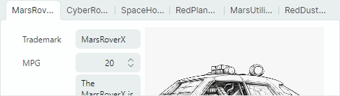

# TabControl

`MxTabControl` control 允许您将 organize 面板转换为选项卡式 UI。用户可以通过单击相应的选项卡来激活特定面板。


`MxTabControl` 是标准 `Avalonia.Controls.TabControl` 控件的后代。它继承了 `TabControl` 的基本功能，并通过附加功能进行了扩展：

- 无限数量的选项卡。
- 来自项目源的选项卡和 tab 内容的填充。
- 通过拖放选项卡重新排序。
- 选项卡 layout 模式：拉伸、滚动和多行。
- “关闭选项卡”按钮。
- “新标签”按钮。
- tab 标头区域中的自定义 controls。

## 创建选项卡

`MxTabControl` 从 `Avalonia.Controls.TabControl` 基类继承 tab 创建功能。 controls 支持两种添加选项卡的方法：

- 手动添加tab项目
- 从项目源填充选项卡和 tab 内容。

### 手动添加选项卡项目

`MxTabControl` control 中的选项卡项由 `MxTabItem` 对象封装。它们公开设置以指定 tab 标题文本、tab 标题 image (glyph)、“关闭”命令（单击 tab 的“关闭”button 时激活的命令）等。

#### 例子

以下示例创建两个具有预定义内容（编辑器和标签）的选项卡。


``` xml
xmlns:mx="https://schemas.eremexcontrols.net/avalonia"
xmlns:mxe="https://schemas.eremexcontrols.net/avalonia/editors"

<mx:MxTabControl Margin="5" Height="160" Name="tabControl1" Width="300">
    <mx:MxTabItem Header="Features">
        <Grid RowDefinitions="Auto Auto Auto" ColumnDefinitions="Auto *" Margin="5">
            <Label Classes="LayoutItem" Grid.Column="0" Grid.Row="0" Content="Trademark"/>
            <mxe:TextEditor EditorValue="{Binding SelectedCar.Trademark}" Margin="5" 
             Height="20" Grid.Row="0" Grid.Column="1"/>
            <Label Classes="LayoutItem" Grid.Column="0" Grid.Row="1" Content="Liters"/>
            <mxe:SpinEditor EditorValue="{Binding SelectedCar.Liter}" Margin="5" 
             Height="20" Grid.Row="1" Grid.Column="1"/>
            <Label Classes="LayoutItem" Grid.Column="0" Grid.Row="2" Content="MPG"/>
            <mxe:SpinEditor EditorValue="{Binding SelectedCar.MPG}" Margin="5" 
             Height="20" Grid.Row="2" Grid.Column="1"/>
        </Grid>
    </mx:MxTabItem>
    <mx:MxTabItem Header="More Info" >
        <mxe:TextEditor Margin="5" EditorValue="{Binding SelectedCar.Description}" 
         TextWrapping="Wrap" VerticalAlignment="Stretch"/>
    </mx:MxTabItem>
</mx:MxTabControl>
```

### 从项目源填充选项卡

`MxTabControl` 的祖先之一是 `Avalonia.Controls.ItemsControl` 类。这允许您使用项目源中的项目填充 TabControl。为此目的，请使用以下主要属性：

- `ItemsSource` — 指定包含要呈现为选项卡的项目的源。
- `ItemTemplate` — 指定用于呈现 tab 标头的 DataTemplate。
- `ContentTemplate` — 指定用于呈现 tab 内容的 DataTemplate。

#### 例子

以下示例将 `MxTabControl` control 绑定到 items source 并指定呈现 tab 标头和内容的 DataTemplate。


``` xml
xmlns:mx="https://schemas.eremexcontrols.net/avalonia"
xmlns:mxe="https://schemas.eremexcontrols.net/avalonia/editors"

<mx:MxTabControl ItemsSource="{Binding Cars}" SelectedItem="{Binding SelectedCar}">
    <mx:MxTabControl.ItemTemplate>
        <DataTemplate DataType="demoData:CarInfo">
            <TextBlock Text="{Binding Trademark}"></TextBlock>
        </DataTemplate>
    </mx:MxTabControl.ItemTemplate>

    <mx:MxTabControl.ContentTemplate>
        <DataTemplate DataType="demoData:CarInfo">
            <StackPanel Orientation="Horizontal" Margin="10">
                <Grid RowDefinitions="Auto Auto Auto" ColumnDefinitions="Auto *">
                    <Label Classes="LayoutItem" Grid.Column="0" Grid.Row="0" Content="Trademark"/>
                    <mxe:TextEditor Classes="LayoutItem"  Grid.Column="1" Grid.Row="0" 
                     EditorValue="{Binding Trademark}"/>

                    <Label Classes="LayoutItem" Grid.Column="0" Grid.Row="1" Content="MPG"/>
                    <mxe:SpinEditor Classes="LayoutItem" Grid.Column="1" Grid.Row="1" 
                     EditorValue="{Binding  MPG}" Minimum="0"/>

                    <Label Classes="LayoutItem" Grid.Column="0" Grid.Row="2" Content="Price"/>
                    <mxe:SpinEditor Classes="LayoutItem" Grid.Column="1" Grid.Row="2" 
                     EditorValue="{Binding  Price}" Suffix="{Binding Currency}" Minimum="0"/>
                </Grid>
                <Image Grid.Column="1" Width="200" Source="{Binding Image}" VerticalAlignment="Top"/>
            </StackPanel>
        </DataTemplate>
    </mx:MxTabControl.ContentTemplate>
</mx:MxTabControl>
```

## 选择一个选项卡

使用以下属性来选择选项卡并获取选定的选项卡：

- `SelectedIndex` — 指定所有选项卡中所选 tab 的 zero-based 索引。您可以使用 `MxTabControl.Items` 属性来访问 tab 集合。
- `SelectedItem` — 指定所选 tab 的项目。如果使用 `MxTabItem` 对象手动将选项卡添加到 TabControl，则 `SelectedItem` 属性指定选定的 `MxTabItem` 对象。如果 TabControl 是从 items source 填充的，则 `SelectedItem` 属性指定来自绑定项源的选定 tab 的数据对象。

`SelectedValue` 属性指定所选 tab 的值。该属性返回以下值：

- `null`，如果使用 `MxTabItem` 对象手动将选项卡添加到 TabControl。
- tab 的 underlying 数据对象（如果 TabControl 是从项目源填充的）。

以下属性允许您返回所选 tab 的内容：

- `SelectedContent` — 指定所选 tab 的内容。
- `SelectedContentTemplate` — 指定所选 tab 的内容模板。

## 选项卡排列

默认情况下，选项卡标题沿着 TabControl 的顶部边缘显示。您可以使用 `TabStripPlacement` 属性来指定 tab 标头的 position。

TabControl 支持三种 tab 接头 layout 模式。使用 `MxTabControl.TabStripLayoutType` 属性指定 tab 标头排列类型：

- `Scroll` — 选项卡标题的宽度足以显示 tab 标题的内容。如果没有足够的空间来完整显示所有 tab 标题，则滚动按钮会出现在 tab 标题区域中。
  


- `Stretch` — 所有 tab 标头均按 line、stretching、to fit 和 control 的宽度排列。它们具有相同的宽度或高度，具体取决于 tab 条带 position（请参阅 `TabStripPlacement` 属性）。
  


- `MultiLine` — 如果没有足够的空间在单行中显示选项卡标题，则选项卡标题会排列在多行中。
  

    

## 选项卡重新排序

如果 `MxTabControl.TabDragMode` 属性设置为 `Reorder`，则用户可以使用拖放操作重新设置 arrange 选项卡。

处理 `TabItemStartDragging` 和 `TabItemCompleteDragging` 事件以取消拖动操作或在拖动选项卡时执行其他操作。

## “关闭”按钮

TabControl 支持内置“选项卡关闭”(“x”) 按钮。它们可以显示在选项卡和/或 tab 标题区域中，如 `MxTabControl.CloseButtonShowMode` 属性所指定。

默认情况下，“选项卡关闭”按钮不执行任何操作。您需要使用以下方法之一实施“关闭”button 操作：

- 处理`MxTabControl.CloseButtonClick`事件。
- 使用 `MxTabItem.CloseCommand` 成员指定命令。

## “新标签”按钮

将 `MxTabControl.NewButtonShowMode` 属性设置为 `InHeaderPanel` 以显示“新选项卡”（“+”）按钮。默认情况下，单击此 button 没有任何操作。您可以使用以下成员指定操作：

- `MxTabControl.NewButtonClick` 事件。
- `MxTabControl.NewCommand` 命令。

## 选项卡标题区域中的自定义控件

您可以使用 `ControlBoxContent` 和 `ControlBoxContentTemplate` 属性将自定义 controls 添加到 tab 标头区域。

### 例子

以下示例添加了“?” button 到 tab 标头区域。单击 button 将引发 _HelpCommand_ 命令。当前选择的 tab 的 item 作为命令的参数传递。


``` xml
xmlns:mx="https://schemas.eremexcontrols.net/avalonia"
x:Class="SampleTabControl.TabControlPageView"
xmlns:vm="using:SampleTabControl"
x:DataType="vm:TabControlPageViewModel"

<mx:MxTabControl ItemsSource="{Binding Cars}"
                SelectedItem="{Binding SelectedCar}"
                x:Name="TabControl"
    >
    <mx:MxTabControl.ControlBoxContent>
        <Button Command="{Binding HelpCommand}" 
         CommandParameter="{Binding $parent.SelectedItem}">
            <Image Width="20" Height="20"  
             Source="{SvgImage 'avares://SampleTabControl/Images/help-icon.svg'}"/>
        </Button>
    </mx:MxTabControl.ControlBoxContent>
    ...
</mx:MxTabControl>
```
``` csharp
public partial class TabControlPageViewModel : PageViewModelBase
{
    //...
    [RelayCommand]
    private void Help(object parameter)
    {
        //...
    }
}
```

<br>
<br>

<sup>*</sup> 本页面使用机器翻译技术翻译。
