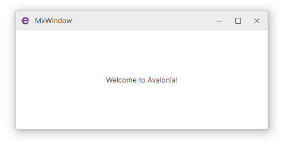

# 窗口和对话框

Eremex Controls 库包含支持 Eremex 绘制主题的 Window 和 MessageBox 组件。通过将 Eremex Controls 与 Eremex 窗口和对话框结合使用,您可以实现一致的用户界面外观。

## MxWindow

`MxWindow` 是一种使用 Eremex 视觉主题绘制窗口标题栏和边框的窗口。

- `MxWindow` 是 Window 组件的派生类。
- 提供用于自定义标题栏中标准按钮可见性的选项
- 提供用于为这些按钮指定自定义图形的选项

[了解更多](mxwindow.md)

## MxMessageBox

`MxMessageBox` 允许您以模态窗口的形式显示消息框。

- 该对话框可以显示文本消息、图标以及一组标准按钮。
- 完全支持 Eremex 视觉主题。
- 简单且一致的 API。

[了解更多](messagebox.md)

 
 

* 本页面使用机器翻译技术翻译。
