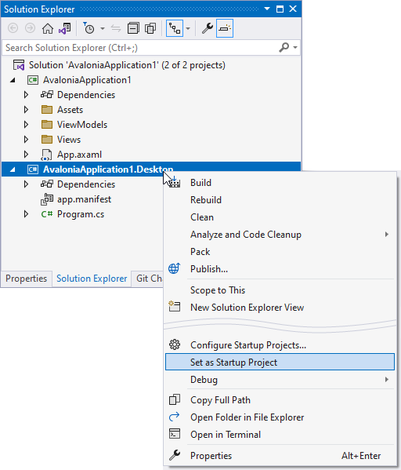
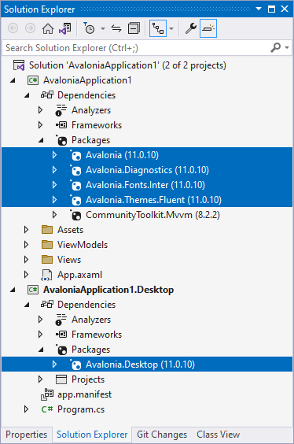

# 使用标准 Avalonia UI 模板结合 Eremex Controls 创建新项目

使用 Eremex 控件创建新 Avalonia UI 项目的最简单方法是使用 [Eremex Avalonia 模板](./index.md)。
本教程展示了如何使用标准 Avalonia UI 模板从零开始创建新项目。

## 1. 安装 Avalonia UI 开发工具

确保您的系统上已安装 Avalonia UI 模板。以下文章介绍了如何安装这些工具：[Avalonia UI - Get Started](https://avaloniaui.net/gettingstarted)。

## 2. 创建新项目

运行 Visual Studio，创建一个新的桌面 Avalonia UI 项目。


在 Avalonia 应用程序模板向导中，选择 Community Toolkit 库，以将 `CommunityToolkit.Mvvm` 包添加到项目中。


## 3. 设置启动项目

创建的解决方案包含两个项目 - _AvaloniaApplication1_ 和 _AvaloniaApplication1.Desktop_。请确保将 _AvaloniaApplication1.Desktop_ 设置为启动项目。



## 4. 更新 Avalonia UI NuGet 包

在需要时，将 _AvaloniaApplication1_ 和 _AvaloniaApplication1.Desktop_ 项目中的 Avalonia UI NuGet 包更新为 Eremex Avalonia UI Controls 支持的版本。请参见[系统要求](../whats-included/system-requirements.md)。



如果解决方案目录中包含 _Directory.Build.props_ 文件，请确保其定义的 Avalonia UI 版本与 Avalonia NuGet 包的版本一致。


## 5. 添加 Eremex Avalonia UI Controls NuGet 包

将 **Eremex.Avalonia.Controls** NuGet 包添加到 _AvaloniaApplication1_ 项目。
同时，添加包含 Eremex 控件的 `DeltaDesign` 绘制主题的 **Eremex.Avalonia.Themes.DeltaDesign** NuGet 包。

## 6. 注册 Eremex 绘制主题

您需要注册一个 Eremex 绘制主题，以确保 Eremex 控件能够正确渲染。如果未注册任何 Eremex 绘制主题，控件将显示为空白。

请确保项目中已添加 `Eremex.Avalonia.Themes.DeltaDesign` NuGet 包。它包含 `DeltaDesign` 绘制主题，您可以按以下方式注册：

- 在 _AvaloniaApplication1_ 项目中打开 _App.axaml_ 文件。
- 将以下命名空间添加到 Application 对象：

  ``` xml
  xmlns:theme="clr-namespace:Eremex.AvaloniaUI.Themes.DeltaDesign;assembly=Eremex.Avalonia.Themes.DeltaDesign"
  ```
  
- 将 <code>&lt;theme:DeltaDesignTheme/&gt;</code> 加入 `Application.Styles` 集合。


  ``` xml
  <Application 
    xmlns="https://github.com/avaloniaui"
    xmlns:x="http://schemas.microsoft.com/winfx/2006/xaml"
    x:Class="DemoCenter.App"
    xmlns:theme="clr-namespace:Eremex.AvaloniaUI.Themes.DeltaDesign;assembly=Eremex.Avalonia.Themes.DeltaDesign"
    RequestedThemeVariant="Light">
    <!-- "Default" - The application's theme variant is defined by the system setting. 
        "Light" - Enables the Light theme variant.
        "Dark" - Enables the Dark theme variant. 
    -->
      <!-- .... -->
      <Application.Styles>
          <theme:DeltaDesignTheme/>
          <!-- .... -->
      </Application.Styles>
  </Application>
  ```

### 选择浅色或深色主题变体

_App.axaml_ 文件中的 `Application.RequestedThemeVariant` 属性指定当前选定的主题变体（浅色或深色）。将此属性设置为所需的值。 

``` xml
<Application 
    RequestedThemeVariant="Default" ... >
    <!-- "Default" - The application's theme is defined by the system setting. 
         "Light" - Enables the Light theme.
         "Dark" - Enables the Dark theme. 
    -->
</Application>
```

<br>
<br>

<sup>*</sup> 本页面使用机器翻译技术翻译。
