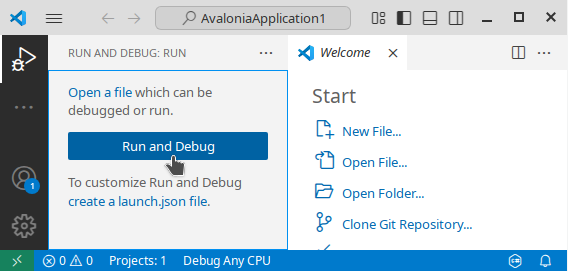
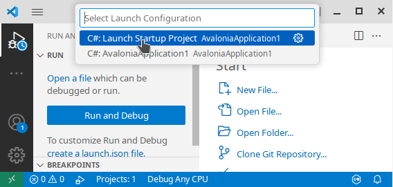
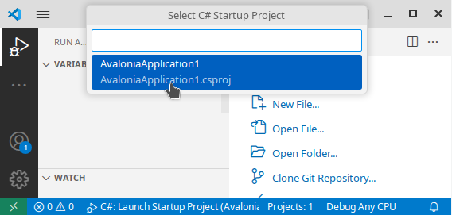

# 在 ALT Linux 上开始使用 Eremex Avalonia UI Controls

本教程将引导您在 ALT Linux 上使用 Eremex 控件创建一个 Avalonia UI 应用程序。首先，我们将搭建 .NET 应用程序的开发环境，然后创建一个包含 EMX DataGrid 控件的项目。


## 1. 前提条件

请确保 ALT Linux 上已安装 .NET SDK 和 Visual Studio Code。以下各节展示了如何从命令行安装它们。

### 1.1 安装 .NET SDK

要在 ALT Linux 上开发 .NET 应用程序，请安装 .NET SDK 包。例如，要安装 .NET 8 SDK，请在终端中运行以下命令：

``` sh
sudo apt-get install dotnet-sdk-8.0
```

### 1.2 安装 Visual Studio Code 和 C# Dev Kit 扩展

有关在 ALT Linux 上安装 VS Code 的说明，请参见：[Education applications: VS Code](https://www.altlinux.org/Education_applications/Vscode)。

或者，您也可以从 [Download Visual Studio Code](https://code.visualstudio.com/Download) 页面下载 VS Code 的 RPM 包，然后使用以下命令进行安装：

``` sh
sudo apt-get install code_xxx.rpm
```

（将 `code_xxx.rpm` 替换为下载的软件包的实际名称。）

运行 VS Code，并在 Extensions 选项卡中安装 `C# Dev Kit` 扩展。


## 2. 安装 Eremex 项目模板

EMX Controls 库包含一组[项目模板](../whats-included/project-templates.md)，可帮助您创建使用 EMX Controls 的新 Avalonia 项目。在终端中运行以下命令来安装这些模板：

``` sh
dotnet new install Eremex.Avalonia.Templates
```

## 3. 创建新项目

导航到您想要生成项目的目录。执行以下命令，根据 `eremex.avalonia.mvvm` 项目模板创建一个名为 _AvaloniaApplication1_ 的支持 MVVM 的项目。

``` sh
dotnet new eremex.avalonia.mvvm -n AvaloniaApplication1
```

如果您遇到关于 `nuget.org` 的证书警告，应该手动将所需的根证书添加到您的操作系统中。若要临时绕过证书验证，请运行以下命令：

``` sh
DOTNET_NUGET_SIGNATURE_VERIFICATION=false dotnet new eremex.avalonia.mvvm -n AvaloniaApplication1
```

生成的项目包括：

- 所有必需的 Eremex Controls 包引用
- 在 `App.axaml` 中注册的 _'DeltaDesign'_ [绘制主题](../controls/themes/index.md)。
- 用作主应用程序窗口的 [MxWindow](../controls/windows-and-dialogs/mxwindow.md)。`MxWindow` 是一种专用窗口，它会根据当前的 Eremex 绘制主题绘制其元素（背景、边框和标题栏）。

## 4. 在 VS Code 中打开项目

在 VS Code 中，打开生成的 _AvaloniaApplication1_ 文件夹。

切换到 `Run and Debug` 选项卡（Ctrl+Shift+D），然后单击 `Run and Debug` 按钮：



选择 `c#` 作为调试环境：


选择 `C#: Launch Startup Project`：



选择 `AvaloniaApplication1.csproj` 作为启动项目：



之后，VS Code 将构建并运行该项目。


您也可以使用以下命令从终端运行该项目：

``` sh
dotnet run
```


## 5. 选择浅色或深色绘制主题变体

Eremex 应用程序模板会自动将 `DeltaDesign` 绘制主题的注册代码添加到创建的项目中。打开 _App.axaml_ 文件，在 `Application` 对象定义中查找该代码。

`DeltaDesign` 绘制主题支持 `Light`（浅色）和 `Dark`（深色）两种主题变体。使用 `Application.RequestedThemeVariant` 属性指定所需的主题变体。

``` xml
<Application xmlns="https://github.com/avaloniaui"
    xmlns:x="http://schemas.microsoft.com/winfx/2006/xaml"
    x:Class="AvaloniaApplication1.App"
    xmlns:local="using:AvaloniaApplication1"
    xmlns:theme=
    "clr-namespace:Eremex.AvaloniaUI.Themes.DeltaDesign;assembly=Eremex.Avalonia.Themes.DeltaDesign"
    RequestedThemeVariant="Light">
  <!-- "Default" - The application's theme variant is defined by the system setting. 
       "Light" - Enables the Light theme variant.
       "Dark" - Enables the Dark theme variant. 
  -->
    <!-- .... -->
    <Application.Styles>
        <theme:DeltaDesignTheme/>
        <!-- .... -->
    </Application.Styles>
</Application>
```

<br>

在下面的各节中，我们将向 View 添加一个 Eremex `DataGridControl` 控件，并将其绑定到 View Model 中定义的 _Employees_ 集合。

## 6. 为 Data Grid 定义数据

打开主 View Model（_MainWindowViewModel.cs_），定义将要绑定到 Data Grid 的 _Employees_ 集合。

``` csharp
using CommunityToolkit.Mvvm.ComponentModel;
using System;
using System.Collections.Generic;

namespace AvaloniaApplication1.ViewModels;

public partial class MainWindowViewModel : ViewModelBase
{
    [ObservableProperty]
    IList<EmployeeInfo> employees;

    public MainWindowViewModel()
    {
        Employees = new List<EmployeeInfo>
        {
            new EmployeeInfo("Alex", "Smith", new DateTime(1990, 1, 1)),
            new EmployeeInfo("Samantha", "Brown", new DateTime(1988, 2, 5)),
            new EmployeeInfo("Nick", "Morris", new DateTime(2000, 8, 25)),
            new EmployeeInfo("Julia", "Lee", new DateTime(2005, 12, 3))
        };
    }
}

public partial class EmployeeInfo : ObservableObject
{
    [ObservableProperty]
    public string firstName;
    [ObservableProperty]
    public string lastName;
    [ObservableProperty]
    public DateTime birthDate;
    public EmployeeInfo(string firstName, string lastName, DateTime birthDate)
    {
        FirstName = firstName;
        LastName = lastName;
        BirthDate = birthDate;
    }
}
```

## 7. 在 XAML 中添加 Eremex Avalonia 控件命名空间

在 XAML 中定义 Eremex Avalonia 控件之前，需要先声明包含这些控件的命名空间。若要在主窗口中使用 `DataGridControl`，请将以下命名空间添加到 _MainWindow.axaml_ 文件中：

``` xml
<mx:MxWindow 
...
xmlns:mxdg="https://schemas.eremexcontrols.net/avalonia/datagrid"
>
```

下表列出了 Eremex 控件和辅助类对应的命名空间：

产品/类 | 命名空间
------|------
Data Grid | `xmlns:mxdg="https://schemas.eremexcontrols.net/avalonia/datagrid"`
Tree List 和 Tree View | `xmlns:mxtl="https://schemas.eremexcontrols.net/avalonia/treelist"`
编辑器和实用控件 | `xmlns:mxe="https://schemas.eremexcontrols.net/avalonia/editors"`
图表 | `xmlns:mxc="https://schemas.eremexcontrols.net/avalonia/charts"`
Property Grid | `xmlns:mxpg="https://schemas.eremexcontrols.net/avalonia/propertygrid"`
Ribbon | `xmlns:mxr="https://schemas.eremexcontrols.net/avalonia/ribbon"`
工具栏和菜单 | `xmlns:mxb="https://schemas.eremexcontrols.net/avalonia/bars"`
Docking | `xmlns:mxd="https://schemas.eremexcontrols.net/avalonia/docking"`
Graphics3DControl | `xmlns:mx3d="https://schemas.eremexcontrols.net/avalonia/controls3d"`
通用辅助类 | `xmlns:mx="https://schemas.eremexcontrols.net/avalonia"`


## 8. 在 XAML 中添加 Data Grid

在 _MainWindow.axaml_ 文件中，定义一个 `DataGridControl` 并将其绑定到 _Employees_ 集合。

``` xml
<mx:MxWindow xmlns="https://github.com/avaloniaui"
        xmlns:x="http://schemas.microsoft.com/winfx/2006/xaml"
        xmlns:vm="using:AvaloniaApplication1.ViewModels"
        xmlns:d="http://schemas.microsoft.com/expression/blend/2008"
        xmlns:mc="http://schemas.openxmlformats.org/markup-compatibility/2006"
        xmlns:mx="https://schemas.eremexcontrols.net/avalonia"
        xmlns:mxdg="https://schemas.eremexcontrols.net/avalonia/datagrid"
        mc:Ignorable="d" d:DesignWidth="800" d:DesignHeight="450"
        x:Class="AvaloniaApplication1.Views.MainWindow"
        x:DataType="vm:MainWindowViewModel"
        Icon="/Assets/EMXControls.ico"
        Title="AvaloniaApplication1">

    <Design.DataContext>
        <!-- This only sets the DataContext for the previewer in an IDE,
             to set the actual DataContext for runtime, 
             set the DataContext property in code (look at App.axaml.cs) -->
        <vm:MainWindowViewModel/>
    </Design.DataContext>

    <mxdg:DataGridControl AutoGenerateColumns="True" ItemsSource="{Binding Employees}"
     SearchPanelDisplayMode="Always"/>

</mx:MxWindow>
```

启用 `DataGridControl.AutoGenerateColumns` 选项后，将根据绑定的项源的公共属性自动生成列。

`DataGridControl.SearchPanelDisplayMode` 属性用于指定搜索框的可见性，该搜索框允许用户根据单元格中包含的值快速定位网格中的行。

## 9. 运行应用程序

现在您可以运行应用程序了（按 F5）。应用程序启动后会出现一个包含功能完整的 Data Grid 控件的窗口。该网格默认即可对数据进行排序和分组。若要定位单元格的值，请在搜索面板中输入文本。


<br>
<br>

<sup>*</sup> 本页面使用机器翻译技术翻译。
