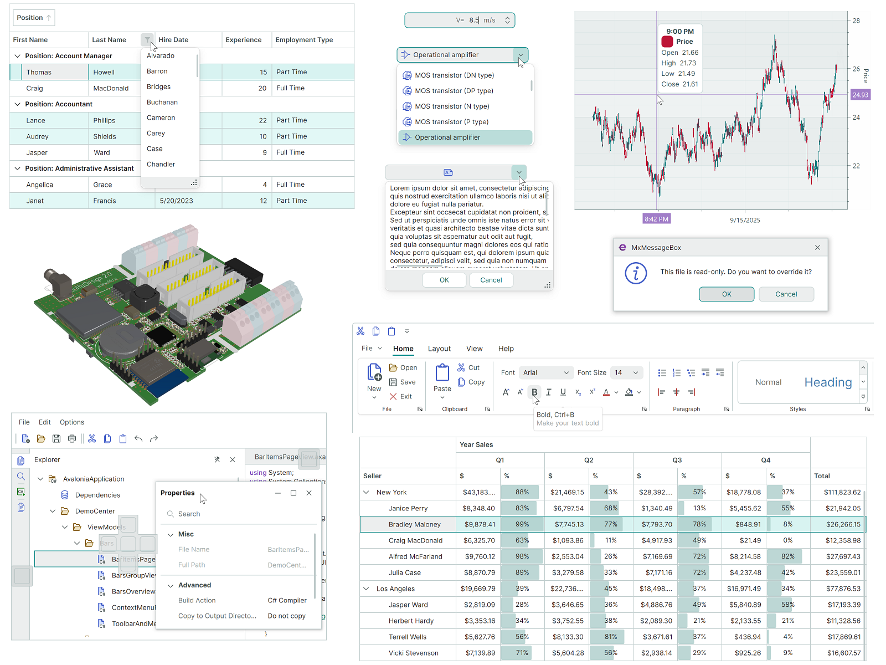
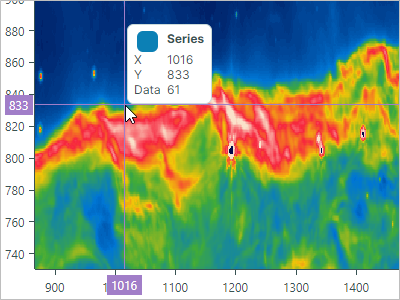
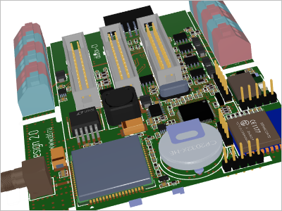
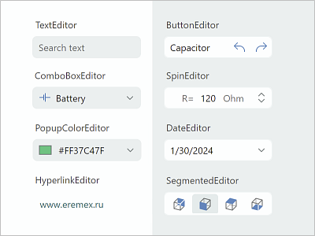
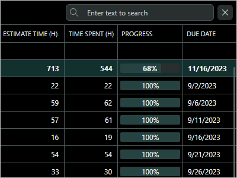
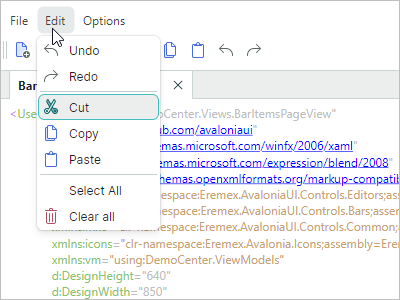

# Eremex Avalonia UI Controls Library

Eremex Avalonia UI Controls Library 包含功能强大的 UI 控件和实用工具库，适用于 Avalonia 框架，可帮助您构建高度可定制的跨平台应用程序，并获得更出色的用户体验。

## 快速入门 

- [Eremex Avalonia UI Controls 入门指南](get-started/get-started-with-emx-controls.md)
- [使用标准 Avalonia UI 模板结合 Eremex Controls 创建新项目](get-started/create-new-avalonia-project-using-avalonia-templates.md)

## 演示应用程序

我们的演示应用程序可让您浏览和测试 Eremex Controls 库的多种功能。

### 离线下载并运行演示

- [Eremex Avalonia Controls Demo](https://github.com/Eremex/controls-demo)

### 在线运行演示

您可以运行演示应用程序的 WASM（WebAssembly）版本，直接在浏览器中体验 Eremex Controls。在线演示的访问地址为：

- [Eremex Avalonia Controls Online Demo](https://eremex.github.io/controls-demo/)

在线演示中禁用了部分示例模块，包括：

- 演示 WASM 不支持的功能的示例（例如 3D 引擎）。
- 未针对在网页浏览器中显示和交互进行优化的示例。

已知限制：不支持超链接。

## 包含内容

- [程序集](whats-included/assemblies.md)
- [项目模板](whats-included/project-templates.md)
- [系统要求](whats-included/system-requirements.md)

 

## 控件和库

     

### 数据管理控件

| 

 | col 2 |
| --- | --- |
| **Data Grid** |  |
|  | 以二维表格的形式显示来自项源的数据，并提供丰富的数据整理和编辑功能。  - 支持大型数据源 - 非绑定数据 - 数据排序和分组 - 内嵌编辑器 - 搜索和数据筛选 - 多行选择 - 行拖放 - 数据验证 - 内置和自定义上下文菜单 - 列组（Column Bands） [了解更多...](controls/datagrid/index.md) |  
| **Tree List 和 Tree View** |
|  | 以树的形式呈现层次结构数据。Tree List 支持多列数据，而 Tree View 是单列控件。  - 绑定到自引用（扁平）和层次结构数据源 - 非绑定模式（允许手动提供数据） - 多行选择 - 通过内置复选框选择行 - 数据排序 - 内嵌编辑器 - 数据搜索和筛选 - 行拖放 - 数据验证 - 内置和自定义上下文菜单 - 列组（Column Bands） [了解更多...](controls/treelist/index.md) | 
| **Property Grid** |
|  | 用于浏览和编辑一个或多个对象属性的高效解决方案。   - 根据绑定对象的公共属性自动生成行 - 手动创建行模式 - 将行合并为类别行 - 将行合并为内嵌选项卡 - 搜索面板（用于快速定位行） - 内嵌编辑器 [了解更多...](controls/propertygrid/index.md) | 
| **List View** |
|  | 一种高级列表，按照您的模板渲染项。支持项排序、分组、筛选和多选。  - 两种项排列模式：`Stack`（单列项）和 `Wrap`（多列排列，支持项换行） - 按照您的模板以自定义方式渲染 ListView 项 - 针对无限数量的项属性进行项排序和分组 - 通过事件进行项筛选 - 单选和多选模式 [了解更多...](controls/listview/index.md) | 

     

### 导航和布局控件

| 

 | col 2 |
| --- | --- |
| **Ribbon** |
|  | 灵感来自 Microsoft Office 产品中 Ribbon UI 的菜单。  - 经典视图和简化视图 - 支持[传统菜单](controls/toolbars-and-menus/index.md)中提供的所有项（命令）类型：常规按钮、复选按钮、编辑器、标签、子菜单和按钮组。 - 内嵌和下拉库（gallery） - 快速访问工具栏（Quick Access Toolbar）——用户可以在运行时通过上下文菜单将常用命令添加到此工具栏。 - 自定义快速访问工具栏的位置（在 Ribbon 命令面板上方或下方）和可见性 - 在选项卡标题区域显示项 - 选项卡标题着色（可用于突出显示上下文相关的选项卡）- 使用键盘导航 Ribbon 项 - 自适应组和项布局（在 Ribbon 控件宽度变化时调整命令布局） [了解更多...](controls/ribbon/index.md) |
| **Toolbars and Menus** |  |
|  | 适用于您应用程序的传统工具栏和菜单。  - 支持的工具栏项类型：按钮、复选按钮、子菜单、项组等 - 在容器边缘停靠工具栏 - 将工具栏放置在窗口内的任意位置（例如，客户端控件的顶部） - 水平和垂直工具栏方向 - 自适应命令布局 - 通过拖放操作在运行时自定义工具栏布局 - 用于高级工具栏个性化设置的运行时自定义模式 - 快速自定义（无需激活自定义模式） - 在工具栏中显示数值，并允许用户使用内嵌编辑器进行编辑 - 支持热键，包括 Ctrl+R、Ctrl+K 等复杂快捷键 - 面向外部控件的上下文菜单 [了解更多...](controls/toolbars-and-menus/index.md) | 
| **Docking UI** |
|  | 灵感来自 Microsoft Visual Studio IDE 的经典 Docking 界面。  - Dock 面板可帮助您创建工具窗格 - Document（内嵌的 Dock 窗口）可用于显示界面的主要内容 - 浮动面板 - 面板自动隐藏功能 - 选项卡容器 - 面板调整大小和拖放 - Dock 提示 - 内置上下文菜单，用于对面板和 Document 执行操作 - 支持 MVVM - 支持多显示器 Docking - 在应用程序运行之间保存和恢复 Dock 面板的布局 [了解更多...](controls/docking/index.md) |

    

### 数据可视化控件

| 

 | col 2 |
| --- | --- |
| **Chart Controls** |  |
|  | `CartesianChart`、`PolarChart` 和 `SmithChart` 控件可让您将最流行的交互式图表集成到应用程序界面中。  - 数据系列数量不受限制 - 支持的视图：Line、Bar、Range Bar、Step Line、Candlestick 等 - 多种坐标轴类型：数值型、日期时间型、时间跨度型、定性型和对数型 - 对整个视图及各个坐标轴进行滚动和缩放 - 显示大数据量时具有高性能。 - 实时数据可视化。 [了解更多...](controls/charts/index.md) | 
| **Heatmap Control** |  |
|  | 一种二维热图——使用彩色点可视化数据的图表。  - 以颜色对数值进行二维表示 - 自定义 X 轴和 Y 轴 - 十字线（Crosshair） - 条带和常数线 - 使用鼠标滚动和缩放 - 将渲染结果导出为位图 [了解更多...](controls/charts/heatmap.md) | 

     

### 3D 图形

| 

 | col 2 |
| --- | --- |
| **Graphics3DControl** |  |
|  | 可让您在 Avalonia 应用程序中可视化 3D 模型。  - 用于指定 3D 模型的 API - 简单材质 - PBR 格式的贴图材质 - 同时显示多个 3D 模型 - 透视和等距相机模式 - 在运行时使用鼠标和键盘旋转、平移和缩放模型 - 借助 Vulkan SDK 在显卡上进行渲染 - 支持使用 MVVM 模式指定 3D 模型 [了解更多...](controls/graphics3dcontrol/index.md) | 

  

### 编辑器和实用控件
| 

 | col 2 |
| --- | --- |
| **Data Editors** |  |
|  | 简单和高级的编辑器，可让用户编辑几乎任何内容——从文本和数字到日期/时间值和颜色。您可以将它们用作独立控件，也可以用作内嵌编辑器   - ButtonEditor - CheckEditor - ComboBoxEditor - DateEditor - HyperlinkEditor - MemoEditor - PopupColorEditor - SegmentedEditor - SpinEditor - TextEditor [了解更多...](controls/editors/index.md) |
| **Utility Controls** |  |
|  | Eremex Controls 库附带的一系列实用控件，可帮助您创建功能丰富的应用程序。  - TabControl -  SplitContainerControl -  GroupBox -  CalendarControl -  MxMessageBox -  CircleProgressIndicator [了解更多...](controls/utility-controls/index.md) |

     

### Eremex 绘制主题

Eremex Controls Library 附带 “DeltaDesign” 绘制主题，可帮助您打造具有明暗两种配色方案的界面。

| 

 | 

 |
| --- | --- |
| **DeltaDesign 浅色主题** | **DeltaDesign 深色主题** |
|  |  |
|  |  |

有关更多信息，请参见以下主题： 

- [主题](controls/themes/index.md)

 
 

* 本页面使用机器翻译技术翻译。
