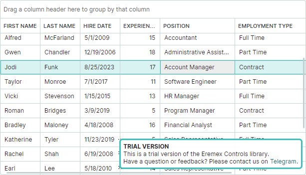
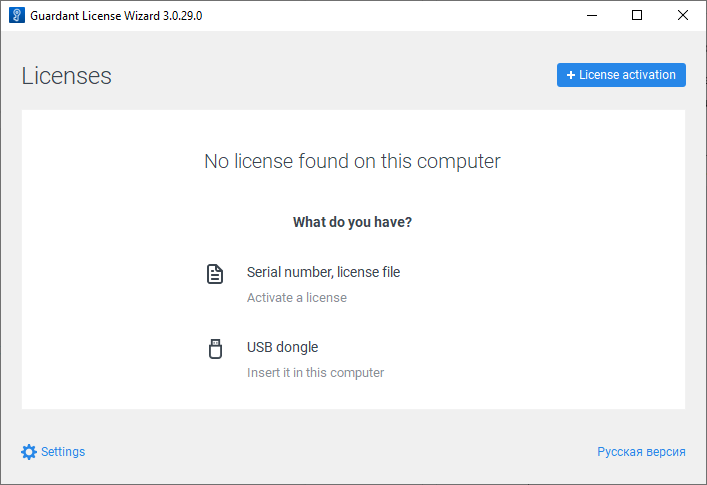
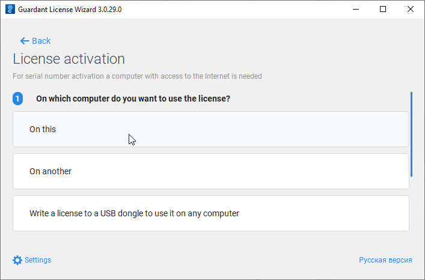
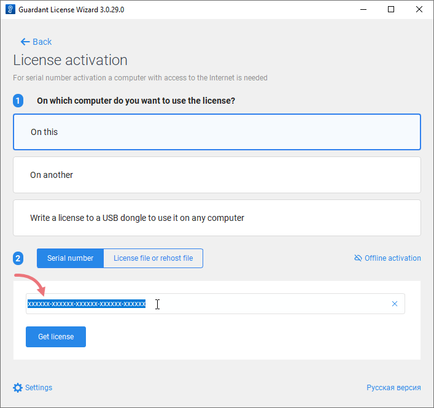
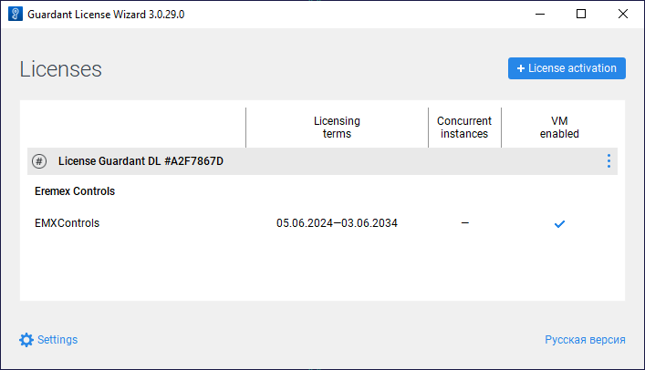
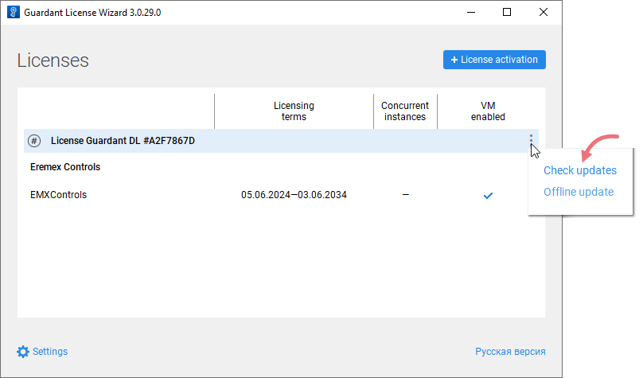
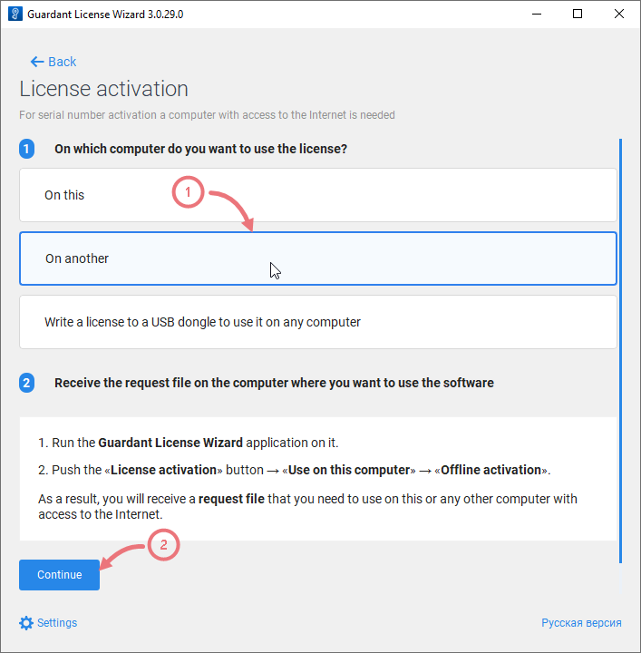
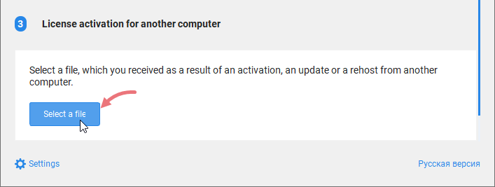
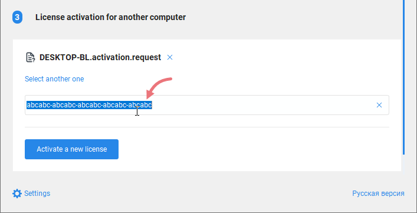

# 许可与产品评估

本文档包含有关产品评估、许可证激活以及许可相关常见问题解答的信息。

如果您正在开发开源项目，并希望在其中使用 Eremex Controls 库，可以申请免费的非商业许可证。请参阅[面向开源项目的免费非商业许可证](#free-non-commercial-licenses-for-open-source-projects)。

## 产品评估

Eremex Controls 库提供免费的 60 天试用版，让您可以在自己的项目和环境中评估该产品。使用试用版期间，Eremex 控件会显示试用消息。



<!-- The free 60-day trial version of the Eremex Controls Library allows you to evaluate the product in your projects and environment. There are no restrictions in the functionality of the controls. The trial version displays "trial" messages and has some minor restrictions -->


## 许可

Eremex Controls 库的许可模式在[最终用户许可协议 (EULA)](eula.md)中进行了说明。

在许可期内，您可以使用 Eremex Controls 库创建新项目，也可以使用新版本的库升级现有项目。在预生成阶段，Eremex Controls 的许可证管理器会生成 `emxLicense.cs` 文件，其中包含唯一的许可证运行时密钥。许可证运行时密钥包含以下设置的信息：

- 程序集名称
- 项目中使用的 Eremex Controls 库的主版本号（**XX.Y**.z）。

在项目生成时，`emxLicense.cs` 文件会在项目目录中创建，并作为编译项包含在项目中。


以下是定义许可证运行时密钥的 `emxLicense.cs` 文件示例：

``` csharp
// This file is auto-generated. Please do not change it.
using System.Runtime.CompilerServices;
using Eremex.AvaloniaUI.Controls.License;

namespace DemoCenter;
public class LicenseProvider
{
#pragma warning disable CA2255 // The 'ModuleInitializer' attribute should not be used in libraries
	[ModuleInitializer]
#pragma warning restore CA2255 // The 'ModuleInitializer' attribute should not be used in libraries
    public static void RegisterLicense()
	{
        ControlsLicenseManager.SetRuntimeLicenseOwner(new LicenseProvider(),"", 
        "61 5C D0 DA 5E 85 40 27 D0 33 A1 27 5E A7 49 C0 55 B8 3F 84 29 15 30 E0 
        08 57 73 0B 33 D6 BF 34 51 3D AC 02 BD 11 BF C3");
	}
}
```

 如果生成的 `emxLicense.cs` 文件未自动包含到项目中（例如，由于 IDE 设置的原因），请手动添加该文件。


许可证运行时密钥用于在运行时进行许可证校验。如果许可证信息无效或未找到，Eremex 控件会显示试用消息。


### 许可证到期

许可期结束后，将无法创建新项目，也无法将现有项目更新到 Eremex Controls 库的新主版本。

在许可期内创建的项目将继续可以生成和运行。唯一的要求是，您不得更改现有项目中 Eremex Controls 库的程序集名称和主版本号。否则，Eremex 控件将在运行时显示试用消息。不过，即使在许可证到期后，您仍然可以自由更新项目中库的次版本号（XX.Y.**z**）。


## 管理许可证

Eremex Controls 的开发者许可证通过来自 [Guardant](https://guardant.com) 的两款工具进行管理：

- “Guardant Control Center” —— 许可证管理服务。安装文件：Windows 版为 `grdcontrol-x.xx.msi`，Linux 版为 `grdcontrol-x.x_amd64.deb`。
- “Guardant License Wizard” —— 一个图形界面和命令行工具，可用于添加、更新和转移许可证。可执行文件：Windows 版为 `license_wizard.exe`，Linux 版为 `license_wizard`。

您可以通过以下链接下载这些工具：

- [Guardant License Management Redistributables (Windows)](../resources/Guardant_Redistributable_Windows.zip)
- [Guardant License Management Redistributables (Linux)](../resources/Guardant_Redistributable_Linux_deb.zip) 

 

### 在线激活 Eremex Controls 许可证

1. 安装“Guardant Control Center”

2. 运行“Guardant License Wizard”

    
    
3. 点击 **Settings**，并确保 **Server address** 属性设置为 _https://getlicense.guardant.ru_。
   
     

	 然后点击 **Back** 返回上一页。

4. 点击 **License Activation** 按钮以添加新的许可证密钥。

5. 指定要在其上注册许可证的计算机。

    

6. 在 **Serial Number** 字段中输入您的许可证密钥。

    

	
7. 点击 **Get license**。

    如果许可证激活成功，向导将显示已授权产品的相关信息。

    


#### 从命令行注册许可证

```
license_wizard --console --activate &lt;LICENSE-KEY&gt; --host https://getlicense.guardant.ru
```

#### 获取所有命令行选项的信息

<code>license_wizard --help</code>


### 在线更新 Eremex Controls 许可证

1. 运行“Guardant License Wizard”

    

2. 点击 **Settings**，并确保 **Server address** 属性设置为 _https://getlicense.guardant.ru_。然后点击 **Back** 返回上一页。

3. 在 Licenses 页面中，点击省略号（“...”）按钮，然后点击“Check updates”。

    

	
4. 如果在服务器上找到许可证更新，请点击出现的 _Install Updates_ 链接。

5. 操作成功后，向导将更新已注册的许可证。
 

#### 从命令行更新许可证

```
license_wizard --console --update &lt;LICENSE-KEY&gt; --host https://getlicense.guardant.ru
```


### 离线激活 Eremex Controls 许可证

1. 运行“Guardant License Wizard”

    

2. 点击“License activation”。

    
3. 选择“On this”以指定要在其上注册许可证的计算机。

    

4. 点击“Offline activation”按钮。

    

5. 点击“Save”将新许可证的请求保存到文件中。

    

6. 在另一台可以访问互联网的计算机上，运行“Guardant License Wizard”。

7. 点击 **Settings**，并确保 **Server address** 属性设置为 _https://getlicense.guardant.ru_。然后点击 **Back** 返回上一页。

8. 在 Licenses 页面中，点击 **License Activation** 按钮。

    

9. 选择“On another”以指定要为其激活许可证的计算机。然后点击“Continue”。

    

10. 加载在目标计算机上生成的许可证请求。

    

11. 输入您的许可证编号，然后点击“Activate a new license”。

    

12. 保存许可证文件（“_*.license_”）。

    

13. 返回目标计算机。

14. 运行“Guardant License Wizard”，并切换到“License activation”页面。

15. 选择“On this”以指定用于许可证激活的计算机。然后点击“License file or rehost file”，并加载生成的许可证文件（“_*.license_”）。

    

16. 激活许可证。

## 切换许可证

如果您的计算机上注册了两个或更多许可证，可以按照以下方式为项目选择所需的许可证。

1. 如果 `emxLicense.cs` 文件缺失，请先生成项目。生成后，该文件将引用找到的第一个许可证。

    `emxLicense.cs` 文件中 `SetRuntimeLicenseOwner` 方法的第三个参数指定了许可证 ID。

    <!-- TODO
    screenshots
    <image> -->

2. 运行“Guardant License Wizard”以查看已安装的许可证。

    <!--TODO <image> -->

3. 找到所需许可证的 ID（在许可证标题后显示的十六进制数字）。

4. 将 `SetRuntimeLicenseOwner` 方法中的许可证 ID 替换为新的 ID。

    <!-- TODO
    code
    -->

5. 重新生成项目。


## 面向开源项目的免费非商业许可证

我们希望开发开源项目的用户也能使用 Eremex Controls。如果您是开源项目的作者，并希望在其中使用我们的库，可以通过以下服务申请许可证。

- [用于开源项目的 EMX Controls 许可系统](https://eremexcontrols.net/open-source-licensing/)

!!! note 

    这种许可方式仅适用于非商业性质的开源项目。

要获得免费许可证，您的项目必须满足以下条件：

- 项目托管在 GitHub 上，并包含 README 文件。
- README 文件中包含指向我们网站的链接：[https://eremexcontrols.net/](https://eremexcontrols.net/)。
- 项目引用了 EMX Controls 库。
- 项目使用以下开源许可证之一进行授权：MIT、Apache 2.0、BSD 2-Clause、BSD 3-Clause、ISC 或 MSPL。

EMX Controls 许可证与项目名称及库的主版本号相关联。如果您更改项目名称或升级到库的新主版本，则需要通过我们的服务重新获取许可证。

请注意，对于免费许可证，我们团队提供的支持可能会受到限制。


## 常见问题


&ndash; **我可以在 CI 中生成使用 Eremex Controls 的项目而无需额外的许可证吗？**

&ndash; 可以。在 CI 中生成项目不需要额外的开发者许可证。要在没有试用消息的情况下运行项目，请勿在 CI 环境中更改项目里 Eremex Controls 的程序集名称和主版本号。


<br>


&ndash; **我可以通过 RDP 远程连接进行应用程序开发吗？**

&ndash; 当您使用远程方式进行应用程序开发时，许可证管理器不会在项目中创建许可证文件。因此，项目中会出现试用消息。如果您需要没有此限制的许可证类型，请联系我们。


<br>


&ndash; **在我的 Eremex Controls 许可证到期后，我的项目还能继续生成和运行，并且不显示试用消息吗？**

&ndash; 可以。许可证赋予您在许可期内创建新项目和升级现有项目的权利。许可证到期后，只要您不更改所引用的 Eremex Controls 库的程序集名称和主版本号（**XX.Y**.z），您的项目仍将继续生成和运行，且不会显示试用消息。您可以在现有项目中更新次版本号（XX.Y.**z**），因为它不参与许可证有效性检查。

<br>

&ndash; **为什么我的项目会显示试用消息？**

&ndash; 在以下情况下，Eremex 控件会显示试用消息：

- 项目不包含带有有效许可证运行时密钥的 `emxLicense.cs` 文件。
- 应用程序使用的 Eremex Controls 库的主版本号与许可证运行时密钥中编码的库版本不匹配。
- 当前的程序集名称与许可证运行时密钥中编码的程序集名称不匹配。

<br>
<br>

<sup>*</sup> 本页面使用机器翻译技术翻译。
