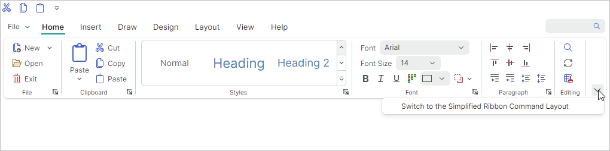
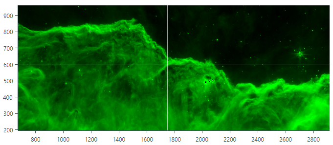

# 版本 1.1

## 1.1.144

### Docking

- 新增的 `DockPane.AllowAutoHide` 选项允许您阻止用户为特定面板启用自动隐藏模式。此选项会隐藏该面板的“Pin”按钮和“Auto Hide”上下文菜单项。 

### Ribbon 和工具栏

- 修复问题：某些情况下拖动工具栏后会引发 AvaloniaInternalException。
- 修复问题：当 Ribbon 中包含隐藏组时，在其中导航会引发 NullReferenceException。

### 图表

- 修复问题：无法通过代码使用 `AxisRange.VisualMin` 和 `AxisRange.VisualMax` 属性更改可见范围。
- 修复问题：禁用滚动和缩放操作时，CartesianChart 控件的 `PointerPressed` 事件不会触发。

## 1.1.142

### DataGridControl 和 TreeListControl 

#### 列标题工具提示

新增的 `HeaderToolTip` 属性允许您为 DataGrid 和 TreeList 控件中的列标题指定自定义工具提示。

#### 已修复的问题

- 对于使用了以自定义方式格式化显示文本的内置编辑器的列，排序和筛选存在错误。具体情况包括：

    * 带掩码的编辑器——当编辑器使用掩码且 `UseMaskAsDisplayText` 属性设置为 `true` 时。
    * `PopupColorEditor`——当编辑器显示所选颜色的值时。
    * `ComboBoxEditor`——当项的显示文本与该项的 `ToString` 方法返回值不一致时（例如，使用 `EnumItemsSource` 对象作为项的来源时）。

- 如果使用 `CellTemplate` 属性为列指定内置编辑器，并为该编辑器的 `IsVisible` 属性指定了绑定，则在调整窗口大小时 DataGrid/TreeList 会引发异常。

### 编辑器

修复问题：在双击和三击时，`SpinEditor` 中的值选择不正确。

### PropertyGrid

修复问题：如果未触发 `PropertyChanged` 事件，则在编辑操作后内置编辑器会恢复为旧值。

### Docking

`FloatWindow.StyleKeyOverride` 属性的值已从 `typeof(Window)` 更改为 `typeof(FloatWindow)`。

### Ribbon

修复问题：如果 `RibbonPageGroup.IsVisible` 属性设置为 `false`，则在调整 Ribbon 大小时会抛出 NullReferenceException。

## 1.1.130

### Graphics3DControl

- 默认曝光值（`Graphics3DControl.Exposure`）已更改为 4.5。
- `Graphics3DControl.EnableMultisampling` 属性已替换为 `Graphics3DControl.MultisamplingMode`。`MultisamplingMode` 设置允许您选择抗锯齿（MSAA）质量级别。
- Graphics3DControl 现在允许您指定自定义光源。使用 `Lights` 或 `LightsSource` 属性来创建光源。支持的光源类型：Point、Directional、CameraPoint 和 CameraDirectional。
- 您可以使用 `AllowDefaultLight` 属性来禁用默认光源。
- 新增对自定义[天空盒](../controls/graphics3dcontrol/skybox.md)的支持。
- 更新了默认天空盒，以改善视觉渲染效果。
- 优化了近裁剪面和远裁剪面的默认距离。

### Data Grid 和 Tree List 
- 修复问题：在网格水平滚动期间，带有 Enum 数据源的内置 ComboBoxEditor 工作不正常。
- 修复问题：在 CellTemplate 中使用 Binding 时，编辑器值的即时提交无法正常工作。

### Docking UI

- 修复问题：启用 Compiled Bindings 时，删除文档会引发 InvalidCastException。

## 1.1.112

### 图表

- 修复了 `DataAdapter.RemoveFromStart` 方法的一个问题，该问题在删除大量数据点时会导致性能显著下降。

### Docking UI

新增了以下属性：

- `DockManager.OwnsFloatingDockPanes` 
- `DockManager.OwnsFloatingDocuments`

这些属性用于指定 `DockManager` 是否自动将自身设置为浮动停靠面板和文档的所有者。
如果 `OwnsFloatingDockPanes`/`OwnsFloatingDocuments` 属性为 `false`，则当主窗口获得焦点时，浮动停靠面板/文档会出现在主窗口后面。

### Graphics3DControl

- 修复了调用上下文菜单时拖动操作不会停止的问题。
- `Graphics3DControl.Gamma` 和 `Graphics3DControl.Exposure` 属性现在可以接受值 0。
- `Graphics3DControl.CoordinateSystem` 现在能正确返回 `RightHanded`，这与 `Graphics3DControl` 中使用的默认坐标系一致。
- `Graphics3DControl.ZoomFactor` 属性已重命名为 `Graphics3DControl.ZoomRate`。
- 改进了用于计算近裁剪面和远裁剪面默认位置的算法。
- 新增了天空盒功能。
- 新增了对象选取和高亮显示功能。
- 新增了无需指定索引即可绘制点的选项。
- 新增了对仅使用 Emission 贴图的纹理的支持。
- 调整了使用鼠标时模型旋转的默认速率。
- 修复了 `MaterialKey` 为 null 时出现的 IndexOutOfRange 异常。

### Ribbon

- 修复了特定 MVVM 场景下的一个问题。

## 1.1.95

### 新增内容

### Ribbon 和工具栏

为 `ToolbarCheckItem` 对象（复选按钮）新增了属性。这些属性用于指定复选按钮在 Ribbon 控件和工具栏中的呈现方式：

- [`ToolbarCheckItem.CheckBoxStyle`](../controls/ribbon/ribbon-items.md#check-buttons-toolbarcheckitem)——指定复选框的呈现方式，是常规复选按钮、切换按钮还是单选按钮。

- `ToolbarCheckItem.CheckBoxAlignment`——指定复选框显示在文本和图标之前还是之后。

<!-- The new `RibbonPageGroup.ItemLayoutDirectionInParent` attached property allows you to override the default layout mechanism for items in a Ribbon page group. -->

### Data Grid 和 Tree List

- 修复问题：更改列的可见性和 ItemsSource 时，`CellData.Row` 对象不会更新。
- 修复问题：单击节点的复选框会关闭显示 Tree List 控件的弹出窗口。

### Graphics3DControl

- 如果 macOS 上缺少 Vulkan SDK，控件会显示安装所需库的说明。
- 修复问题：移除底层 3D 模型后，Graphics3DControl 的渲染内容不会被清除。
- 修复了某些情况下自动相机定位的问题。
- 修复问题：背面看起来比实际更具金属质感。

## 1.1.91

### 新增内容

#### Ribbon

[RibbonControl](../controls/ribbon/index.md) 允许您将受 Microsoft Office 启发的导航菜单集成到 Avalonia UI 应用程序中。 

- 内置和下拉画廊
- 快速访问工具栏——您可以将常用命令添加到此工具栏。
- 自定义快速访问工具栏的位置（位于 Ribbon 命令面板上方或下方）和可见性
- 在页面标题区域显示项目
- 页面标题着色（可用于突出显示上下文选项卡）
- 使用键盘进行 Ribbon 项目导航
- 经典和简化的命令布局
- 支持传统菜单（[ToolbarManager](../controls/toolbars-and-menus/index.md)）中可用的所有类型的项目（命令）
- 组和项目的自适应布局（在 Ribbon 控件宽度变化时调整命令的布局）

#### Cartesian Chart - 蜡烛图系列视图

[蜡烛图视图](../controls/charts/cartesian-series-views/candlestick-series-view.md)允许您创建描述资产价格变动的金融图表。 

对于每个数据点，图表会显示一组四个值：开盘价（Open）、收盘价（Close）、最高价（High）和最低价（Low）。

#### Heatmap

[Heatmap](../controls/charts/heatmap.md) 控件是一种通过颜色在矩阵中可视化数值数据的工具。

[热力图](https://en.wikipedia.org/wiki/Heat_map)有助于对大型数据集进行可视化分析，并定位沿水平轴和垂直轴显示的两个变量之间的相关性和异常情况。
热力图中每个数据点的颜色由该点的数值决定。要在 Heatmap 控件中指定自定义颜色编码，请为特定值（过渡值）分配颜色。
这些颜色用于在过渡值之间创建颜色渐变。矩阵中所有点的颜色均由这些渐变确定。
[Heatmap](../controls/charts/heatmap.md) 控件的功能包括：
  - 自定义颜色编码
  - 灰度着色
  - 自定义 X 轴和 Y 轴
  - 十字光标
  - 条带和恒定线
  - 使用鼠标滚动和缩放
  - 将数据着色结果导出为位图

#### Graphics3DControl

[Graphics3DControl](../controls/graphics3dcontrol/index.md)——一个用于可视化和交互操作 3D 模型的控件。

- 该控件的 API 允许您指定 3D 模型、相机设置和材质（PBR 格式）
- 相机支持透视和等距 3D 视图 
- 同时显示多个 3D 模型
- 您可以在运行时使用鼠标和键盘旋转、缩放和平移模型
- 使用 Vulkan SDK 显示 3D 图形
- 支持 MVVM 模式

#### Data Grid 和 Tree List/Tree View

- Data Grid——行拖放——DataGridControl 控件现在支持控件内部以及向外部控件（例如 Tree List 或另一个 Data Grid）进行行拖放操作。拖放操作支持常规行（数据行）和分组行。当您拖动一个分组行时，该组的所有数据行都会一起被拖动。如果源控件和目标控件（Data Grid 和/或 Tree List）数据源中的业务对象类型相同，则无需额外编写代码即可处理二者之间的行拖放操作。

- Data Grid——多行选择——用户可以通过鼠标并按住 CTRL 和 SHIFT 键同时选择多行。控件公开的公共 API 允许您在代码中选择多行。

- Data Grid 和 Tree List——从 View Model 填充列的能力——使用 `ColumnsSource` 属性指定需要表示为列的对象集合。`ColumnTemplate` 属性允许您指定用于从这些对象创建列的模板。

- Data Grid 和 Tree List/Tree View——新的垂直滚动机制——当行高度不同时，我们对网格和 Tree List 控件的垂直滚动进行了显著改进。即使对于大型记录集，这些控件现在也能为可变高度的行提供流畅的垂直滚动和精确的滚动滑块定位。

- Data Grid 和 Tree List——完整的数据虚拟化——Data Grid 和 Tree List 控件实现的数据虚拟化机制旨在提升控件在显示大量行和列时的性能。自 1.0 版起，这些控件就支持垂直虚拟化。在新版本（v 1.1）中，控件支持水平虚拟化，从而在使用大量列时加快启动时间。  

  虚拟化机制只创建和维护视口中可见的视觉元素（单元格、列标题等）。如果没有数据虚拟化，控件就必须为全部单元格（包括视口之外的单元格）创建视觉元素。

- Data Grid 和 Tree List——我们优化了容器控件中内置编辑器的渲染方式。这使我们能够大幅提升多列 Data Grid 和 Tree List 控件的加载时间和滚动性能。

#### Property Grid

- 垂直虚拟化——Property Grid 现在支持数据虚拟化机制。它可以缩短显示大量行时控件的加载时间。

#### MxMessageBox

[MxMessageBox](../controls/windows-and-dialogs/messagebox.md) 对话框允许您向用户显示消息并提出问题。 

该对话框支持 Eremex 绘制主题，其外观与项目中的其他 EMX Controls 保持一致。 

#### 编辑器

- ComboBoxEditor——可以处理新增的 `FilterItem` 事件来自定义筛选项目。当用户在编辑器中输入文本时，只要自动完成功能被禁用，就会触发项目筛选机制。请参阅 [ComboBoxEditor - 自动筛选](../controls/editors/comboboxeditor.md#auto-filter)。

 
 

* 本页面使用机器翻译技术翻译。
