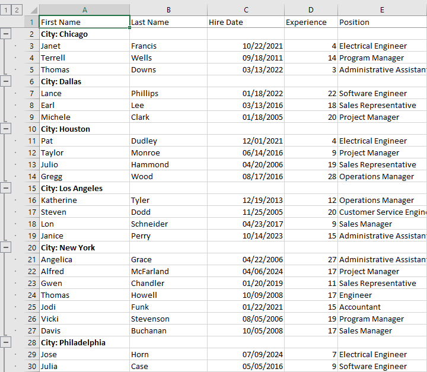
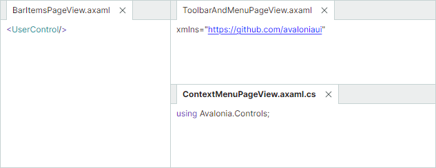
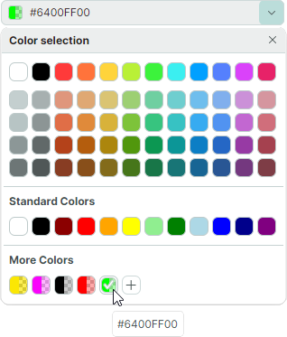

# 版本 1.2

## 1.2.102

### DataGrid 和 TreeList

- 已修复问题：在同一列中使用多个 DataTemplate 时，垂直滚动期间为单元格模板提供的数据不正确。

### Property Grid

- 已修复问题：双击具有嵌套属性的属性会触发行展开/折叠事件的无限循环。
- 已修复问题：内置编辑器 PopupColorEditor 不以大写形式显示 HEX 颜色值。

### 图表

- 已修复问题：当 Axis.WholeMin 和 Axis.WholeMax 属性设置为零时，将鼠标悬停在图表上会引发 ArgumentOutOfRangeException。
- 已修复问题：设置 MeasureUnit 属性时应用了不正确的可视范围。

### 工具栏和 Ribbon

- 已修复问题：当项目被放置在工具栏的溢出菜单中时，Tag 属性丢失。
- 已修复问题：大按钮中的文本对齐不正确。

### Docking 界面

- 已修复问题：在 Tabbed Group 中隐藏面板时，选项卡标题仍然可见。


## 1.2.96

### Graphics3DControl

- 已修复问题：如果模型包含两个或更多 `Lines` 或 `Points` 类型的网格，则在更改 `MeshGeometry3D.PrimitiveSize` 设置时，Graphics3DControl 不会立即更新。

## 1.2.95

### 系统要求

Eremex Controls Library 现在需要 Avalonia 框架 11.3.8 或更高版本。

### DataGrid 和 TreeList

- 重大更改 — 更新了拖放事件参数

    `StartDrag`、`DragOver` 和 `Drop` 事件的事件参数已更改。此重大更改的原因是系统 `Avalonia.Input.IDataObject` 接口已被弃用。这些事件的 `Data` 参数现在是 `DragDropData` 类的类型（在之前的版本中它是 `IDataObject` 接口类型）。`DragDropData` 类公开与已弃用接口相同的成员。

- 已修复问题：无法通过对 `DataGridRowControl` 对象应用样式来更改网格行的背景。

### Property Grid

- 已修复问题：如果活动的内置 PopupColorEditor 的弹出窗口已打开，在其中导航（按上、下箭头键）时会引发异常。

### Ribbon

- 已修复问题：当 Ribbon 包含隐藏项时更新它会引发异常。

#### MxWindow

- 已修复问题：窗口在最大化状态下会添加不必要的内边距。

## 1.2.92

### TreeList — 导出为 PDF

现在您可以直接将 Tree List 控件导出为 PDF 文档。导出过程遵循所见即所得（WYSIWYG）方式，确保生成的 PDF 与控件的屏幕布局一致。


导出 API 允许您自定义各种导出选项，例如列和 band 标题的可见性、纸张设置等。

相关主题：

- [导出](../controls/treelist/export.md)

### Data Grid 和 Tree List — 复制到剪贴板

Data Grid 和 Tree List 控件现在支持使用 CTRL+C 快捷键将所选行复制到剪贴板。
新的 `CopyToClipboardAsync` 方法允许您在代码中复制行。

有关更多信息，请参阅以下主题：

- [剪贴板](../controls/datagrid/clipboard.md)

### Data Grid 和 TreeList — 其他

- `OnKeyDown` 和 `OnKeyUp` 方法现在是虚方法。
- 已修复问题：当具有 Auto 宽度的列设置了 MinWidth 时，控件会冻结。
- 已修复问题：列中的筛选菜单不适用于可为 null 的属性。

## Property Grid

- 已修复问题：将行的 IsVisible 属性绑定到某个属性，然后编辑该属性时出现的问题。


## Ribbon

- 已修复问题：当 Ribbon 放置在 ToolbarManager 内部时会引发异常。
- 已修复问题：Ribbon 会为隐藏项分配空间。

### ComboBoxEditor — 编辑器值的即时更新

在多选模式下，ComboBoxEditor 在下拉窗口中包含用于确认用户选择的 OK 和 Cancel 按钮。如果这些按钮被隐藏，则当用户在下拉列表中勾选或取消勾选项目时，ComboBoxEditor 会立即更新其值。如果这些按钮可见，则编辑器的值在点击 OK 按钮后才会更新。

将编辑器的 `PopupFooterButtons` 属性设置为 `None`，即可隐藏 OK 和 Cancel 按钮。

## 1.2.77


### Data Grid 和 Tree List — 列筛选

Data Grid 和 Tree List 控件现在支持列筛选菜单。

将鼠标悬停在任意列标题上以显示筛选按钮。点击此按钮会打开一个列出该列唯一值的筛选菜单。选择任意值即可立即筛选该列。


- 多列筛选 — 您可以同时对多个列应用筛选。
- 筛选面板 — 应用筛选后，控件底部会出现一个专用的筛选面板。它显示当前的筛选条件，并提供临时禁用或清除筛选的选项。
- 代码中筛选 — 使用新的 `DataControlBase.FilterString` 属性来[在代码中创建自定义筛选条件](../controls/datagrid/filter-and-search.md#filter-in-code)。该属性适用于 Data Grid、Tree List 和 Tree View 控件。

相关主题：

- [Data Grid - 筛选和搜索](../controls/datagrid/filter-and-search.md)
- [Tree List - 筛选和搜索](../controls/treelist/filter-and-search.md)

### Data Grid — 导出为 PDF

Data Grid 现在允许您将数据导出为 PDF 文档。导出为 PDF 的功能遵循所见即所得（WYSIWYG）理念，在输出文档中保留网格元素的布局。


导出为 PDF 时，您可以自定义各种设置，包括纸张类型、页边距、方向等。

相关主题：

- [导出](../controls/datagrid/export.md)

### MxMessageBox — 异步模式

`MxMessageBox` 现在包含[ShowAsync 方法重载](../controls/windows-and-dialogs/messagebox.md#showasync-method-overloads)。它们允许您异步显示消息框，而不会阻塞 UI 线程。

### 以 Json 格式序列化控件

要序列化/反序列化 Eremex 控件，您通常使用其 `SaveLayout` 和 `RestoreLayout` 方法，这些方法采用 XML 格式进行序列化。目前，这些方法不允许您选择输出格式。

要更全面地控制序列化设置并使用 JSON 格式，请使用带有 `SerializationSettings` 参数的 `SerializationManager.Serialize` 和 `SerializationManager.Deserialize` 方法。将 `SerializationSettings.SerializationMode` 属性设置为 `Json`，即可以此格式序列化/反序列化控件。

### Docking 界面

- 新的 `DockManager.DockItemContextMenuOpening` 事件允许您自定义 Dock 面板和 Document 面板的内置上下文菜单，并阻止显示上下文菜单。

- `DockManager.Commands` 属性提供对 Dock 面板和 Document 面板所有内置命令（`ICommand` 对象）的访问（例如 `AutoHide`、`ToggleAutoHide`、`Maximize`、`Minimize`、`NewHorizontalDocumentGroup` 等）。这些命令由内置上下文菜单调用。

### Ribbon

- 已修复问题：在特定按钮布局中，Ribbon 组中的按钮会消失。

### 禁用窗口和弹出窗口的透明度和阴影

新的 `MxSettings` 类存储了 Avalonia 应用程序中所有 Eremex 控件特有的全局设置。该类包含 `MxSettings.EnableWindowTransparency` 属性，用于管理 Eremex 窗口和弹出窗口的透明度及阴影可见性。

要自定义 `MxSettings.EnableWindowTransparency` 设置，请在 `AppBuilder.Configure` 链中添加对 `UseEMXServices` 方法的调用，如下所示：

``` cs
public static AppBuilder BuildAvaloniaApp()
    => AppBuilder.Configure<App>()
        .UsePlatformDetect()
        .WithInterFont()
        .LogToTrace()
        .UseEMXServices(settings => { settings.EnableWindowTransparency = false; });
```


## 1.2.63 (Beta)


### DataGrid 和 TreeList

#### 列 Band

DataGrid 和 TreeList 控件现在支持列 Band 功能。Band 允许您将列进行可视化分组，并在其上方显示额外的标题。控件支持具有无限嵌套层级的层级式 Band。


有关更多信息，请参阅以下主题：

- [Data Grid - Band](../controls/datagrid/bands.md)
- [Tree List - Band](../controls/treelist/bands.md)


#### 导出为 Excel 格式

现在您可以将 DataGrid 和 TreeList 控件中的数据导出为 XLSX 格式。导出引擎允许您在输出的 XLSX 文档中保留控件的数据整形选项：

- 行分组
- 值格式化
- 数据排序



要了解更多信息，请参阅以下主题：

- [Data Grid - 导出](../controls/datagrid/export.md)
- [Tree List - 导出](../controls/treelist/export.md)

#### 模板更新

DataGridControl 和 TreeListControl 的以下模板已更新：
  
``` xml
<ControlTheme x:Key="{x:Type mxdg:DataGridControl}" TargetType="mxdg:DataGridControl">
<ControlTheme x:Key="{x:Type mxtl:TreeListControl}" TargetType="mxtl:TreeListControl">
```

主要更改包括：

- 这些模板中的 ColumnHeaderPanel 对象已被替换为 ColumnHeadersControl。ColumnHeaderPanel 对象现在嵌套在 ColumnHeadersControl 的模板内部。
- DataGridGroupPanelControl 类的所有成员已迁移到新的 DataGridGroupPanelItemsControl 类（ItemsControl 的派生类）。DataGridGroupPanelControl 类现在继承自 TemplatedControl。其模板包含一个 DataGridGroupPanelItemsControl 类的实例。


### TreeView

新的 `TreeViewControl.CellWidth` 属性允许您控制 TreeView 控件中单元格的宽度。`CellWidth` 属性的默认值为 `"*"`，会拉伸单元格以填充控件的宽度。
如果单元格文本过长，会在右边缘被截断，并且不会出现水平滚动条。

将 `CellWidth` 属性设置为 `"Auto"`，即可根据单元格内容自动调整数据列的宽度。当单元格内容的最大宽度超过控件宽度时，会出现水平滚动条。

### Cartesian Chart

新的 Lollipop Series View（`CartesianLollipopSeriesView`）允许您使用带有末端标记的细线来可视化数据。标记表示单个数据点，而线条将标记连接到基线。


主要特性包括：

- 将线条（茎）延伸到水平轴或垂直轴。
- SVG 格式的自定义标记。

#### 重大更改

- Point Series Views 及其派生类 — 现在，在设置 `MarkerImageCss` 属性时，需要使用 `{0}` 语法而不是 `#{0}` 语法。此更改旨在提升控件的可用性。

    Point Series Views（及其派生类）中的 `MarkerImageCss` 属性支持[基于 CSS 的 SVG 元素样式设置](https://developer.mozilla.org/en-US/docs/Web/SVG/Reference/Element/style)。`{0}` 占位符允许您在 CSS 代码中插入 `CartesianLollipopSeriesView.Color` 属性的值。

    在之前的版本中，您需要在 `{0}` 占位符前添加 `#`：

    ``` xml
    <!-- version 1.1 -->
    <mxc:CartesianPointSeriesView Color="orange" MarkerImageCss="circle {{fill:#{0}}}">
    ```

    在 1.2 及更高版本中，使用不带 `#` 字符的 `{0}` 语法。

    ``` xml
    <!-- version 1.2 -->
    <mxc:CartesianPointSeriesView Color="orange" MarkerImageCss="circle {{fill:{0}}}">
    ```

    有关更多信息，请参阅以下主题：
    
    - [Point Series View 设置](../controls/charts/cartesian-series-views/point-series-view.md#point-series-view-settings)
    - [示例 - 创建 Lollipop Series View 并使用自定义 SVG 数据点标记](../controls/charts/cartesian-series-views/lollipop-series-view.md#example-create-a-lollipop-series-view-and-use-custom-svg-data-point-markers)

- Area Series View 和 Step Area Series View — 从 1.2 版本开始，`Transparency` 属性的解释方式已反转，以与标准图形约定保持一致。该属性现在直接控制填充区域的透明度（而非不透明度）。

    版本 1.2+：
    - `Transparency` 设置为 `0` 表示完全不透明
    - `Transparency` 设置为 `1` 表示完全透明

    版本 1.1：
    - `Transparency` 设置为 `0` 表示完全透明
    - `Transparency` 设置为 `1` 表示完全不透明


### Docking

#### Document Switcher

Document Switcher 是一个工具窗口，用于显示可用的 dock 面板和文档，并允许用户使用键盘切换到特定面板。用户可以按 CTRL+TAB 或 CTRL+SHIFT+TAB 来显示 Document Switcher。


有关更多详细信息，请参阅 [Document Switcher](../controls/docking/document-switcher.md)。

#### 混合文档布局

新的 `DockManager.AllowFreeDocumentLayout` 属性允许 DocumentGroup 同时水平和垂直并排停靠。




如果此选项设置为 `false`（默认值），则 DocumentGroup 只能垂直或水平并排停靠。


#### 为 FloatGroup 标题指定内容

新的 `FloatGroup.WindowTitle` 和 `FloatGroup.WindowIcon` 属性允许您为浮动组（浮动窗口）指定标题和图标。
有关更多详细信息，请参阅以下主题：[设置浮动窗口的标题和图像](../controls/docking/dock-panes-and-containers.md#set-a-floating-windows-header-and-image)。


### Editors

#### ComboBoxEditor

您可以使用新的 `SelectAllItemText` 和 `ClearValueItemText` 属性，为编辑器弹出窗口中预定义的 `(Select All)` 和 `(None)` 项指定自定义标题：

- `(Select All)` 项 — 选择/取消选择所有项目。适用于[多选模式](../controls/editors/comboboxeditor.md#select-all-item-in-multiple-selection-mode)。
- `(None)` 项 — 通过将编辑器的值设置为 null 来清除当前选择。适用于[单选模式](../controls/editors/comboboxeditor.md#none-item-in-single-selection-mode)。

#### PopupEditor 及其派生类 

弹出编辑器现在具有 `ShowPopupIfReadOnly` 属性，允许您为只读编辑器禁用弹出窗口。

#### ColorEditor 和 PopupColorEditor

- 颜色选择对话框已重新设计。现在它显示颜色分量的缩写名称：

    

<!-- TODO
Describe in the main topic + change? the example
articles\controls\datagrid\examples\how-to-prevent-opening-popups-for-read-only-popup-editors.md
 -->

- `ColorEditor` 和 `PopupColorEditor` 控件中的颜色框现在会显示带有灰色方块的附加区域，以表示颜色中存在 alpha 通道（透明度）。

    


<!-- ### Built-in Icons

The **Eremex.Avalonia.Controls** assembly includes a set of SVG icons that you can use in your applications. In the new version, the following built-in icons have been renamed:

| Old Name | New Name |
| --- | --- |
| SimOne/Chip Add.svg | Simtera/Chip Add.svg |
| SimOne/Chip Cloud Add Copy.svg | Simtera/Chip Cloud Add Copy.svg |
| SimOne/Chip Cloud Add.svg | Simtera/Chip Cloud Add.svg |
| SimOne/Chip Cloud Change.svg | Simtera/Chip Cloud Change.svg |
| SimOne/Chip Cloud Copy.svg | Simtera/Chip Cloud Copy.svg |
| SimOne/Chip Cloud Import.svg | Simtera/Chip Cloud Import.svg |
| SimOne/Chip Cloud.svg | Simtera/Chip Cloud.svg |
| SimOne/Chip Curve.svg | Simtera/Chip Curve.svg |
| SimOne/Chip Import.svg | Simtera/Chip Import.svg |
| SimOne/Chip.svg | Simtera/Chip.svg |
| SimOne/Oscilloscope.svg | Simtera/Oscilloscope.svg |

``` xml
xmlns:mxi="https://schemas.eremexcontrols.net/avalonia/icons"

<Image Source="{x:Static mxi:Simtera.Chip_Cloud_Add_Copy}" />
```

The 'SVG Icons Browser' module in the Demo Center showcases the available icons and demonstrates XAML code for embedding the icons in your projects. -->

<br>
<br>

<sup>*</sup> 本页面使用机器翻译技术翻译。
